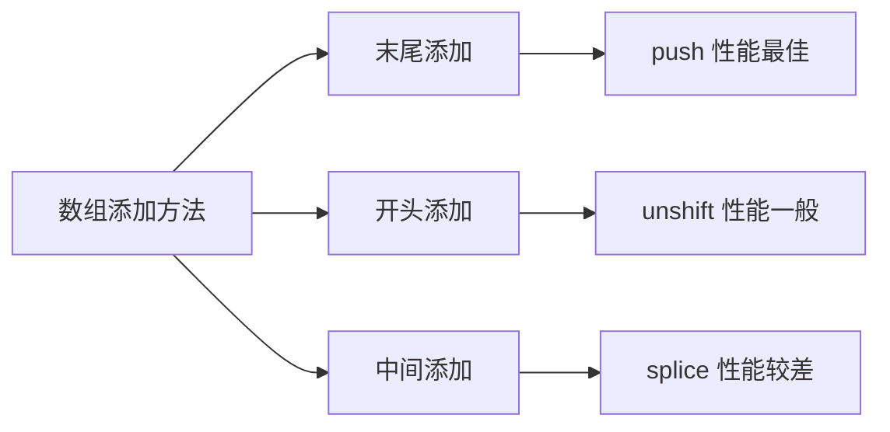

# JavaScript 数组添加元素

在JavaScript编程中，向数组添加元素是一项基础且常用的操作。JavaScript提供了多种方法，让我们能够在数组的不同位置添加一个或多个元素。本文将全面介绍这些方法，帮助初学者掌握数组元素的添加技巧。

## 为什么需要学习数组添加元素？

在实际开发中，我们经常需要动态地向数组添加元素。例如：
- 用户提交的表单数据需要存储到数组中
- 从服务器获取的数据需要添加到已有列表
- 构建菜单或导航时需要动态添加项目

掌握数组添加元素的各种方法，可以帮助你灵活处理这些场景。

## 数组添加元素的基本方法

### 1. 在数组末尾添加元素：push() 方法

`push()` 方法是最常用的添加元素方法，它可以在数组末尾添加一个或多个元素，并返回添加元素后的数组长度。

```javascript
const fruits = ['苹果', '香蕉'];
const newLength = fruits.push('橙子');

console.log(fruits); // 输出: ['苹果', '香蕉', '橙子']
console.log(newLength); // 输出: 3
```

你也可以一次添加多个元素：

```javascript
const vegetables = ['胡萝卜', '土豆'];
vegetables.push('西红柿', '黄瓜', '茄子');

console.log(vegetables); // 输出: ['胡萝卜', '土豆', '西红柿', '黄瓜', '茄子']
```

:::tip
`push()` 方法会直接修改原数组（而不是创建新数组）。这种修改原数组的方法称为"**变异方法**"。
:::

### 2. 在数组开头添加元素：unshift() 方法

如果需要在数组的开头添加元素，可以使用 `unshift()` 方法。它同样返回添加元素后的数组长度。

```javascript
const numbers = [3, 4, 5];
const newLength = numbers.unshift(1, 2);

console.log(numbers); // 输出: [1, 2, 3, 4, 5]
console.log(newLength); // 输出: 5
```

:::caution
`unshift()` 方法会让数组中的所有已有元素的索引值增加，可能对大型数组的性能有影响。
:::

## 在数组特定位置添加元素

### 使用 splice() 方法

`splice()` 方法是一个强大的数组操作工具，可以删除元素、添加元素或同时进行这两种操作。用于添加元素时，它的基本语法如下：

```javascript
array.splice(startIndex, deleteCount, item1, item2, ...)
```

- `startIndex`：开始修改的位置
- `deleteCount`：要删除的元素数量（添加元素时通常设为0）
- `item1, item2, ...`：要添加的元素

下面是一个在数组中间位置添加元素的例子：

```javascript
const colors = ['红色', '蓝色', '黑色'];
colors.splice(1, 0, '绿色', '黄色');

console.log(colors); // 输出: ['红色', '绿色', '黄色', '蓝色', '黑色']
```

在这个例子中，我们在索引1的位置（也就是'蓝色'之前）添加了两个元素，而不删除任何元素。

## 非变异添加方法：创建新数组

有时候，你可能不想修改原数组，而是希望创建一个包含新元素的新数组。

### 1. 使用展开运算符（Spread Operator）

ES6引入的展开运算符 `...` 是一种优雅的方式创建包含新元素的新数组：

```javascript
const original = [1, 2, 3];

// 在末尾添加元素
const newArray1 = [...original, 4, 5];
console.log(newArray1); // 输出: [1, 2, 3, 4, 5]

// 在开头添加元素
const newArray2 = [0, ...original];
console.log(newArray2); // 输出: [0, 1, 2, 3]

// 在中间添加元素
const newArray3 = [1, ...original.slice(1)];
console.log(newArray3); // 输出: [1, 2, 3]
```

### 2. 使用 concat() 方法

`concat()` 方法可以合并两个或多个数组，它不会更改现有数组，而是返回一个新数组：

```javascript
const array1 = [1, 2, 3];
const array2 = [4, 5];
const newArray = array1.concat(array2);

console.log(newArray); // 输出: [1, 2, 3, 4, 5]
console.log(array1); // 输出: [1, 2, 3] (原数组保持不变)
```

也可以用来添加单个元素：

```javascript
const numbers = [1, 2, 3];
const newNumbers = numbers.concat(4);

console.log(newNumbers); // 输出: [1, 2, 3, 4]
```

## 各种方法的性能比较

根据数组大小和操作位置的不同，各种添加方法的性能也有所不同：



- 在数组末尾添加元素（push）通常是最快的操作
- 在数组开头或中间添加元素（unshift, splice）需要移动其他元素，性能较差
- 对于大型数组，考虑使用 展开运算符 或 concat 创建新数组，而不是修改原数组

## 实际应用场景

### 场景一：构建待办事项列表

```javascript
// 创建一个待办事项列表
const todoList = [];

// 用户添加新任务（添加到末尾）
function addTask(task) {
  todoList.push(task);
  console.log(`已添加任务: ${task}`);
  console.log(`当前任务列表: ${todoList}`);
}

// 添加紧急任务（添加到开头）
function addUrgentTask(task) {
  todoList.unshift(task);
  console.log(`已添加紧急任务: ${task}`);
  console.log(`当前任务列表: ${todoList}`);
}

// 在特定位置插入任务
function insertTask(index, task) {
  todoList.splice(index, 0, task);
  console.log(`已在位置 ${index} 添加任务: ${task}`);
  console.log(`当前任务列表: ${todoList}`);
}

// 使用示例
addTask("完成JavaScript作业");
addTask("购物");
addUrgentTask("回复邮件");
insertTask(1, "打电话给客户");
```

输出结果：
```
已添加任务: 完成JavaScript作业
当前任务列表: 完成JavaScript作业
已添加任务: 购物
当前任务列表: 完成JavaScript作业,购物
已添加紧急任务: 回复邮件
当前任务列表: 回复邮件,完成JavaScript作业,购物
已在位置 1 添加任务: 打电话给客户
当前任务列表: 回复邮件,打电话给客户,完成JavaScript作业,购物
```

### 场景二：购物车功能

```javascript
// 购物车系统
const shoppingCart = [];

// 添加商品到购物车
function addToCart(product) {
  shoppingCart.push(product);
  updateCartDisplay();
}

// 添加多个相同商品
function addMultipleToCart(product, quantity) {
  for (let i = 0; i < quantity; i++) {
    shoppingCart.push(product);
  }
  updateCartDisplay();
}

// 添加优惠商品（显示在顶部）
function addPromotionalItem(product) {
  shoppingCart.unshift(product);
  updateCartDisplay();
}

// 显示购物车
function updateCartDisplay() {
  console.log("当前购物车:", shoppingCart);
  console.log(`购物车中有 ${shoppingCart.length} 件商品`);
}

// 使用示例
addToCart("笔记本电脑");
addMultipleToCart("鼠标", 2);
addPromotionalItem("促销键盘");
```

## 总结

JavaScript提供了多种向数组添加元素的方法，大致可分为两类：

1. **变异方法**：直接修改原数组
   - `push()`: 在数组末尾添加元素
   - `unshift()`: 在数组开头添加元素
   - `splice()`: 在指定位置添加元素

2. **非变异方法**：创建包含新元素的新数组
   - 展开运算符 (`...`)
   - `concat()` 方法

选择哪种方法取决于你的具体需求：
- 需要保持原数组不变时，使用非变异方法
- 考虑性能时，添加到数组末尾的操作通常最快
- 对于复杂操作，`splice()` 提供了最高的灵活性

## 练习题

1. 创建一个空数组，然后使用三种不同的方法添加元素。
2. 实现一个函数，可以在数组的任意位置插入多个元素。
3. 创建一个简单的播放列表程序，支持添加歌曲到列表顶部、底部和中间位置。
4. 比较 `push()` 和展开运算符在添加大量元素时的性能差异。

:::note
记得在实际应用中选择最适合你需求的方法！考虑因素包括：性能要求、是否需要保持原数组不变、代码可读性等。
:::

## 延伸阅读

- MDN Web Docs: 
  - [Array.prototype.push()](https://developer.mozilla.org/zh-CN/docs/Web/JavaScript/Reference/Global_Objects/Array/push)
  - [Array.prototype.unshift()](https://developer.mozilla.org/zh-CN/docs/Web/JavaScript/Reference/Global_Objects/Array/unshift)
  - [Array.prototype.splice()](https://developer.mozilla.org/zh-CN/docs/Web/JavaScript/Reference/Global_Objects/Array/splice)
- JavaScript 数组操作性能比较
- 数组的不可变操作与函数式编程