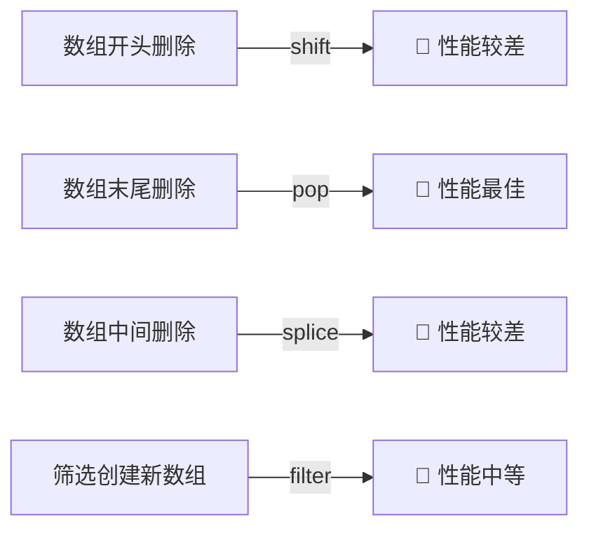

# JavaScript 数组删除元素

在 JavaScript 编程中，删除数组元素是一项常见的操作。无论是开发网页应用、处理数据还是构建交互式界面，你都需要掌握如何从数组中移除元素。本文将全面介绍 JavaScript 中删除数组元素的多种方法，帮助初学者建立坚实的基础。

## 数组删除操作概述

JavaScript 提供了多种方法来删除数组元素，每种方法有其特定的用例和行为特点：

- 从数组末尾删除元素
- 从数组开头删除元素
- 从数组中间删除元素
- 根据元素的值或条件删除元素
- 删除并替换元素

让我们详细了解这些方法。

## 从数组末尾删除元素：pop() 方法

`pop()` 方法删除数组中的最后一个元素，并返回该元素。这个方法会**改变原数组**。

```javascript
const fruits = ["苹果", "香蕉", "橙子", "芒果"];

// 使用 pop() 删除最后一个元素
const removedFruit = fruits.pop();

console.log("移除的水果:", removedFruit); // 输出: 移除的水果: 芒果
console.log("剩余水果:", fruits); // 输出: 剩余水果: ["苹果", "香蕉", "橙子"]
```

## 从数组开头删除元素：shift() 方法

`shift()` 方法删除数组中的第一个元素，并返回该元素。这个方法也会**改变原数组**。

```javascript
const fruits = ["苹果", "香蕉", "橙子", "芒果"];

// 使用 shift() 删除第一个元素
const removedFruit = fruits.shift();

console.log("移除的水果:", removedFruit); // 输出: 移除的水果: 苹果
console.log("剩余水果:", fruits); // 输出: 剩余水果: ["香蕉", "橙子", "芒果"]
```

:::caution 性能提示
`shift()` 方法会导致数组中所有剩余元素的索引位置向前移动，对于大型数组可能会影响性能。
:::

## 从特定位置删除元素：splice() 方法

`splice()` 方法是 JavaScript 中最强大的数组操作方法之一，它可以删除、替换或添加数组元素。该方法会**改变原数组**，并返回被删除的元素组成的数组。

### 基本语法

```javascript
array.splice(startIndex, deleteCount, item1, item2, ...)
```

- `startIndex`：开始更改的位置（索引）
- `deleteCount`：要删除的元素数量
- `item1, item2, ...`：可选，要添加的新元素

### 删除示例

```javascript
const fruits = ["苹果", "香蕉", "橙子", "芒果", "葡萄"];

// 从索引 1 开始，删除 2 个元素
const removedFruits = fruits.splice(1, 2);

console.log("移除的水果:", removedFruits); // 输出: 移除的水果: ["香蕉", "橙子"]
console.log("剩余水果:", fruits); // 输出: 剩余水果: ["苹果", "芒果", "葡萄"]
```

### 删除并添加新元素

```javascript
const fruits = ["苹果", "香蕉", "橙子", "芒果"];

// 从索引 1 开始，删除 2 个元素，并添加新元素
const removedFruits = fruits.splice(1, 2, "草莓", "樱桃");

console.log("移除的水果:", removedFruits); // 输出: 移除的水果: ["香蕉", "橙子"]
console.log("更新后的水果:", fruits); // 输出: 更新后的水果: ["苹果", "草莓", "樱桃", "芒果"]
```

## 使用 filter() 创建新数组（不修改原数组）

`filter()` 方法创建一个新数组，其中包含通过指定条件测试的所有元素。它**不会改变原数组**。

```javascript
const numbers = [1, 2, 3, 4, 5, 6];

// 删除所有偶数（实际上是创建一个只有奇数的新数组）
const oddNumbers = numbers.filter(number => number % 2 !== 0);

console.log("原始数组:", numbers); // 输出: 原始数组: [1, 2, 3, 4, 5, 6]
console.log("过滤后的数组:", oddNumbers); // 输出: 过滤后的数组: [1, 3, 5]
```

使用 `filter()` 根据值删除特定元素：

```javascript
const fruits = ["苹果", "香蕉", "橙子", "香蕉", "芒果"];

// 删除所有 "香蕉"
const withoutBananas = fruits.filter(fruit => fruit !== "香蕉");

console.log("原始数组:", fruits); // 输出: 原始数组: ["苹果", "香蕉", "橙子", "香蕉", "芒果"]
console.log("过滤后的数组:", withoutBananas); // 输出: 过滤后的数组: ["苹果", "橙子", "芒果"]
```

:::tip 提示
当你不想修改原始数组时，`filter()` 是一个很好的选择。它遵循函数式编程的不可变原则。
:::

## 使用 delete 操作符

JavaScript 的 `delete` 操作符可以删除数组中的元素，但它会在数组中留下一个"空洞"（undefined），而不是重新调整数组的索引。不建议使用此方法，但了解它的工作方式很重要。

```javascript
const fruits = ["苹果", "香蕉", "橙子", "芒果"];

// 使用 delete 删除索引 1 处的元素
delete fruits[1];

console.log(fruits); // 输出: ["苹果", undefined, "橙子", "芒果"]
console.log(fruits.length); // 输出: 4（长度不变）
```

:::warning 注意事项
使用 `delete` 操作符会将数组元素值设置为 `undefined`，但不会改变数组长度或重新排列其他元素的索引。这可能导致意外的行为，因此通常不推荐用于数组操作。
:::

## 清空数组

有时候你可能需要删除数组中的所有元素。这里有几种方法：

### 方法 1: 将长度设置为零

```javascript
const fruits = ["苹果", "香蕉", "橙子", "芒果"];
fruits.length = 0;
console.log(fruits); // 输出: []
```

### 方法 2: 赋值为空数组

```javascript
let fruits = ["苹果", "香蕉", "橙子", "芒果"];
fruits = [];
console.log(fruits); // 输出: []
```

:::note
第二种方法创建了一个新的空数组并分配给变量。如果有其他变量引用原始数组，它们将继续引用原始数组。
:::

### 方法 3: 使用 splice 方法

```javascript
const fruits = ["苹果", "香蕉", "橙子", "芒果"];
fruits.splice(0, fruits.length);
console.log(fruits); // 输出: []
```

## 实际应用案例

### 购物车项目移除

假设我们正在构建一个在线购物网站，需要实现从购物车中移除商品的功能：

```javascript
// 购物车数组
let cart = [
  { id: 1, name: "笔记本电脑", price: 5999, quantity: 1 },
  { id: 2, name: "键盘", price: 299, quantity: 1 },
  { id: 3, name: "鼠标", price: 99, quantity: 2 },
  { id: 4, name: "显示器", price: 1299, quantity: 1 }
];

// 通过商品ID删除购物车中的商品
function removeFromCart(productId) {
  // 找到商品在数组中的索引
  const index = cart.findIndex(item => item.id === productId);
  
  // 如果找到了商品，则从购物车中移除
  if (index !== -1) {
    cart.splice(index, 1);
    console.log(`已从购物车中移除商品 ${productId}`);
  } else {
    console.log(`购物车中未找到商品 ${productId}`);
  }
}

console.log("原始购物车:", cart);

// 移除键盘
removeFromCart(2);
console.log("移除键盘后的购物车:", cart);

// 移除不存在的商品
removeFromCart(5);

// 使用 filter 方法重新实现（不修改原数组）
function removeFromCartImmutable(productId) {
  return cart.filter(item => item.id !== productId);
}

// 创建移除鼠标后的新购物车
const newCart = removeFromCartImmutable(3);
console.log("使用不可变方法移除鼠标后:", newCart);
console.log("原始购物车仍然保持不变:", cart);
```

### 任务列表管理

假设我们正在开发一个任务管理应用，需要实现删除已完成任务或特定任务的功能：

```javascript
let tasks = [
  { id: 1, text: "学习 JavaScript", completed: true },
  { id: 2, text: "构建网站", completed: false },
  { id: 3, text: "阅读技术文章", completed: true },
  { id: 4, text: "锻炼身体", completed: false }
];

// 删除所有已完成的任务
function removeCompletedTasks() {
  tasks = tasks.filter(task => !task.completed);
}

// 删除特定ID的任务
function removeTask(id) {
  const index = tasks.findIndex(task => task.id === id);
  if (index !== -1) {
    tasks.splice(index, 1);
    return true;
  }
  return false;
}

console.log("原始任务列表:", tasks);

// 删除ID为3的任务
removeTask(3);
console.log("删除特定任务后:", tasks);

// 删除所有已完成的任务
removeCompletedTasks();
console.log("删除已完成任务后:", tasks);
```

## 性能比较

不同的数组删除方法在性能上有差异，特别是对大型数组：



- 从数组末尾删除元素（`pop()`）性能最好
- 从数组开头删除元素（`shift()`）需要重新索引所有元素，性能较差
- 从数组中间删除元素（`splice()`）需要重新索引删除位置后的所有元素
- 使用 `filter()` 创建新数组性能适中，但会消耗额外内存

## 方法对比总结

| 方法 | 修改原数组 | 返回值 | 适用场景 |
|------|------------|--------|----------|
| `pop()` | ✅ 是 | 被删除的元素 | 删除最后一个元素 |
| `shift()` | ✅ 是 | 被删除的元素 | 删除第一个元素 |
| `splice()` | ✅ 是 | 被删除元素的数组 | 删除指定位置的元素或多个元素 |
| `filter()` | ❌ 否 | 新数组 | 根据条件删除元素（函数式方法） |
| `delete` | ✅ 是 | undefined | 不推荐用于数组 |
| `length = 0` | ✅ 是 | undefined | 清空整个数组 |

## 总结

JavaScript 提供了多种删除数组元素的方法，每种方法都有其特定的用例：

1. 使用 `pop()` 从数组末尾删除元素
2. 使用 `shift()` 从数组开头删除元素
3. 使用 `splice()` 从任意位置删除一个或多个元素
4. 使用 `filter()` 创建一个不包含特定元素的新数组
5. 将数组 `length` 设置为 0 来快速清空数组

当你设计程序时，应该根据具体需求选择最合适的方法。考虑因素包括：是否需要保留原始数组、删除操作的频率和位置、数组大小等。

## 练习题

为了巩固所学知识，尝试完成以下练习：

1. 编写一个函数，从数组中删除所有重复元素
2. 创建一个函数，从数组中删除所有假值（false, null, 0, "", undefined, NaN）
3. 实现一个购物车应用，能够添加商品、删除商品、清空购物车
4. 创建一个函数，删除数组中指定索引范围内的所有元素

## 扩展阅读

- [MDN Web Docs: Array](https://developer.mozilla.org/zh-CN/docs/Web/JavaScript/Reference/Global_Objects/Array)
- [JavaScript 数组方法的时间复杂度](https://www.freecodecamp.org/news/time-complexity-of-javascript-array-methods/)
- [函数式编程中的不可变数据结构](https://immutable-js.com/)

通过掌握这些数组删除方法，你将能够更有效地处理 JavaScript 中的数据操作，无论是在前端还是后端开发中。