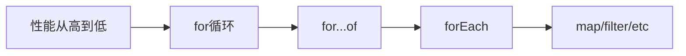

# JavaScript 数组遍历

## 介绍

数组遍历是编程中最常见的操作之一，它允许我们访问数组中的每个元素并对其执行特定操作。JavaScript提供了多种遍历数组的方法，从传统的for循环到现代的高阶函数，每种方法都有其独特的用途和优势。

在本教程中，我们将全面介绍JavaScript中遍历数组的各种方法，包括它们的语法、工作原理以及适用场景。掌握这些技巧将帮助你更高效地处理数组数据，编写更简洁、可读性更高的代码。

## 基础遍历方法

### 1. for循环

最传统的数组遍历方式是使用`for`循环。

```javascript
const fruits = ['apple', 'banana', 'cherry', 'date'];

for (let i = 0; i < fruits.length; i++) {
    console.log(fruits[i]);
}

// 输出:
// apple
// banana
// cherry
// date
```

**优点**：
- 灵活性高，可以控制遍历的起始点和步长
- 可以按索引访问元素

**缺点**：
- 语法较冗长
- 容易出现边界错误（如超出数组长度）

### 2. for...of循环

ES6引入的`for...of`循环提供了更简洁的语法，用于遍历可迭代对象（如数组）。

```javascript
const fruits = ['apple', 'banana', 'cherry', 'date'];

for (const fruit of fruits) {
    console.log(fruit);
}

// 输出:
// apple
// banana
// cherry
// date
```

**优点**：
- 语法简洁
- 专为遍历设计，代码更易读
- 可以使用`break`和`continue`语句

**缺点**：
- 无法直接获取当前元素的索引

:::tip
如果你需要同时获取索引和值，可以结合`entries()`方法使用：

```javascript
for (const [index, fruit] of fruits.entries()) {
    console.log(`${index}: ${fruit}`);
}
```
:::

### 3. forEach方法

`forEach`是数组对象的一个方法，它对数组的每个元素执行一次提供的函数。

```javascript
const fruits = ['apple', 'banana', 'cherry', 'date'];

fruits.forEach((fruit, index) => {
    console.log(`${index}: ${fruit}`);
});

// 输出:
// 0: apple
// 1: banana
// 2: cherry
// 3: date
```

**优点**：
- 代码简洁、易读
- 回调函数可以接收元素、索引和原数组

**缺点**：
- 不能使用`break`或`continue`语句
- 不能提前终止循环

## 高级数组遍历方法

JavaScript提供了多种功能强大的数组方法，它们不仅可以遍历数组，还可以同时处理数据。

### 1. map方法

`map`方法创建一个新数组，其结果是对原数组中的每个元素调用提供的函数。

```javascript
const numbers = [1, 2, 3, 4, 5];
const doubled = numbers.map(num => num * 2);

console.log(doubled);
// 输出: [2, 4, 6, 8, 10]
```

**使用场景**：当你需要将数组中的所有元素转换为另一种形式时。

### 2. filter方法

`filter`方法创建一个新数组，其包含通过所提供函数实现的测试的所有元素。

```javascript
const numbers = [1, 2, 3, 4, 5, 6];
const evenNumbers = numbers.filter(num => num % 2 === 0);

console.log(evenNumbers);
// 输出: [2, 4, 6]
```

**使用场景**：当你需要从数组中筛选出符合特定条件的元素时。

### 3. reduce方法

`reduce`方法对数组中的每个元素执行一个由您提供的reducer函数，将其结果汇总为单个返回值。

```javascript
const numbers = [1, 2, 3, 4, 5];
const sum = numbers.reduce((total, current) => total + current, 0);

console.log(sum);
// 输出: 15
```

**使用场景**：当你需要将数组中的所有元素合并为一个值时，例如计算总和、找最大值等。

### 4. find和findIndex方法

- `find`方法返回数组中满足提供的测试函数的第一个元素的值。
- `findIndex`方法返回数组中满足提供的测试函数的第一个元素的索引。

```javascript
const fruits = ['apple', 'banana', 'cherry', 'date'];

const cherry = fruits.find(fruit => fruit === 'cherry');
console.log(cherry); // 输出: cherry

const cherryIndex = fruits.findIndex(fruit => fruit === 'cherry');
console.log(cherryIndex); // 输出: 2
```

**使用场景**：当你需要在数组中查找满足特定条件的元素或其位置时。

### 5. some和every方法

- `some`方法测试数组中是否至少有一个元素通过了提供的函数测试。
- `every`方法测试数组中的所有元素是否都通过了提供的函数测试。

```javascript
const numbers = [1, 2, 3, 4, 5];

const hasEven = numbers.some(num => num % 2 === 0);
console.log(hasEven); // 输出: true

const allEven = numbers.every(num => num % 2 === 0);
console.log(allEven); // 输出: false
```

**使用场景**：当你需要检查数组是否包含符合特定条件的元素或所有元素是否都符合条件时。

## 性能考量

不同的数组遍历方法有不同的性能特点。在大多数情况下，这些差异并不明显，但在处理大型数组或性能关键型应用程序时，了解这些差异是很重要的。



:::note
传统的`for`循环通常是最快的遍历方式，但现代JavaScript引擎对高阶函数进行了很多优化，所以除非是在极端性能敏感的场景，否则选择最适合需求和最易读的方法更为重要。
:::

## 实际应用案例

### 案例1: 购物车计算

以下是一个使用数组方法计算购物车总价和应用折扣的例子：

```javascript
const cart = [
    { id: 1, name: '键盘', price: 199, quantity: 1 },
    { id: 2, name: '鼠标', price: 99, quantity: 2 },
    { id: 3, name: '显示器', price: 1999, quantity: 1 },
    { id: 4, name: '耳机', price: 299, quantity: 1 }
];

// 计算每件商品的总价
const itemTotals = cart.map(item => ({
    ...item,
    totalPrice: item.price * item.quantity
}));

// 过滤出价格大于等于200的商品
const expensiveItems = cart.filter(item => item.price >= 200);

// 计算购物车总价
const cartTotal = cart.reduce((total, item) => {
    return total + (item.price * item.quantity);
}, 0);

console.log('购物车总价:', cartTotal); 
// 输出: 购物车总价: 2695
```

### 案例2: 数据处理与统计

以下是一个使用数组方法处理和分析学生成绩数据的例子：

```javascript
const students = [
    { name: '张三', score: 85, subjects: ['数学', '英语', '物理'] },
    { name: '李四', score: 92, subjects: ['数学', '语文', '化学'] },
    { name: '王五', score: 78, subjects: ['生物', '英语', '历史'] },
    { name: '赵六', score: 95, subjects: ['数学', '物理', '化学'] }
];

// 找出成绩最高的学生
const topStudent = students.reduce((highest, student) => {
    return (student.score > highest.score) ? student : highest;
}, students[0]);

// 计算平均分
const averageScore = students.reduce((total, student) => 
    total + student.score, 0) / students.length;

// 找出学习数学的学生
const mathStudents = students.filter(student => 
    student.subjects.includes('数学'));

console.log('成绩最高的学生:', topStudent.name);
console.log('平均分:', averageScore);
console.log('学习数学的学生数量:', mathStudents.length);
```

## 总结

JavaScript提供了多种强大的数组遍历方法，每种方法都有其独特的用途：

1. **基础遍历方法**：`for`循环、`for...of`循环和`forEach`方法适用于简单的遍历操作
2. **高级遍历方法**：`map`、`filter`、`reduce`等方法不仅可以遍历数组，还能同时处理数据
3. **查找方法**：`find`、`findIndex`、`some`和`every`等方法可以帮助你在数组中搜索特定元素或验证条件

选择合适的遍历方法取决于你的具体需求：

- 需要简单遍历？使用`for...of`或`forEach`
- 需要创建新数组？使用`map`或`filter`
- 需要累积值？使用`reduce`
- 需要查找元素？使用`find`或`findIndex`
- 需要验证条件？使用`some`或`every`

掌握这些方法将使你的JavaScript代码更简洁、更易读，同时提高你处理数组数据的能力。

## 练习

为了巩固所学知识，试着完成以下练习：

1. 使用`map`方法将一个包含华氏温度的数组转换为摄氏温度
2. 使用`filter`方法从一个数组中过滤出所有质数
3. 使用`reduce`方法找出数组中最长的字符串
4. 编写一个函数，使用适当的遍历方法检查数组中是否存在重复元素
5. 结合多种数组方法，将一个对象数组按照某个属性进行分组

## 附加资源

- [MDN Web Docs: Array](https://developer.mozilla.org/zh-CN/docs/Web/JavaScript/Reference/Global_Objects/Array) - 官方参考文档
- [JavaScript.info: Array methods](https://javascript.info/array-methods) - 更多详细解释和示例

通过持续练习这些方法，你将能够更熟练地处理JavaScript中的数组数据，编写出更高效、更优雅的代码。