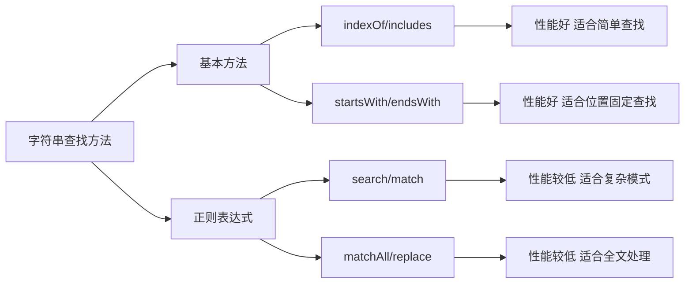

# JavaScript 字符串查找

在JavaScript编程中，字符串查找是一个非常常见且重要的操作。无论是验证用户输入、处理文本内容，还是从数据中提取信息，掌握字符串查找技术都是不可或缺的技能。本文将详细介绍JavaScript中进行字符串查找的多种方法及其应用场景。

## 为什么需要字符串查找？

字符串查找允许我们：
- 验证用户输入是否包含特定内容
- 在文本中定位关键信息
- 执行搜索功能
- 确定数据格式是否符合要求
- 处理和操作文本数据

## 基本字符串查找方法

### indexOf() 方法

`indexOf()` 方法返回字符串中指定文本首次出现的位置（索引），如果未找到则返回 -1。

```jsx
const message = "JavaScript是一门强大的编程语言";
const position = message.indexOf("强大");
console.log(position); // 输出: 10
```

不存在的情况：

```jsx
const message = "JavaScript是一门强大的编程语言";
const position = message.indexOf("Python");
console.log(position); // 输出: -1
```

:::tip
JavaScript中的字符串索引从0开始计数。
:::

### lastIndexOf() 方法

与`indexOf()`类似，但返回字符串中指定文本最后一次出现的位置。如果未找到则返回 -1。

```jsx
const message = "JavaScript是编程语言，JavaScript很有趣";
const lastPosition = message.lastIndexOf("JavaScript");
console.log(lastPosition); // 输出: 13
```

### 指定搜索起始位置

`indexOf()` 和 `lastIndexOf()` 都可以接受第二个参数，指定开始搜索的位置：

```jsx
const text = "一二三四五一二三四五";
// 从索引5开始搜索"二"
console.log(text.indexOf("二", 5)); // 输出: 6

// 从索引5往前搜索"二"
console.log(text.lastIndexOf("二", 5)); // 输出: 1
```

## 现代字符串查找方法

### includes() 方法

ES6引入的 `includes()` 方法用于判断字符串是否包含指定的子字符串，返回布尔值。

```jsx
const message = "JavaScript是一门强大的编程语言";
console.log(message.includes("强大")); // 输出: true
console.log(message.includes("Python")); // 输出: false
```

`includes()` 也可以接受第二个参数，指定开始搜索的位置：

```jsx
const message = "JavaScript是一门强大的编程语言";
console.log(message.includes("JavaScript", 1)); // 输出: false
```

### startsWith() 和 endsWith() 方法

这两个方法分别用于检查字符串是否以指定文本开始或结束。

```jsx
const url = "https://www.example.com/index.html";
console.log(url.startsWith("https")); // 输出: true
console.log(url.endsWith(".html")); // 输出: true
```

它们也支持指定起始位置的参数：

```jsx
const url = "https://www.example.com/index.html";
// 从索引8开始检查是否以"www"开头
console.log(url.startsWith("www", 8)); // 输出: true

// 检查不包括最后5个字符的字符串是否以"com"结尾
console.log(url.endsWith("com", url.length - 5)); // 输出: true
```

## 使用正则表达式进行高级查找

对于更复杂的字符串查找需求，可以使用正则表达式。

### search() 方法

`search()` 方法使用正则表达式搜索字符串，并返回匹配的位置：

```jsx
const message = "我的电话号码是13812345678和13987654321";
const position = message.search(/\d{11}/);
console.log(position); // 输出: 7
```

### match() 方法

`match()` 方法返回字符串中与指定正则表达式匹配的结果：

```jsx
const message = "我的电话号码是13812345678和13987654321";
const matches = message.match(/\d{11}/g);
console.log(matches); // 输出: ["13812345678", "13987654321"]
```

### matchAll() 方法

ES2020引入的 `matchAll()` 方法返回一个迭代器，包含所有匹配的结果及其捕获组：

```jsx
const message = "我的电话号码是13812345678和13987654321";
const regexMatches = [...message.matchAll(/(\d{3})(\d{4})(\d{4})/g)];

for (const match of regexMatches) {
  console.log(`完整号码: ${match[0]}`);
  console.log(`区号部分: ${match[1]}`);
  console.log(`中间四位: ${match[2]}`);
  console.log(`最后四位: ${match[3]}`);
}
```

输出:
```
完整号码: 13812345678
区号部分: 138
中间四位: 1234
最后四位: 5678
完整号码: 13987654321
区号部分: 139
中间四位: 8765
最后四位: 4321
```

## 实际应用案例

### 案例1：验证电子邮件格式

```jsx
function validateEmail(email) {
  // 简单的邮箱验证
  if (email.includes('@') && email.includes('.')) {
    const atPosition = email.indexOf('@');
    const dotPosition = email.lastIndexOf('.');
    
    // 检查@符号是否在.之前，且它们之间至少有一个字符
    if (atPosition < dotPosition && atPosition > 0 && dotPosition < email.length - 1 && dotPosition - atPosition > 1) {
      return true;
    }
  }
  return false;
}

console.log(validateEmail("user@example.com")); // 输出: true
console.log(validateEmail("invalid-email")); // 输出: false
```

### 案例2：从URL提取参数

```jsx
function getParameterByName(url, paramName) {
  // 构建参数名称模式
  const pattern = paramName + '=([^&]+)';
  const regex = new RegExp(pattern);
  const match = url.match(regex);
  
  return match ? match[1] : null;
}

const url = "https://example.com/search?query=javascript&sort=desc&page=2";
console.log(getParameterByName(url, "query")); // 输出: javascript
console.log(getParameterByName(url, "sort")); // 输出: desc
console.log(getParameterByName(url, "unknown")); // 输出: null
```

### 案例3：高亮文本中的关键词

```jsx
function highlightKeyword(text, keyword) {
  if (!text.includes(keyword)) {
    return text; // 如果没有关键词，直接返回原文本
  }
  
  // 使用split和join实现简单的替换高亮
  return text.split(keyword).join(`<span style="background-color: yellow">${keyword}</span>`);
}

const paragraph = "JavaScript是一门强大的编程语言，学习JavaScript可以让你开发各种应用。";
const highlighted = highlightKeyword(paragraph, "JavaScript");
console.log(highlighted);
// 输出: <span style="background-color: yellow">JavaScript</span>是一门强大的编程语言，学习<span style="background-color: yellow">JavaScript</span>可以让你开发各种应用。
```

## 性能考虑

不同的字符串查找方法在大型文本或频繁操作时可能有不同的性能表现：



:::caution
在处理大量文本数据时，使用简单的 `indexOf()` 或 `includes()` 通常比正则表达式方法更高效，除非需要复杂的匹配模式。
:::

## 总结

字符串查找是JavaScript中的一项基础但强大的功能。我们学习了：

1. 基本查找方法：`indexOf()` 和 `lastIndexOf()`
2. 现代查找方法：`includes()`, `startsWith()` 和 `endsWith()`
3. 正则表达式查找：`search()`, `match()` 和 `matchAll()`
4. 实际应用案例，如验证邮箱、提取URL参数和文本高亮

根据具体需求选择合适的方法，可以大大简化文本处理工作。对于简单的包含检查，`includes()` 通常是最直观的选择；对于复杂的模式匹配，正则表达式提供了强大的解决方案。

## 练习

为了巩固所学知识，试着完成以下练习：

1. 编写一个函数，统计一个字符串中指定子字符串出现的次数
2. 创建一个函数，检查一个字符串是否是有效的手机号码（假设格式为：1xx-xxxx-xxxx）
3. 实现一个简单的敏感词过滤函数，将指定的敏感词替换为 `***`

## 延伸阅读

- [MDN Web Docs: String](https://developer.mozilla.org/zh-CN/docs/Web/JavaScript/Reference/Global_Objects/String)
- [MDN Web Docs: RegExp](https://developer.mozilla.org/zh-CN/docs/Web/JavaScript/Reference/Global_Objects/RegExp)

通过掌握这些字符串查找技术，你将能够更加高效地处理和操作JavaScript中的文本数据！