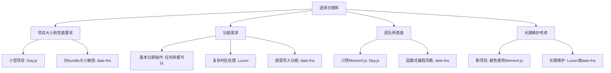

# JavaScript 日期库介绍

## 为什么需要日期库？

在JavaScript中，原生的`Date`对象提供了基本的日期和时间处理功能，但在实际开发中常常面临以下挑战：

- 日期格式化和解析的复杂性
- 时区处理的困难
- 日期计算（如添加天数、比较日期等）的繁琐
- 本地化（i18n）支持不足
- 原生API设计不够直观

因此，各种功能强大的日期库应运而生，帮助开发者更高效地处理日期和时间。

## 主流JavaScript日期库对比

### 1. Moment.js

曾经最流行的JavaScript日期处理库，提供了全面的日期操作功能。

:::caution
Moment.js已进入维护模式，官方不再推荐在新项目中使用。
:::

**基本用法示例：**

```javascript
// 引入 Moment.js
const moment = require('moment');

// 创建当前日期时间
const now = moment();
console.log(now.format('YYYY-MM-DD HH:mm:ss')); // 输出: 2023-10-20 14:30:25

// 日期解析
const date = moment('2023-10-20');
console.log(date.format('dddd')); // 输出: Friday

// 日期计算
const nextWeek = moment().add(1, 'weeks');
console.log(nextWeek.fromNow()); // 输出: in 7 days
```

**优点：**
- 强大的解析功能
- 丰富的格式化选项
- 完善的本地化支持
- 链式API

**缺点：**
- 体积较大（约16KB gzipped）
- 不再积极维护
- 可变API设计（可能导致意外的副作用）

### 2. Day.js

Moment.js的轻量级替代品，API设计相似但体积更小。

**基本用法示例：**

```javascript
// 引入 Day.js
const dayjs = require('dayjs');

// 创建日期
const now = dayjs();
console.log(now.format('YYYY-MM-DD HH:mm:ss')); // 输出: 2023-10-20 14:30:25

// 日期解析
const date = dayjs('2023-10-20');
console.log(date.format('dddd')); // 需要加载插件才能使用星期格式化

// 日期计算
const nextWeek = dayjs().add(1, 'week');
console.log(nextWeek.format()); // 输出: 2023-10-27T14:30:25+08:00
```

**优点：**
- 极小的体积（约2KB gzipped）
- 与Moment.js兼容的API
- 模块化设计，按需加载插件
- 不可变API，操作不会改变原始对象

**缺点：**
- 需要额外插件实现一些功能
- 功能相对Moment.js稍简单

### 3. date-fns

函数式编程风格的日期库，每个功能都是独立的函数。

**基本用法示例：**

```javascript
// 引入需要的函数
import { format, addWeeks, differenceInDays } from 'date-fns';

// 格式化日期
const now = new Date();
console.log(format(now, 'yyyy-MM-dd HH:mm:ss')); // 输出: 2023-10-20 14:30:25

// 日期计算
const nextWeek = addWeeks(now, 1);
console.log(format(nextWeek, 'yyyy-MM-dd')); // 输出: 2023-10-27

// 日期比较
const days = differenceInDays(
  new Date(2023, 9, 27),
  new Date(2023, 9, 20)
);
console.log(days); // 输出: 7
```

**优点：**
- 采用现代函数式编程风格
- 模块化设计，可按需导入函数减小体积
- 优秀的TypeScript支持
- 不可变API

**缺点：**
- API相对不如链式调用直观
- 需要分别导入多个函数可能增加代码量

### 4. Luxon

由Moment.js团队成员开发的现代化替代方案。

**基本用法示例：**

```javascript
// 引入 Luxon
const { DateTime } = require('luxon');

// 创建日期
const now = DateTime.now();
console.log(now.toFormat('yyyy-MM-dd HH:mm:ss')); // 输出: 2023-10-20 14:30:25

// 日期解析
const date = DateTime.fromISO('2023-10-20');
console.log(date.weekdayLong); // 输出: Friday

// 日期计算
const nextWeek = now.plus({ weeks: 1 });
console.log(nextWeek.toRelative()); // 输出: in 7 days
```

**优点：**
- 现代化API设计
- 强大的时区处理
- 不可变对象
- 内置国际化支持

**缺点：**
- 体积中等（约7.5KB gzipped）
- API与Moment.js有较大差异，迁移成本高

## 如何选择合适的日期库？

在选择日期库时，应考虑以下因素：



### 选择建议

1. **新项目推荐**：
   - 轻量级需求：Day.js
   - 现代应用：date-fns 或 Luxon

2. **从Moment.js迁移**：
   - 简单迁移路径：Day.js
   - 完全重构：date-fns 或 Luxon

3. **特定需求**：
   - 时区处理复杂：Luxon
   - Tree-shaking和bundle优化：date-fns

## 实际应用案例

### 案例1：日历应用

构建一个简单的日程管理界面，显示当前月份，并标记重要日期：

```javascript
import { format, addMonths, eachDayOfInterval, startOfMonth, endOfMonth, isSameDay } from 'date-fns';

// 当前月份
const currentMonth = new Date();
const start = startOfMonth(currentMonth);
const end = endOfMonth(currentMonth);

// 获取月份所有日期
const daysInMonth = eachDayOfInterval({ start, end });

// 重要日期
const importantDates = [
  new Date(2023, 9, 15), // 假设这天有会议
  new Date(2023, 9, 25)  // 假设这天是截止日期
];

// 渲染日历
function renderCalendar() {
  console.log(`当前月份: ${format(currentMonth, 'yyyy年MM月')}`);
  
  // 输出每一天
  daysInMonth.forEach(day => {
    const dateStr = format(day, 'dd');
    const isImportant = importantDates.some(impDate => isSameDay(impDate, day));
    
    if (isImportant) {
      console.log(`${dateStr} ⭐`); // 标记重要日期
    } else {
      console.log(dateStr);
    }
  });
}

renderCalendar();
```

### 案例2：用户会话倒计时

创建一个用户登录会话计时器，显示剩余时间：

```javascript
import dayjs from 'dayjs';
import duration from 'dayjs/plugin/duration';
import relativeTime from 'dayjs/plugin/relativeTime';

// 加载插件
dayjs.extend(duration);
dayjs.extend(relativeTime);

// 假设会话在30分钟后过期
const sessionStart = dayjs();
const sessionExpires = sessionStart.add(30, 'minute');

// 创建计时器，每秒更新一次
const timer = setInterval(() => {
  const now = dayjs();
  const remaining = sessionExpires.diff(now);
  
  // 如果会话已过期
  if (remaining <= 0) {
    console.log('会话已过期');
    clearInterval(timer);
    return;
  }
  
  // 显示剩余时间
  const remainingTime = dayjs.duration(remaining);
  console.log(`会话将在 ${remainingTime.minutes()}分 ${remainingTime.seconds()}秒 后过期`);
}, 1000);

// 实际应用中需要清除定时器
// setTimeout(() => clearInterval(timer), 10000);
```

## 总结

JavaScript日期库极大地简化了日期和时间处理的复杂性：

1. **Moment.js** - 曾经的行业标准，功能全面但已进入维护模式
2. **Day.js** - 轻量级替代品，API相似，体积小
3. **date-fns** - 函数式风格，模块化设计
4. **Luxon** - 现代化替代方案，时区处理强大

### 选择建议

- **新项目**：优先考虑Day.js（简单需求）或date-fns（复杂需求）
- **现有项目**：根据项目需求和团队熟悉度选择合适的库

### 学习资源

- Day.js官方文档: [https://day.js.org/](https://day.js.org/)
- date-fns官方文档: [https://date-fns.org/](https://date-fns.org/)
- Luxon官方文档: [https://moment.github.io/luxon/](https://moment.github.io/luxon/)

### 练习建议

1. 尝试使用不同的日期库实现同一功能，比较它们的易用性和代码量
2. 创建一个倒数计时器应用，显示距离重要事件的剩余时间
3. 实现一个日期范围选择器，用于选择开始和结束日期
4. 尝试处理不同时区的日期转换和显示

掌握一个好的日期库将极大地提升你在JavaScript开发中处理时间相关功能的效率！