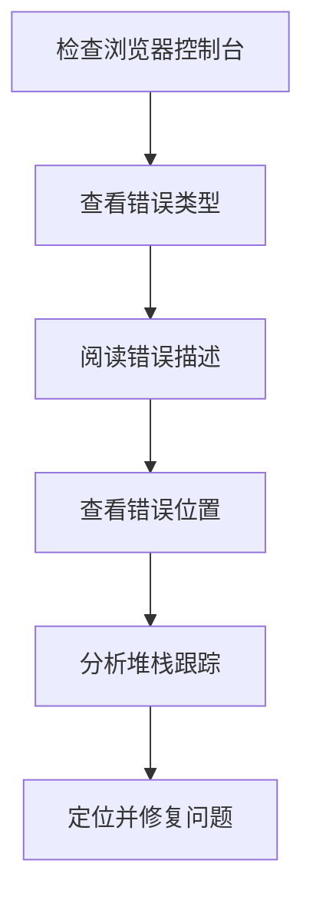

# JavaScript 错误基础

在编程过程中，错误是不可避免的。了解如何识别、理解和处理这些错误，是成为一名优秀JavaScript开发者的重要技能。本文将介绍JavaScript中的错误基础知识，帮助你更好地理解和处理代码中的问题。

## 什么是JavaScript错误？

JavaScript错误是程序执行过程中发生的异常情况。当JavaScript引擎遇到无法处理的问题时，会抛出一个错误，导致程序停止执行。如果不处理这些错误，可能会导致整个应用程序崩溃。

## JavaScript 中常见的错误类型

JavaScript有几种内置的错误类型，每种类型对应不同的错误情况：

### 1. SyntaxError（语法错误）

当代码语法不符合JavaScript规则时发生。这类错误通常在代码执行前就会被检测到。

```javascript
// 语法错误示例
console.log("Hello World"; // 缺少右括号
```

**控制台输出：**
```
SyntaxError: missing ) after argument list
```

### 2. ReferenceError（引用错误）

当引用不存在的变量时发生。

```javascript
// 引用错误示例
console.log(undefinedVariable);
```

**控制台输出：**
```
ReferenceError: undefinedVariable is not defined
```

### 3. TypeError（类型错误）

当值的类型与预期不符，或者尝试在不适当的值上调用方法时发生。

```javascript
// 类型错误示例
const str = "Hello";
str.push("World"); // 字符串没有push方法
```

**控制台输出：**
```
TypeError: str.push is not a function
```

### 4. RangeError（范围错误）

当值超出允许的范围时发生。

```javascript
// 范围错误示例
const arr = new Array(-1); // 数组长度不能为负数
```

**控制台输出：**
```
RangeError: Invalid array length
```

### 5. URIError（URI错误）

当使用全局URI处理函数时传入了错误的参数，发生URI错误。

```javascript
// URI错误示例
decodeURI('%'); // '%'不是有效的URI编码
```

**控制台输出：**
```
URIError: URI malformed
```

### 6. EvalError（Eval错误）

当`eval()`函数使用不当时发生。在现代JavaScript中较少见。

:::note
在旧版本的JavaScript中，错误使用`eval()`函数会抛出EvalError，但在现代JavaScript中，这种情况通常会抛出SyntaxError或其他错误类型。
:::

## 错误对象的属性

JavaScript错误对象通常包含以下重要属性：

- `name`：错误类型名称（如"SyntaxError"、"ReferenceError"等）
- `message`：人类可读的错误描述
- `stack`：堆栈跟踪，显示错误发生的位置和调用栈

```javascript
try {
  // 故意引发错误
  const x = y + 10;
} catch (error) {
  console.log("错误名称:", error.name);
  console.log("错误消息:", error.message);
  console.log("错误堆栈:", error.stack);
}
```

**控制台输出：**
```
错误名称: ReferenceError
错误消息: y is not defined
错误堆栈: ReferenceError: y is not defined
    at <anonymous>:3:14
    ...
```

## 如何识别错误

当JavaScript代码发生错误时，浏览器控制台会显示错误信息。通常包括：

1. 错误类型（如SyntaxError、ReferenceError等）
2. 错误描述
3. 错误发生的文件名
4. 错误发生的行号和列号
5. 堆栈跟踪（显示调用路径）



## 浏览器调试工具

大多数现代浏览器都提供了强大的调试工具，可以帮助你识别和解决错误：

1. **控制台（Console）**：显示错误消息和日志
2. **源代码（Sources）**：允许你设置断点和逐步执行代码
3. **网络（Network）**：显示网络请求和响应

:::tip
在Chrome浏览器中，可以通过按F12或右键点击页面并选择"检查"来打开开发者工具，然后选择"Console"选项卡查看错误消息。
:::

## 基本的错误处理

JavaScript提供了`try...catch`语句用于捕获和处理运行时错误。

### try...catch基本语法

```javascript
try {
  // 可能引发错误的代码
} catch (error) {
  // 处理错误的代码
}
```

### 实际案例

假设我们需要从服务器获取数据并处理：

```javascript
function processUserData() {
  try {
    // 假设这是从服务器获取的数据
    const userData = JSON.parse('{"name": "John", "age": 30,}'); // 注意这里有一个多余的逗号，导致JSON语法错误
    console.log("用户名:", userData.name);
  } catch (error) {
    console.log("数据解析错误:", error.message);
    // 可以在这里进行错误记录或显示友好的错误消息给用户
  }
}

processUserData();
```

**控制台输出：**
```
数据解析错误: Unexpected token } in JSON at position 27
```

### 添加finally块

`finally`块中的代码无论是否发生错误都会执行，适合用于清理资源。

```javascript
function testFinally() {
  try {
    console.log("开始尝试获取数据");
    // 模拟错误
    throw new Error("获取数据失败");
  } catch (error) {
    console.log("捕获到错误:", error.message);
  } finally {
    console.log("无论如何都会执行这部分代码");
  }
}

testFinally();
```

**控制台输出：**
```
开始尝试获取数据
捕获到错误: 获取数据失败
无论如何都会执行这部分代码
```

## 自定义错误

你可以创建自定义错误类型，以便更好地管理应用程序中的特定错误：

```javascript
// 创建自定义错误类型
class ValidationError extends Error {
  constructor(message) {
    super(message);
    this.name = "ValidationError";
  }
}

// 使用自定义错误
function validateUser(user) {
  if (!user.name) {
    throw new ValidationError("用户名不能为空");
  }
  if (!user.email) {
    throw new ValidationError("邮箱不能为空");
  }
  return true;
}

// 测试
try {
  validateUser({ name: "John", email: "" });
} catch (error) {
  console.log(`${error.name}: ${error.message}`);
}
```

**控制台输出：**
```
ValidationError: 邮箱不能为空
```

## 实际应用场景

### 表单验证

```javascript
function validateForm(formData) {
  try {
    if (!formData.username) {
      throw new Error("用户名不能为空");
    }
    
    if (formData.password.length < 6) {
      throw new Error("密码长度必须大于6个字符");
    }
    
    if (formData.password !== formData.confirmPassword) {
      throw new Error("两次密码输入不一致");
    }
    
    return true; // 验证通过
  } catch (error) {
    // 显示错误消息到UI
    document.getElementById("error-message").textContent = error.message;
    return false; // 验证失败
  }
}

// 使用示例
document.getElementById("signup-form").addEventListener("submit", function(e) {
  const formData = {
    username: document.getElementById("username").value,
    password: document.getElementById("password").value,
    confirmPassword: document.getElementById("confirm-password").value
  };
  
  if (!validateForm(formData)) {
    e.preventDefault(); // 阻止表单提交
  }
});
```

### API请求错误处理

```javascript
async function fetchUserData(userId) {
  try {
    const response = await fetch(`https://api.example.com/users/${userId}`);
    
    if (!response.ok) {
      throw new Error(`HTTP错误: ${response.status}`);
    }
    
    const data = await response.json();
    return data;
  } catch (error) {
    if (error.message.includes("HTTP错误: 404")) {
      console.log("未找到用户数据");
    } else if (error.message.includes("HTTP错误: 401")) {
      console.log("未授权访问，请先登录");
    } else {
      console.log("获取数据时发生错误:", error.message);
    }
    
    // 返回一个默认值或者重新抛出错误
    return { error: true, message: error.message };
  }
}
```

## 总结

JavaScript错误处理是每个开发者必须掌握的技能。通过了解：

1. 不同类型的JavaScript错误（SyntaxError、ReferenceError、TypeError等）
2. 如何识别和调试错误
3. 如何使用`try...catch...finally`结构来处理错误
4. 如何创建和使用自定义错误类型

可以使你的代码更健壮，提供更好的用户体验，并简化调试过程。

错误不再是可怕的问题，而是帮助你改进代码的重要信号。通过正确的错误处理，可以使你的应用程序更加稳定和用户友好。

## 练习和进一步学习

尝试以下练习来测试你的理解：

1. 创建一个简单的计算器函数，使用错误处理来防止除以零和处理非数字输入
2. 创建一个自定义错误类型`NetworkError`，并在适当的场景中使用它
3. 使用浏览器调试工具定位并修复一段包含错误的代码

### 推荐资源

- [MDN Web Docs: JavaScript 错误参考](https://developer.mozilla.org/zh-CN/docs/Web/JavaScript/Reference/Errors)
- [JavaScript.info: 错误处理](https://zh.javascript.info/error-handling)
- [《You Don't Know JS》系列丛书](https://github.com/getify/You-Dont-Know-JS)

通过实践和不断学习，你将能够更加自信地处理JavaScript程序中的各种错误情况。