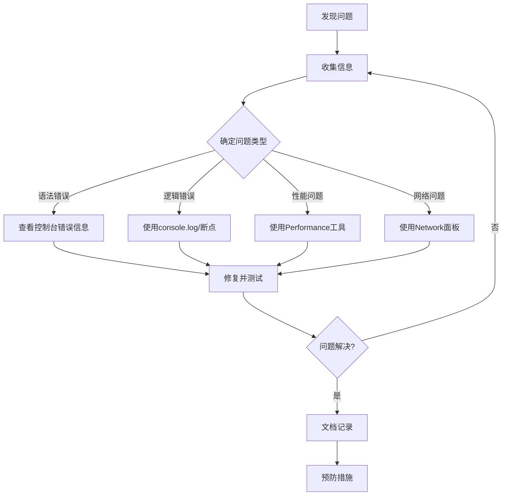

# JavaScript 调试技巧

## 调试的重要性

当我们编写JavaScript代码时，错误是难以避免的。无论是语法错误、逻辑错误还是运行时异常，它们都可能导致程序无法按预期运行。有效的调试技巧可以帮助我们快速定位和解决这些问题，提高开发效率。

:::tip 调试的核心价值
良好的调试能力是区分初级和高级JavaScript开发者的关键技能之一。掌握调试技巧不仅能帮你解决当前问题，还能提升你对代码的理解和控制能力。
:::

## 基础调试方法

### 使用console对象

`console`对象是JavaScript中最常用的调试工具之一，它提供了多种方法来输出信息：

```javascript
// 基本输出
console.log("这是一条普通信息");
console.info("这是一条信息");
console.warn("这是一条警告");
console.error("这是一条错误");

// 查看变量
let user = { name: "张三", age: 25 };
console.log("用户信息:", user);

// 输出结果：
// 这是一条普通信息
// 这是一条信息
// 这是一条警告
// 这是一条错误
// 用户信息: {name: "张三", age: 25}
```

#### 格式化控制台输出

```javascript
// 使用占位符
console.log("用户 %s 的年龄是 %d", "张三", 25);

// 使用CSS样式
console.log("%c重要提示!", "color: red; font-size: 20px;");

// 输出结果：
// 用户 张三 的年龄是 25
// 重要提示! (显示为红色、20px大小的文字)
```

#### 分组和表格展示

```javascript
// 分组信息
console.group("用户详情");
console.log("姓名: 张三");
console.log("年龄: 25");
console.groupEnd();

// 表格展示
console.table([
  { name: "张三", age: 25 },
  { name: "李四", age: 30 }
]);

// 输出结果：
// 用户详情
//   姓名: 张三
//   年龄: 25
// (以表格形式展示两条用户记录)
```

### 计时和计数

```javascript
// 计时
console.time("循环执行时间");
for(let i = 0; i < 1000000; i++) {
  // 一些操作
}
console.timeEnd("循环执行时间");

// 计数
function doSomething() {
  console.count("doSomething被调用");
  // 函数内容
}

doSomething();
doSomething();
doSomething();

// 输出结果：
// 循环执行时间: 10.123ms
// doSomething被调用: 1
// doSomething被调用: 2
// doSomething被调用: 3
```

## 浏览器开发者工具

现代浏览器提供了强大的开发者工具，可以帮助我们调试JavaScript代码。

### 使用断点

断点是调试中最有用的工具之一，它允许我们暂停代码执行并检查当前状态。

```javascript
function calculate(a, b) {
  let result = a * b;  // 在这一行设置断点
  result = result + 10;
  return result;
}

let value = calculate(5, 7);
console.log("计算结果:", value);
```

设置断点步骤：
1. 在浏览器中打开开发者工具（F12或右键 -> 检查）
2. 切换到"源代码"或"Sources"选项卡
3. 找到你的JavaScript文件
4. 点击代码行号来设置断点

### 调试控制按钮

一旦代码在断点处暂停，你可以使用以下控制按钮：

- **继续执行(F8)** - 继续执行直到下一个断点
- **单步执行(F10)** - 执行当前行代码并移动到下一行，不进入函数内部
- **步入(F11)** - 如果当前行调用了函数，则进入该函数内部
- **步出(Shift+F11)** - 完成当前函数的执行并返回到调用处
- **禁用所有断点** - 临时禁用所有断点，不删除它们

### 条件断点

当你需要在特定条件下才暂停代码执行时，可以设置条件断点：

```javascript
// 假设我们有一个处理用户数组的函数
function processUsers(users) {
  for(let i = 0; i < users.length; i++) {
    // 在这里可以设置条件断点: users[i].id === 5
    processUser(users[i]);
  }
}
```

设置条件断点：
1. 右键点击代码行号
2. 选择"添加条件断点"
3. 输入条件表达式，如`users[i].id === 5`

### 监视表达式

在代码暂停时，你可以添加监视表达式来跟踪变量或表达式的值：

1. 在开发者工具中找到"监视"或"Watch"面板
2. 点击"+"添加表达式
3. 输入你想监视的变量名或表达式

## 调试常见问题的技巧

### 1. 异步代码调试

异步代码的调试是JavaScript中最具挑战性的部分之一。

```javascript
function fetchUserData() {
  console.log("开始获取用户数据");
  
  fetch('https://api.example.com/user')
    .then(response => {
      console.log("收到响应");
      return response.json();
    })
    .then(data => {
      debugger; // 内置断点语句
      console.log("用户数据:", data);
    })
    .catch(error => {
      console.error("获取数据出错:", error);
    });
    
  console.log("fetchUserData函数执行结束");
}
```

:::tip 小技巧
使用 `debugger;` 语句可以在代码中直接插入断点，当浏览器的开发者工具打开时，代码执行到该语句会自动暂停。
:::

### 2. 使用try-catch捕获并记录错误

```javascript
function riskyOperation() {
  try {
    // 可能出错的代码
    let obj = null;
    let value = obj.property; // 这里会抛出错误
    return value;
  } catch (error) {
    console.error("发生错误:", error);
    console.error("错误堆栈:", error.stack);
    // 可以进一步处理错误
  }
}
```

### 3. 事件监听器调试

当你有多个事件监听器时，调试它们可能很困难：

```javascript
function setupEventListeners() {
  const button = document.getElementById('submitBtn');
  
  button.addEventListener('click', function buttonClick(e) {
    console.log('按钮被点击', e.target);
    // 使用事件对象的信息进行调试
  });
}
```

可以在开发者工具中使用"Event Listeners"面板查看所有附加到元素上的事件监听器。

## 高级调试技巧

### 1. 使用Source Maps

当你使用构建工具（如Webpack、Babel等）将代码转换为生产环境代码时，调试变得困难。Source Maps可以将转换后的代码映射回原始源代码：

```javascript
// 在webpack配置中启用source maps
module.exports = {
  // ...其他配置
  devtool: 'source-map' // 或其他source map变体
};
```

### 2. 使用浏览器性能工具

当你的应用表现不佳时，可以使用Performance面板分析性能瓶颈：

1. 打开开发者工具中的"Performance"面板
2. 点击录制按钮
3. 执行你想分析的操作
4. 停止录制并分析结果

### 3. 使用网络面板调试API请求

```javascript
async function fetchData() {
  try {
    const response = await fetch('/api/data');
    
    if (!response.ok) {
      console.error('服务器响应错误:', response.status);
      return;
    }
    
    const data = await response.json();
    console.log('获取的数据:', data);
  } catch (error) {
    console.error('网络请求失败:', error);
  }
}
```

在Network面板中，你可以：
- 查看所有网络请求
- 检查请求和响应头部
- 查看响应内容
- 测量网络性能

## 实际案例：调试一个计算器应用

假设我们有一个简单的计算器应用，但计算结果不正确：

```javascript
// calculator.js
function add(a, b) {
  return a + b;
}

function subtract(a, b) {
  return a - b;
}

function multiply(a, b) {
  // 这里有一个错误，使用了加法而不是乘法
  return a + b; 
}

function divide(a, b) {
  if (b === 0) {
    throw new Error("除数不能为零");
  }
  return a / b;
}

function calculate() {
  const num1 = parseFloat(document.getElementById("num1").value);
  const num2 = parseFloat(document.getElementById("num2").value);
  const operation = document.getElementById("operation").value;
  let result;
  
  try {
    switch(operation) {
      case "add":
        result = add(num1, num2);
        break;
      case "subtract":
        result = subtract(num1, num2);
        break;
      case "multiply":
        result = multiply(num1, num2);
        break;
      case "divide":
        result = divide(num1, num2);
        break;
      default:
        throw new Error("未知操作");
    }
    document.getElementById("result").textContent = result;
  } catch(error) {
    console.error("计算错误:", error);
    document.getElementById("result").textContent = "错误: " + error.message;
  }
}
```

### 调试步骤演示

1. **确定问题**：用户报告乘法功能不正常，5 × 3 结果为8而非15

2. **使用console.log进行初步调试**：
   ```javascript
   function multiply(a, b) {
     console.log("乘法输入:", a, b);
     const result = a + b; // 问题在这里
     console.log("乘法结果:", result);
     return result;
   }
   ```

3. **设置断点并检查**：
   - 在multiply函数中设置断点
   - 执行计算并观察变量
   - 发现代码使用`+`而不是`*`进行计算

4. **修复问题**：
   ```javascript
   function multiply(a, b) {
     return a * b; // 修正为乘法
   }
   ```

5. **添加单元测试防止回归**：
   ```javascript
   // 简单的测试函数
   function testCalculator() {
     console.assert(add(2, 3) === 5, "加法测试失败");
     console.assert(subtract(5, 2) === 3, "减法测试失败");
     console.assert(multiply(4, 3) === 12, "乘法测试失败");
     console.assert(divide(10, 2) === 5, "除法测试失败");
     console.log("所有测试通过!");
   }
   
   // 页面加载时运行测试
   window.addEventListener('load', testCalculator);
   ```

## 调试工作流总结

有效的JavaScript调试工作流程如下：



## 调试最佳实践

1. **始终保持控制台开启**：在开发过程中保持浏览器控制台打开，及早发现错误。

2. **使用结构化的调试语句**：使用清晰的标签来标记你的控制台输出。
   ```javascript
   console.log("[用户服务] 正在加载用户:", userId);
   ```

3. **不要在生产代码中保留调试语句**：使用构建工具自动移除开发环境的调试代码。

4. **学会使用断言**：断言可以帮助你验证假设。
   ```javascript
   console.assert(user.age > 18, "用户必须年满18岁");
   ```

5. **编写可测试的代码**：小而专注的函数更容易调试。

## 总结

掌握JavaScript调试技巧是成为高效开发者的关键一步。通过本文介绍的方法，从基本的`console.log`到高级的断点和性能分析，你已经具备了处理各种JavaScript问题的能力。记住，调试不仅仅是一种解决问题的手段，更是加深对代码理解的过程。

## 练习题

1. 使用`console.table`展示一个包含5个学生信息(姓名、年龄、成绩)的数组。
2. 编写一段代码，故意引入一个错误，然后使用try-catch捕获并记录错误信息。
3. 创建一个包含异步操作的函数，并在其中使用断点调试异步执行流程。
4. 使用性能API(`performance.now()`)测量一个函数的执行时间。
5. 查找并修复以下代码中的错误：
   ```javascript
   function processArray(arr) {
     for(let i = 0; i <= arr.length; i++) {
       console.log(arr[i].toUpperCase());
     }
   }
   
   processArray(["a", "b", "c"]);
   ```

## 附加资源

- [Chrome DevTools 官方文档](https://developers.google.com/web/tools/chrome-devtools/)
- [JavaScript调试技巧总结](https://raygun.com/javascript-debugging-tips)
- [Visual Studio Code 调试指南](https://code.visualstudio.com/docs/editor/debugging)

:::caution 调试提醒
记住，调试是开发过程中的正常部分。即使是经验丰富的开发者也会花大量时间调试代码。保持耐心，系统地解决问题，你的调试技能会随着实践不断提高。
:::