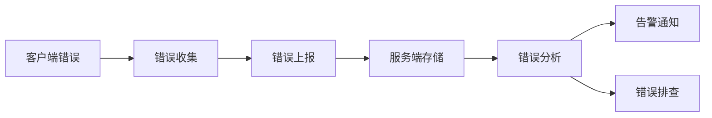

# JavaScript 错误监控

在开发Web应用时，错误是不可避免的。然而，及时发现并修复这些错误对于维持良好的用户体验至关重要。JavaScript错误监控系统让我们能够在生产环境中追踪和分析错误，从而更快地定位和解决问题。

## 为什么需要错误监控？

在没有错误监控的情况下，当用户遇到问题时，他们可能只会看到一个白屏或者功能失效，而开发人员却没有任何线索。错误监控系统提供了一种机制，让我们能够：

- 实时获取生产环境中的错误信息
- 了解错误的发生频率和影响范围
- 收集错误发生时的上下文信息
- 优先修复影响最大的问题

## JavaScript 错误监控的基本方法

### 1. 使用全局错误处理

JavaScript提供了`window.onerror`事件处理程序，可以捕获大部分未被try-catch捕获的错误。

```javascript
window.onerror = function(message, source, lineno, colno, error) {
  console.log('捕获到错误:', {
    message,      // 错误信息
    source,       // 发生错误的脚本URL
    lineno,       // 行号
    colno,        // 列号
    error         // Error对象
  });
  
  // 向服务器发送错误信息
  sendErrorToServer({
    message,
    source,
    lineno,
    colno,
    stack: error && error.stack
  });
  
  // 返回true可以阻止浏览器默认的错误处理（如在控制台中显示错误）
  return true;
};
```

### 2. 捕获Promise错误

未被处理的Promise拒绝不会被`window.onerror`捕获，我们需要使用`unhandledrejection`事件：

```javascript
window.addEventListener('unhandledrejection', function(event) {
  console.log('未处理的Promise拒绝:', event.reason);
  
  // 向服务器发送错误信息
  sendErrorToServer({
    type: 'unhandledrejection',
    reason: String(event.reason),
    stack: event.reason && event.reason.stack
  });
  
  // 阻止默认处理
  event.preventDefault();
});
```

### 3. 监控网络请求错误

对于AJAX/Fetch请求，我们可以拦截这些请求来监控网络错误：

```javascript
// 拦截XMLHttpRequest
const originalXhrSend = XMLHttpRequest.prototype.send;
XMLHttpRequest.prototype.send = function() {
  this.addEventListener('error', function() {
    sendErrorToServer({
      type: 'xhr_error',
      url: this._url,
      method: this._method
    });
  });
  
  this.addEventListener('timeout', function() {
    sendErrorToServer({
      type: 'xhr_timeout',
      url: this._url,
      method: this._method
    });
  });
  
  return originalXhrSend.apply(this, arguments);
};

// 保存原始的open方法
const originalXhrOpen = XMLHttpRequest.prototype.open;
XMLHttpRequest.prototype.open = function(method, url) {
  this._url = url;
  this._method = method;
  return originalXhrOpen.apply(this, arguments);
};

// 拦截Fetch API
const originalFetch = window.fetch;
window.fetch = function(url, options) {
  return originalFetch(url, options)
    .catch(error => {
      sendErrorToServer({
        type: 'fetch_error',
        url: url,
        error: String(error)
      });
      throw error;
    });
};
```

### 4. 监控资源加载错误

使用`error`事件可以捕获资源（如图片、脚本、样式表等）加载失败的情况：

```javascript
window.addEventListener('error', function(event) {
  // 过滤资源加载错误
  if (event.target && (event.target.src || event.target.href)) {
    sendErrorToServer({
      type: 'resource_error',
      resource: event.target.src || event.target.href,
      tagName: event.target.tagName
    });
  }
}, true); // 注意这里的 true，表示在捕获阶段处理
```

## 构建完整的错误监控系统

一个完整的错误监控系统通常需要包含以下组件：



### 错误上报函数

以下是一个简单的错误上报函数示例：

```javascript
function sendErrorToServer(errorInfo) {
  // 添加一些上下文信息
  const reportData = {
    ...errorInfo,
    url: window.location.href,
    userAgent: navigator.userAgent,
    timestamp: new Date().getTime(),
    // 可以添加用户ID等信息
    userId: getUserId()
  };
  
  // 使用sendBeacon API进行上报，这样即使页面关闭也能保证数据发送
  if (navigator.sendBeacon) {
    navigator.sendBeacon('/api/error-report', JSON.stringify(reportData));
  } else {
    // 降级处理，使用普通的AJAX请求
    const xhr = new XMLHttpRequest();
    xhr.open('POST', '/api/error-report', true);
    xhr.setRequestHeader('Content-Type', 'application/json');
    xhr.send(JSON.stringify(reportData));
  }
  
  // 可以选择在本地存储一些错误信息，以便下次启动时上报
  try {
    const storedErrors = JSON.parse(localStorage.getItem('pendingErrors') || '[]');
    storedErrors.push(reportData);
    // 限制存储的错误数量
    if (storedErrors.length > 10) storedErrors.shift();
    localStorage.setItem('pendingErrors', JSON.stringify(storedErrors));
  } catch (e) {
    // 处理localStorage可能的异常
  }
}
```

### 错误去重与采样

为了避免相同错误重复上报和减轻服务器负担，我们可以实现错误去重和采样：

```javascript
// 存储已经上报的错误哈希
const reportedErrors = new Set();

function hashError(error) {
  // 简单的哈希函数，实际应用中可能需要更复杂的逻辑
  const key = `${error.message}-${error.lineno}-${error.colno}-${error.source}`;
  return key;
}

function shouldReportError(error) {
  const errorHash = hashError(error);
  
  // 已经上报过的相同错误，不再上报
  if (reportedErrors.has(errorHash)) {
    return false;
  }
  
  // 记录这个错误已经上报
  reportedErrors.add(errorHash);
  
  // 控制Set大小，防止内存泄漏
  if (reportedErrors.size > 100) {
    // 移除最早添加的项
    reportedErrors.delete(reportedErrors.keys().next().value);
  }
  
  // 错误采样，比如只上报10%的错误
  return Math.random() < 0.1;
}
```

## 实际应用案例：构建一个简单的错误监控SDK

以下是一个简化的错误监控SDK示例，展示了如何将前面的概念整合在一起：

```javascript
class ErrorMonitor {
  constructor(options = {}) {
    this.options = {
      apiUrl: '/api/report-error',
      appId: 'default',
      userId: null,
      ...options
    };
    
    this.reportedErrors = new Set();
  }
  
  init() {
    this._setupWindowErrorHandler();
    this._setupPromiseRejectionHandler();
    this._setupResourceErrorHandler();
    this._interceptXhr();
    this._interceptFetch();
    this._reportPendingErrors();
    
    console.log('错误监控已初始化');
  }
  
  _setupWindowErrorHandler() {
    window.onerror = (message, source, lineno, colno, error) => {
      this._reportError({
        type: 'js_error',
        message,
        source,
        lineno,
        colno,
        stack: error && error.stack
      });
      return true;
    };
  }
  
  _setupPromiseRejectionHandler() {
    window.addEventListener('unhandledrejection', (event) => {
      this._reportError({
        type: 'unhandled_promise',
        message: String(event.reason),
        stack: event.reason && event.reason.stack
      });
    });
  }
  
  _setupResourceErrorHandler() {
    window.addEventListener('error', (event) => {
      if (event.target && (event.target.src || event.target.href)) {
        this._reportError({
          type: 'resource_error',
          source: event.target.src || event.target.href,
          tagName: event.target.tagName
        });
      }
    }, true);
  }
  
  _interceptXhr() {
    // XHR拦截逻辑
    // 类似前面的示例代码
  }
  
  _interceptFetch() {
    // Fetch拦截逻辑
    // 类似前面的示例代码
  }
  
  _reportError(errorInfo) {
    if (!this._shouldReport(errorInfo)) return;
    
    const reportData = {
      ...errorInfo,
      appId: this.options.appId,
      userId: this.options.userId || 'anonymous',
      url: window.location.href,
      userAgent: navigator.userAgent,
      timestamp: new Date().getTime()
    };
    
    this._sendToServer(reportData);
  }
  
  _shouldReport(errorInfo) {
    // 错误去重和采样逻辑
    // 类似前面的shouldReportError函数
    return true;
  }
  
  _sendToServer(data) {
    // 发送数据到服务器
    // 类似前面的sendErrorToServer函数
    
    // 将错误存储到localStorage以备后续上报
    this._storeErrorLocally(data);
  }
  
  _storeErrorLocally(data) {
    try {
      const storedErrors = JSON.parse(localStorage.getItem('pendingErrors') || '[]');
      storedErrors.push(data);
      if (storedErrors.length > 10) storedErrors.shift();
      localStorage.setItem('pendingErrors', JSON.stringify(storedErrors));
    } catch (e) {
      // 处理localStorage异常
    }
  }
  
  _reportPendingErrors() {
    try {
      const storedErrors = JSON.parse(localStorage.getItem('pendingErrors') || '[]');
      if (storedErrors.length > 0) {
        storedErrors.forEach(error => this._sendToServer(error));
        localStorage.removeItem('pendingErrors');
      }
    } catch (e) {
      // 处理异常
    }
  }
}

// 使用示例
const errorMonitor = new ErrorMonitor({
  apiUrl: 'https://api.example.com/error-report',
  appId: 'my-awesome-app',
  userId: 'user_123'
});

errorMonitor.init();
```

## 使用开源工具

除了自己构建错误监控系统，也可以使用一些成熟的开源工具：

:::note
以下是一些流行的错误监控工具，但这不是推广，而是提供一些学习参考。
:::

- **Sentry**: 开源的错误监控平台，支持多种编程语言
- **LogRocket**: 提供会话重放和错误监控功能
- **TrackJS**: 专注于JavaScript错误跟踪
- **Rollbar**: 提供实时错误监控和分析

## 最佳实践

1. **收集有用的上下文信息**：
   - 用户ID
   - 当前URL
   - 浏览器和设备信息
   - 错误发生时的操作路径

2. **适当处理敏感信息**：
   - 避免收集用户的隐私数据
   - 必要时对数据进行脱敏处理

3. **实现错误去重和采样**：
   - 避免相同错误重复上报
   - 对高频错误进行采样

4. **设置错误优先级**：
   - 区分致命错误和非致命错误
   - 对不同类型的错误设置不同的处理策略

5. **建立错误告警机制**：
   - 当出现新错误或错误突增时发送通知
   - 设置合理的告警阈值

## 总结

JavaScript错误监控是提高Web应用质量和用户体验的重要环节。通过实施错误监控系统，我们可以：

- 及时发现并修复生产环境中的问题
- 了解用户实际使用应用时遇到的困难
- 根据数据优先修复影响最大的问题
- 持续改进应用的稳定性

无论是构建自己的错误监控系统，还是使用现有的工具，重要的是建立一个有效的错误捕获、上报和分析流程，使开发团队能够快速响应并解决问题。

## 练习

1. 实现一个简单的错误监控SDK，能够捕获JavaScript错误、Promise拒绝和资源加载错误。
2. 设计一个错误去重算法，避免相同错误重复上报。
3. 创建一个简单的后端API接收错误报告，并将其存储到数据库中。
4. 尝试使用一个开源错误监控工具（如Sentry）集成到你的项目中。
5. 设计一个错误分析仪表板，展示错误趋势、频率和影响范围。

## 延伸阅读

- MDN上关于[window.onerror](https://developer.mozilla.org/en-US/docs/Web/API/Window/error_event)的文档
- 了解更多关于[Beacon API](https://developer.mozilla.org/en-US/docs/Web/API/Beacon_API)的信息
- 学习[SourceMap](https://developer.mozilla.org/en-US/docs/Tools/Debugger/How_to/Use_a_source_map)如何帮助在生产环境中定位错误
- 研究[Performance API](https://developer.mozilla.org/en-US/docs/Web/API/Performance)如何与错误监控结合，提供更全面的应用性能分析

掌握JavaScript错误监控不仅能帮助你更好地维护自己的应用，还是成为高级前端开发者的必备技能。当你构建更复杂的应用时，一个健全的错误监控系统将成为你的得力助手！