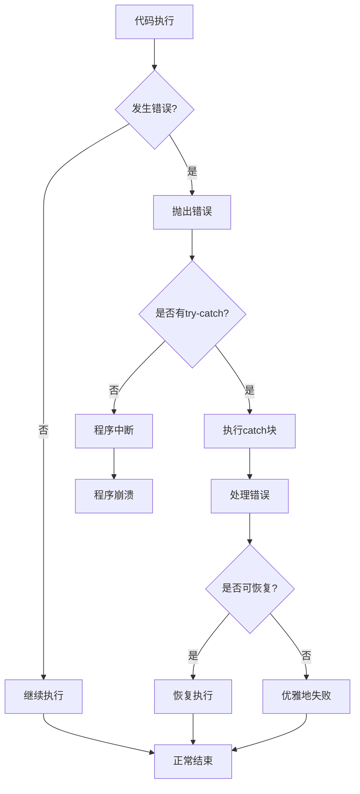

# JavaScript 错误处理最佳实践

## 引言

在JavaScript开发中，错误是不可避免的。代码中的错误可能来自于多种原因：用户输入有误、网络请求失败、代码逻辑问题等。良好的错误处理不仅可以防止程序崩溃，还能提供有用的调试信息，提高用户体验。本文将介绍JavaScript中错误处理的最佳实践，帮助你写出更加健壮和可维护的代码。

## 为什么错误处理很重要？

在深入了解错误处理技术之前，让我们先理解为什么错误处理对于开发来说至关重要：

1. **防止程序崩溃** - 未处理的错误可能导致整个应用程序停止工作
2. **调试辅助** - 良好的错误信息可以帮助快速定位问题
3. **用户体验** - 友好的错误提示可以提升用户体验
4. **代码健壮性** - 通过处理各种可能的错误情况，提高代码可靠性

## JavaScript 中的错误类型

在学习错误处理之前，先了解JavaScript内置的主要错误类型：

```javascript
// SyntaxError - 语法错误
const obj = {name: "John",};  // 有效的语法

// ReferenceError - 引用错误
console.log(undefinedVariable);  // 引用未定义的变量

// TypeError - 类型错误
const num = 123;
num.toUpperCase();  // 数字没有toUpperCase方法

// RangeError - 范围错误
const arr = new Array(-1);  // 数组长度不能为负数

// URIError - URI相关错误
decodeURI('%');  // 无效的URI编码

// EvalError - eval()函数使用不当
// 在现代JavaScript中较少见
```

## 基础错误处理：try-catch语句

最基本的错误处理方式是使用`try-catch`语句：

```javascript
try {
  // 可能会引发错误的代码
  const result = riskyOperation();
  console.log(result);
} catch (error) {
  // 处理错误
  console.error("发生错误:", error.message);
}
```

### try-catch-finally结构

完整的错误处理结构包括finally块，它无论是否发生错误都会执行：

```javascript
try {
  // 尝试执行的代码
  document.getElementById("demo").innerHTML = "尝试更改文本";
} catch (error) {
  // 处理错误
  console.error("出错了:", error.message);
} finally {
  // 无论如何都会执行的代码
  console.log("操作尝试完成");
}
```

:::note
`finally`块无论`try`块是否抛出错误，或者是否被`catch`块捕获，都会执行。这对于清理资源非常有用，例如关闭文件或数据库连接。
:::

## 高级错误处理技巧

### 自定义错误

创建自定义错误类可以让错误处理更加精确和有组织：

```javascript
// 定义自定义错误类
class ValidationError extends Error {
  constructor(message) {
    super(message);
    this.name = "ValidationError";
    this.date = new Date();
  }
}

// 使用自定义错误
function validateUser(user) {
  if (!user.name) {
    throw new ValidationError("用户名不能为空");
  }
  if (!user.email) {
    throw new ValidationError("邮箱不能为空");
  }
  return true;
}

// 处理自定义错误
try {
  validateUser({ name: "John", email: "" });
} catch (error) {
  if (error instanceof ValidationError) {
    console.log(`验证错误: ${error.message} (${error.date})`);
  } else {
    console.log(`未知错误: ${error.message}`);
  }
}
```

### 错误处理最佳实践

#### 1. 具体捕获错误

尽可能具体地捕获错误，而非笼统地处理所有错误：

```javascript
try {
  // 可能会导致多种错误的代码
  const data = JSON.parse(userInput);
  processData(data);
} catch (error) {
  // 针对不同类型的错误采取不同的处理方式
  if (error instanceof SyntaxError) {
    console.error("数据格式不正确，请检查输入");
  } else if (error instanceof TypeError) {
    console.error("数据处理错误，请联系支持团队");
  } else {
    console.error("发生未知错误", error.message);
  }
}
```

#### 2. 避免空catch块

空的catch块会掩盖问题，使调试变得困难：

```javascript
// 不好的做法 ❌
try {
  riskyOperation();
} catch (error) {
  // 什么都不做
}

// 好的做法 ✅
try {
  riskyOperation();
} catch (error) {
  console.error("操作失败:", error.message);
  // 可能的话，还应提供恢复策略或通知用户
}
```

#### 3. 异步错误处理

对于Promise和async/await，正确处理错误是很重要的：

```javascript
// Promise 错误处理
fetchData()
  .then(data => {
    // 处理数据
    displayData(data);
  })
  .catch(error => {
    // 处理错误
    displayError("无法获取数据: " + error.message);
  });

// async/await 错误处理
async function loadData() {
  try {
    const response = await fetch('https://api.example.com/data');
    
    if (!response.ok) {
      throw new Error(`HTTP错误! 状态码: ${response.status}`);
    }
    
    const data = await response.json();
    return data;
  } catch (error) {
    console.error("获取数据失败:", error.message);
    // 可以重试、显示友好错误消息或回退到默认数据
    return defaultData;
  }
}
```

#### 4. 集中式错误处理

对于大型应用，集中式错误处理可以提高代码的可维护性：

```javascript
// 全局错误处理函数
function globalErrorHandler(error, errorInfo = {}) {
  // 记录错误
  console.error("错误:", error);
  console.error("错误信息:", errorInfo);
  
  // 可以发送到错误追踪服务
  // errorTrackingService.report(error, errorInfo);
  
  // 可以通知用户
  showUserFriendlyError();
}

// 在应用中使用
window.onerror = function(message, source, lineno, colno, error) {
  globalErrorHandler(error, { source, lineno, colno });
  return true; // 防止默认的错误处理
};

// 对于未捕获的Promise错误
window.addEventListener('unhandledrejection', event => {
  globalErrorHandler(event.reason, { type: 'unhandled promise rejection' });
});
```

## 实际案例：用户表单验证

以下是一个实际的表单验证错误处理案例：

```javascript
class FormValidationError extends Error {
  constructor(fieldName, message) {
    super(message);
    this.name = "FormValidationError";
    this.fieldName = fieldName;
  }
}

// 验证函数
function validateForm(formData) {
  // 验证用户名
  if (!formData.username) {
    throw new FormValidationError("username", "用户名不能为空");
  }
  
  if (formData.username.length < 3) {
    throw new FormValidationError("username", "用户名至少需要3个字符");
  }
  
  // 验证电子邮件
  if (!formData.email) {
    throw new FormValidationError("email", "电子邮件不能为空");
  }
  
  const emailRegex = /^[^\s@]+@[^\s@]+\.[^\s@]+$/;
  if (!emailRegex.test(formData.email)) {
    throw new FormValidationError("email", "请输入有效的电子邮件地址");
  }
  
  // 验证密码
  if (!formData.password) {
    throw new FormValidationError("password", "密码不能为空");
  }
  
  if (formData.password.length < 8) {
    throw new FormValidationError("password", "密码长度至少为8个字符");
  }
  
  return true; // 所有验证通过
}

// 处理表单提交
function handleFormSubmit(event) {
  event.preventDefault();
  
  // 重置之前的错误提示
  clearFormErrors();
  
  const formData = {
    username: document.getElementById("username").value,
    email: document.getElementById("email").value,
    password: document.getElementById("password").value
  };
  
  try {
    if (validateForm(formData)) {
      // 表单验证通过，可以提交
      submitFormToServer(formData);
    }
  } catch (error) {
    if (error instanceof FormValidationError) {
      // 显示特定字段的错误
      displayFieldError(error.fieldName, error.message);
    } else {
      // 处理其他类型的错误
      displayGeneralError("表单提交出错: " + error.message);
    }
  }
}

// 辅助函数
function clearFormErrors() {
  const errorElements = document.getElementsByClassName("error-message");
  while(errorElements.length > 0) {
    errorElements[0].parentNode.removeChild(errorElements[0]);
  }
}

function displayFieldError(fieldName, message) {
  const field = document.getElementById(fieldName);
  const errorDiv = document.createElement("div");
  errorDiv.className = "error-message";
  errorDiv.textContent = message;
  errorDiv.style.color = "red";
  field.parentNode.insertBefore(errorDiv, field.nextSibling);
}

function displayGeneralError(message) {
  const form = document.getElementById("user-form");
  const errorDiv = document.createElement("div");
  errorDiv.className = "error-message";
  errorDiv.textContent = message;
  errorDiv.style.color = "red";
  form.prepend(errorDiv);
}

// 假设的表单提交函数
async function submitFormToServer(formData) {
  try {
    const response = await fetch('https://api.example.com/register', {
      method: 'POST',
      headers: {
        'Content-Type': 'application/json'
      },
      body: JSON.stringify(formData)
    });
    
    if (!response.ok) {
      throw new Error(`服务器错误: ${response.status}`);
    }
    
    const data = await response.json();
    alert("注册成功!");
    window.location.href = "/welcome";
  } catch (error) {
    displayGeneralError("无法提交表单: " + error.message);
  }
}

// 添加事件监听器
document.getElementById("user-form").addEventListener("submit", handleFormSubmit);
```

## 错误处理的图示流程



## 总结

良好的错误处理是构建健壮JavaScript应用的关键。主要实践包括：

1. **使用try-catch语句** - 捕获并处理可能的错误
2. **创建自定义错误** - 使错误信息更具描述性和可操作性
3. **特定错误处理** - 根据错误类型采取不同的处理策略
4. **异步代码的错误处理** - 正确处理Promise和async/await中的错误
5. **集中式错误处理** - 在大型应用中统一管理错误
6. **避免空catch块** - 始终提供有意义的错误处理
7. **用户友好的错误消息** - 向用户展示可理解的错误信息

通过遵循这些最佳实践，你可以编写出更加稳定、可靠的JavaScript应用，提供更好的用户体验，并简化调试和维护过程。

## 练习与挑战

为了巩固你的错误处理知识，尝试完成以下练习：

1. 创建一个包含自定义错误类的计算器，处理除数为零、无效输入等错误情况
2. 实现一个带错误处理的简单文件上传表单，处理文件大小、类型等验证
3. 编写一个带重试机制的API请求函数，在网络错误时自动重试几次
4. 为一个表单实现实时验证，使用自定义错误类展示适当的错误消息

:::tip 记住
好的错误处理不仅仅是捕获错误，更是提供有用的诊断信息和合理的恢复策略。保持错误消息对用户友好，对开发者有意义！
:::

## 额外资源

- [MDN Web Docs: JavaScript 错误参考](https://developer.mozilla.org/zh-CN/docs/Web/JavaScript/Reference/Errors)
- [JavaScript Error Handling – The Complete Guide](https://www.educative.io/blog/javascript-error-handling)
- [The Definitive Guide to JavaScript Errors](https://airbrake.io/blog/javascript/javascript-error-handling)
- [JavaScript Errors: Throw and Try...Catch...Finally](https://www.w3schools.com/js/js_errors.asp)