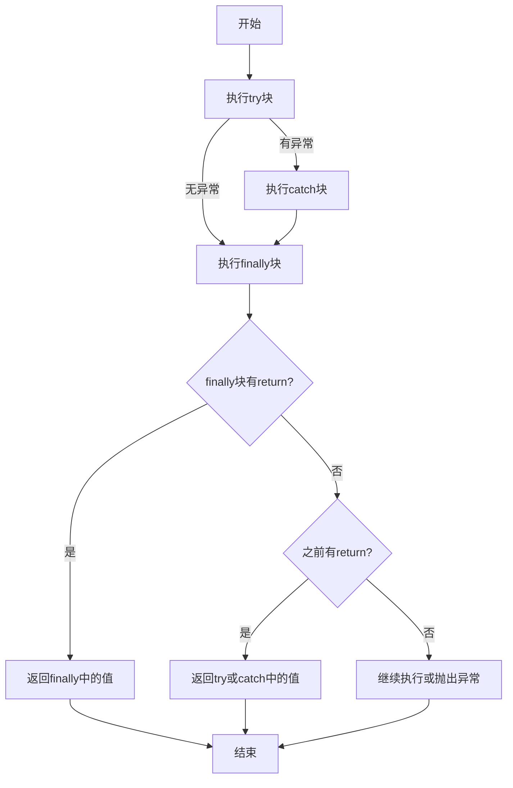

# JavaScript Finally语句

## 什么是finally语句？

在JavaScript的错误处理机制中，`finally`语句是`try-catch`结构的重要组成部分。它定义了一个代码块，无论`try`块中的代码是否抛出异常，也无论`catch`块是否捕获到异常，这个代码块**总是会被执行**。

`finally`语句通常用于资源释放、清理工作或确保某些关键操作必定执行的场景。

## try-catch-finally的基本语法

```javascript
try {
  // 可能会抛出异常的代码
} catch (error) {
  // 处理异常的代码
} finally {
  // 无论如何都会执行的代码
}
```

你也可以省略`catch`块，直接使用`try-finally`结构：

```javascript
try {
  // 可能会抛出异常的代码
} finally {
  // 无论如何都会执行的代码
}
```

:::note
如果使用`try-finally`结构（省略`catch`），当`try`块中发生异常时，异常会在`finally`块执行完毕后被抛出。
:::

## finally语句的执行时机

让我们通过一些例子来理解`finally`块的执行时机：

### 例子1：try块正常执行

```javascript
function testFinally1() {
  try {
    console.log("在try块中");
    return "try的返回值";
  } catch (err) {
    console.log("在catch块中");
    return "catch的返回值";
  } finally {
    console.log("在finally块中");
  }
}

const result = testFinally1();
console.log("函数返回值:", result);
```

输出：
```
在try块中
在finally块中
函数返回值: try的返回值
```

### 例子2：try块抛出异常

```javascript
function testFinally2() {
  try {
    console.log("在try块中");
    throw new Error("发生错误");
    return "try的返回值";  // 这行不会执行
  } catch (err) {
    console.log("在catch块中:", err.message);
    return "catch的返回值";
  } finally {
    console.log("在finally块中");
  }
}

const result = testFinally2();
console.log("函数返回值:", result);
```

输出：
```
在try块中
在catch块中: 发生错误
在finally块中
函数返回值: catch的返回值
```

### 例子3：即使return也会执行finally

```javascript
function testFinally3() {
  try {
    console.log("在try块中");
    return "try的返回值";
  } finally {
    console.log("在finally块中");
  }
}

const result = testFinally3();
console.log("函数返回值:", result);
```

输出：
```
在try块中
在finally块中
函数返回值: try的返回值
```

## finally块会覆盖返回值吗？

这是一个重要的知识点：如果`finally`块中也有`return`语句，它会覆盖`try`或`catch`块中的返回值。

```javascript
function testReturnInFinally() {
  try {
    console.log("在try块中");
    return "try的返回值";
  } catch (err) {
    return "catch的返回值";
  } finally {
    console.log("在finally块中");
    return "finally的返回值";  // 这会覆盖try块的返回值
  }
}

const result = testReturnInFinally();
console.log("函数返回值:", result);
```

输出：
```
在try块中
在finally块中
函数返回值: finally的返回值
```

:::warning
在`finally`块中使用`return`语句通常被认为是一种不好的做法，因为它会隐藏`try`或`catch`块中可能出现的错误，并可能导致意外的行为。
:::

## 实际应用场景

### 场景1：资源清理

无论操作成功与否，都需要关闭资源的情景：

```javascript
function processFile() {
  let connection = null;
  try {
    connection = openDatabaseConnection();
    // 执行数据库操作
    return "操作成功";
  } catch (err) {
    console.error("数据库错误:", err.message);
    return "操作失败";
  } finally {
    // 无论操作成功还是失败，都确保关闭连接
    if (connection) {
      connection.close();
      console.log("数据库连接已关闭");
    }
  }
}
```

### 场景2：计时器和性能测量

使用`finally`来确保计时器停止，无论操作是否成功：

```javascript
function measureExecutionTime() {
  const startTime = performance.now();
  try {
    // 执行需要测量时间的操作
    doSomethingComplicated();
    return "操作完成";
  } catch (err) {
    console.error("操作失败:", err.message);
    return "操作失败";
  } finally {
    const endTime = performance.now();
    console.log(`操作耗时: ${endTime - startTime} 毫秒`);
  }
}
```

### 场景3：UI状态管理

在前端应用中，无论API请求成功或失败，都需要重置加载状态：

```javascript
async function fetchUserData() {
  // 显示加载状态
  setLoading(true);
  
  try {
    const response = await fetch('/api/user');
    if (!response.ok) {
      throw new Error('获取用户数据失败');
    }
    const userData = await response.json();
    return userData;
  } catch (err) {
    console.error("API错误:", err.message);
    showErrorMessage("无法加载用户数据");
    return null;
  } finally {
    // 无论请求成功还是失败，都隐藏加载状态
    setLoading(false);
  }
}
```

## finally与异步代码

在使用`async/await`时，`try-catch-finally`结构仍然有效：

```javascript
async function fetchData() {
  try {
    const response = await fetch('https://api.example.com/data');
    const data = await response.json();
    return data;
  } catch (error) {
    console.error('获取数据失败:', error);
    return null;
  } finally {
    console.log('请求已完成');
  }
}
```

## 常见误区和最佳实践

### 误区1：在finally中抛出异常

如果在`finally`块中抛出异常，它会替换原来在`try`或`catch`块中抛出的异常：

```javascript
try {
  throw new Error("原始错误");
} finally {
  throw new Error("finally错误");  // 原始错误会被覆盖
}
// 只有"finally错误"会被抛出
```

### 最佳实践

1. **避免在finally中返回值**：这可能会导致意外覆盖`try`或`catch`块中的返回值。
2. **保持finally块简洁**：`finally`块应当只包含清理代码，而不应当包含复杂的逻辑。
3. **避免在finally中抛出异常**：这会覆盖原始异常，使调试变得困难。
4. **只清理在try块中成功分配的资源**：在`finally`块中检查资源是否分配成功，再进行清理。

## 流程控制图示

下面是`try-catch-finally`的执行流程示意图：



## 总结

- `finally`语句提供了一个无论`try`块中的代码是否抛出异常都会执行的代码块。
- `finally`块常用于资源释放、清理工作和确保某些操作必定执行的场景。
- `finally`块中的`return`语句会覆盖`try`和`catch`块中的返回值，这通常是不良实践。
- 在异步函数中，`try-catch-finally`结构与同步代码中的用法相同。

## 练习题

1. 编写一个函数，使用`try-catch-finally`结构模拟打开、使用和关闭文件的操作。
2. 创建一个示例，展示`finally`块如何覆盖`try`块中的返回值。
3. 实现一个带有超时功能的API调用函数，确保无论调用成功、失败或超时，都会清理相关资源。

## 进一步学习资源

- MDN Web Docs上的[try...catch文档](https://developer.mozilla.org/en-US/docs/Web/JavaScript/Reference/Statements/try...catch)
- 深入学习JavaScript的异常处理机制
- 探索Promise中的错误处理与finally方法

:::tip
记住：`finally`块的主要目的是确保资源被正确释放，而不是处理错误逻辑。将错误处理逻辑放在`catch`块中，将资源清理放在`finally`块中，这样可以使代码更加清晰和可维护。
:::