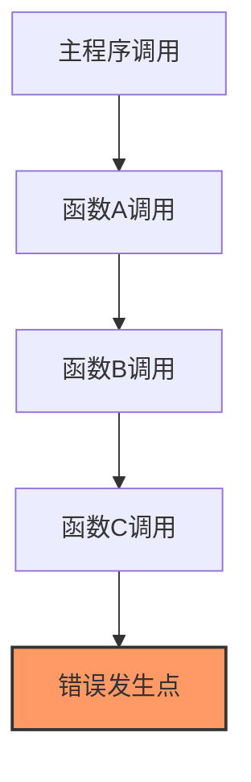

# JavaScript 错误栈

在JavaScript开发过程中，错误是不可避免的。无论你是初学者还是有经验的开发者，了解如何正确解读和使用错误栈(Error Stack)都是提高调试效率的关键技能。本文将带你深入了解JavaScript错误栈的概念、工作原理以及实际应用。

## 什么是错误栈？

错误栈(Error Stack)是JavaScript引擎在程序出现异常时，记录的函数调用路径。它以堆栈的形式展示了错误发生时的"调用链"，按照从最新调用到最早调用的顺序排列，帮助开发者追踪错误的来源和传播路径。



## Error对象与stack属性

JavaScript中的`Error`对象包含一个名为`stack`的属性，该属性包含了错误栈信息：

```javascript
try {
  // 故意引发错误
  nonExistentFunction();
} catch (error) {
  console.log(error.stack);
}
```

输出可能类似于：

```
ReferenceError: nonExistentFunction is not defined
    at <anonymous>:2:3
    at Object.executeUserCode (evaluation-script:6:10)
    at evaluateScript (evaluation-script:93:35)
    at <anonymous>:1:1
```

这个输出告诉我们：
1. 错误类型是`ReferenceError`
2. 错误消息是"nonExistentFunction is not defined"
3. 错误发生在匿名脚本的第2行第3列
4. 调用栈的其余部分展示了错误传播的路径

## 错误栈的结构

一个典型的错误栈包含以下信息：

1. **错误类型**：如`ReferenceError`、`TypeError`、`SyntaxError`等
2. **错误消息**：描述错误的具体内容
3. **调用栈**：以"at 函数名 (文件路径:行号:列号)"的形式呈现的调用链

让我们通过一个更复杂的例子来分析错误栈：

```javascript
function first() {
  second();
}

function second() {
  third();
}

function third() {
  throw new Error('出错了！');
}

try {
  first();
} catch (error) {
  console.log(error.stack);
}
```

输出可能类似于：

```
Error: 出错了！
    at third (<anonymous>:8:9)
    at second (<anonymous>:4:3)
    at first (<anonymous>:1:3)
    at <anonymous>:12:3
```

这个错误栈清晰地展示了错误的传播路径：错误最初在`third`函数中抛出，然后传递给`second`函数，再传递给`first`函数，最后到达主程序。

## 自定义错误栈

有时，我们需要创建自定义错误，并希望保留完整的错误栈信息：

```javascript
function CustomError(message) {
  this.name = 'CustomError';
  this.message = message;
  this.stack = (new Error()).stack;
}

CustomError.prototype = Object.create(Error.prototype);
CustomError.prototype.constructor = CustomError;

try {
  throw new CustomError('这是一个自定义错误');
} catch (error) {
  console.log(error.stack);
}
```

在ES6中，我们可以使用类继承来更简洁地实现：

```javascript
class CustomError extends Error {
  constructor(message) {
    super(message);
    this.name = 'CustomError';
  }
}

try {
  throw new CustomError('这是一个自定义错误');
} catch (error) {
  console.log(error.stack);
}
```

## 实际应用场景

### 1. 调试复杂应用

在大型应用中，错误栈帮助我们理解错误发生的上下文和调用路径，这对于定位问题至关重要。

### 2. 错误监控系统

在生产环境中，我们通常会使用错误监控系统来收集用户遇到的错误信息：

```javascript
window.onerror = function(message, source, lineno, colno, error) {
  // 发送错误信息到服务器
  fetch('/api/log-error', {
    method: 'POST',
    headers: {
      'Content-Type': 'application/json'
    },
    body: JSON.stringify({
      message: message,
      source: source,
      lineno: lineno,
      colno: colno,
      stack: error ? error.stack : null
    })
  });
  
  return true; // 防止默认错误处理
};
```

### 3. 异步操作中的错误追踪

在异步编程中，错误栈可能会丢失上下文信息。使用`async/await`或者Promise链可以帮助保留更完整的错误栈：

```javascript
async function processData() {
  try {
    const data = await fetchData();
    return processResult(data);
  } catch (error) {
    console.error('处理数据时出错:', error.stack);
    throw error; // 重新抛出以保留栈信息
  }
}
```

## 跨浏览器兼容性

不同的JavaScript引擎可能会生成格式略有不同的错误栈。例如：

- **Chrome/V8**: 提供相对完整的调用栈和文件位置信息
- **Firefox/SpiderMonkey**: 格式类似，但可能会有细微差别
- **Safari/JavaScriptCore**: 较早版本可能提供较少的调用栈信息
- **Internet Explorer**: 旧版本可能不提供完整的`stack`属性

:::tip
如果你的应用需要在多平台上运行，考虑使用像 [TraceKit](https://github.com/csnover/TraceKit) 或 [error-stack-parser](https://github.com/stacktracejs/error-stack-parser) 这样的库来规范化错误栈格式。
:::

## 错误栈清理与优化

有时错误栈可能过于冗长，包含不必要的框架内部调用信息。我们可以实现简单的清理函数：

```javascript
function cleanStack(stack) {
  // 移除框架内部调用
  return stack
    .split('\n')
    .filter(line => !line.includes('node_modules/'))
    .join('\n');
}

try {
  throw new Error('测试错误');
} catch (error) {
  console.log(cleanStack(error.stack));
}
```

## 利用Source Maps

当使用了代码压缩或转译的生产环境代码时，错误栈中的行号和列号可能对应的是编译后的代码，而非源代码。这种情况下，我们可以使用Source Maps来映射回原始源代码：

```javascript
// 在生产环境添加source map
//# sourceMappingURL=app.min.js.map
```

许多错误监控服务（如Sentry、Rollbar等）能够自动处理Source Maps，使报告的错误与源代码正确对应。

## 实践练习

以下是几个练习题，帮助你更好地理解和应用错误栈：

1. 创建一个嵌套三层的函数调用，在最内层抛出错误，然后捕获并分析错误栈。
2. 编写一个自定义错误类，确保它正确保留错误栈信息。
3. 在异步操作中（如setTimeout或Promise）捕获错误，观察错误栈的变化。
4. 实现一个简单的错误处理中间件，记录应用中的所有错误及其栈信息。

## 总结

错误栈是JavaScript调试和错误处理的重要工具，它帮助我们了解错误发生的上下文和传播路径。通过正确解读和利用错误栈，我们可以：

- 快速定位错误源头
- 理解程序的执行流程
- 更有效地调试复杂应用
- 构建更健壮的错误监控系统

随着你编程经验的增长，熟练解读和使用错误栈将成为你解决问题的有力武器。

## 延伸阅读

1. [MDN Web Docs: Error.prototype.stack](https://developer.mozilla.org/en-US/docs/Web/JavaScript/Reference/Global_Objects/Error/stack)
2. [JavaScript错误类型详解](https://developer.mozilla.org/en-US/docs/Web/JavaScript/Reference/Global_Objects/Error#error_types)
3. [Source Maps详解](https://developer.mozilla.org/en-US/docs/Tools/Debugger/How_to/Use_a_source_map)
4. [异步编程中的错误处理最佳实践](https://www.toptal.com/javascript/asynchronous-javascript-async-await-tutorial)

掌握JavaScript错误栈是迈向高级JavaScript开发者的重要一步，希望本文对你的学习之旅有所帮助！