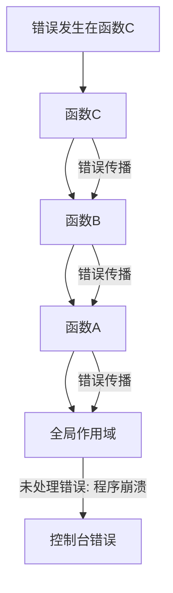

# JavaScript 错误传播

在JavaScript应用程序中，错误会像热锅上的水滴一样，从代码的一部分迅速传播到另一部分。理解错误如何传播对于编写稳健的代码和有效调试至关重要。本文将探讨JavaScript中的错误传播机制，以及如何管理和控制这一过程。

## 什么是错误传播？

错误传播是指当在函数或代码块中发生错误时，该错误如何"冒泡"或传递到调用栈的更高层次的过程。在JavaScript中，如果不处理错误，它们会沿着函数调用链向上传播，直到被捕获或导致程序崩溃。



## 默认的错误传播行为

当JavaScript代码执行过程中遇到错误时，如果没有特定的错误处理机制，错误将按照以下方式传播：

1. 当前函数停止执行
2. 控制权传回到调用该函数的代码
3. 如果在调用链中没有错误处理程序，错误会一直传播到全局作用域
4. 在浏览器环境中，未处理的错误会显示在控制台中

让我们看一个简单的例子：

```javascript
function deepestFunction() {
  // 这里产生一个错误
  const result = nonExistentVariable + 10;
  return result;
}

function middleFunction() {
  return deepestFunction();
}

function topFunction() {
  return middleFunction();
}

// 调用顶层函数
try {
  const result = topFunction();
  console.log(result);
} catch (error) {
  console.error("捕获到错误:", error.message);
}

// 输出: "捕获到错误: nonExistentVariable is not defined"
```

在上面的代码中，错误发生在`deepestFunction`中，但是被传播到了`topFunction`的调用处才被捕获。

## 使用try...catch控制错误传播

JavaScript提供了`try...catch`语句来控制错误传播。通过在适当的位置添加错误处理，你可以防止错误进一步传播，并可以采取补救措施。

### 基本语法

```javascript
try {
  // 可能会产生错误的代码
} catch (error) {
  // 处理错误的代码
} finally {
  // 无论是否发生错误，都会执行的代码
}
```

### 在不同层级捕获错误

你可以选择在调用栈的不同层级捕获错误，每个层级可以决定是处理错误还是让它继续传播。

```javascript
function riskyFunction() {
  try {
    // 可能产生错误的代码
    throw new Error("这是一个示例错误");
  } catch (error) {
    console.log("在riskyFunction中捕获错误:", error.message);
    
    // 决定是否重新抛出错误
    if (error.message.includes("严重")) {
      throw error; // 重新抛出，让错误继续传播
    }
    
    // 返回一个默认值或错误标识
    return { success: false, error: error.message };
  }
}

function callerFunction() {
  try {
    const result = riskyFunction();
    console.log("调用结果:", result);
  } catch (error) {
    console.error("在callerFunction中捕获错误:", error.message);
  }
}

callerFunction();

// 输出: 
// "在riskyFunction中捕获错误: 这是一个示例错误"
// "调用结果: { success: false, error: '这是一个示例错误' }"
```

## 自定义错误和错误传播

创建和抛出自定义错误可以使错误传播过程更加可控和信息丰富。

```javascript
// 定义自定义错误类型
class ValidationError extends Error {
  constructor(message) {
    super(message);
    this.name = "ValidationError";
  }
}

class DatabaseError extends Error {
  constructor(message) {
    super(message);
    this.name = "DatabaseError";
  }
}

// 在不同层级处理不同类型的错误
function validateUserData(data) {
  if (!data.username) {
    throw new ValidationError("用户名不能为空");
  }
  return true;
}

function saveUserToDatabase(data) {
  try {
    validateUserData(data);
    // 模拟数据库操作
    if (Math.random() > 0.5) {
      throw new DatabaseError("数据库连接失败");
    }
    return { success: true };
  } catch (error) {
    if (error instanceof ValidationError) {
      // 处理验证错误
      console.log("数据验证失败:", error.message);
      return { success: false, reason: "validation" };
    }
    // 数据库错误继续传播
    throw error;
  }
}

function processUserRegistration(userData) {
  try {
    const result = saveUserToDatabase(userData);
    console.log("用户注册结果:", result);
  } catch (error) {
    if (error instanceof DatabaseError) {
      console.error("数据库错误:", error.message);
      // 通知管理员或尝试重新连接
    } else {
      console.error("未知错误:", error.message);
    }
  }
}

// 测试
processUserRegistration({ username: "" });
// 可能输出: "数据验证失败: 用户名不能为空" 和 "用户注册结果: { success: false, reason: 'validation' }"

processUserRegistration({ username: "john_doe" });
// 可能输出: "用户注册结果: { success: true }" 或 "数据库错误: 数据库连接失败"
```

## Promise中的错误传播

在异步代码中，错误传播的方式有所不同。Promise提供了一种结构化的方式来处理异步操作中的错误。

```javascript
function fetchUserData(userId) {
  return new Promise((resolve, reject) => {
    // 模拟API调用
    setTimeout(() => {
      if (userId < 0) {
        reject(new Error("用户ID不能为负数"));
      } else if (userId === 0) {
        reject(new Error("用户不存在"));
      } else {
        resolve({ id: userId, name: `用户${userId}` });
      }
    }, 1000);
  });
}

// 使用Promise链处理错误
fetchUserData(-1)
  .then(user => {
    console.log("用户数据:", user);
    return processUserData(user);
  })
  .catch(error => {
    console.error("获取用户数据失败:", error.message);
    // 返回默认用户
    return { id: 999, name: "默认用户" };
  })
  .then(result => {
    console.log("最终结果:", result);
  });

// 输出:
// "获取用户数据失败: 用户ID不能为负数"
// "最终结果: { id: 999, name: '默认用户' }"
```

### async/await中的错误传播

`async/await`语法使异步代码看起来更像同步代码，但错误传播机制依然遵循Promise的规则。

```javascript
async function getUserDetails(userId) {
  try {
    const user = await fetchUserData(userId);
    const permissions = await fetchUserPermissions(user.id);
    return {
      ...user,
      permissions
    };
  } catch (error) {
    console.error(`获取用户${userId}的详细信息失败:`, error.message);
    throw new Error(`用户详情获取失败: ${error.message}`);
  }
}

async function displayUserDashboard(userId) {
  try {
    const userDetails = await getUserDetails(userId);
    console.log("显示用户仪表板:", userDetails);
  } catch (error) {
    console.error("无法显示用户仪表板:", error.message);
    // 显示错误页面或者默认仪表板
  }
}

// 调用
displayUserDashboard(-5);
// 输出可能是:
// "获取用户-5的详细信息失败: 用户ID不能为负数"
// "无法显示用户仪表板: 用户详情获取失败: 用户ID不能为负数"
```

## 错误传播的最佳实践

:::tip
有效管理错误传播可以大大提高代码的可靠性和可维护性。以下是一些最佳实践：
:::

1. **在适当的层级处理错误**：不是所有错误都应该传播到顶层。在能够有效处理错误的最低层级捕获它们。

2. **使用自定义错误类型**：创建特定领域的错误类型，使错误处理更加精确。

3. **提供有用的错误信息**：确保错误消息包含足够的上下文信息，便于调试。

4. **考虑恢复策略**：在捕获错误后，考虑是否可以采取恢复措施，而不仅仅是记录错误。

5. **避免吞没错误**：不要捕获错误后不做任何处理，这会使调试变得困难。

```javascript
// 不好的做法
try {
  riskyOperation();
} catch (error) {
  // 什么也不做，错误被"吞没"了
}

// 好的做法
try {
  riskyOperation();
} catch (error) {
  console.error("操作失败:", error);
  // 执行恢复操作或通知用户
}
```

6. **选择性重新抛出**：根据错误类型决定是处理还是重新抛出。

```javascript
try {
  const data = JSON.parse(inputString);
  processData(data);
} catch (error) {
  if (error instanceof SyntaxError) {
    console.error("输入数据格式无效:", error.message);
    return defaultData;
  }
  // 其他类型的错误继续传播
  throw error;
}
```

## 实际案例：用户注册流程

下面是一个更复杂的实际案例，展示了如何在用户注册流程中处理错误传播：

```javascript
// 用户注册流程中的错误处理

// 自定义错误类型
class ValidationError extends Error {
  constructor(message, field) {
    super(message);
    this.name = "ValidationError";
    this.field = field;
  }
}

class DatabaseError extends Error {
  constructor(message, operation) {
    super(message);
    this.name = "DatabaseError";
    this.operation = operation;
  }
}

// 数据验证函数
function validateRegistrationData(userData) {
  if (!userData.email) {
    throw new ValidationError("电子邮件不能为空", "email");
  }
  
  if (!userData.email.includes('@')) {
    throw new ValidationError("电子邮件格式无效", "email");
  }
  
  if (!userData.password || userData.password.length < 8) {
    throw new ValidationError("密码必须至少包含8个字符", "password");
  }
  
  return true;
}

// 检查电子邮件是否已存在
async function checkEmailExists(email) {
  // 模拟数据库查询
  return new Promise((resolve, reject) => {
    setTimeout(() => {
      if (email === "test@example.com") {
        resolve(true); // 电子邮件已存在
      } else if (Math.random() < 0.1) {
        reject(new DatabaseError("数据库查询失败", "checkEmail"));
      } else {
        resolve(false); // 电子邮件不存在
      }
    }, 500);
  });
}

// 创建用户账户
async function createUserAccount(userData) {
  // 模拟用户创建
  return new Promise((resolve, reject) => {
    setTimeout(() => {
      if (Math.random() < 0.1) {
        reject(new DatabaseError("创建用户账户失败", "insertUser"));
      } else {
        resolve({
          id: Math.floor(Math.random() * 10000),
          email: userData.email,
          created: new Date()
        });
      }
    }, 800);
  });
}

// 注册流程协调函数
async function registerUser(userData) {
  try {
    // 验证用户数据
    validateRegistrationData(userData);
    
    // 检查邮箱是否已存在
    const emailExists = await checkEmailExists(userData.email);
    if (emailExists) {
      throw new ValidationError("此电子邮件已被注册", "email");
    }
    
    // 创建用户账户
    const newUser = await createUserAccount(userData);
    
    // 发送确认邮件（简化版）
    console.log(`向 ${userData.email} 发送确认邮件`);
    
    return {
      success: true,
      user: newUser
    };
  } catch (error) {
    // 根据错误类型采取不同的处理方式
    if (error instanceof ValidationError) {
      return {
        success: false,
        errorType: "validation",
        field: error.field,
        message: error.message
      };
    }
    
    if (error instanceof DatabaseError) {
      console.error(`数据库操作失败 [${error.operation}]:`, error.message);
      
      // 对于某些数据库操作，我们可能希望重试
      if (error.operation === "checkEmail") {
        // 可以实现重试逻辑
      }
      
      return {
        success: false,
        errorType: "database",
        message: "服务器错误，请稍后重试"
      };
    }
    
    // 未知错误
    console.error("注册过程中发生未知错误:", error);
    return {
      success: false,
      errorType: "unknown",
      message: "注册过程中发生错误"
    };
  }
}

// 使用示例
async function handleRegistrationForm() {
  const userData = {
    email: "new.user@example.com",
    password: "securepass123"
  };
  
  const result = await registerUser(userData);
  
  if (result.success) {
    console.log("用户注册成功:", result.user);
    // 重定向到欢迎页面
  } else {
    console.log(`注册失败: ${result.message}`);
    if (result.errorType === "validation" && result.field) {
      console.log(`请检查 ${result.field} 字段`);
      // 高亮显示表单中的问题字段
    }
  }
}

// 调用注册处理函数
handleRegistrationForm();
```

## 总结

错误传播是JavaScript错误处理的核心概念。通过理解错误如何在应用程序中传播，你可以构建更健壮的错误处理系统，提高代码的可靠性和用户体验。关键点包括：

1. 错误默认沿调用栈向上传播，直到被捕获或达到全局作用域
2. 使用`try...catch`可以在不同级别控制错误传播
3. 自定义错误类型有助于更精确地处理特定类型的错误
4. Promise和async/await提供了处理异步操作中错误的结构化方式
5. 应在适当的层级处理错误，并提供恢复策略

通过实践本文中的技术和原则，你将能够更有效地管理JavaScript应用程序中的错误，提供更好的用户体验，并简化调试和维护过程。

## 练习

为了巩固你的理解，尝试完成以下练习：

1. 创建一个函数链，包含至少三个嵌套函数，然后实施不同级别的错误处理策略。
2. 定义一个自定义错误类型层次结构，并编写代码来有选择地处理这些错误类型。
3. 改进本文中的用户注册示例，添加更多的验证规则和错误处理逻辑。

## 附加资源

- [MDN Web Docs: try...catch](https://developer.mozilla.org/zh-CN/docs/Web/JavaScript/Reference/Statements/try...catch)
- [MDN Web Docs: Error](https://developer.mozilla.org/zh-CN/docs/Web/JavaScript/Reference/Global_Objects/Error)
- [JavaScript错误处理的最佳实践](https://www.toptal.com/javascript/proper-error-handling-javascript)

掌握错误传播对于编写健壮的JavaScript代码至关重要。继续练习和应用这些概念，你将成为更出色的JavaScript开发者！