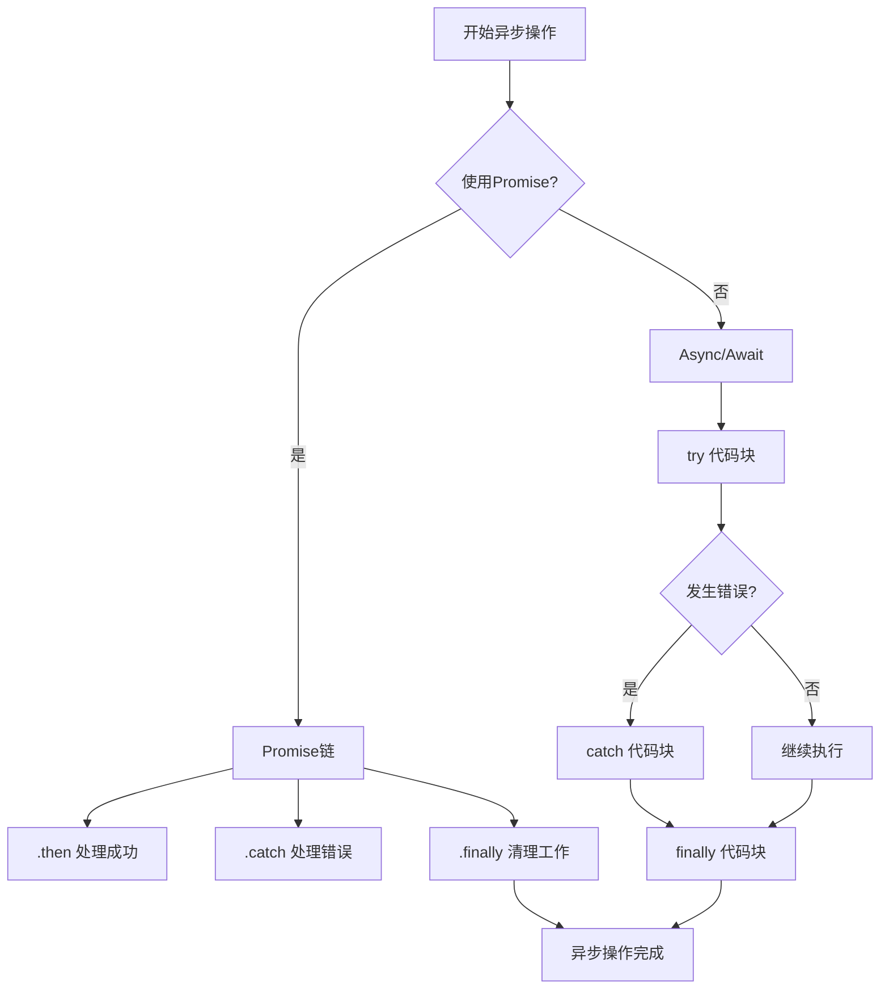

# JavaScript 异步错误处理

## 什么是异步错误处理？

在JavaScript中，异步操作是我们日常编程中无法避免的一部分。无论是网络请求、文件操作还是定时器，这些操作都是异步执行的。与同步代码不同，异步代码的错误处理需要特殊的技巧和方法，因为常规的`try/catch`块在异步操作中并不总是有效。

:::note
**异步操作**是指那些不会立即完成，而是在未来某个时间点完成的操作，如API调用、定时器或事件监听器。
:::

## 异步编程的错误处理挑战

让我们先看一个简单的例子，理解为什么传统的错误处理方式在异步代码中不起作用：

```javascript
try {
  setTimeout(() => {
    throw new Error('异步错误！');
  }, 1000);
} catch (error) {
  console.log('捕获到错误:', error.message);
}

console.log('继续执行...');
```

输出结果：
```
继续执行...
Uncaught Error: 异步错误！
```

在上面的代码中，我们试图用`try/catch`捕获定时器回调中的错误，但是错误并没有被捕获。这是因为当回调函数执行并抛出错误时，`try/catch`块已经执行完毕了。

## Promise中的错误处理

Promise提供了一种更优雅的方式来处理异步操作中的错误。

### 使用.catch()方法

```javascript
function fetchData() {
  return new Promise((resolve, reject) => {
    // 模拟API请求
    setTimeout(() => {
      const random = Math.random();
      if (random > 0.5) {
        resolve('成功获取数据');
      } else {
        reject(new Error('网络请求失败'));
      }
    }, 1000);
  });
}

// 使用.catch处理错误
fetchData()
  .then(data => {
    console.log('数据:', data);
  })
  .catch(error => {
    console.error('错误处理:', error.message);
  })
  .finally(() => {
    console.log('无论成功还是失败都会执行');
  });
```

输出结果（取决于随机值）：
```
数据: 成功获取数据
无论成功还是失败都会执行
```
或
```
错误处理: 网络请求失败
无论成功还是失败都会执行
```

### Promise链中的错误冒泡

Promise的一个强大特性是错误会沿着链条向下传递，直到被捕获：

```javascript
fetchData()
  .then(data => {
    console.log('第一步:', data);
    throw new Error('第一步中出错');
    return '第一步处理后的数据';
  })
  .then(data => {
    // 这一步不会执行，因为前一步出错了
    console.log('第二步:', data);
    return '第二步处理后的数据';
  })
  .catch(error => {
    console.error('捕获到错误:', error.message);
    return '恢复后的数据';
  })
  .then(data => {
    console.log('继续处理:', data);
  });
```

输出结果（假设fetchData成功）：
```
第一步: 成功获取数据
捕获到错误: 第一步中出错
继续处理: 恢复后的数据
```

## Async/Await中的错误处理

Async/Await是构建在Promise之上的语法糖，它使异步代码看起来更像同步代码。在使用`async/await`时，我们可以使用传统的`try/catch`来处理错误。

```javascript
async function processData() {
  try {
    const data = await fetchData();
    console.log('获取的数据:', data);
    
    // 模拟数据处理中的错误
    const processedData = await processDataFunction(data);
    return processedData;
  } catch (error) {
    console.error('处理数据时出错:', error.message);
    // 可以返回默认值或重新抛出错误
    return '默认数据';
  } finally {
    console.log('数据处理完成');
  }
}

// 模拟数据处理函数
function processDataFunction(data) {
  return new Promise((resolve, reject) => {
    setTimeout(() => {
      if (data.includes('成功')) {
        resolve('处理后的' + data);
      } else {
        reject(new Error('数据格式错误'));
      }
    }, 500);
  });
}

// 调用异步函数
processData()
  .then(result => console.log('最终结果:', result))
  .catch(error => console.error('未捕获的错误:', error.message));
```

输出结果（假设fetchData成功）：
```
获取的数据: 成功获取数据
数据处理完成
最终结果: 处理后的成功获取数据
```

## 多个异步操作的错误处理

### Promise.all的错误处理

`Promise.all`允许我们并行执行多个Promise，但如果任何一个Promise失败，整个操作都会失败：

```javascript
function fetchUserData(userId) {
  return new Promise((resolve, reject) => {
    setTimeout(() => {
      if (userId === 3) {
        reject(new Error(`用户ID ${userId} 不存在`));
      } else {
        resolve(`用户 ${userId} 的数据`);
      }
    }, 1000);
  });
}

const userIds = [1, 2, 3, 4, 5];
const fetchPromises = userIds.map(id => fetchUserData(id));

Promise.all(fetchPromises)
  .then(results => {
    console.log('所有用户数据:', results);
  })
  .catch(error => {
    console.error('获取用户数据失败:', error.message);
  });
```

输出结果：
```
获取用户数据失败: 用户ID 3 不存在
```

### Promise.allSettled的错误处理

与`Promise.all`不同，`Promise.allSettled`会等待所有Promise完成（无论成功或失败）：

```javascript
Promise.allSettled(fetchPromises)
  .then(results => {
    const successful = results
      .filter(result => result.status === 'fulfilled')
      .map(result => result.value);
      
    const failed = results
      .filter(result => result.status === 'rejected')
      .map(result => result.reason);
      
    console.log('成功获取的用户数据:', successful);
    console.log('失败的请求:', failed.map(err => err.message));
  });
```

输出结果：
```
成功获取的用户数据: ["用户 1 的数据", "用户 2 的数据", "用户 4 的数据", "用户 5 的数据"]
失败的请求: ["用户ID 3 不存在"]
```

## 实际应用案例

### 案例1：带重试机制的API请求

在实际开发中，网络请求可能由于各种原因失败。我们可以实现一个带重试机制的函数：

```javascript
async function fetchWithRetry(url, options = {}, retries = 3, delay = 1000) {
  try {
    const response = await fetch(url, options);
    
    if (!response.ok) {
      throw new Error(`HTTP error! Status: ${response.status}`);
    }
    
    return await response.json();
  } catch (error) {
    if (retries <= 0) {
      throw new Error(`最终请求失败: ${error.message}`);
    }
    
    console.warn(`请求失败，${retries}次重试后重新尝试...`);
    
    // 等待一段时间后重试
    await new Promise(resolve => setTimeout(resolve, delay));
    
    // 递归调用，减少重试次数
    return fetchWithRetry(url, options, retries - 1, delay * 1.5);
  }
}

// 使用示例
async function loadUserData(userId) {
  try {
    const userData = await fetchWithRetry(`https://api.example.com/users/${userId}`);
    console.log('用户数据加载成功:', userData);
    return userData;
  } catch (error) {
    console.error('无法加载用户数据:', error.message);
    // 显示用户友好的错误信息
    showErrorToUser('很抱歉，无法加载用户数据，请稍后再试。');
    // 记录详细错误信息
    logErrorToServer(error);
    return null;
  }
}

// 模拟UI错误展示
function showErrorToUser(message) {
  console.log(`[UI错误提示]: ${message}`);
}

// 模拟错误日志记录
function logErrorToServer(error) {
  console.log(`[错误日志]: ${error.message}`, error.stack);
}
```

### 案例2：异步操作的超时处理

在某些场景下，我们需要为异步操作设置超时：

```javascript
function timeoutPromise(promise, timeout) {
  return Promise.race([
    promise,
    new Promise((_, reject) => 
      setTimeout(() => reject(new Error('操作超时')), timeout)
    )
  ]);
}

// 使用示例
async function fetchDataWithTimeout() {
  try {
    // 设置5秒超时
    const result = await timeoutPromise(fetchData(), 5000);
    console.log('成功获取数据:', result);
  } catch (error) {
    if (error.message === '操作超时') {
      console.error('请求超时，服务器可能响应慢或不可用');
    } else {
      console.error('发生错误:', error.message);
    }
  }
}
```

## 最佳实践

1. **永远不要忽略Promise的错误**
   ```javascript
   // 不好的做法 - 忽略错误
   fetchData().then(data => {
     // 处理数据
   }); // 没有.catch()!

   // 好的做法
   fetchData()
     .then(data => {
       // 处理数据
     })
     .catch(error => {
       // 处理错误
       console.error('Error:', error.message);
     });
   ```

2. **使用更精确的错误类型**
   ```javascript
   class NetworkError extends Error {
     constructor(message, statusCode) {
       super(message);
       this.name = 'NetworkError';
       this.statusCode = statusCode;
     }
   }

   class ValidationError extends Error {
     constructor(message, field) {
       super(message);
       this.name = 'ValidationError';
       this.field = field;
     }
   }

   async function fetchUser(id) {
     try {
       const response = await fetch(`/api/users/${id}`);
       
       if (!response.ok) {
         throw new NetworkError('Failed to fetch user', response.status);
       }
       
       const data = await response.json();
       
       if (!data.name) {
         throw new ValidationError('User name is required', 'name');
       }
       
       return data;
     } catch (error) {
       if (error instanceof NetworkError) {
         console.error(`网络错误 (${error.statusCode}): ${error.message}`);
       } else if (error instanceof ValidationError) {
         console.error(`验证错误 (字段: ${error.field}): ${error.message}`);
       } else {
         console.error('未知错误:', error);
       }
       throw error; // 重新抛出以便上层处理
     }
   }
   ```

3. **处理Unhandled Rejection**
   ```javascript
   // 在Node.js环境中
   process.on('unhandledRejection', (reason, promise) => {
     console.error('未处理的Promise拒绝:', reason);
     // 应用特定的处理逻辑
   });

   // 在浏览器环境中
   window.addEventListener('unhandledrejection', event => {
     console.error('未处理的Promise拒绝:', event.reason);
     event.preventDefault(); // 阻止默认处理
   });
   ```

## 异步错误处理的流程图

让我们用图表来理解异步错误处理的流程：



## 总结

正确处理JavaScript中的异步错误是构建健壮应用程序的关键。通过本文，我们学习了：

1. 传统的`try/catch`在异步代码中的局限性
2. 如何使用Promise的`.then()/.catch()`链进行错误处理
3. 如何在`async/await`中使用`try/catch`处理错误
4. 处理多个异步操作中的错误（`Promise.all`和`Promise.allSettled`）
5. 实际应用中的错误处理策略，如重试机制和超时控制
6. 异步错误处理的最佳实践

记住，良好的错误处理不仅仅是捕获错误，还包括如何恢复、记录和通知用户。在设计异步操作时，始终考虑可能出现的错误情况，并相应地处理它们。

## 练习

1. 创建一个函数，模拟API请求，有30%的概率失败。使用Promise实现，并正确处理错误。
2. 使用`async/await`改写上面的函数，并添加重试功能。
3. 实现一个函数，同时从多个API获取数据，如果其中一个失败，仍然返回其他成功的结果。
4. 创建一个自定义的Error类，专门用于处理API错误，并在示例中使用它。

## 附加资源

- [JavaScript Promises: An Introduction](https://developers.google.com/web/fundamentals/primers/promises)
- [MDN Web文档: 使用Promises](https://developer.mozilla.org/zh-CN/docs/Web/JavaScript/Guide/Using_promises)
- [异步JavaScript: 从回调到Promise再到Async/Await](https://developer.mozilla.org/zh-CN/docs/Learn/JavaScript/Asynchronous)
- [JavaScript错误处理的完整指南](https://www.valentinog.com/blog/error)

:::tip
记住，好的错误处理会使你的代码更加健壮，并提升用户体验。即使是最小的项目也应该有适当的错误处理机制！
:::