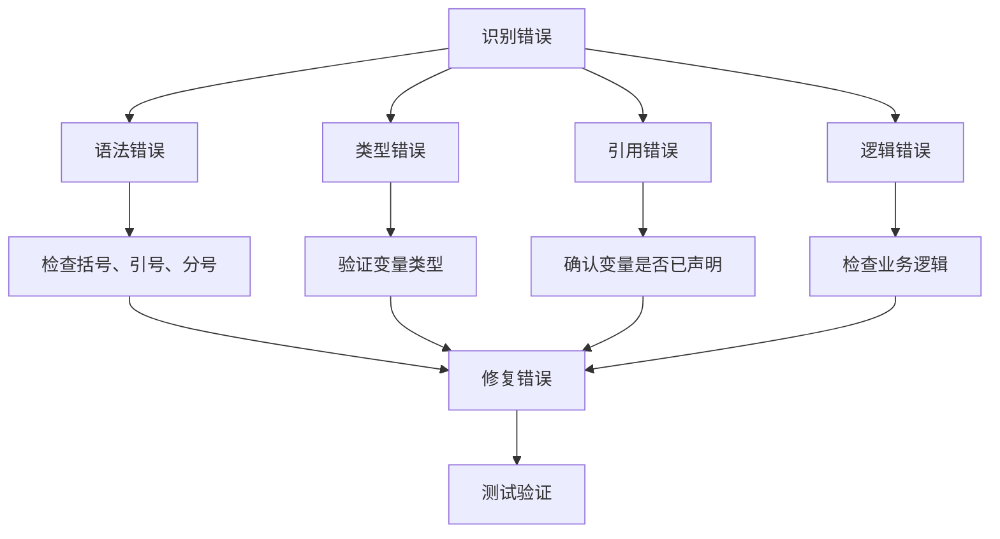

# JavaScript 错误调试

## 引言

在编写JavaScript代码时，错误是不可避免的。不管是初学者还是有经验的开发者，都会遇到各种各样的bug和错误。有效的错误调试不仅能帮助你快速解决问题，还能提高代码质量和开发效率。本文将介绍JavaScript错误调试的基本概念、常用工具和实用技术，帮助你成为更高效的JavaScript开发者。

## 什么是JavaScript错误调试？

错误调试是指识别、定位和修复代码中错误的过程。在JavaScript中，错误可能导致程序执行中断或产生意外结果。调试的目的是找出这些错误并修复它们，使程序能够按照预期运行。

## 常见的JavaScript错误类型

在开始学习调试技术之前，我们先了解一些常见的JavaScript错误类型：

1. **语法错误(SyntaxError)**: 代码不符合JavaScript语法规则
2. **类型错误(TypeError)**: 操作的数据类型与预期不符
3. **引用错误(ReferenceError)**: 引用了不存在的变量
4. **范围错误(RangeError)**: 数值超出有效范围
5. **逻辑错误**: 代码语法正确但不能达到预期结果

## 基本的调试工具和技术

### 1. console对象

`console`对象是JavaScript中最简单也是最常用的调试工具，它提供了多种方法来输出信息：

```javascript
// 基本输出
console.log('这是一条普通消息');
console.info('这是一条信息');
console.warn('这是一条警告');
console.error('这是一条错误');

// 输出变量
let user = { name: "张三", age: 25 };
console.log('用户信息:', user);

// 使用占位符
console.log('用户名: %s, 年龄: %d', user.name, user.age);

// 计时功能
console.time('循环计时');
for(let i = 0; i < 1000000; i++) {
  // 一些操作
}
console.timeEnd('循环计时'); // 输出: 循环计时: xxms
```

### 2. 使用 debugger 语句

在代码中插入`debugger`语句可以在执行到该位置时自动暂停执行，让你检查变量值和程序状态：

```javascript
function calculateTotal(items) {
  let total = 0;
  debugger; // 代码会在这里暂停执行
  for(let i = 0; i < items.length; i++) {
    total += items[i].price;
  }
  return total;
}
```

### 3. 浏览器开发者工具

现代浏览器提供了强大的开发者工具，可以帮助你调试JavaScript：

1. **开发者工具的访问方式**:
   - Chrome/Edge: F12 或 右键 -> 检查
   - Firefox: F12 或 右键 -> 检查元素
   - Safari: 开发菜单 -> 显示Web检查器

2. **Console面板**: 显示`console`方法输出的信息和JavaScript错误

3. **Sources/Debugger面板**: 用于设置断点和查看代码执行

:::tip
要在Chrome中打开开发者工具，你可以按F12键或右键网页并选择"检查"。
:::

## 高级调试技术

### 1. 设置断点

断点允许你暂停代码执行并检查程序状态：

1. **在浏览器中设置断点**:
   - 打开开发者工具
   - 导航到Sources/Debugger面板
   - 点击代码行号设置断点

2. **条件断点**:
   - 右键点击行号
   - 选择"Add conditional breakpoint"
   - 输入条件表达式，仅当条件为true时才会暂停

```javascript
// 当循环到第5次迭代时才会暂停
for(let i = 0; i < 10; i++) {
  // 可以设置条件断点：i === 5
  console.log(i);
}
```

### 2. 监视表达式

在调试模式下，你可以添加监视表达式来跟踪特定变量或表达式的值：

1. 在开发者工具的断点调试状态下
2. 找到"Watch"或"监视"部分
3. 添加你想监视的变量或表达式

### 3. 调用栈分析

调用栈显示了代码执行的路径，帮助你理解函数调用的顺序：

```javascript
function first() {
  console.log('Inside first function');
  second();
}

function second() {
  console.log('Inside second function');
  third();
}

function third() {
  console.log('Inside third function');
  console.trace(); // 输出当前的调用栈
}

first(); // 开始调用链
```

## 实际案例分析

让我们通过一个实际案例来应用调试技术：

### 案例：购物车总价计算错误

假设我们有一个简单的购物车功能，但总价计算结果不正确：

```javascript
function calculateCartTotal(cart) {
  let total = 0;
  
  for(let i = 0; i < cart.length; i++) {
    total += cart[i].price * cart[i].quantity;
  }
  
  // 应用折扣
  if(total > 100) {
    total = total * 0.9; // 超过100元打9折
  }
  
  return total;
}

// 测试数据
const cart = [
  { name: "T恤", price: 25, quantity: 2 },
  { name: "牛仔裤", price: 50, quantity: 1 },
  { name: "袜子", price: 10, quantity: 3 }
];

const total = calculateCartTotal(cart);
console.log("购物车总价:", total); // 不符合预期的输出
```

### 调试步骤：

1. **使用console.log检查中间值**:

```javascript
function calculateCartTotal(cart) {
  let total = 0;
  
  for(let i = 0; i < cart.length; i++) {
    const itemTotal = cart[i].price * cart[i].quantity;
    console.log(`${cart[i].name}: ${cart[i].price} × ${cart[i].quantity} = ${itemTotal}`);
    total += itemTotal;
  }
  
  console.log("折扣前总价:", total);
  
  // 应用折扣
  if(total > 100) {
    const discount = total * 0.1;
    total = total * 0.9; // 超过100元打9折
    console.log(`应用折扣: -${discount.toFixed(2)}`);
  }
  
  return total;
}
```

2. **设置断点分析问题**:
   - 在开发者工具中设置断点
   - 检查变量值
   - 一步步执行代码

3. **使用调试器验证修复**:
   - 在确认问题后修改代码
   - 使用调试器验证是否已修复

### 常见错误和解决方案



## 调试最佳实践

1. **分而治之**: 将复杂问题分解成小部分逐个调试
2. **隔离问题**: 创建最小复现示例，隔离出问题代码
3. **系统调试**: 使用日志和断点系统地排查问题
4. **检查假设**: 不要假设代码的某部分工作正常，验证每个部分
5. **保持冷静**: 调试可能会很沮丧，保持耐心和系统性思考

:::caution
永远不要在生产环境中留下调试代码如`console.log`或`debugger`语句！
:::

## 提前预防错误的方法

1. **使用严格模式**:
```javascript
"use strict";
// 你的代码
```

2. **代码静态分析工具**: 使用ESLint等工具检查潜在问题

3. **编写单元测试**: 自动测试可以提前发现问题

4. **代码审查**: 让其他开发者审查你的代码

## 总结

JavaScript错误调试是每个开发者必须掌握的技能。通过使用`console`方法、断点调试、浏览器开发者工具等技术，你可以有效地识别和修复JavaScript代码中的错误。记住，调试是一个系统性的过程，需要耐心和逻辑思考。随着你经验的增长，调试技能也会不断提高。

## 练习任务

1. 尝试在自己的项目中使用不同的`console`方法
2. 练习使用浏览器开发者工具设置断点和条件断点
3. 找出下面代码中的错误并修复（提示：使用调试技术）:

```javascript
function findMax(numbers) {
  let max = numbers[0];
  for(let i = 0; i <= numbers.length; i++) {
    if(numbers[i] > max) {
      max = number[i];
    }
  }
  return max;
}

const result = findMax([5, 12, 8, 130, 44]);
console.log("最大值:", result);
```

## 延伸阅读

- MDN上的[JavaScript调试指南](https://developer.mozilla.org/zh-CN/docs/Web/JavaScript/Reference/Errors)
- Chrome开发者工具[官方文档](https://developers.google.com/web/tools/chrome-devtools/)
- 《JavaScript高级程序设计》中的错误处理与调试章节