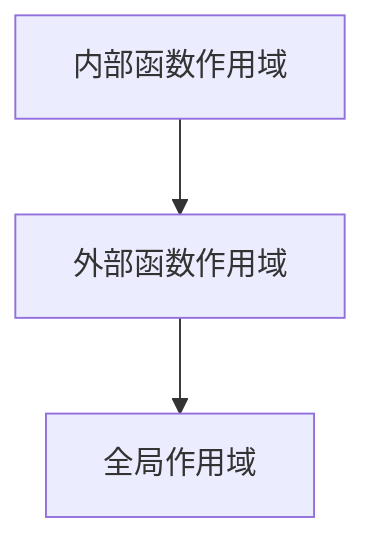

# JavaScript 作用域概念

---
title: JavaScript 作用域概念
description: 深入理解JavaScript中的作用域概念，包括全局作用域、局部作用域、块级作用域以及作用域链等核心内容
---

## 什么是作用域？

作用域是JavaScript中最基本也是最重要的概念之一，它决定了变量和函数的可访问性（可见性）。简单来说，作用域定义了代码中变量和其他资源的可见范围。

想象一下，作用域就像是变量和函数的"活动范围"，在这个范围内它们可以被访问和使用，而在这个范围外则无法被识别。

在JavaScript中，我们主要有以下几种作用域：

1. 全局作用域
2. 函数（局部）作用域
3. 块级作用域（ES6引入）

## 全局作用域

全局作用域是最外层的作用域，在浏览器环境中，`window`对象就代表着全局作用域。在全局作用域中声明的变量或函数可以被程序中的任何部分访问。

```javascript
// 全局作用域中的变量
var globalVar = "我是全局变量";
let globalLet = "我也是全局变量";
const globalConst = "我是全局常量";

function globalFunction() {
  console.log("我是全局函数");
}

// 在任何地方都可以访问全局变量和函数
console.log(globalVar); // 输出: "我是全局变量"
globalFunction(); // 输出: "我是全局函数"
```

:::caution 注意
过多的全局变量和函数容易导致命名冲突和意外覆盖，这是不好的编程习惯。应尽量减少全局变量的使用。
:::

## 函数作用域（局部作用域）

函数作用域是指在函数内部声明的变量只能在该函数内部访问，外部无法直接访问这些变量。

```javascript
function showLocalScope() {
  var localVar = "我是局部变量";
  let localLet = "我也是局部变量";
  const localConst = "我是局部常量";
  
  console.log(localVar); // 输出: "我是局部变量"
  console.log(globalVar); // 输出: "我是全局变量"（函数内可以访问全局变量）
}

showLocalScope();

// 下面的代码会报错，因为无法访问函数内部的变量
// console.log(localVar); // ReferenceError: localVar is not defined
```

函数作用域具有"单向穿透性"：函数内部可以访问外部变量，但外部无法访问函数内部变量。

## 块级作用域

ES6引入了`let`和`const`关键字，它们支持块级作用域。块级作用域指由一对花括号`{}`界定的区域。

```javascript
{
  // 这是一个块
  let blockLet = "我是块级变量";
  const blockConst = "我是块级常量";
  var blockVar = "我不是块级变量，而是函数级变量";
  
  console.log(blockLet); // 输出: "我是块级变量"
}

// 使用let和const声明的变量无法在块外访问
// console.log(blockLet); // ReferenceError: blockLet is not defined
// console.log(blockConst); // ReferenceError: blockConst is not defined

// 但var声明的变量不受块级作用域限制（除非在函数内）
console.log(blockVar); // 输出: "我不是块级变量，而是函数级变量"
```

块级作用域在条件语句和循环中特别有用：

```javascript
for (let i = 0; i < 3; i++) {
  console.log(i); // 输出: 0, 1, 2
}

// console.log(i); // ReferenceError: i is not defined

// 对比使用var的情况
for (var j = 0; j < 3; j++) {
  console.log(j); // 输出: 0, 1, 2
}

console.log(j); // 输出: 3（注意：循环结束后j仍然可访问）
```

## 词法作用域

JavaScript使用词法作用域（Lexical Scope），也称静态作用域。这意味着函数的作用域在函数定义时就已确定，而非函数调用时。

```javascript
let x = "全局x";

function outer() {
  let y = "outer函数中的y";
  
  function inner() {
    let z = "inner函数中的z";
    console.log(x); // 访问全局变量
    console.log(y); // 访问outer函数中的变量
    console.log(z); // 访问自己的变量
  }
  
  inner();
}

outer();
// 输出:
// 全局x
// outer函数中的y
// inner函数中的z
```

## 作用域链

当访问一个变量时，JavaScript会先在当前作用域内查找该变量。如果没找到，会继续在外层作用域中查找，直到找到该变量或到达全局作用域。这一查找过程形成了作用域链。



看个例子：

```javascript
let global = "我是全局变量";

function outer() {
  let outerVar = "我是outer变量";
  
  function middle() {
    let middleVar = "我是middle变量";
    
    function inner() {
      let innerVar = "我是inner变量";
      
      console.log(innerVar); // 自己作用域内的变量
      console.log(middleVar); // 上一级作用域的变量
      console.log(outerVar);  // 上上级作用域的变量
      console.log(global);    // 全局作用域的变量
    }
    
    inner();
  }
  
  middle();
}

outer();
```

## 变量提升

JavaScript会在执行代码之前，将函数声明和变量声明（仅限var）提升到各自作用域的顶部。这就是变量提升（Hoisting）。

```javascript
console.log(hoistedVar); // 输出: undefined (不是报错！)
var hoistedVar = "我被提升了";

// 等同于:
// var hoistedVar;
// console.log(hoistedVar);
// hoistedVar = "我被提升了";

// 而let和const不会被提升
// console.log(notHoisted); // ReferenceError: notHoisted is not defined
// let notHoisted = "我没有被提升";
```

函数声明会被完全提升：

```javascript
hoistedFunction(); // 输出: "我是被提升的函数"

function hoistedFunction() {
  console.log("我是被提升的函数");
}

// 但函数表达式不会被提升
// notHoistedFunction(); // TypeError: notHoistedFunction is not a function
// var notHoistedFunction = function() {
//   console.log("我是没有被提升的函数");
// };
```

## 实际应用案例

### 案例1：避免全局变量污染

在实际项目中，我们通常使用立即执行函数表达式（IIFE）来避免全局变量污染：

```javascript
// 不好的做法：直接在全局作用域声明变量
var name = "小明";
var age = 18;

// 好的做法：使用IIFE创建私有作用域
(function() {
  var name = "小明"; // 这个name变量不会污染全局作用域
  var age = 18;
  
  // 处理逻辑...
  console.log(name + "今年" + age + "岁");
})();

// console.log(name); // 无法访问IIFE内部的name变量
```

### 案例2：模块化设计

作用域可以帮助我们实现简单的模块化设计：

```javascript
// 计算器模块
const calculator = (function() {
  // 私有变量
  const privateVar = 10;
  
  // 私有函数
  function privateAdd(a, b) {
    return a + b;
  }
  
  // 返回公共API
  return {
    add: function(a, b) {
      return privateAdd(a, b);
    },
    
    multiply: function(a, b) {
      return a * b;
    },
    
    getPrivateVar: function() {
      return privateVar;
    }
  };
})();

console.log(calculator.add(5, 3)); // 输出: 8
console.log(calculator.multiply(2, 4)); // 输出: 8
console.log(calculator.getPrivateVar()); // 输出: 10

// 无法直接访问私有变量和函数
// console.log(calculator.privateVar); // undefined
// calculator.privateAdd(1, 2); // TypeError: calculator.privateAdd is not a function
```

### 案例3：循环中的闭包问题

这是初学者经常遇到的一个问题：

```javascript
// 问题代码
function createButtons() {
  for (var i = 0; i < 3; i++) {
    var btn = document.createElement('button');
    btn.innerHTML = '按钮 ' + i;
    btn.onclick = function() {
      console.log('这是第 ' + i + ' 个按钮');
    };
    document.body.appendChild(btn);
  }
}
// 创建按钮后，点击任何按钮都会显示"这是第3个按钮"

// 解决方案：使用let创建块级作用域
function createButtonsFixed() {
  for (let i = 0; i < 3; i++) {
    let btn = document.createElement('button');
    btn.innerHTML = '按钮 ' + i;
    btn.onclick = function() {
      console.log('这是第 ' + i + ' 个按钮');
    };
    document.body.appendChild(btn);
  }
}
// 现在点击每个按钮都会显示正确的编号
```

## 总结

作用域是JavaScript中极为重要的基础概念，正确理解和使用作用域可以帮助我们：

1. **避免变量冲突**：通过局部作用域限制变量的可见范围
2. **保护数据**：隐藏内部实现细节，只暴露必要的功能
3. **减少全局污染**：减少全局变量，改善代码质量
4. **实现模块化**：构建结构良好的应用程序

记住这些关键点：
- 全局作用域中的变量可被任何地方访问
- 函数作用域限制变量只能在函数内访问
- ES6中的块级作用域通过`let`和`const`实现
- 作用域链决定了变量查找的顺序
- `var`声明的变量会提升，`let`和`const`不会

:::tip 小贴士
养成使用`let`和`const`的习惯，尽量避免使用`var`，这样可以更好地控制变量的作用域，减少意外错误。
:::

## 练习题

1. 尝试预测以下代码的输出结果：
```javascript
let x = 10;
function foo() {
  let x = 20;
  console.log(x);
  
  if (true) {
    let x = 30;
    console.log(x);
  }
  
  console.log(x);
}
foo();
console.log(x);
```

2. 修改以下代码，使用作用域知识来避免变量泄露和污染：
```javascript
// 修改前
var userId = "user123";
var userName = "张三";

function showUserInfo() {
  var userAge = 25;
  console.log("用户信息：" + userId + ", " + userName + ", " + userAge);
}

// 修改为一个模块化结构，保护用户数据隐私
```

## 延伸阅读

1. 学习闭包概念，它建立在作用域的基础上
2. 研究ES6模块系统与作用域的关系
3. 探索执行上下文与作用域的区别

通过掌握作用域概念，你已经迈出了成为JavaScript高手的重要一步！