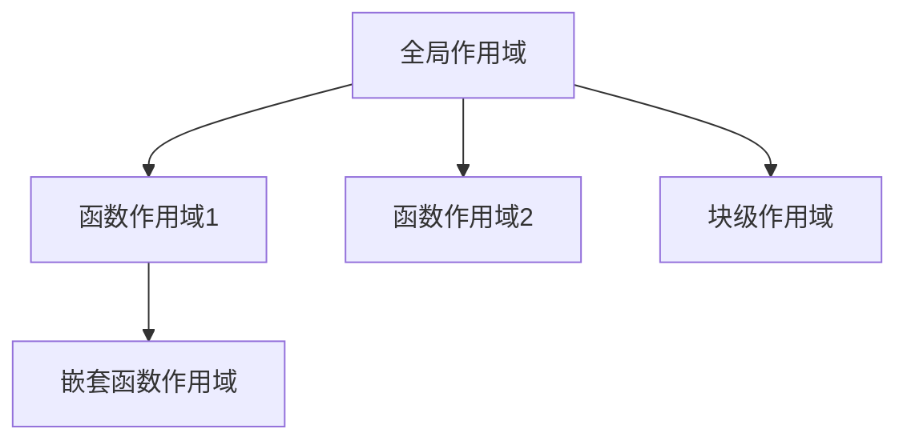

# JavaScript 全局作用域

## 什么是全局作用域？

在JavaScript中，**全局作用域**是指在代码中的任何地方都能访问到的变量、函数或对象所在的范围。它是作用域层级中的最顶层，也是JavaScript代码执行的默认环境。

当我们声明一个变量或函数时，如果不将其放在任何函数或块级作用域内，它就会自动成为全局作用域的一部分。



## 全局作用域的特性

### 1. 全局变量与全局对象

在浏览器环境中，全局作用域与全局对象`window`紧密相关。在全局作用域中声明的变量和函数会自动成为`window`对象的属性和方法。

```javascript
// 全局变量
var globalVar = "我是全局变量";
console.log(window.globalVar); // "我是全局变量"

// 全局函数
function sayHello() {
  console.log("Hello!");
}
window.sayHello(); // "Hello!"
```

:::note
在Node.js环境中，全局对象是`global`而不是`window`。
:::

### 2. 使用var、let和const声明全局变量的区别

在全局作用域中，使用不同的关键字声明变量会有一些细微差别：

```javascript
// 使用var声明
var name = "小明";
console.log(window.name); // "小明" - 成为window对象的属性

// 使用let声明
let age = 25;
console.log(window.age); // undefined - 不会成为window对象的属性

// 使用const声明
const JOB = "程序员";
console.log(window.JOB); // undefined - 不会成为window对象的属性
```

### 3. 不使用声明关键字的变量赋值

在JavaScript中，如果不使用任何声明关键字（`var`、`let`或`const`）而直接给一个变量赋值，这个变量会自动成为全局变量。

```javascript
function createGlobalVar() {
  localVar = "我本应是局部变量，但成了全局变量";
  // 没有使用var、let或const声明
}

createGlobalVar();
console.log(localVar); // "我本应是局部变量，但成了全局变量"
console.log(window.localVar); // "我本应是局部变量，但成了全局变量"
```

:::warning
这是一种不良实践，很容易导致意外的全局变量污染。在严格模式（'use strict'）下，这种行为会抛出错误。
:::

## 全局作用域的生命周期

全局作用域中的变量和函数在页面加载时创建，直到页面关闭或重新加载才会被销毁。这意味着它们会一直占用内存资源。

```javascript
// 全局变量会存在于整个页面生命周期
var globalData = "永久存在直到页面关闭";

function someFunction() {
  var localData = "函数执行完毕后被回收";
  console.log(localData);
  console.log(globalData);
}

someFunction();
// 此时localData已被回收，但globalData仍然存在
```

## 全局作用域的问题与挑战

### 1. 命名冲突

全局作用域中的变量和函数很容易与其他代码（如第三方库）产生命名冲突。

```javascript
// 假设你的代码
var userName = "用户A";

// 第三方库的代码
var userName = "用户B"; // 覆盖了你的变量

console.log(userName); // "用户B"
```

### 2. 代码组织和维护问题

过多使用全局变量会导致代码难以维护，因为全局作用域中的数据可以被任何代码修改。

### 3. 内存消耗

全局变量会在整个程序生命周期内占用内存，不会被垃圾回收器回收。

## 避免全局作用域污染的方法

### 1. 使用立即执行函数表达式(IIFE)

IIFE创建了一个独立的作用域，可以有效避免变量泄露到全局作用域。

```javascript
(function() {
  // 这里的变量都是局部的
  var privateVar = "我不会污染全局作用域";
  
  function privateFunction() {
    console.log("我也是局部的");
  }
})();

// 外部无法访问
console.log(typeof privateVar); // "undefined"
```

### 2. 使用模块模式

模块模式结合了IIFE和闭包，提供了更好的代码组织方式。

```javascript
var myModule = (function() {
  // 私有变量和函数
  var privateData = "私有数据";
  
  function privateMethod() {
    console.log(privateData);
  }
  
  // 返回公共API
  return {
    publicMethod: function() {
      privateMethod();
      console.log("这是公共方法");
    },
    publicData: "公共数据"
  };
})();

myModule.publicMethod(); // 输出: "私有数据" 然后 "这是公共方法"
console.log(myModule.publicData); // "公共数据"
console.log(myModule.privateData); // undefined
```

### 3. 使用ES6模块

ES6引入了原生模块系统，文件内的变量默认不会进入全局作用域。

```javascript
// 文件: module.js
const privateVar = "私有变量";
export const publicVar = "公共变量";
export function publicFunc() {
  console.log(privateVar);
}

// 在另一个文件中使用
import { publicVar, publicFunc } from './module.js';
// privateVar在这里不可访问
```

### 4. 使用命名空间

通过创建一个对象作为命名空间，将相关功能组织在一起。

```javascript
// 创建一个命名空间
var MyApp = MyApp || {};

// 在命名空间中添加功能
MyApp.utils = {
  add: function(a, b) {
    return a + b;
  },
  subtract: function(a, b) {
    return a - b;
  }
};

// 使用
console.log(MyApp.utils.add(5, 3)); // 8
```

## 实际应用场景

### 1. 配置信息

全局作用域适合存储应用程序的配置信息，这些信息需要在多个组件或模块间共享。

```javascript
// 应用程序配置
const APP_CONFIG = {
  apiUrl: 'https://api.example.com',
  timeout: 30000,
  maxRetries: 3
};

// 在不同的模块中使用
function fetchData(endpoint) {
  return fetch(`${APP_CONFIG.apiUrl}/${endpoint}`, {
    timeout: APP_CONFIG.timeout
  });
}
```

### 2. 全局状态管理

在简单应用中，可以使用全局对象管理应用状态。

```javascript
// 简单的全局状态管理
const AppState = {
  user: null,
  isAuthenticated: false,
  theme: 'light',
  
  login(userData) {
    this.user = userData;
    this.isAuthenticated = true;
    this.onUserChange();
  },
  
  logout() {
    this.user = null;
    this.isAuthenticated = false;
    this.onUserChange();
  },
  
  onUserChange() {
    // 通知应用程序用户状态变化
    console.log('User state changed:', this.isAuthenticated);
  }
};

// 在登录组件中
function handleLoginSuccess(userData) {
  AppState.login(userData);
}

// 在导航栏组件中
function renderNavbar() {
  if (AppState.isAuthenticated) {
    console.log(`欢迎, ${AppState.user.name}`);
  } else {
    console.log('请登录');
  }
}
```

:::caution
在复杂应用中，推荐使用专门的状态管理库（如Redux、Vuex等）而不是直接使用全局变量。
:::

### 3. 工具函数库

某些通用工具函数适合放在全局作用域，方便在任何地方调用。

```javascript
// 全局工具函数
const Utils = {
  formatDate(date) {
    return new Date(date).toLocaleDateString();
  },
  
  generateId() {
    return Math.random().toString(36).substr(2, 9);
  },
  
  debounce(func, delay) {
    let timeout;
    return function() {
      const context = this;
      const args = arguments;
      clearTimeout(timeout);
      timeout = setTimeout(() => func.apply(context, args), delay);
    };
  }
};

// 在任何地方使用
const formattedDate = Utils.formatDate('2023-11-15');
const uniqueId = Utils.generateId();
```

## 总结

全局作用域是JavaScript中最基础的作用域概念，理解它对于编写高质量的JavaScript代码至关重要：

1. **全局变量和函数**可以在代码的任何位置访问，与全局对象（浏览器中为`window`）关联
2. **不同声明方式**（`var`、`let`、`const`或不使用关键字）对全局变量有不同影响
3. **全局作用域的问题**包括命名冲突、代码难以维护和内存消耗
4. **避免全局污染的方法**包括使用IIFE、模块模式、ES6模块和命名空间
5. **适当的应用场景**包括配置信息、简单的状态管理和工具函数库

在现代JavaScript开发中，我们通常会尽量减少对全局作用域的直接使用，而是采用模块化的方式组织代码，只在确实需要全局访问的情况下谨慎使用全局变量。

## 练习题

1. 分析下面代码，解释变量`x`和`y`的区别以及为什么会有这种差异：
   ```javascript
   var x = 10;
   let y = 20;
   
   console.log(window.x);
   console.log(window.y);
   ```

2. 修改以下代码，使用IIFE避免全局作用域污染：
   ```javascript
   var counter = 0;
   
   function incrementCounter() {
     counter++;
     return counter;
   }
   ```

3. 创建一个命名空间`MathUtils`，包含计算圆面积和矩形面积的方法。

## 进一步学习资源

- [MDN Web Docs: JavaScript作用域](https://developer.mozilla.org/zh-CN/docs/Web/JavaScript/Guide/Grammar_and_types#变量的作用域)
- [JavaScript模块化编程](https://www.ruanyifeng.com/blog/2012/10/javascript_module.html)
- [ES6模块系统](https://es6.ruanyifeng.com/#docs/module)

要深入理解作用域概念，建议后续学习局部作用域、闭包、词法作用域和变量提升等相关主题。