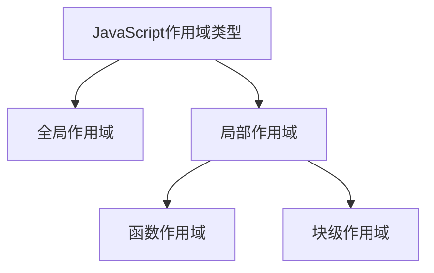

# JavaScript 作用域最佳实践

作用域是JavaScript中最基本也最重要的概念之一，它决定了变量的可访问性和生命周期。掌握作用域的最佳实践不仅能帮助你写出更清晰、更高效的代码，还能避免许多常见的JavaScript错误。

## 什么是作用域？

作用域（Scope）是指变量、函数和对象的可访问范围，它决定了在代码的哪些部分可以使用这些资源。



## 作用域最佳实践

### 1. 使用 let 和 const 代替 var

在现代JavaScript开发中，应优先使用`let`和`const`而非`var`来声明变量。

```javascript
// 不推荐
var name = 'John';

// 推荐
const name = 'John'; // 对于不需要重新赋值的变量
let age = 30;        // 对于需要重新赋值的变量
```

**原因**：
- `var`声明的变量会被提升(hoisting)
- `var`没有块级作用域
- `let`和`const`提供了块级作用域
- `const`防止变量被意外重新赋值

:::caution 注意
`const`只能防止变量被重新赋值，但如果值是对象，对象的属性仍可以被修改。
:::

### 2. 最小化全局变量的使用

全局变量会导致命名冲突、代码难以维护和测试。

```javascript
// 不推荐
userName = 'Alice'; // 隐式全局变量，不使用声明关键字

// 推荐
// 将变量限制在需要的作用域内
function userProfile() {
  const userName = 'Alice';
  // 使用userName
}
```

### 3. 立即执行函数表达式（IIFE）创建私有作用域

IIFE可以创建一个独立的函数作用域，防止变量污染全局环境。

```javascript
// 创建私有作用域
(function() {
  const privateVar = 'I am private';
  console.log(privateVar); // 'I am private'
})();

// 外部无法访问privateVar
console.log(typeof privateVar); // 'undefined'
```

### 4. 使用块级作用域控制变量生命周期

```javascript
// 推荐
{
  const temporary = '仅在此块中可用';
  console.log(temporary); // '仅在此块中可用'
}
// console.log(temporary); // 错误：temporary未定义
```

### 5. 闭包的合理使用

闭包是函数和声明该函数的词法环境的组合，它允许函数访问其外部函数作用域中的变量。

```javascript
function createCounter() {
  let count = 0;
  
  return function() {
    return ++count;
  };
}

const counter = createCounter();
console.log(counter()); // 1
console.log(counter()); // 2
console.log(counter()); // 3
```

**优点**：
- 数据封装和私有变量
- 维护状态
- 创建工厂函数

**缺点**：
- 可能导致内存泄漏（如果闭包持有大型对象的引用）

### 6. 避免变量提升带来的困惑

虽然`let`和`const`也会被提升，但它们有"暂时性死区"，这意味着在声明之前尝试访问它们会抛出错误。

```javascript
// var的行为
console.log(name); // undefined (而非错误)
var name = 'John';

// let的行为
// console.log(age); // ReferenceError: age is not defined
let age = 30;
```

### 7. 合理使用模块作用域

ES6模块为每个模块提供了自己的作用域，使用`import`和`export`可以明确控制哪些内容对外可见。

```javascript
// utils.js
const privateFunction = () => {
  // 内部实现
};

export const publicFunction = () => {
  privateFunction();
  return 'Result';
};

// main.js
import { publicFunction } from './utils.js';
publicFunction(); // 可以使用
// privateFunction(); // 错误，无法访问
```

## 实际案例：数据管理模块

以下是一个使用作用域最佳实践的数据管理模块示例：

```javascript
// 数据管理模块
const DataManager = (function() {
  // 私有变量
  const data = {};
  
  // 私有方法
  function validateKey(key) {
    if (typeof key !== 'string') {
      throw new Error('Key must be a string');
    }
  }
  
  // 公共API
  return {
    set(key, value) {
      validateKey(key);
      data[key] = value;
      return true;
    },
    
    get(key) {
      validateKey(key);
      return data[key];
    },
    
    remove(key) {
      validateKey(key);
      if (key in data) {
        delete data[key];
        return true;
      }
      return false;
    }
  };
})();

// 使用示例
DataManager.set('user', { name: 'John', age: 30 });
console.log(DataManager.get('user')); // { name: 'John', age: 30 }
DataManager.remove('user'); // true
console.log(DataManager.get('user')); // undefined
```

这个示例说明了如何使用IIFE创建一个模块，提供公共API同时保护内部数据和实现细节。

## 常见陷阱与如何避免

### 1. 循环中的闭包问题

```javascript
// 问题代码
function createFunctions() {
  var result = [];
  for (var i = 0; i < 3; i++) {
    result.push(function() { 
      console.log(i); 
    });
  }
  return result;
}

const functions = createFunctions();
functions[0](); // 3 (不是预期的0)
functions[1](); // 3 (不是预期的1)
functions[2](); // 3 (不是预期的2)

// 修复方法1：使用let
function createFunctionsCorrected1() {
  const result = [];
  for (let i = 0; i < 3; i++) {
    result.push(function() { 
      console.log(i); 
    });
  }
  return result;
}

// 修复方法2：使用IIFE
function createFunctionsCorrected2() {
  const result = [];
  for (var i = 0; i < 3; i++) {
    (function(j) {
      result.push(function() { 
        console.log(j); 
      });
    })(i);
  }
  return result;
}
```

### 2. `this`关键字与箭头函数

```javascript
const user = {
  name: 'John',
  // 传统函数: this取决于调用方式
  greet1: function() {
    console.log(`Hello, my name is ${this.name}`);
  },
  // 箭头函数: this继承自词法作用域
  greet2: () => {
    console.log(`Hello, my name is ${this.name}`);
  }
};

user.greet1(); // "Hello, my name is John"
user.greet2(); // "Hello, my name is undefined"
```

:::tip 提示
在对象方法中，使用传统函数可以正确引用对象本身，而箭头函数则不行，因为它会从外部环境继承`this`值。
:::

## 总结

遵循JavaScript作用域的最佳实践可以帮助你编写出更加清晰、可维护、性能更好的代码：

1. 使用`let`和`const`代替`var`
2. 最小化全局变量的使用
3. 使用IIFE创建私有作用域
4. 合理利用块级作用域
5. 谨慎使用闭包，注意潜在的内存问题
6. 了解并避免变量提升带来的困惑
7. 使用ES6模块系统管理代码组织

掌握这些最佳实践不仅能让你的代码更加专业，还能减少潜在的bug和调试时间。

## 练习题

1. 重构一个使用`var`的旧代码，改用`let`和`const`
2. 创建一个计数器函数，每次调用返回递增的数字
3. 编写一个模块，提供一些公共函数，同时保护内部实现细节

## 相关资源

- [MDN Web Docs: Closures](https://developer.mozilla.org/en-US/docs/Web/JavaScript/Closures)
- [MDN Web Docs: let](https://developer.mozilla.org/en-US/docs/Web/JavaScript/Reference/Statements/let)
- [MDN Web Docs: const](https://developer.mozilla.org/en-US/docs/Web/JavaScript/Reference/Statements/const)
- [JavaScript: The Good Parts](http://shop.oreilly.com/product/9780596517748.do) by Douglas Crockford