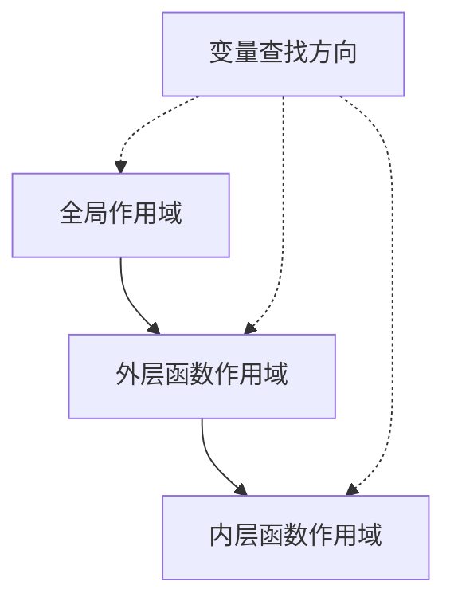

# JavaScript 函数作用域

在 JavaScript 编程中，理解"作用域"是构建高效且无错误代码的基础。函数作用域是 JavaScript 中最重要的作用域类型之一，本文将深入探讨它的概念和应用。

## 什么是函数作用域？

函数作用域是指在函数内部声明的变量只能在该函数内部访问，而在函数外部则不可见。这是 JavaScript 变量可见性规则的重要部分。

:::note 定义
函数作用域（Function Scope）：指在函数内声明的变量，只在函数体内可访问，函数外部无法直接读取这些变量。
:::

## 函数作用域的基本示例

让我们通过一个简单的例子来理解函数作用域：

```javascript
// 全局作用域
const globalVar = "我是全局变量";

function exampleFunction() {
  // 函数作用域
  const localVar = "我是局部变量";
  
  console.log(globalVar); // 可以访问全局变量
  console.log(localVar);  // 可以访问局部变量
}

exampleFunction();

// 输出:
// 我是全局变量
// 我是局部变量

console.log(globalVar); // 可以访问全局变量
console.log(localVar);  // 错误：localVar is not defined
```

在这个例子中：
- `globalVar` 是在全局作用域中声明的，所以在任何地方都可以访问它
- `localVar` 是在 `exampleFunction` 函数内声明的，所以只能在该函数内访问它

## 作用域嵌套

JavaScript 允许作用域嵌套，即函数可以在其他函数内部定义，形成一种层级关系：

```javascript
function outerFunction() {
  const outerVar = "我在外层函数中";
  
  function innerFunction() {
    const innerVar = "我在内层函数中";
    
    console.log(outerVar); // 可以访问外层函数的变量
    console.log(innerVar); // 可以访问自己的变量
  }
  
  innerFunction();
  
  console.log(outerVar); // 可以访问自己的变量
  console.log(innerVar); // 错误：innerVar is not defined
}

outerFunction();
```

输出结果：
```
我在外层函数中
我在内层函数中
我在外层函数中
Uncaught ReferenceError: innerVar is not defined
```

## 作用域链

当 JavaScript 引擎尝试解析一个变量时，它会首先在当前作用域中查找。如果找不到，则会向上层作用域查找，一直到全局作用域。这种查找过程称为"作用域链"。



看一个作用域链的例子：

```javascript
const global = "全局变量";

function outer() {
  const outerVar = "外层变量";
  
  function inner() {
    const innerVar = "内层变量";
    
    // 从内向外查找变量
    console.log(innerVar); // 找到了：内层变量
    console.log(outerVar); // 在外层找到：外层变量
    console.log(global);   // 在全局作用域找到：全局变量
  }
  
  inner();
}

outer();
```

## 变量提升与函数作用域

在 JavaScript 中，使用 `var` 声明的变量和函数声明会被"提升"到它们所在作用域的顶部。

```javascript
function hoistingExample() {
  console.log(hoistedVar); // 输出：undefined（而不是报错）
  var hoistedVar = "我被提升了";
  console.log(hoistedVar); // 输出：我被提升了
}

hoistingExample();
```

这段代码实际上相当于：

```javascript
function hoistingExample() {
  var hoistedVar; // 声明被提升到顶部
  console.log(hoistedVar); // undefined
  hoistedVar = "我被提升了"; // 赋值保留在原位置
  console.log(hoistedVar); // 我被提升了
}
```

:::caution 注意
使用 `let` 和 `const` 声明的变量不会被提升，或者更准确地说，它们存在"暂时性死区"(TDZ)，在声明之前不能访问。
:::

```javascript
function letExample() {
  console.log(letVar); // ReferenceError: Cannot access 'letVar' before initialization
  let letVar = "我不会被提升";
}
```

## 函数作用域与块级作用域的区别

JavaScript 中有两种主要的作用域类型：函数作用域和块级作用域：

```javascript
function scopeComparison() {
  // 函数作用域
  var functionScoped = "我是函数作用域变量";
  
  if (true) {
    // 块级作用域
    let blockScoped = "我是块级作用域变量";
    var anotherFunctionScoped = "我也是函数作用域变量";
    
    console.log(functionScoped); // 可访问
    console.log(blockScoped); // 可访问
    console.log(anotherFunctionScoped); // 可访问
  }
  
  console.log(functionScoped); // 可访问
  console.log(anotherFunctionScoped); // 可访问，因为var不遵守块级作用域
  console.log(blockScoped); // 错误：blockScoped is not defined
}

scopeComparison();
```

## 实际应用场景

### 1. 避免命名冲突

函数作用域可以帮助避免变量命名冲突：

```javascript
function calculator() {
  // 这些变量在其他地方定义不会冲突
  let result = 0;
  
  function add(a, b) {
    result = a + b;
    return result;
  }
  
  function multiply(a, b) {
    result = a * b;
    return result;
  }
  
  return {
    add,
    multiply
  };
}

const calc = calculator();
console.log(calc.add(5, 3)); // 8
console.log(calc.multiply(2, 4)); // 8
```

### 2. 数据封装和私有变量

函数作用域可以创建"私有"变量，限制对数据的访问：

```javascript
function createCounter() {
  // 私有变量，外部无法直接访问
  let count = 0;
  
  return {
    increment() {
      count += 1;
      return count;
    },
    decrement() {
      count -= 1;
      return count;
    },
    getValue() {
      return count;
    }
  };
}

const counter = createCounter();
console.log(counter.increment()); // 1
console.log(counter.increment()); // 2
console.log(counter.decrement()); // 1
console.log(counter.getValue()); // 1
console.log(counter.count); // undefined - 无法直接访问私有变量
```

### 3. 立即执行函数表达式 (IIFE)

IIFE 是一种常见的模式，它创建了一个只执行一次的函数作用域：

```javascript
(function() {
  // 所有变量都被限制在这个函数内
  const secretData = "机密信息";
  console.log("IIFE 内部可以访问：" + secretData);
})();

// console.log(secretData); // 错误：secretData is not defined
```

IIFE 曾经是 JavaScript 模块化的一种重要方式，在 ES6 模块出现之前广泛使用。

## 常见陷阱与注意事项

### 闭包与内存考虑

函数作用域与闭包紧密相关。当一个函数返回另一个函数，而这个返回的函数引用了外部函数的变量，就会形成闭包：

```javascript
function createGreeting(name) {
  // name 变量会被闭包保留
  return function() {
    console.log(`你好，${name}！`);
  };
}

const greetAlice = createGreeting("Alice");
const greetBob = createGreeting("Bob");

greetAlice(); // 你好，Alice！
greetBob(); // 你好，Bob！
```

:::warning
过度使用闭包可能导致内存使用问题，因为被引用的变量会一直保存在内存中，不会被垃圾回收。
:::

### 循环中的作用域问题

在循环中使用函数时可能会遇到作用域问题：

```javascript
// 问题版本
function createButtons() {
  for (var i = 1; i <= 3; i++) {
    const button = document.createElement("button");
    button.textContent = "按钮 " + i;
    button.onclick = function() {
      console.log("按钮 " + i + " 被点击了");
    };
    document.body.appendChild(button);
  }
}

// 执行后，点击任何按钮都会显示："按钮 4 被点击了"
```

解决方案是使用 IIFE 或 `let` 声明创建单独的作用域：

```javascript
// 解决方案 1：使用 IIFE
function createButtonsFixed1() {
  for (var i = 1; i <= 3; i++) {
    const button = document.createElement("button");
    button.textContent = "按钮 " + i;
    
    // 使用 IIFE 创建作用域
    (function(buttonNumber) {
      button.onclick = function() {
        console.log("按钮 " + buttonNumber + " 被点击了");
      };
    })(i);
    
    document.body.appendChild(button);
  }
}

// 解决方案 2：使用 let 声明
function createButtonsFixed2() {
  for (let i = 1; i <= 3; i++) {  // 使用 let 而不是 var
    const button = document.createElement("button");
    button.textContent = "按钮 " + i;
    button.onclick = function() {
      console.log("按钮 " + i + " 被点击了");
    };
    document.body.appendChild(button);
  }
}
```

## 总结与最佳实践

函数作用域是 JavaScript 中变量可见性和访问控制的基础机制。理解它有助于编写更清晰、更安全的代码。以下是一些最佳实践：

1. **使用块级声明**：优先使用 `let` 和 `const` 而不是 `var`，以获得更可预测的作用域行为
2. **遵循最小特权原则**：变量应该在尽可能小的作用域中声明，以减少意外修改的风险
3. **避免全局变量**：减少全局变量的使用，以避免命名冲突和难以跟踪的副作用
4. **合理使用闭包**：闭包是强大的工具，但要注意潜在的内存问题
5. **使用现代模块系统**：对于大型项目，使用 ES6 模块系统比依赖函数作用域创建命名空间更清晰

## 练习

为了强化对函数作用域的理解，尝试完成以下练习：

1. 编写一个计数器函数，使用闭包保持计数状态
2. 创建一个函数，它返回另一个函数，这个返回的函数可以访问但不能修改外部函数中定义的变量
3. 找出并修复以下代码中的作用域问题：
   ```javascript
   function problemCode() {
     for (var i = 0; i < 3; i++) {
       setTimeout(function() {
         console.log(i);
       }, 1000);
     }
   }
   // 执行此函数会打印什么？为什么？如何修复？
   ```

:::tip 扩展学习
如果你想深入了解 JavaScript 作用域，建议学习以下相关主题：
- 词法作用域 vs 动态作用域
- 执行上下文和执行栈
- 闭包的高级应用
- 模块模式和现代模块系统
:::

学习 JavaScript 函数作用域是成为高效 JavaScript 开发者的关键一步。通过深入理解作用域规则，你可以编写更加安全、可维护且高效的代码。