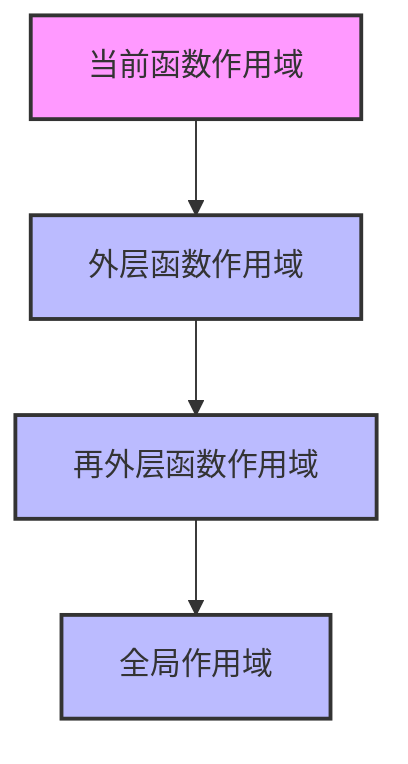

# JavaScript 作用域链

当我们编写JavaScript代码时，变量和函数的访问规则由作用域决定。而作用域链则是JavaScript引擎查找变量的路径，它决定了我们在代码的不同部分可以访问哪些变量。理解作用域链对于掌握JavaScript至关重要，它能帮助你写出更高效、更少bug的代码。

## 什么是作用域链？

作用域链是JavaScript引擎在查找变量时所遵循的路径。当代码试图访问一个变量时，JavaScript引擎首先在当前作用域中查找该变量，如果没有找到，则会向上一级作用域查找，以此类推，直到找到该变量或达到全局作用域为止。



## 作用域链的形成

JavaScript的作用域链是在函数定义时就已经确定的，而不是在函数调用时。这是因为JavaScript使用的是词法作用域（静态作用域），也就是说，函数的作用域是在函数定义的位置决定的，而不是在函数调用的位置。

让我们通过一个简单的例子来理解作用域链的形成：

```javascript
var globalVariable = "我是全局变量";

function outerFunction() {
    var outerVariable = "我是外层函数变量";
    
    function innerFunction() {
        var innerVariable = "我是内层函数变量";
        console.log(innerVariable);     // 可以访问自己作用域的变量
        console.log(outerVariable);     // 可以访问外层函数的变量
        console.log(globalVariable);    // 可以访问全局变量
    }
    
    innerFunction();
}

outerFunction();
```

输出结果：
```
我是内层函数变量
我是外层函数变量
我是全局变量
```

在这个例子中：
- `innerFunction` 的作用域链包含：自身作用域 → `outerFunction`作用域 → 全局作用域
- 当在 `innerFunction` 中访问变量时，JavaScript引擎首先在 `innerFunction` 的作用域中查找，然后是 `outerFunction` 的作用域，最后是全局作用域

## 变量查找机制

当我们在代码中访问一个变量时，JavaScript引擎会按照以下步骤查找：

1. 首先在当前执行上下文的变量对象中查找
2. 如果找不到，则沿着作用域链向上查找
3. 如果到达全局作用域仍然找不到，则会抛出 `ReferenceError` 错误

让我们通过一个例子来理解这个查找过程：

```javascript
var x = "全局x";

function first() {
    var y = "first函数中的y";
    
    function second() {
        var z = "second函数中的z";
        console.log(x);  // 从全局作用域找到
        console.log(y);  // 从first函数作用域找到
        console.log(z);  // 从当前作用域找到
        console.log(w);  // 找不到这个变量
    }
    
    second();
}

first();  // 会抛出ReferenceError: w is not defined
```

:::warning
在上面的例子中，当尝试访问不存在的变量 `w` 时，JavaScript引擎会抛出 `ReferenceError` 错误。这说明变量查找已经到达了作用域链的顶端（全局作用域）但仍然没有找到该变量。
:::

## 变量屏蔽（Shadow）

当不同作用域中存在同名变量时，内层作用域的变量会"屏蔽"外层作用域的同名变量。这种现象称为变量屏蔽（Variable Shadowing）。

```javascript
var x = 10;

function test() {
    var x = 20;  // 这个x会屏蔽全局变量x
    console.log(x);  // 20
}

test();
console.log(x);  // 10
```

输出结果：
```
20
10
```

在函数 `test` 内部，声明了一个局部变量 `x`，它屏蔽了全局变量 `x`。因此，在函数内部访问 `x` 时，实际上访问的是局部变量，而不是全局变量。

## let、const与块级作用域的影响

在ES6引入 `let` 和 `const` 之前，JavaScript只有函数作用域和全局作用域。引入 `let` 和 `const` 后，JavaScript增加了块级作用域的概念，这对作用域链有重要影响。

```javascript
function blocksExample() {
    var a = 1;
    let b = 2;

    if (true) {
        var a = 11;  // 覆盖了外层的a
        let b = 22;  // 创建了块级作用域的新变量b
        console.log(a);  // 11
        console.log(b);  // 22
    }
    
    console.log(a);  // 11，被if块中的a覆盖了
    console.log(b);  // 2，外部的b没有受到影响
}

blocksExample();
```

输出结果：
```
11
22
11
2
```

:::tip
当使用 `let` 或 `const` 声明变量时，这些变量只在声明它们的块级作用域内有效，这极大地减少了变量名冲突的可能性，使代码更加健壮和可预测。
:::

## 作用域链与闭包

作用域链是理解闭包的关键。闭包发生在一个函数能够记住并访问其词法作用域的情况，即使当该函数在其词法作用域之外执行。

```javascript
function createCounter() {
    let count = 0;
    
    return function() {
        count++;
        return count;
    };
}

const counter = createCounter();
console.log(counter());  // 1
console.log(counter());  // 2
console.log(counter());  // 3
```

在这个例子中，返回的匿名函数形成了一个闭包，它可以访问 `createCounter` 函数作用域中的 `count` 变量，即使在 `createCounter` 函数执行完毕后。这是因为返回的函数保留了对其父函数作用域的引用，这个引用就是作用域链的一部分。

## 实际应用案例

### 1. 模块模式

作用域链是实现JavaScript模块模式的基础。通过闭包和作用域链，我们可以创建私有变量和方法。

```javascript
const calculator = (function() {
    // 私有变量
    let result = 0;
    
    // 私有函数
    function validate(n) {
        return typeof n === 'number';
    }
    
    // 公共API
    return {
        add: function(n) {
            if (validate(n)) {
                result += n;
            }
            return this;
        },
        subtract: function(n) {
            if (validate(n)) {
                result -= n;
            }
            return this;
        },
        getResult: function() {
            return result;
        }
    };
})();

calculator.add(5).subtract(2);
console.log(calculator.getResult());  // 3
console.log(calculator.result);  // undefined - 无法直接访问私有变量
```

### 2. 事件处理程序

在Web开发中，作用域链对事件处理程序特别重要，尤其是在处理动态生成的元素时。

```javascript
function setupButtonHandlers() {
    for (let i = 0; i < 3; i++) {
        const button = document.createElement('button');
        button.textContent = '按钮 ' + i;
        
        // 使用let创建块级作用域，每次迭代都有自己的i值
        button.addEventListener('click', function() {
            alert('你点击了按钮 ' + i);
        });
        
        document.body.appendChild(button);
    }
}

// 在实际网页中运行setupButtonHandlers()将创建3个按钮
// 点击每个按钮都会显示其各自的索引
```

:::caution
在ES6之前，上面的例子会有一个常见的问题：所有按钮点击时都会显示同一个值（最终的i值）。这是因为使用`var`声明的变量没有块级作用域，所有事件处理程序共享同一个变量引用。使用`let`或在每次迭代中创建闭包可以解决这个问题。
:::

## 总结

作用域链是JavaScript中变量查找的路径，它从当前作用域开始，向外层作用域查找，直到全局作用域。理解作用域链对于编写高质量的JavaScript代码至关重要，它帮助我们：

1. 理解变量访问的规则
2. 避免变量命名冲突
3. 正确实现闭包
4. 创建私有变量和方法
5. 理解代码的执行上下文

掌握作用域链的工作原理，不仅能让你写出更可靠的代码，还能帮助你解决复杂的JavaScript问题，尤其是在处理闭包、异步编程等高级概念时。

## 练习与延伸学习

为了巩固你对作用域链的理解，试着完成以下练习：

1. 写一个函数，创建多个计数器，每个计数器都有自己独立的计数状态
2. 实现一个简单的模块模式，包含私有变量和方法
3. 分析一段代码中变量查找的过程，并画出其作用域链

### 扩展阅读资源

- 《You Don't Know JS》系列中的"作用域与闭包"部分
- MDN文档中关于[词法作用域](https://developer.mozilla.org/zh-CN/docs/Web/JavaScript/Closures)的解释
- JavaScript高级程序设计（第4版）中的变量、作用域和内存章节

理解作用域链是掌握JavaScript的重要一步，它将帮助你理解更多复杂的JavaScript概念，如闭包、模块化和异步编程。