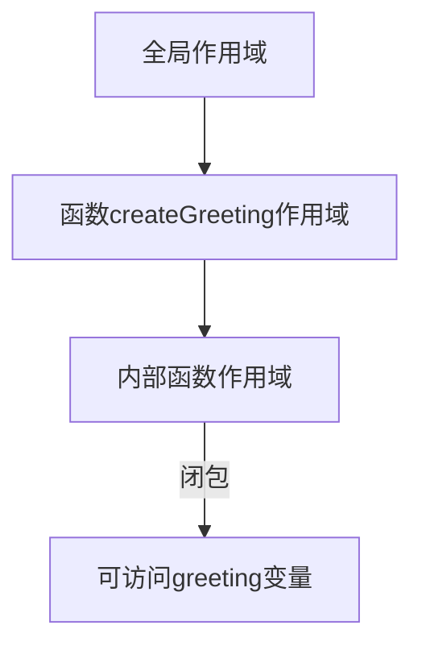

# JavaScript 闭包详解

闭包是JavaScript中一个强大而复杂的概念，对于很多初学者来说可能有些难以理解。但一旦掌握了闭包的基本原理，你会发现它在日常编程中非常实用。本文将从基础概念开始，通过简单易懂的示例，逐步深入讲解JavaScript中的闭包。

## 什么是闭包？

**闭包(Closure)**是指一个函数能够记住并访问其词法作用域，即使该函数在其原始作用域之外执行时也是如此。简单来说，闭包使得函数可以保留对创建它时所在的作用域中变量的引用。

:::note
词法作用域指的是在代码编写阶段就确定的作用域，也就是根据代码的位置来决定变量的访问权限。
:::

## 闭包的基本示例

看一个最简单的闭包示例：

```javascript
function createGreeting(greeting) {
  // 外部函数
  return function(name) {
    // 内部函数，形成闭包
    console.log(`${greeting}, ${name}!`);
  };
}

const sayHello = createGreeting("Hello");
const sayHi = createGreeting("Hi");

sayHello("Alice"); // 输出: Hello, Alice!
sayHi("Bob");      // 输出: Hi, Bob!
```

在这个例子中：
1. `createGreeting`函数接收一个`greeting`参数
2. 它返回一个新函数，这个新函数接收一个`name`参数
3. 返回的函数可以访问`createGreeting`的`greeting`参数
4. 即使`createGreeting`已经执行完毕，返回的函数仍然能访问`greeting`变量

这就是闭包的核心特性：**函数与其词法环境的组合**。

## 闭包的工作原理

要理解闭包的工作原理，需要首先了解JavaScript的作用域和执行上下文。



当JavaScript执行到`createGreeting`函数时：

1. 创建一个新的执行上下文
2. 在这个上下文中定义`greeting`变量
3. 创建并返回内部函数
4. 内部函数保持对`greeting`的引用
5. `createGreeting`执行完毕，但其作用域不会被垃圾回收

这是因为返回的内部函数仍然引用着`createGreeting`的作用域，形成了闭包。

## 闭包的常见用途

### 1. 数据封装和私有变量

闭包可以用来创建私有变量，这是实现模块化和信息隐藏的重要方式。

```javascript
function createCounter() {
  let count = 0; // 私有变量
  
  return {
    increment: function() {
      count++;
      return count;
    },
    decrement: function() {
      count--;
      return count;
    },
    getCount: function() {
      return count;
    }
  };
}

const counter = createCounter();
console.log(counter.getCount()); // 输出: 0
console.log(counter.increment()); // 输出: 1
console.log(counter.increment()); // 输出: 2
console.log(counter.decrement()); // 输出: 1
console.log(counter.count); // 输出: undefined (无法直接访问私有变量)
```

### 2. 函数工厂

闭包可以用来创建特定功能的函数：

```javascript
function multiplyBy(factor) {
  return function(number) {
    return number * factor;
  };
}

const double = multiplyBy(2);
const triple = multiplyBy(3);

console.log(double(5)); // 输出: 10
console.log(triple(5)); // 输出: 15
```

### 3. 回调函数中保存状态

在异步编程中，闭包可以用来保存执行上下文：

```javascript
function fetchData(url) {
  const data = { requestTime: new Date() };
  
  return function(callback) {
    // 在这个闭包中可以访问 data 和 url
    fetch(url)
      .then(response => response.json())
      .then(result => {
        data.response = result;
        data.responseTime = new Date();
        callback(data);
      });
  };
}

const getFacebookData = fetchData('https://api.example.com/facebook');

// 稍后使用
getFacebookData(function(data) {
  console.log('请求时间:', data.requestTime);
  console.log('响应时间:', data.responseTime);
  console.log('响应数据:', data.response);
});
```

## 闭包的实际应用场景

### 事件处理

在DOM事件处理中，闭包可以帮助我们保存和传递额外的数据：

```javascript
function setupButtonListeners() {
  const buttons = document.querySelectorAll('button');
  
  for (let i = 0; i < buttons.length; i++) {
    // 每个事件处理函数形成一个闭包，保存了i的值
    buttons[i].addEventListener('click', function() {
      console.log(`按钮 ${i + 1} 被点击了`);
    });
  }
}
```

:::caution
在ES6之前，如果上面的例子使用`var`而不是`let`，所有按钮点击都会显示相同的值。这是因为`var`没有块级作用域，所有的闭包都引用了同一个`i`变量。
:::

### 实现单例模式

闭包可用于实现单例模式：

```javascript
const Singleton = (function() {
  let instance;
  
  function createInstance() {
    return {
      name: 'Singleton Instance',
      method: function() {
        console.log('Method called');
      }
    };
  }
  
  return {
    getInstance: function() {
      if (!instance) {
        instance = createInstance();
      }
      return instance;
    }
  };
})();

const instance1 = Singleton.getInstance();
const instance2 = Singleton.getInstance();

console.log(instance1 === instance2); // 输出: true (是同一个实例)
```

### 防抖函数实现

闭包在实用工具函数如防抖(debounce)中非常有用：

```javascript
function debounce(func, delay) {
  let timeoutId;
  
  return function(...args) {
    // 这个函数形成闭包，可以访问并修改 timeoutId
    const context = this;
    
    clearTimeout(timeoutId);
    timeoutId = setTimeout(() => {
      func.apply(context, args);
    }, delay);
  };
}

// 使用示例
const handleSearch = debounce(function(query) {
  console.log('搜索:', query);
  // 执行搜索操作
}, 300);

// 在输入框中使用
document.querySelector('input').addEventListener('input', function(e) {
  handleSearch(e.target.value);
});
```

## 闭包的潜在问题和注意事项

### 内存泄漏

闭包会保持对外部变量的引用，如果不小心，可能导致内存泄漏：

```javascript
function createLargeData() {
  const largeData = new Array(1000000).fill('potentially large data');
  
  return function() {
    // 这个函数引用了largeData，即使函数本身不使用它
    console.log('Function called');
  };
}

const fn = createLargeData(); // largeData会一直保留在内存中
```

### 性能考虑

闭包涉及到额外的作用域链查找，过度使用可能影响性能：

```javascript
function createFunctions() {
  const functions = [];
  
  for (let i = 0; i < 10000; i++) {
    functions.push(function() {
      return i; // 每个函数都形成一个闭包
    });
  }
  
  return functions;
}
```

:::tip
在现代JavaScript环境中，闭包的性能影响已经大大减小。除非你创建成千上万的闭包，否则通常不需要过度担心性能问题。
:::

## 实践练习

尝试实现一个缓存函数，利用闭包记住函数调用的结果：

```javascript
function memoize(fn) {
  const cache = {};
  
  return function(...args) {
    const key = JSON.stringify(args);
    
    if (cache[key]) {
      console.log('从缓存中获取结果');
      return cache[key];
    }
    
    console.log('计算新结果');
    const result = fn.apply(this, args);
    cache[key] = result;
    return result;
  };
}

// 测试
const expensiveCalculation = function(n) {
  console.log('执行复杂计算');
  return n * n;
};

const memoizedCalc = memoize(expensiveCalculation);

console.log(memoizedCalc(4)); // 输出: 执行复杂计算, 16
console.log(memoizedCalc(4)); // 输出: 从缓存中获取结果, 16
console.log(memoizedCalc(5)); // 输出: 执行复杂计算, 25
```

## 总结

闭包是JavaScript中一个强大的特性，它允许函数访问和操作在其词法作用域之外的变量。理解和掌握闭包对于编写高效、模块化的JavaScript代码至关重要。

我们学习了：
- 闭包的基本概念和工作原理
- 闭包的常见用途，如数据封装和函数工厂
- 实际应用场景，如事件处理和单例模式
- 使用闭包时需要注意的问题
- 闭包在实际编程中的应用

通过掌握闭包，你可以编写更加灵活、功能强大的JavaScript代码，实现更好的抽象和模块化。

## 延伸阅读

想要进一步提升对闭包的理解，可以参考以下资源：

1. JavaScript高级程序设计（第4版）- 第7章
2. 你不知道的JavaScript（上卷）- 第5章
3. [MDN Web 文档 - 闭包](https://developer.mozilla.org/zh-CN/docs/Web/JavaScript/Closures)

## 练习题

1. 创建一个计数器函数，每次调用时返回递增的数字，但要求可以设置计数的步长。
2. 实现一个函数，可以限制另一个函数在指定时间内最多被调用一次。
3. 使用闭包实现一个简单的事件发布/订阅系统。

掌握闭包需要时间和实践，通过不断地练习和应用，你会越来越熟悉这个概念，也能更好地利用它来解决实际问题。