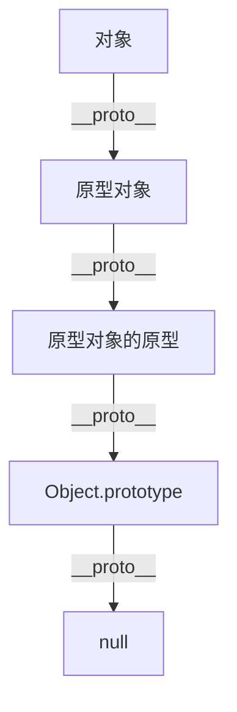

# JavaScript 面向对象基础

JavaScript是一门多范式的编程语言，它支持面向对象编程，尽管其实现方式与传统的基于类的面向对象语言（如Java或C++）有所不同。在JavaScript中，面向对象编程是基于原型的，这为初学者提供了一种灵活但有时令人困惑的编程范式。

## 什么是面向对象编程？

面向对象编程（OOP）是一种编程范式，它使用"对象"来组织代码。对象是数据和操作数据的方法的集合。JavaScript中的对象可以看作是键值对的集合，其中值可以是数据或函数（方法）。

:::note
JavaScript中的面向对象编程是基于原型的，而不是基于类的。虽然ES6引入了`class`关键字，但这只是语法糖，底层仍然是基于原型的。
:::

## JavaScript 中的对象基础

### 创建对象

在JavaScript中，有多种创建对象的方式：

1. **对象字面量**：最简单直接的方式

```javascript
const person = {
  firstName: "张",
  lastName: "三",
  fullName: function() {
    return this.firstName + this.lastName;
  }
};

console.log(person.fullName()); // 输出: 张三
```

2. **使用构造函数**：允许创建多个类似的对象

```javascript
function Person(firstName, lastName) {
  this.firstName = firstName;
  this.lastName = lastName;
  this.fullName = function() {
    return this.firstName + this.lastName;
  };
}

const person1 = new Person("张", "三");
const person2 = new Person("李", "四");

console.log(person1.fullName()); // 输出: 张三
console.log(person2.fullName()); // 输出: 李四
```

3. **ES6 Class语法**：更现代的方式，但底层仍是基于原型的

```javascript
class Person {
  constructor(firstName, lastName) {
    this.firstName = firstName;
    this.lastName = lastName;
  }
  
  fullName() {
    return this.firstName + this.lastName;
  }
}

const person = new Person("张", "三");
console.log(person.fullName()); // 输出: 张三
```

### 访问对象属性和方法

JavaScript提供两种访问对象属性和方法的方式：

```javascript
// 点符号
console.log(person.firstName);

// 方括号符号（对于键名含有空格或特殊字符时特别有用）
console.log(person["firstName"]);

// 调用方法
console.log(person.fullName());
```

## 原型和原型链

JavaScript的面向对象系统是基于原型的，理解原型对于掌握JavaScript至关重要。

### 什么是原型？

每个JavaScript对象都有一个指向另一个对象的链接，这个对象就是原型。当试图访问一个对象的属性时，如果该对象本身没有这个属性，JavaScript会尝试在原型对象上查找这个属性。



### 原型链示例

```javascript
// 使用构造函数和原型
function Student(name, grade) {
  this.name = name;
  this.grade = grade;
}

// 在原型上添加方法
Student.prototype.introduce = function() {
  return `我是${this.name}，我在${this.grade}年级`;
};

const student1 = new Student("小明", "三");
console.log(student1.introduce()); // 输出: 我是小明，我在三年级

// 原型链查找
console.log(student1.toString()); // 从Object.prototype继承的方法
```

当调用`student1.introduce()`时，JavaScript首先在`student1`对象上查找`introduce`方法。如果找不到，则会查找其原型（即`Student.prototype`），在那里能找到这个方法。

同样，当调用`student1.toString()`时，由于在`student1`和`Student.prototype`上都找不到这个方法，JavaScript会继续沿着原型链查找，最终在`Object.prototype`上找到它。

## 继承

JavaScript中，继承是通过原型链实现的。有几种实现继承的方式：

### 1. 原型继承

```javascript
function Animal(name) {
  this.name = name;
}

Animal.prototype.speak = function() {
  return `${this.name}发出声音`;
};

function Dog(name, breed) {
  Animal.call(this, name); // 调用父构造函数
  this.breed = breed;
}

// 设置Dog的原型为Animal的实例
Dog.prototype = Object.create(Animal.prototype);
Dog.prototype.constructor = Dog;

// 覆盖继承的方法
Dog.prototype.speak = function() {
  return `${this.name}汪汪叫`;
};

const dog = new Dog("小黑", "拉布拉多");
console.log(dog.speak()); // 输出: 小黑汪汪叫
console.log(dog.name);    // 输出: 小黑
console.log(dog.breed);   // 输出: 拉布拉多
```

### 2. ES6类继承（语法糖）

```javascript
class Animal {
  constructor(name) {
    this.name = name;
  }

  speak() {
    return `${this.name}发出声音`;
  }
}

class Dog extends Animal {
  constructor(name, breed) {
    super(name); // 调用父类构造函数
    this.breed = breed;
  }

  speak() {
    return `${this.name}汪汪叫`;
  }
}

const dog = new Dog("小黑", "拉布拉多");
console.log(dog.speak()); // 输出: 小黑汪汪叫
```

## 封装和私有属性

在ES2022之前，JavaScript没有内置的私有属性语法，开发者通常使用命名约定（如下划线前缀）或闭包来模拟私有属性：

### 使用闭包模拟私有属性

```javascript
function BankAccount(initialBalance) {
  // 私有变量
  let balance = initialBalance;
  
  // 公开的API
  this.getBalance = function() {
    return balance;
  };
  
  this.deposit = function(amount) {
    if (amount > 0) {
      balance += amount;
      return true;
    }
    return false;
  };
  
  this.withdraw = function(amount) {
    if (amount > 0 && amount <= balance) {
      balance -= amount;
      return true;
    }
    return false;
  };
}

const account = new BankAccount(1000);
console.log(account.getBalance()); // 输出: 1000
account.deposit(500);
console.log(account.getBalance()); // 输出: 1500
console.log(account.balance);      // 输出: undefined (私有变量无法直接访问)
```

### 使用ES2022私有字段

```javascript
class BankAccount {
  #balance; // 私有字段声明

  constructor(initialBalance) {
    this.#balance = initialBalance;
  }

  getBalance() {
    return this.#balance;
  }

  deposit(amount) {
    if (amount > 0) {
      this.#balance += amount;
      return true;
    }
    return false;
  }

  withdraw(amount) {
    if (amount > 0 && amount <= this.#balance) {
      this.#balance -= amount;
      return true;
    }
    return false;
  }
}

const account = new BankAccount(1000);
console.log(account.getBalance()); // 输出: 1000
// console.log(account.#balance); // 语法错误：无法访问私有字段
```

## 多态性

多态性是面向对象编程的重要概念，它允许不同类的对象对同一个方法有不同的实现：

```javascript
class Shape {
  calculateArea() {
    return 0;
  }
}

class Circle extends Shape {
  constructor(radius) {
    super();
    this.radius = radius;
  }

  calculateArea() {
    return Math.PI * this.radius * this.radius;
  }
}

class Rectangle extends Shape {
  constructor(width, height) {
    super();
    this.width = width;
    this.height = height;
  }

  calculateArea() {
    return this.width * this.height;
  }
}

// 多态性示例
function printArea(shape) {
  console.log(`面积是: ${shape.calculateArea()}`);
}

const circle = new Circle(5);
const rectangle = new Rectangle(4, 6);

printArea(circle);     // 输出: 面积是: 78.53981633974483
printArea(rectangle);  // 输出: 面积是: 24
```

## 实际案例：购物车系统

下面是一个简单的购物车系统，展示了JavaScript面向对象编程的实际应用：

```javascript
// 产品类
class Product {
  constructor(id, name, price) {
    this.id = id;
    this.name = name;
    this.price = price;
  }

  formatPrice() {
    return `￥${this.price.toFixed(2)}`;
  }
}

// 购物车项类
class CartItem {
  constructor(product, quantity = 1) {
    this.product = product;
    this.quantity = quantity;
  }

  getSubtotal() {
    return this.product.price * this.quantity;
  }
}

// 购物车类
class ShoppingCart {
  constructor() {
    this.items = [];
  }

  addItem(product, quantity = 1) {
    // 检查产品是否已经在购物车中
    const existingItem = this.items.find(item => item.product.id === product.id);
    
    if (existingItem) {
      existingItem.quantity += quantity;
    } else {
      this.items.push(new CartItem(product, quantity));
    }
  }

  removeItem(productId) {
    this.items = this.items.filter(item => item.product.id !== productId);
  }

  updateQuantity(productId, quantity) {
    const item = this.items.find(item => item.product.id === productId);
    if (item) {
      item.quantity = quantity;
    }
  }

  getTotalPrice() {
    return this.items.reduce((total, item) => total + item.getSubtotal(), 0);
  }

  getItemCount() {
    return this.items.reduce((count, item) => count + item.quantity, 0);
  }
}

// 使用示例
const laptop = new Product(1, "笔记本电脑", 5999);
const phone = new Product(2, "智能手机", 2999);
const headphones = new Product(3, "无线耳机", 899);

const cart = new ShoppingCart();
cart.addItem(laptop);
cart.addItem(phone, 2);
cart.addItem(headphones);

console.log(`购物车中有 ${cart.getItemCount()} 件商品`);
console.log(`总价: ￥${cart.getTotalPrice().toFixed(2)}`);

// 更新购物车
cart.removeItem(3); // 移除耳机
cart.updateQuantity(2, 1); // 将手机数量改为1

console.log(`更新后购物车中有 ${cart.getItemCount()} 件商品`);
console.log(`更新后总价: ￥${cart.getTotalPrice().toFixed(2)}`);
```

输出:
```
购物车中有 4 件商品
总价: ￥12896.00
更新后购物车中有 2 件商品
更新后总价: ￥8998.00
```

## 总结

JavaScript的面向对象编程具有它自己的特点和挑战：

1. **基于原型**：JavaScript使用原型链而非类来实现继承
2. **灵活性**：可以动态添加属性和方法
3. **多种创建对象的方式**：对象字面量、构造函数、ES6类语法等
4. **闭包实现私有性**：传统上使用闭包实现数据封装，现代JavaScript则有了私有字段

掌握JavaScript的面向对象编程不仅能帮助你组织更清晰的代码，还能让你更好地理解许多JavaScript框架和库，因为它们大量使用了这些概念。

:::tip 进阶学习
面向对象编程是一个深奥的主题。为了进一步提高，可以探索以下主题：
- 设计模式在JavaScript中的应用
- 原型链的深层理解
- 类继承与组合模式的比较
- JavaScript中的函数式编程与面向对象编程的结合
:::

## 练习

1. 创建一个`Book`类，包含标题、作者、页数和是否已读的属性，以及一个提供书籍信息摘要的方法。
2. 创建一个`Library`类管理多本书，实现添加书籍、删除书籍、标记阅读状态等功能。
3. 为`Book`类创建子类`Ebook`，增加文件大小和格式属性，并覆盖信息摘要方法。
4. 实现一个简单的博客系统，包含`Post`、`Comment`和`User`类，练习类的组合使用。

完成这些练习将帮助你巩固JavaScript面向对象编程的基础知识，并为更复杂的应用开发做准备。