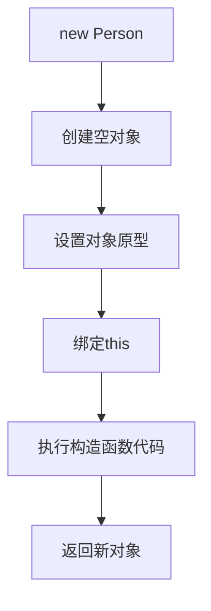

# JavaScript 构造函数详解

## 什么是构造函数？

构造函数是JavaScript中用于创建对象的特殊函数。它们是实现面向对象编程的基础工具，允许我们创建多个具有相同属性和方法的对象实例，而无需重复编写相同的代码。

在JavaScript中，构造函数通常以大写字母开头，这是一种编程约定，用来区分普通函数和构造函数。

:::tip
构造函数本质上就是一个普通的函数，但当它与`new`关键字一起使用时，它的行为会发生变化，变成一个创建对象的工厂。
:::

## 构造函数的基本语法

构造函数的基本语法如下：

```javascript
function Person(name, age) {
  this.name = name;
  this.age = age;
  this.sayHello = function() {
    console.log("Hello, my name is " + this.name);
  };
}

// 使用构造函数创建对象
const person1 = new Person("Alice", 25);
const person2 = new Person("Bob", 30);

// 访问对象属性
console.log(person1.name); // 输出: Alice
console.log(person2.age);  // 输出: 30

// 调用对象方法
person1.sayHello(); // 输出: Hello, my name is Alice
```

在上面的例子中：
1. 我们定义了一个名为`Person`的构造函数，接受`name`和`age`参数
2. 函数内部使用`this`关键字来设置新对象的属性
3. 使用`new`关键字调用构造函数来创建新的对象实例

## new 关键字的作用

当我们使用`new`关键字调用构造函数时，JavaScript会执行以下操作：

1. 创建一个新的空对象
2. 将这个对象的原型指向构造函数的`prototype`属性
3. 将构造函数内部的`this`绑定到这个新创建的对象
4. 执行构造函数的代码
5. 如果构造函数没有返回其他对象，则返回这个新创建的对象



## 构造函数的问题

尽管构造函数很有用，但它也有一个明显的问题：每次创建新实例时，构造函数中定义的方法都会被重新创建，这可能导致内存浪费。

```javascript
function Person(name, age) {
  this.name = name;
  this.age = age;
  // 每个实例都会创建一个新的函数对象
  this.sayHello = function() {
    console.log("Hello, my name is " + this.name);
  };
}

const person1 = new Person("Alice", 25);
const person2 = new Person("Bob", 30);

// 这两个方法是不同的函数对象
console.log(person1.sayHello === person2.sayHello); // 输出: false
```

为了解决这个问题，我们可以使用原型（prototype）来共享方法。

## 使用原型改进构造函数

通过将方法添加到构造函数的`prototype`属性上，所有实例可以共享这些方法：

```javascript
function Person(name, age) {
  this.name = name;
  this.age = age;
}

// 将方法添加到原型上
Person.prototype.sayHello = function() {
  console.log("Hello, my name is " + this.name);
};

const person1 = new Person("Alice", 25);
const person2 = new Person("Bob", 30);

// 现在这两个方法是同一个函数对象
console.log(person1.sayHello === person2.sayHello); // 输出: true
```

这样，无论我们创建多少个实例，`sayHello`方法只会被创建一次，所有实例都会共享这个方法，从而节省内存。

## 构造函数的返回值

通常，构造函数不需要显式返回值。如果没有返回值，则默认返回新创建的对象（`this`）。但是，如果构造函数中显式返回了一个对象，那么这个对象会替代新创建的对象被返回。

```javascript
function Car(brand) {
  this.brand = brand;
  
  // 如果返回一个对象，会覆盖默认返回的this对象
  return { type: "vehicle" };
}

const myCar = new Car("Toyota");
console.log(myCar.brand); // 输出: undefined
console.log(myCar.type);  // 输出: vehicle
```

:::caution
如果构造函数返回的是原始类型（如字符串、数字等），则该返回值会被忽略，仍然返回新创建的对象。
:::

```javascript
function Bike(brand) {
  this.brand = brand;
  
  // 返回原始类型值会被忽略
  return "A new bike";
}

const myBike = new Bike("Giant");
console.log(myBike); // 输出: { brand: "Giant" }
```

## 检查对象的构造函数

我们可以使用`instanceof`运算符来检查一个对象是否是由特定构造函数创建的：

```javascript
function Animal(name) {
  this.name = name;
}

const dog = new Animal("Rex");

console.log(dog instanceof Animal); // 输出: true
console.log(dog instanceof Object); // 输出: true
console.log(dog instanceof Array);  // 输出: false
```

另外，我们也可以通过`constructor`属性来检查：

```javascript
console.log(dog.constructor === Animal); // 输出: true
```

## 实际应用案例

### 创建用户管理系统

以下是一个简单的用户管理系统示例，展示了构造函数的实际应用：

```javascript
// 用户构造函数
function User(username, email, role = "member") {
  this.username = username;
  this.email = email;
  this.role = role;
  this.createdAt = new Date();
  this.isActive = true;
}

// 添加到原型的方法
User.prototype.deactivate = function() {
  this.isActive = false;
  console.log(`用户 ${this.username} 已停用`);
};

User.prototype.promote = function(newRole) {
  this.role = newRole;
  console.log(`用户 ${this.username} 已升级为 ${newRole}`);
};

User.prototype.getInfo = function() {
  return {
    username: this.username,
    email: this.email,
    role: this.role,
    isActive: this.isActive,
    memberSince: this.createdAt.toLocaleDateString()
  };
};

// 使用构造函数创建用户
const user1 = new User("alice123", "alice@example.com");
const admin = new User("adminBob", "bob@example.com", "admin");

// 使用用户对象
console.log(user1.getInfo());
// 输出: { username: "alice123", email: "alice@example.com", role: "member", isActive: true, memberSince: "2023/5/10" }

admin.promote("superadmin");
// 输出: 用户 adminBob 已升级为 superadmin

user1.deactivate();
// 输出: 用户 alice123 已停用
console.log(user1.isActive); // 输出: false
```

### 购物车系统

另一个构造函数的实际应用是实现简单的购物车功能：

```javascript
// 商品构造函数
function Product(id, name, price) {
  this.id = id;
  this.name = name;
  this.price = price;
}

// 购物车构造函数
function ShoppingCart() {
  this.items = [];
}

// 购物车方法
ShoppingCart.prototype.addItem = function(product, quantity = 1) {
  this.items.push({
    product: product,
    quantity: quantity
  });
  console.log(`已添加 ${quantity} 个 ${product.name} 到购物车`);
};

ShoppingCart.prototype.removeItem = function(productId) {
  const index = this.items.findIndex(item => item.product.id === productId);
  if (index !== -1) {
    const removedItem = this.items.splice(index, 1)[0];
    console.log(`已从购物车移除 ${removedItem.product.name}`);
  }
};

ShoppingCart.prototype.getTotal = function() {
  return this.items.reduce((total, item) => {
    return total + (item.product.price * item.quantity);
  }, 0);
};

// 使用构造函数
const laptop = new Product(1, "笔记本电脑", 5999);
const phone = new Product(2, "智能手机", 2999);
const headphones = new Product(3, "无线耳机", 799);

const myCart = new ShoppingCart();
myCart.addItem(laptop);
myCart.addItem(phone, 2);
myCart.addItem(headphones);

console.log("购物车总金额: ¥" + myCart.getTotal());
// 输出: 购物车总金额: ¥12796

myCart.removeItem(2);
console.log("购物车总金额: ¥" + myCart.getTotal());
// 输出: 购物车总金额: ¥6798
```

## 构造函数与 ES6 类的比较

ES6 引入了类（class）语法，这是一种更现代的创建对象模板的方式。实际上，类是构造函数的语法糖，底层仍然使用原型继承：

```javascript
// 使用构造函数
function PersonConstructor(name, age) {
  this.name = name;
  this.age = age;
}

PersonConstructor.prototype.greet = function() {
  console.log(`Hi, I'm ${this.name}`);
};

// 使用 ES6 类
class PersonClass {
  constructor(name, age) {
    this.name = name;
    this.age = age;
  }
  
  greet() {
    console.log(`Hi, I'm ${this.name}`);
  }
}

// 两者创建的对象行为相同
const person1 = new PersonConstructor("Tom", 25);
const person2 = new PersonClass("Jerry", 22);

person1.greet(); // 输出: Hi, I'm Tom
person2.greet(); // 输出: Hi, I'm Jerry
```

尽管 ES6 类更加简洁易读，理解构造函数仍然很重要，因为它们是 JavaScript 面向对象编程的基础。

## 总结

构造函数是 JavaScript 中创建对象的强大工具，它们允许我们：

1. 创建具有预定义属性和方法的多个对象
2. 通过原型共享方法以提高性能
3. 实现面向对象的编程模式
4. 建立对象实例与构造函数之间的关系

理解构造函数及其工作原理是掌握 JavaScript 面向对象编程的关键一步。虽然现代 JavaScript 提供了类语法，但构造函数仍然是 JavaScript 对象系统的核心。

## 练习题

1. 创建一个`Book`构造函数，包含`title`、`author`、`year`和`isRead`属性，以及`markAsRead`和`getSummary`方法。

2. 创建一个`BankAccount`构造函数，包含`owner`、`balance`属性，以及`deposit`、`withdraw`和`getBalance`方法。确保通过原型共享这些方法。

3. 修改以下代码，使用原型改进性能：

```javascript
function Circle(radius) {
  this.radius = radius;
  this.getArea = function() {
    return Math.PI * this.radius * this.radius;
  };
  this.getPerimeter = function() {
    return 2 * Math.PI * this.radius;
  };
}
```

4. 创建一个`Calculator`构造函数，实现基本的计算功能（加、减、乘、除）。

:::note
推荐阅读：
- [MDN Web Docs: 构造函数](https://developer.mozilla.org/zh-CN/docs/Web/JavaScript/Reference/Global_Objects/Object/constructor)
- [MDN Web Docs: new 操作符](https://developer.mozilla.org/zh-CN/docs/Web/JavaScript/Reference/Operators/new)
- [MDN Web Docs: 原型与原型链](https://developer.mozilla.org/zh-CN/docs/Web/JavaScript/Inheritance_and_the_prototype_chain)
:::