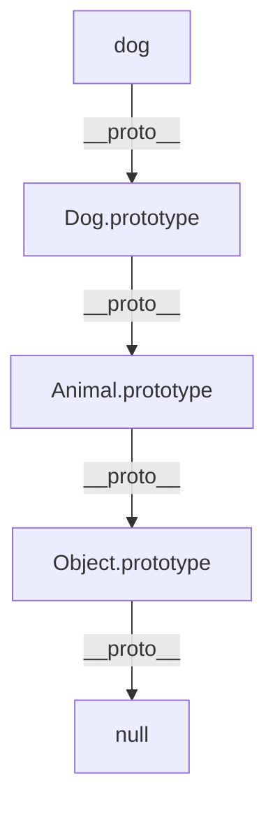

# JavaScript 类继承

## 介绍

继承是面向对象编程中的核心概念之一，允许我们创建基于现有类的新类，从而重用代码并建立对象之间的层次关系。在ES6引入`class`关键字之前，JavaScript主要通过原型链实现继承。现在，ES6的类语法让继承变得更加直观和易于使用，虽然底层仍然是基于原型的实现。

本教程将帮助你理解JavaScript中的类继承机制，掌握`extends`关键字的使用，以及处理继承过程中常见的挑战。

## 类继承的基本语法

在JavaScript中，我们使用`extends`关键字来创建一个继承自另一个类的子类：

```javascript
class Parent {
  constructor(name) {
    this.name = name;
  }
  
  greet() {
    return `Hello, I am ${this.name}`;
  }
}

class Child extends Parent {
  constructor(name, age) {
    super(name); // 调用父类构造函数
    this.age = age;
  }
  
  greet() {
    return `${super.greet()} and I am ${this.age} years old`;
  }
}

// 创建实例
const parent = new Parent('Alice');
const child = new Child('Bob', 5);

console.log(parent.greet()); // 输出: "Hello, I am Alice"
console.log(child.greet());  // 输出: "Hello, I am Bob and I am 5 years old"
```

:::note
`super`关键字有两种用法：
1. 在构造函数中调用`super()`，代表调用父类的构造函数
2. 在方法中使用`super.方法名()`，代表调用父类的同名方法
:::

## 继承中的关键概念

### 1. super关键字

`super`是继承中的一个重要关键字，它有两个主要用途：

```javascript
class Animal {
  constructor(name) {
    this.name = name;
  }
  
  speak() {
    return `${this.name} makes a noise`;
  }
}

class Dog extends Animal {
  constructor(name, breed) {
    super(name); // 调用父类构造函数
    this.breed = breed;
  }
  
  speak() {
    return `${super.speak()}, specifically a bark!`; // 调用父类方法
  }
  
  getDetails() {
    return `${this.name} is a ${this.breed}`;
  }
}

const dog = new Dog('Rex', 'German Shepherd');
console.log(dog.speak()); // 输出: "Rex makes a noise, specifically a bark!"
console.log(dog.getDetails()); // 输出: "Rex is a German Shepherd"
```

:::caution
在子类的构造函数中，必须先调用`super()`才能使用`this`关键字，否则会抛出`ReferenceError`。
```javascript
class Child extends Parent {
  constructor(name) {
    console.log(this); // 错误：在调用super()之前引用this
    super(name);
  }
}
```
:::

### 2. 方法覆盖

子类可以覆盖（重写）父类中的方法，以提供特定于子类的行为：

```javascript
class Vehicle {
  constructor(type) {
    this.type = type;
  }
  
  getDescription() {
    return `This is a ${this.type}`;
  }
}

class Car extends Vehicle {
  constructor(make, model) {
    super('car');
    this.make = make;
    this.model = model;
  }
  
  getDescription() {
    // 覆盖父类方法
    return `This is a ${this.make} ${this.model} ${this.type}`;
  }
}

const myCar = new Car('Toyota', 'Corolla');
console.log(myCar.getDescription()); // 输出: "This is a Toyota Corolla car"
```

### 3. 属性继承

子类自动继承父类的所有属性：

```javascript
class Person {
  constructor(name, age) {
    this.name = name;
    this.age = age;
  }
}

class Employee extends Person {
  constructor(name, age, jobTitle) {
    super(name, age);
    this.jobTitle = jobTitle;
  }
}

const employee = new Employee('John', 30, 'Developer');
console.log(employee.name); // 输出: "John" (继承自Person)
console.log(employee.age); // 输出: 30 (继承自Person)
console.log(employee.jobTitle); // 输出: "Developer" (Employee自己的属性)
```

## 类继承的复杂场景

### 多层继承

JavaScript支持多层继承，即一个类可以继承自另一个子类：

```javascript
class Animal {
  constructor(name) {
    this.name = name;
  }
  
  eat() {
    return `${this.name} is eating.`;
  }
}

class Mammal extends Animal {
  constructor(name) {
    super(name);
  }
  
  warmBlooded() {
    return `${this.name} is warm-blooded.`;
  }
}

class Dog extends Mammal {
  constructor(name, breed) {
    super(name);
    this.breed = breed;
  }
  
  bark() {
    return `${this.name} is barking!`;
  }
}

const myDog = new Dog('Buddy', 'Golden Retriever');
console.log(myDog.eat()); // 来自Animal类
console.log(myDog.warmBlooded()); // 来自Mammal类
console.log(myDog.bark()); // 来自Dog类
```

输出：
```
Buddy is eating.
Buddy is warm-blooded.
Buddy is barking!
```

### 静态方法的继承

子类也会继承父类的静态方法：

```javascript
class MathOperations {
  static add(x, y) {
    return x + y;
  }
}

class AdvancedMath extends MathOperations {
  static multiply(x, y) {
    return x * y;
  }
}

console.log(AdvancedMath.add(5, 3)); // 输出: 8 (继承自MathOperations)
console.log(AdvancedMath.multiply(5, 3)); // 输出: 15 (自己的方法)
```

## 类继承与原型链的关系

ES6的类继承在底层仍然使用原型链实现。了解这种关系有助于深入理解JavaScript的继承机制：

```javascript
class Animal {
  constructor(name) {
    this.name = name;
  }
  
  speak() {
    console.log(`${this.name} makes a noise.`);
  }
}

class Dog extends Animal {
  speak() {
    console.log(`${this.name} barks.`);
  }
}

const dog = new Dog('Rex');
console.log(dog instanceof Dog); // true
console.log(dog instanceof Animal); // true

// 原型链关系
console.log(Dog.prototype.__proto__ === Animal.prototype); // true
console.log(dog.__proto__ === Dog.prototype); // true
```

这个继承层次可以用下面的图表表示：



## 实际应用案例

### 构建UI组件库

在前端开发中，类继承常用于构建可复用的UI组件：

```javascript
class Component {
  constructor(id) {
    this.element = document.getElementById(id);
  }
  
  hide() {
    this.element.style.display = 'none';
    return this;
  }
  
  show() {
    this.element.style.display = 'block';
    return this;
  }
}

class Button extends Component {
  constructor(id) {
    super(id);
    this.attachEvents();
  }
  
  attachEvents() {
    this.element.addEventListener('click', this.onClick.bind(this));
  }
  
  onClick() {
    alert('Button clicked!');
  }
  
  disable() {
    this.element.disabled = true;
    return this;
  }
  
  enable() {
    this.element.disabled = false;
    return this;
  }
}

// 使用
// HTML中：<button id="submit-btn">Submit</button>
const submitButton = new Button('submit-btn');
submitButton.show().disable();
```

### 游戏开发中的角色类设计

在游戏开发中，类继承可以用来创建不同类型的游戏角色：

```javascript
class Character {
  constructor(name, health, power) {
    this.name = name;
    this.health = health;
    this.power = power;
  }
  
  attack(target) {
    target.health -= this.power;
    return `${this.name} attacked ${target.name}, causing ${this.power} damage!`;
  }
  
  isAlive() {
    return this.health > 0;
  }
}

class Warrior extends Character {
  constructor(name) {
    super(name, 100, 10);
    this.armor = 5;
  }
  
  defend() {
    this.health += this.armor;
    return `${this.name} defends and gains ${this.armor} health!`;
  }
}

class Wizard extends Character {
  constructor(name) {
    super(name, 70, 15);
    this.mana = 100;
  }
  
  castSpell(target) {
    if (this.mana >= 20) {
      this.mana -= 20;
      target.health -= this.power * 2;
      return `${this.name} casts a spell on ${target.name}, causing ${this.power * 2} damage!`;
    } else {
      return `${this.name} doesn't have enough mana to cast a spell!`;
    }
  }
}

// 游戏中使用
const warrior = new Warrior('Arthur');
const wizard = new Wizard('Merlin');

console.log(warrior.attack(wizard)); // Arthur attacked Merlin, causing 10 damage!
console.log(wizard.castSpell(warrior)); // Merlin casts a spell on Arthur, causing 30 damage!
console.log(warrior.defend()); // Arthur defends and gains 5 health!
```

## 继承的最佳实践

### 1. 保持继承层次简单

避免创建过深的继承层次，通常不应超过2-3层。过深的继承链会使代码难以理解和维护。

### 2. 优先使用组合而非继承

在许多情况下，组合（将一个对象包含在另一个对象中）比继承更灵活：

```javascript
// 继承方式
class Animal {
  move() { /* ... */ }
}

class Bird extends Animal {
  fly() { /* ... */ }
}

// 组合方式
class Movement {
  move() { /* ... */ }
}

class Flight {
  fly() { /* ... */ }
}

class Bird {
  constructor() {
    this.movement = new Movement();
    this.flight = new Flight();
  }
}
```

### 3. 使用instanceof检查继承关系

可以用`instanceof`运算符检查对象是否是某个类的实例：

```javascript
const dog = new Dog('Rex');
console.log(dog instanceof Dog); // true
console.log(dog instanceof Animal); // true
console.log(dog instanceof Object); // true
```

### 4. 处理构造函数中的错误

确保在子类构造函数中正确调用`super()`，并处理可能的错误：

```javascript
class SafeChild extends Parent {
  constructor(name) {
    try {
      super(name);
    } catch (error) {
      console.error('Error in parent constructor:', error);
      // 提供合理的默认值或错误处理
    }
  }
}
```

## 总结

JavaScript类继承提供了一种清晰、直观的方式来重用代码并建立对象之间的层次关系。通过`extends`关键字和`super`引用，我们可以创建继承父类属性和方法的子类，同时可以根据需要添加新功能或覆盖现有功能。

关键要点：

1. 使用`extends`关键字创建子类
2. 在子类构造函数中必须调用`super()`，而且要在使用`this`之前
3. 使用`super.方法名()`可以调用父类中的方法
4. 子类可以继承父类的所有属性和方法，包括静态方法
5. ES6类继承的底层实现仍然基于原型链

掌握类继承后，你能够创建更模块化、可维护的代码，并充分利用面向对象编程的优势来构建复杂的应用程序。

## 练习

1. 创建一个`Shape`基类，然后创建`Circle`和`Rectangle`子类，每个类都应该有计算面积的方法。

2. 实现一个简单的`Vehicle`类层次结构，包括`Car`、`Motorcycle`和`Truck`子类，每个类都有特定的属性和方法。

3. 改造上面游戏角色的例子，添加一个新的`Archer`角色，以及一个可以治疗其他角色的`Healer`角色。

## 附加资源

- MDN Web文档：[Classes](https://developer.mozilla.org/zh-CN/docs/Web/JavaScript/Reference/Classes)
- MDN Web文档：[Inheritance and the prototype chain](https://developer.mozilla.org/zh-CN/docs/Web/JavaScript/Inheritance_and_the_prototype_chain)
- JavaScript.info：[Class inheritance](https://javascript.info/class-inheritance)

通过实践这些概念并尝试各种场景，你将能够熟练运用JavaScript的类继承机制，创建更加结构化和可维护的代码。