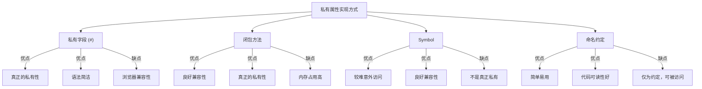

# JavaScript 私有属性

在面向对象编程中，**封装**是一个核心概念，而私有属性是实现封装的重要手段。私有属性允许我们隐藏对象的内部状态，只通过公共方法提供有限的访问权限，从而增强代码的安全性和可维护性。本文将介绍JavaScript中实现私有属性的多种方法。

## 为什么需要私有属性？

在构建复杂应用时，我们常常需要限制对某些属性的直接访问：

1. **保护数据完整性** - 防止外部代码随意修改对象内部状态
2. **降低耦合度** - 隐藏实现细节，提供清晰的公共接口
3. **避免命名冲突** - 私有属性不会污染全局命名空间

## 私有属性的实现方法

JavaScript提供了多种方式来实现私有属性，从传统技巧到现代语法特性，让我们一一了解。

### 1. 使用ES2022的私有字段（#）

ES2022引入了私有字段语法，使用`#`前缀来声明真正的私有属性：

```javascript
class BankAccount {
  #balance = 0;  // 私有字段
  
  constructor(initialBalance) {
    if (initialBalance > 0) {
      this.#balance = initialBalance;
    }
  }
  
  deposit(amount) {
    if (amount > 0) {
      this.#balance += amount;
      return true;
    }
    return false;
  }
  
  withdraw(amount) {
    if (amount > 0 && amount <= this.#balance) {
      this.#balance -= amount;
      return true;
    }
    return false;
  }
  
  getBalance() {
    return this.#balance;
  }
}

const account = new BankAccount(1000);
console.log(account.getBalance()); // 输出: 1000
account.deposit(500);
console.log(account.getBalance()); // 输出: 1500
console.log(account.#balance); // 语法错误: 私有字段不能在类外部访问
```

:::tip
私有字段语法(`#`)是JavaScript中实现真正私有属性的最现代方法，但需要注意浏览器兼容性问题。在撰写本文时，大多数现代浏览器已支持此特性。
:::

### 2. 使用闭包实现私有属性

在ES2022之前，开发者通常使用**闭包**来模拟私有属性：

```javascript
function createPerson(name, age) {
  // 私有变量
  let _name = name;
  let _age = age;
  
  // 返回包含公共方法的对象
  return {
    getName: function() {
      return _name;
    },
    getAge: function() {
      return _age;
    },
    setAge: function(newAge) {
      if (newAge > 0 && newAge < 120) {
        _age = newAge;
        return true;
      }
      return false;
    },
    introduce: function() {
      return `我叫${_name}，今年${_age}岁。`;
    }
  };
}

const person = createPerson("张三", 25);
console.log(person.introduce()); // 输出: 我叫张三，今年25岁。
person.setAge(26);
console.log(person.getAge());    // 输出: 26
console.log(person._age);        // 输出: undefined (无法直接访问)
```

闭包方法的优点是良好的浏览器兼容性，缺点是每个实例都会创建新的方法副本，可能增加内存消耗。

### 3. 使用Symbol作为属性键

Symbol可以创建唯一标识符，作为对象属性的键，虽然不是真正的私有属性，但可以防止意外访问：

```javascript
const User = (function() {
  // 创建唯一的Symbol
  const passwordSymbol = Symbol('password');
  
  class User {
    constructor(username, password) {
      this.username = username;
      // 使用Symbol作为键
      this[passwordSymbol] = password; 
    }
    
    validatePassword(input) {
      return input === this[passwordSymbol];
    }
  }
  
  return User;
})();

const user = new User("admin", "secret123");
console.log(user.username);            // 输出: "admin"
console.log(user.password);            // 输出: undefined
console.log(user.validatePassword("secret123")); // 输出: true

// Symbol并非完全私有，可通过以下方式获取：
const symbols = Object.getOwnPropertySymbols(user);
console.log(user[symbols[0]]);         // 输出: "secret123"
```

:::caution
Symbol方法并不是真正的私有化，它只是增加了访问难度。在需要严格保护数据的场景下，应该使用私有字段(#)或闭包方法。
:::

### 4. 命名约定（下划线前缀）

使用下划线前缀是一种常见的命名约定，表明该属性应被视为私有，但这只是一种约定，并不提供真正的私有性：

```javascript
class Product {
  constructor(name, price) {
    this.name = name;
    this._price = price; // 约定为"私有"
  }
  
  get price() {
    return `¥${this._price.toFixed(2)}`;
  }
  
  applyDiscount(percent) {
    this._price = this._price * (1 - percent/100);
  }
}

const phone = new Product("智能手机", 2999);
console.log(phone.price);  // 输出: ¥2999.00
phone.applyDiscount(10);
console.log(phone.price);  // 输出: ¥2699.10
console.log(phone._price); // 输出: 2699.1 (依然可访问)
```

## 实际应用场景

### 1. 数据验证

私有属性可以帮助实现数据验证，确保存储的数据始终有效：

```javascript
class EmailManager {
  #emails = [];
  
  addEmail(email) {
    // 简单的邮箱验证
    const emailRegex = /^[^\s@]+@[^\s@]+\.[^\s@]+$/;
    if (emailRegex.test(email)) {
      this.#emails.push(email);
      return true;
    }
    return false;
  }
  
  getEmails() {
    // 返回副本而非原始数组
    return [...this.#emails];
  }
}

const manager = new EmailManager();
console.log(manager.addEmail("test@example.com"));  // 输出: true
console.log(manager.addEmail("invalid"));          // 输出: false
console.log(manager.getEmails());                  // 输出: ["test@example.com"]
```

### 2. 缓存实现

私有属性非常适合实现缓存机制，隐藏内部缓存数据：

```javascript
class DataFetcher {
  #cache = new Map();
  #expiryTimes = new Map();
  #cacheTime = 60000; // 默认缓存1分钟
  
  async fetchData(url) {
    const now = Date.now();
    
    // 检查缓存
    if (this.#cache.has(url) && now < this.#expiryTimes.get(url)) {
      console.log("从缓存获取数据");
      return this.#cache.get(url);
    }
    
    // 获取新数据
    console.log("获取新数据");
    try {
      const response = await fetch(url);
      const data = await response.json();
      
      // 更新缓存
      this.#cache.set(url, data);
      this.#expiryTimes.set(url, now + this.#cacheTime);
      
      return data;
    } catch (error) {
      console.error("获取数据失败:", error);
      throw error;
    }
  }
  
  clearCache() {
    this.#cache.clear();
    this.#expiryTimes.clear();
  }
  
  setCacheTime(milliseconds) {
    if (milliseconds >= 0) {
      this.#cacheTime = milliseconds;
    }
  }
}

// 使用示例
const fetcher = new DataFetcher();
// 首次调用将获取新数据
fetcher.fetchData("https://api.example.com/data")
  .then(data => console.log("第一次调用:", data));

// 短时间内再次调用将使用缓存数据
setTimeout(() => {
  fetcher.fetchData("https://api.example.com/data")
    .then(data => console.log("第二次调用:", data));
}, 2000);
```

### 3. 状态管理

在组件或状态管理系统中，私有属性可用于保护内部状态：

```javascript
class UIComponent {
  #state = {};
  #listeners = [];
  
  constructor(initialState = {}) {
    this.#state = { ...initialState };
  }
  
  setState(updates) {
    // 使用浅拷贝合并更新
    this.#state = { ...this.#state, ...updates };
    // 通知监听器
    this.#notifyListeners();
  }
  
  getState() {
    // 返回状态的副本，防止外部直接修改
    return { ...this.#state };
  }
  
  subscribe(listener) {
    if (typeof listener === 'function') {
      this.#listeners.push(listener);
      // 返回取消订阅函数
      return () => {
        this.#listeners = this.#listeners.filter(l => l !== listener);
      };
    }
  }
  
  #notifyListeners() {
    const currentState = this.getState();
    this.#listeners.forEach(listener => {
      listener(currentState);
    });
  }
}

// 使用示例
const counter = new UIComponent({ count: 0 });

const unsubscribe = counter.subscribe(state => {
  console.log('状态更新:', state);
});

counter.setState({ count: counter.getState().count + 1 }); // 输出: 状态更新: { count: 1 }
counter.setState({ count: counter.getState().count + 1 }); // 输出: 状态更新: { count: 2 }

unsubscribe(); // 取消订阅
counter.setState({ count: 0 }); // 不会输出任何内容
```

## 私有方法的实现

除了私有属性，我们也常需要私有方法。ES2022也支持私有方法：

```javascript
class Calculator {
  #precision = 2;
  
  constructor(precision) {
    if (precision >= 0) {
      this.#precision = precision;
    }
  }
  
  add(a, b) {
    return this.#format(a + b);
  }
  
  subtract(a, b) {
    return this.#format(a - b);
  }
  
  // 私有方法
  #format(number) {
    return Number(number.toFixed(this.#precision));
  }
}

const calc = new Calculator(3);
console.log(calc.add(10.1234, 5.6789));    // 输出: 15.802
console.log(calc.subtract(10.1234, 5.6789)); // 输出: 4.444
// calc.#format(10.1234); // 语法错误
```

## 私有属性和私有方法的对比

下面是各种实现私有属性的方法对比：



## 总结

JavaScript私有属性是实现封装的重要机制，我们学习了多种实现方法：

1. **私有字段(`#`)**：ES2022特性，提供真正的私有性
2. **闭包**：传统方法，利用作用域隔离变量
3. **Symbol**：创建难以偶然访问的属性
4. **命名约定**：简单但不提供真正私有性的方法

在现代JavaScript开发中，推荐使用私有字段(`#`)语法，它既保证了私有性，又有简洁的语法。如果需要考虑更广泛的浏览器兼容性，闭包方法仍然是可靠的选择。

## 练习

1. 创建一个`PasswordManager`类，使用私有字段存储密码，并提供验证密码的方法。
2. 实现一个计数器类，使用闭包方式隐藏计数值，提供增加、减少和重置方法。
3. 创建一个购物车类，使用Symbol隐藏商品列表，提供添加商品和计算总价的方法。

## 扩展阅读

- [MDN Web Docs: 私有类字段](https://developer.mozilla.org/zh-CN/docs/Web/JavaScript/Reference/Classes/Private_class_fields)
- [JavaScript封装模式](https://developer.mozilla.org/zh-CN/docs/Web/JavaScript/Closures)
- [Symbol类型](https://developer.mozilla.org/zh-CN/docs/Web/JavaScript/Reference/Global_Objects/Symbol)

通过掌握私有属性的实现，你将能够编写更安全、更健壮的面向对象代码，为构建大型应用打下良好基础！