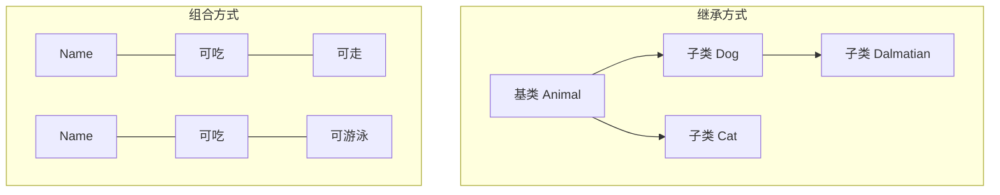

# JavaScript 对象组合

## 什么是对象组合？

对象组合是JavaScript中一种强大的设计模式，它强调将功能分散到多个小型、独立的对象中，然后将这些对象组合起来构建更复杂的功能。这种方法遵循"组合优于继承"的设计原则，在许多现代JavaScript应用程序中得到广泛应用。

相比传统的继承模式，对象组合提供了更灵活、更可维护的代码结构，特别适合JavaScript这种动态语言。

:::tip 核心概念
组合的核心思想是：**拥有而不是继承**。一个对象通过包含其他对象的实例来获得功能，而不是通过继承链。
:::

## 为什么使用对象组合？

继承模式在某些场景下会带来一些问题：

1. **脆弱的基类问题**：当基类改变时，所有继承它的子类都可能受到影响
2. **层次结构僵化**：继承创建了紧密耦合的对象层次结构，难以修改
3. **多重继承复杂性**：JavaScript不直接支持多重继承，实现起来较为复杂

对象组合通过以下方式解决这些问题：

- 创建松散耦合的对象
- 提高代码重用性
- 提供更大的灵活性
- 简化测试和维护

## 基本组合方法

### 1. 对象混入(Object Mixins)

混入是一种将一个对象的属性复制到另一个对象的技术：

```javascript
// 创建一些功能模块
const canEat = {
  eat: function(food) {
    console.log(`Eating ${food}`);
  }
};

const canWalk = {
  walk: function() {
    console.log('Walking');
  }
};

const canSwim = {
  swim: function() {
    console.log('Swimming');
  }
};

// 创建一个人类对象
const person = {
  name: 'John'
};

// 使用Object.assign组合功能
Object.assign(person, canEat, canWalk);

// 使用组合的功能
person.eat('apple'); // 输出: Eating apple
person.walk(); // 输出: Walking

// 创建一个鱼类对象
const fish = {
  name: 'Nemo'
};

// 为鱼组合不同的功能
Object.assign(fish, canEat, canSwim);

fish.eat('seaweed'); // 输出: Eating seaweed
fish.swim(); // 输出: Swimming
```

### 2. 函数组合

我们还可以通过函数组合来创建更加灵活的对象：

```javascript
// 工厂函数
function createAnimal(name) {
  return {
    name,
    getName() {
      return this.name;
    }
  };
}

function swimmer(obj) {
  return Object.assign({}, obj, {
    swim() {
      return `${this.name} is swimming`;
    }
  });
}

function flyer(obj) {
  return Object.assign({}, obj, {
    fly() {
      return `${this.name} is flying`;
    }
  });
}

// 创建一个只会游泳的动物
const fish = swimmer(createAnimal('Fish'));
console.log(fish.swim()); // 输出: Fish is swimming

// 创建一个会游泳也会飞的动物
const flyingFish = flyer(swimmer(createAnimal('Flying Fish')));
console.log(flyingFish.swim()); // 输出: Flying Fish is swimming
console.log(flyingFish.fly()); // 输出: Flying Fish is flying
```

### 3. 使用组合委托

组合委托是一种通过对象引用其他对象并委托调用来实现组合的方式：

```javascript
// 创建功能模块
const eater = {
  init(food) {
    this.food = food;
    return this;
  },
  eat() {
    return `Eating ${this.food}`;
  }
};

const sleeper = {
  init(hoursOfSleep) {
    this.hoursOfSleep = hoursOfSleep;
    return this;
  },
  sleep() {
    return `Sleeping for ${this.hoursOfSleep} hours`;
  }
};

// 创建主对象
const robot = {
  name: 'Robot',
  // 组合其他对象
  eater: Object.create(eater),
  sleeper: Object.create(sleeper),
  
  // 初始化方法
  init(name, food, hoursOfSleep) {
    this.name = name;
    this.eater.init(food);
    this.sleeper.init(hoursOfSleep);
    return this;
  },
  
  // 委托方法
  eat() {
    return `${this.name}: ${this.eater.eat()}`;
  },
  sleep() {
    return `${this.name}: ${this.sleeper.sleep()}`;
  }
};

// 创建robot实例
const robby = Object.create(robot).init('Robby', 'electricity', 8);

console.log(robby.eat());  // 输出: Robby: Eating electricity
console.log(robby.sleep()); // 输出: Robby: Sleeping for 8 hours
```

## 实际应用案例

### 游戏角色系统

假设我们正在开发一个游戏，需要创建不同类型的角色，每个角色都有不同的能力组合：

```javascript
// 基本能力
const hasHealth = (health) => ({
  health,
  getHealth() {
    return this.health;
  },
  decreaseHealth(amount) {
    this.health -= amount;
    return this;
  }
});

const canAttack = (attackPower) => ({
  attackPower,
  attack(target) {
    console.log(`Attacking with power of ${this.attackPower}`);
    target.decreaseHealth(this.attackPower);
    return this;
  }
});

const canCastSpell = (magicPower) => ({
  magicPower,
  castSpell(spellName, target) {
    console.log(`Casting ${spellName} with magic power of ${this.magicPower}`);
    target.decreaseHealth(this.magicPower);
    return this;
  }
});

const canHeal = (healPower) => ({
  healPower,
  heal(target) {
    console.log(`Healing with power of ${this.healPower}`);
    target.health += this.healPower;
    return this;
  }
});

// 创建不同类型的角色
function createCharacter(name) {
  return {
    name,
    info() {
      let info = `${this.name} `;
      if (this.health !== undefined) info += `[Health: ${this.health}] `;
      if (this.attackPower !== undefined) info += `[Attack: ${this.attackPower}] `;
      if (this.magicPower !== undefined) info += `[Magic: ${this.magicPower}] `;
      if (this.healPower !== undefined) info += `[Heal: ${this.healPower}] `;
      return info;
    }
  };
}

function createWarrior(name) {
  return Object.assign(
    createCharacter(name),
    hasHealth(100),
    canAttack(20)
  );
}

function createMage(name) {
  return Object.assign(
    createCharacter(name),
    hasHealth(60),
    canAttack(5),
    canCastSpell(30)
  );
}

function createPriest(name) {
  return Object.assign(
    createCharacter(name),
    hasHealth(80),
    canCastSpell(15),
    canHeal(25)
  );
}

// 游戏示例
const warrior = createWarrior("Aragorn");
const mage = createMage("Gandalf");
const priest = createPriest("Radagast");

console.log(warrior.info()); // 输出: Aragorn [Health: 100] [Attack: 20] 
console.log(mage.info());    // 输出: Gandalf [Health: 60] [Attack: 5] [Magic: 30] 
console.log(priest.info());  // 输出: Radagast [Health: 80] [Magic: 15] [Heal: 25] 

// 战斗模拟
warrior.attack(mage);
console.log(mage.info());    // 输出: Gandalf [Health: 40] [Attack: 5] [Magic: 30] 
mage.castSpell("Fireball", warrior);
console.log(warrior.info()); // 输出: Aragorn [Health: 70] [Attack: 20] 
priest.heal(warrior);
console.log(warrior.info()); // 输出: Aragorn [Health: 95] [Attack: 20] 
```

### UI组件系统

在前端开发中，我们可以使用对象组合来构建可复用的UI组件：

```javascript
// 组件基础功能
const hasElement = (type = 'div') => ({
  element: document.createElement(type),
  render() {
    return this.element;
  }
});

const hasText = (text = '') => ({
  setText(newText) {
    this.element.textContent = newText;
    return this;
  },
  getText() {
    return this.element.textContent;
  },
  init() {
    this.setText(text);
    return this;
  }
});

const hasStyle = (styles = {}) => ({
  setStyle(property, value) {
    this.element.style[property] = value;
    return this;
  },
  init() {
    Object.entries(styles).forEach(([property, value]) => {
      this.setStyle(property, value);
    });
    return this;
  }
});

const isClickable = (onClick) => ({
  attachClickHandler() {
    this.element.addEventListener('click', () => onClick(this));
    return this;
  }
});

// 创建具体组件
function createButton(text, styles = {}, onClick = () => {}) {
  const button = Object.assign(
    {},
    hasElement('button'),
    hasText(text),
    hasStyle(styles),
    isClickable(onClick)
  );
  
  // 初始化组件
  button.setText(text);
  button.init && button.init();
  button.attachClickHandler();
  
  return button;
}

// 使用示例（实际代码需在浏览器环境中运行）
/*
const myButton = createButton(
  'Click me',
  { backgroundColor: 'blue', color: 'white', padding: '10px' },
  (btn) => {
    btn.setText('Clicked!');
    btn.setStyle('backgroundColor', 'red');
  }
);

document.body.appendChild(myButton.render());
*/

// 输出 HTML 结构描述（用于演示）
console.log("创建了一个按钮组件，包含文本 'Click me'，蓝色背景，白色文字");
console.log("点击后，文本会变为 'Clicked!'，背景会变为红色");
```

## 组合与继承的对比

让我们直观地对比对象组合和继承的差异：



### 继承的优缺点

**优点：**
- 层次结构清晰
- 可以使用多态
- 代码复用方便

**缺点：**
- 创建固定的、脆弱的层次结构
- 基类变化会影响所有子类
- JavaScript中的原型继承可能复杂难懂

### 组合的优缺点

**优点：**
- 灵活性高，可以动态组合功能
- 松散耦合，易于测试和维护
- 避免了深层继承层次带来的复杂性

**缺点：**
- 对象可能变得难以追踪
- 需要更细致的设计
- 可能需要更多的代码来连接各个部分

## 最佳实践

1. **保持功能单一**：每个可组合的对象或函数应该只做一件事，并做好它

2. **避免状态共享**：尽量减少组合对象之间的状态依赖

3. **使用工厂函数**：通过工厂函数创建和组合对象，而不是直接使用构造函数

4. **明确接口**：每个组件应该有明确定义的接口

5. **优先使用委托而不是混合**：当性能是关键因素时，委托通常比属性复制更有效

6. **保持浅层组合**：避免创建过于复杂的组合链

## 总结

JavaScript对象组合是一种强大的设计模式，它通过将功能分解成小型、独立的对象，然后将它们组合在一起，提供了比传统继承更灵活的代码结构。对象组合特别适合JavaScript这样的动态语言，能够创建松散耦合、易于测试和维护的代码。

在实际开发中，我们往往需要根据具体场景，选择合适的组合方法（混入、函数组合或委托），有时甚至将组合和继承结合使用，以达到最佳效果。掌握对象组合模式，将使你能够创建更加灵活、可维护和可扩展的JavaScript应用。

:::caution 记住
继承体现了"是什么"的关系，而组合体现了"有什么"的关系。当你发现自己在设计时过度使用"是一个"关系时，考虑是否可以通过组合实现更灵活的设计。
:::

## 练习

1. 创建一个汽车系统，使用对象组合设计不同类型的汽车（跑车、SUV、电动车等）
2. 设计一个任务管理系统，通过组合添加不同的功能（优先级、截止日期、通知等）
3. 重构一个现有的使用继承的代码，将其改为使用对象组合

## 扩展阅读

- [JavaScript设计模式与开发实践](https://www.ituring.com.cn/book/1632)
- [Functional-Light JavaScript](https://github.com/getify/Functional-Light-JS)
- [Eric Elliott的组合文章系列](https://medium.com/javascript-scene/composing-software-the-book-f31c77fc3ddc)