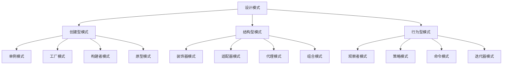

# JavaScript 面向对象设计模式

## 什么是设计模式？

设计模式是软件开发过程中针对特定问题的可重用解决方案。它们就像是经过验证的蓝图，可以帮助我们更高效地解决常见的编程问题，同时也能让我们的代码更易于维护和扩展。

在JavaScript这种支持面向对象编程的语言中，设计模式尤为重要，它们能够帮助我们：
- 避免重复造轮子
- 使用行业标准术语提高团队沟通效率
- 编写更易于维护和扩展的代码
- 解决特定的编程场景问题

:::tip
设计模式并非银弹，而是工具箱中的工具。重要的是了解何时以及如何使用它们！
:::

## 常见的JavaScript设计模式

让我们一起来探索几种在JavaScript中最常用的设计模式。

### 1. 单例模式（Singleton Pattern）

单例模式确保一个类只有一个实例，并提供一个全局访问点。在JavaScript中，单例通常用于管理全局状态或资源。

```javascript
// 单例模式实现
class Database {
  constructor(data) {
    if (Database.instance) {
      return Database.instance;
    }
    
    this.data = data;
    Database.instance = this;
  }
  
  getData() {
    return this.data;
  }
  
  setData(data) {
    this.data = data;
  }
}

// 测试
const mongo = new Database('MongoDB');
console.log(mongo.getData()); // 输出: MongoDB

const mysql = new Database('MySQL');
console.log(mysql.getData()); // 输出: MongoDB（而不是MySQL，因为是同一个实例）

// 验证是同一个实例
console.log(mongo === mysql); // 输出: true
```

**实际应用场景**：配置管理器、数据库连接池、应用程序设置等需要全局唯一实例的情况。

### 2. 工厂模式（Factory Pattern）

工厂模式提供了一个接口来创建对象，但允许子类决定要实例化的类。这种模式适用于创建复杂对象或需要根据不同条件创建不同类型对象的场景。

```javascript
// 工厂模式实现
class Vehicle {
  constructor(type, color) {
    this.type = type;
    this.color = color;
  }
  
  getInfo() {
    return `This is a ${this.color} ${this.type}`;
  }
}

class VehicleFactory {
  createVehicle(type, color) {
    switch(type) {
      case 'car':
        return new Vehicle('car', color);
      case 'truck':
        return new Vehicle('truck', color);
      case 'bike':
        return new Vehicle('bike', color);
      default:
        console.log('Unknown vehicle type');
    }
  }
}

// 使用工厂创建对象
const factory = new VehicleFactory();
const car = factory.createVehicle('car', 'blue');
const truck = factory.createVehicle('truck', 'red');

console.log(car.getInfo()); // 输出: This is a blue car
console.log(truck.getInfo()); // 输出: This is a red truck
```

**实际应用场景**：UI组件库、游戏角色创建、多平台应用中根据平台创建不同的服务等。

### 3. 观察者模式（Observer Pattern）

观察者模式定义了对象间的一种一对多依赖关系，当一个对象状态发生改变时，所有依赖它的对象都会得到通知并自动更新。

```javascript
// 观察者模式实现
class Subject {
  constructor() {
    this.observers = [];
  }
  
  subscribe(observer) {
    this.observers.push(observer);
  }
  
  unsubscribe(observer) {
    this.observers = this.observers.filter(obs => obs !== observer);
  }
  
  notify(data) {
    this.observers.forEach(observer => observer.update(data));
  }
}

class Observer {
  constructor(name) {
    this.name = name;
  }
  
  update(data) {
    console.log(`${this.name} received: ${data}`);
  }
}

// 测试
const subject = new Subject();

const observer1 = new Observer('Observer 1');
const observer2 = new Observer('Observer 2');

subject.subscribe(observer1);
subject.subscribe(observer2);

subject.notify('Hello World!');
// 输出:
// Observer 1 received: Hello World!
// Observer 2 received: Hello World!

subject.unsubscribe(observer1);
subject.notify('Hello Again!');
// 输出:
// Observer 2 received: Hello Again!
```

**实际应用场景**：事件处理系统、用户界面更新、数据绑定（如Vue和React的响应式系统）等。

### 4. 模块模式（Module Pattern）

模块模式使用闭包提供私有和公共方法的能力，可以用来模拟类并隐藏实现细节。

```javascript
// 模块模式实现
const counterModule = (function() {
  // 私有变量
  let count = 0;
  
  // 私有方法
  function validateCount(value) {
    return typeof value === 'number' && !isNaN(value);
  }
  
  // 返回公共接口
  return {
    increment: function() {
      return ++count;
    },
    decrement: function() {
      return --count;
    },
    getCount: function() {
      return count;
    },
    setCount: function(value) {
      if (validateCount(value)) {
        count = value;
        return count;
      } else {
        console.error('Invalid count value');
        return count;
      }
    }
  };
})();

// 使用模块
console.log(counterModule.getCount()); // 输出: 0
counterModule.increment();
counterModule.increment();
console.log(counterModule.getCount()); // 输出: 2
counterModule.setCount(10);
console.log(counterModule.getCount()); // 输出: 10
counterModule.setCount('not a number'); // 输出错误: Invalid count value
console.log(counterModule.getCount()); // 输出: 10（值未改变）

// 尝试直接访问私有变量
console.log(counterModule.count); // 输出: undefined
```

**实际应用场景**：封装功能单元、构建工具库、API客户端等。

### 5. 装饰器模式（Decorator Pattern）

装饰器模式允许向现有对象动态添加额外的功能，而不修改其结构。

```javascript
// 装饰器模式实现
class Coffee {
  cost() {
    return 5;
  }
  
  getDescription() {
    return 'Plain coffee';
  }
}

// 装饰器基类
class CoffeeDecorator {
  constructor(coffee) {
    this.coffee = coffee;
  }
  
  cost() {
    return this.coffee.cost();
  }
  
  getDescription() {
    return this.coffee.getDescription();
  }
}

// 具体装饰器
class MilkDecorator extends CoffeeDecorator {
  cost() {
    return this.coffee.cost() + 1.5;
  }
  
  getDescription() {
    return `${this.coffee.getDescription()}, with milk`;
  }
}

class SugarDecorator extends CoffeeDecorator {
  cost() {
    return this.coffee.cost() + 0.5;
  }
  
  getDescription() {
    return `${this.coffee.getDescription()}, with sugar`;
  }
}

// 使用装饰器
let coffee = new Coffee();
console.log(`${coffee.getDescription()}: $${coffee.cost()}`);
// 输出: Plain coffee: $5

coffee = new MilkDecorator(coffee);
console.log(`${coffee.getDescription()}: $${coffee.cost()}`);
// 输出: Plain coffee, with milk: $6.5

coffee = new SugarDecorator(coffee);
console.log(`${coffee.getDescription()}: $${coffee.cost()}`);
// 输出: Plain coffee, with milk, with sugar: $7
```

**实际应用场景**：表单验证、日志记录、权限检查等功能的动态添加。

## 设计模式之间的关系

不同的设计模式解决不同的问题，有时它们可以结合使用以创建更强大的解决方案。



## 如何选择合适的设计模式

选择设计模式应该基于你尝试解决的具体问题，而不是为了使用设计模式而使用设计模式。以下是一些选择设计模式的指导原则：

1. **明确问题**：首先明确你要解决的问题
2. **研究相似问题**：看看类似的问题是如何通过设计模式解决的
3. **考虑复杂度**：评估使用设计模式是否会使问题变得更复杂
4. **考虑可维护性**：考虑将来维护代码的人是否能理解这种模式
5. **考虑灵活性**：评估这种模式是否能适应需求的变化

:::warning
避免过度工程化！不要仅仅因为你知道某个设计模式就强行使用它。有时简单的解决方案最好。
:::

## 实际项目中的设计模式应用

让我们看一个实际项目中综合应用多种设计模式的例子：一个简单的购物车系统。

```javascript
// 单例模式 - 购物车管理器
class ShoppingCart {
  constructor() {
    if (ShoppingCart.instance) {
      return ShoppingCart.instance;
    }
    
    this.items = [];
    this.observers = [];
    ShoppingCart.instance = this;
  }
  
  // 观察者模式 - 添加观察者
  addObserver(observer) {
    this.observers.push(observer);
  }
  
  // 观察者模式 - 通知观察者
  notifyObservers() {
    for (const observer of this.observers) {
      observer.update(this);
    }
  }
  
  addItem(item) {
    this.items.push(item);
    this.notifyObservers();
  }
  
  removeItem(itemId) {
    this.items = this.items.filter(item => item.id !== itemId);
    this.notifyObservers();
  }
  
  getTotal() {
    return this.items.reduce((total, item) => total + item.price, 0);
  }
  
  getItems() {
    return [...this.items];
  }
}

// 工厂模式 - 商品工厂
class ProductFactory {
  createProduct(id, name, price, category) {
    return {
      id,
      name,
      price,
      category,
      toString() {
        return `${name} ($${price})`;
      }
    };
  }
}

// 观察者 - 界面更新
class CartUIObserver {
  update(cart) {
    const cartItemsElement = document.getElementById('cart-items');
    const cartTotalElement = document.getElementById('cart-total');
    
    if (cartItemsElement && cartTotalElement) {
      cartItemsElement.innerHTML = cart.getItems()
        .map(item => `<li>${item.toString()}</li>`)
        .join('');
      
      cartTotalElement.textContent = `$${cart.getTotal()}`;
    }
  }
}

// 装饰器模式 - 折扣装饰器
class DiscountDecorator {
  constructor(cart, discountPercentage) {
    this.cart = cart;
    this.discountPercentage = discountPercentage;
  }
  
  getTotal() {
    const originalTotal = this.cart.getTotal();
    const discount = originalTotal * (this.discountPercentage / 100);
    return originalTotal - discount;
  }
  
  // 代理其他方法到原始购物车
  getItems() {
    return this.cart.getItems();
  }
  
  addItem(item) {
    this.cart.addItem(item);
  }
  
  removeItem(itemId) {
    this.cart.removeItem(itemId);
  }
}

// 使用示例
const productFactory = new ProductFactory();
const cart = new ShoppingCart();
const uiObserver = new CartUIObserver();

// 添加观察者
cart.addObserver(uiObserver);

// 创建商品并添加到购物车
const laptop = productFactory.createProduct(1, 'Laptop', 999.99, 'Electronics');
const headphones = productFactory.createProduct(2, 'Headphones', 59.99, 'Electronics');

cart.addItem(laptop);
cart.addItem(headphones);

console.log(`购物车总价: $${cart.getTotal()}`);
// 输出: 购物车总价: $1059.98

// 应用折扣
const discountCart = new DiscountDecorator(cart, 10); // 10% 折扣
console.log(`打折后总价: $${discountCart.getTotal()}`);
// 输出: 打折后总价: $953.982

// 验证单例
const sameCart = new ShoppingCart();
console.log(cart === sameCart); // 输出: true
```

在这个例子中，我们结合使用了：
- **单例模式**：确保只有一个购物车实例
- **观察者模式**：当购物车变化时更新UI
- **工厂模式**：创建不同的商品
- **装饰器模式**：动态添加折扣功能

## 总结

设计模式是编写高质量JavaScript代码的重要工具，它们提供了解决特定编程问题的经过验证的方案。在本文中，我们学习了几种常见的JavaScript设计模式：

1. **单例模式**：确保一个类只有一个实例
2. **工厂模式**：提供创建对象的接口，而不直接使用构造函数
3. **观察者模式**：定义对象之间的一对多依赖关系
4. **模块模式**：使用闭包创建私有和公共方法
5. **装饰器模式**：动态向对象添加功能

掌握这些设计模式将帮助你编写更加模块化、可维护和可扩展的代码。记住，设计模式是工具，不是规则；你应该在理解问题和模式的情况下，明智地选择和应用它们。

## 练习与资源

### 练习

1. 实现一个使用单例模式的应用程序配置管理器
2. 使用工厂模式创建一个简单的表单元素生成器
3. 实现一个使用观察者模式的简单事件系统
4. 使用装饰器模式给普通函数添加日志功能

### 深入学习资源

- 《JavaScript设计模式》(Addy Osmani)
- 《设计模式：可复用面向对象软件的基础》(GoF)
- MDN Web文档：[JavaScript面向对象编程](https://developer.mozilla.org/zh-CN/docs/Web/JavaScript/Guide/Object-oriented_JavaScript)

:::tip
记住，理解设计模式的最好方法是通过实践！尝试在你自己的项目中应用这些模式，并观察它们如何改善代码质量。
:::