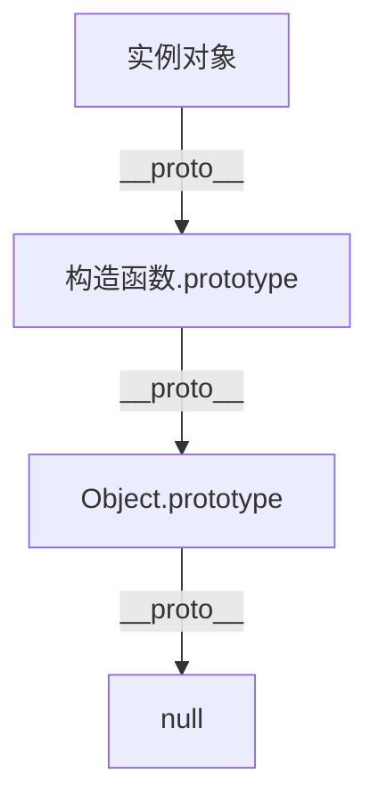

# JavaScript 原型详解

JavaScript 是一门基于原型的语言，而不是基于类的语言。这是它与 Java、C++ 等语言最大的区别之一。要掌握 JavaScript 的面向对象编程，理解原型(prototype)是至关重要的。本文将详细讲解 JavaScript 原型的概念、工作机制以及实际应用。

## 什么是原型？

在 JavaScript 中，每个对象都有一个内部链接指向另一个对象，称为它的"原型"。当你试图访问一个对象的属性时，如果这个对象本身没有这个属性，JavaScript 会自动去它的原型上查找，如果原型上也没有，则继续查找原型的原型，直到找到属性或达到原型链的末端（通常是 `Object.prototype`，其原型为 `null`）。

:::note
这种基于原型链的属性查找机制，是 JavaScript 实现继承的基础。
:::

## 原型的基本概念

### 对象与原型

在 JavaScript 中，几乎所有对象都是 `Object` 的实例，它们都从 `Object.prototype` 继承属性和方法。

```javascript
const obj = {};
console.log(obj.__proto__ === Object.prototype); // 输出: true
```

### 构造函数与原型对象

当我们创建一个函数时，JavaScript 会自动为这个函数创建一个 `prototype` 属性，这个属性指向一个对象，称为原型对象。

```javascript
function Person(name) {
  this.name = name;
}

// Person.prototype 是一个对象
console.log(typeof Person.prototype); // 输出: "object"
```

### 实例与原型的关系

当使用构造函数创建对象（实例）时，这个实例会有一个内部链接指向构造函数的原型对象。

```javascript
function Person(name) {
  this.name = name;
}

const alice = new Person("Alice");

// alice 的原型是 Person.prototype
console.log(alice.__proto__ === Person.prototype); // 输出: true
```

:::caution
`__proto__` 属性已被废弃，现代代码应该使用 `Object.getPrototypeOf()` 和 `Object.setPrototypeOf()` 方法。这里使用 `__proto__` 是为了更直观地理解原型链。
:::

## 原型链

当访问对象的属性时，JavaScript 引擎首先在对象本身查找，如果找不到，则沿着原型链向上查找。



### 示例代码

```javascript
function Person(name) {
  this.name = name;
}

Person.prototype.sayHello = function() {
  return `Hello, my name is ${this.name}`;
};

const alice = new Person("Alice");

console.log(alice.sayHello()); // 输出: "Hello, my name is Alice"
console.log(alice.toString()); // 输出: "[object Object]" (从 Object.prototype 继承)
```

在上面的例子中：
1. `alice` 对象没有 `sayHello` 方法，所以 JavaScript 在 `alice.__proto__`（即 `Person.prototype`）中查找
2. `alice` 对象也没有 `toString` 方法，在 `Person.prototype` 中也找不到，所以继续在 `Person.prototype.__proto__`（即 `Object.prototype`）中查找

## 原型的操作方法

### 读取原型

```javascript
// 推荐的方法
Object.getPrototypeOf(obj);

// 不推荐但更直观的方法
obj.__proto__;
```

### 设置原型

```javascript
// 创建时设置原型
const obj = Object.create(protoObj);

// 创建后修改原型（不推荐，影响性能）
Object.setPrototypeOf(obj, newProtoObj);
```

### 检测原型关系

```javascript
// 检查 protoObj 是否在 obj 的原型链上
Object.prototype.isPrototypeOf(obj);

// 检查 obj 是否由 Constructor 创建
obj instanceof Constructor;
```

## 原型继承的实现方式

### 通过构造函数

```javascript
function Animal(name) {
  this.name = name;
}

Animal.prototype.speak = function() {
  console.log(`${this.name} makes a noise.`);
};

function Dog(name, breed) {
  // 调用父类构造函数
  Animal.call(this, name);
  this.breed = breed;
}

// 设置 Dog.prototype 继承自 Animal.prototype
Dog.prototype = Object.create(Animal.prototype);
// 修复 constructor 属性
Dog.prototype.constructor = Dog;

// 重写继承的方法
Dog.prototype.speak = function() {
  console.log(`${this.name} barks.`);
};

// 添加 Dog 特有的方法
Dog.prototype.fetch = function() {
  console.log(`${this.name} fetches the ball.`);
};

const dog = new Dog("Rex", "German Shepherd");
dog.speak(); // 输出: "Rex barks."
dog.fetch(); // 输出: "Rex fetches the ball."
```

### 使用 ES6 类语法

```javascript
class Animal {
  constructor(name) {
    this.name = name;
  }
  
  speak() {
    console.log(`${this.name} makes a noise.`);
  }
}

class Dog extends Animal {
  constructor(name, breed) {
    super(name);
    this.breed = breed;
  }
  
  speak() {
    console.log(`${this.name} barks.`);
  }
  
  fetch() {
    console.log(`${this.name} fetches the ball.`);
  }
}

const dog = new Dog("Rex", "German Shepherd");
dog.speak(); // 输出: "Rex barks."
dog.fetch(); // 输出: "Rex fetches the ball."
```

:::tip
ES6 的类语法本质上仍是基于原型的继承，只是语法糖让代码看起来更像传统的基于类的继承。
:::

## 原型的实际应用案例

### 通过原型添加方法

为内置对象添加自定义方法是原型的常见应用场景，但要小心避免污染原型。

```javascript
// 为所有数组添加一个求和方法
Array.prototype.sum = function() {
  return this.reduce((total, current) => total + current, 0);
};

const numbers = [1, 2, 3, 4, 5];
console.log(numbers.sum()); // 输出: 15
```

### 实现混入(Mixin)模式

原型可以用来实现混入模式，将多个对象的功能组合到一个对象中。

```javascript
const canEat = {
  eat: function(food) {
    console.log(`Eating ${food}`);
  }
};

const canSleep = {
  sleep: function(hours) {
    console.log(`Sleeping for ${hours} hours`);
  }
};

function Person(name) {
  this.name = name;
}

// 混入方法
Object.assign(Person.prototype, canEat, canSleep);

const alice = new Person("Alice");
alice.eat("apple"); // 输出: "Eating apple"
alice.sleep(8); // 输出: "Sleeping for 8 hours"
```

### 实现单例模式

原型可以用来实现单例模式，确保一个类只有一个实例。

```javascript
const Singleton = (function() {
  let instance;
  
  function createInstance() {
    return {
      method: function() {
        console.log("I am a singleton instance");
      }
    };
  }
  
  return {
    getInstance: function() {
      if (!instance) {
        instance = createInstance();
      }
      return instance;
    }
  };
})();

const instance1 = Singleton.getInstance();
const instance2 = Singleton.getInstance();

console.log(instance1 === instance2); // 输出: true
```

## 原型使用中的常见问题

### 1. 属性共享问题

原型上的对象属性会被所有实例共享，这在处理引用类型时可能导致问题。

```javascript
function Person() {}
Person.prototype.friends = ["Alice", "Bob"];

const person1 = new Person();
const person2 = new Person();

person1.friends.push("Charlie");
console.log(person2.friends); // 输出: ["Alice", "Bob", "Charlie"]
```

:::warning
这可能导致意外行为！解决方案是将可变属性定义在构造函数中，而不是原型上。
:::

### 2. 原型链过长

原型链过长会影响属性查找的性能。尽量保持原型链简短。

### 3. 原型污染

修改内置对象的原型可能导致不可预期的结果，特别是在多人协作的项目中。

```javascript
// 危险的做法！
Object.prototype.customMethod = function() { /* ... */ };

// 现在所有对象都有这个方法，可能导致意外行为
const obj = {};
obj.customMethod(); // 有效，但可能与其他库冲突
```

## 总结

JavaScript 的原型机制是其面向对象编程的核心。通过原型链，JavaScript 实现了对象之间的属性继承。理解原型对于深入掌握 JavaScript 至关重要，它不仅是理解内置对象行为的基础，也是实现代码复用和设计模式的关键。

主要要点回顾：
- 每个 JavaScript 对象都有一个指向其原型的内部链接
- 原型链实现了属性的继承查找机制
- 构造函数通过 `prototype` 属性定义其创建的实例的原型
- ES6 类语法是基于原型继承的语法糖
- 通过原型可以实现各种设计模式

## 练习与延伸阅读

### 练习题

1. 实现一个基于原型的继承系统，创建 `Vehicle`、`Car` 和 `Truck` 类，其中 `Car` 和 `Truck` 继承自 `Vehicle`。

2. 不使用 ES6 类语法，实现一个带有私有属性的对象系统。

3. 解释并修复下面代码中的问题：
```javascript
function Widget() {}
Widget.prototype.options = {
  width: 100,
  height: 100
};

const widget1 = new Widget();
widget1.options.width = 200;

const widget2 = new Widget();
console.log(widget2.options.width); // 应该输出什么？为什么？如何修复？
```

### 延伸阅读

- [MDN Web Docs: 继承与原型链](https://developer.mozilla.org/zh-CN/docs/Web/JavaScript/Inheritance_and_the_prototype_chain)
- [JavaScript 高级程序设计（第4版）](https://www.ituring.com.cn/book/2472) 的原型和继承章节
- [You Don't Know JS: this & Object Prototypes](https://github.com/getify/You-Dont-Know-JS/tree/1st-ed/this%20%26%20object%20prototypes)

继续深入学习 JavaScript 的面向对象编程，将帮助你编写更清晰、更可维护的代码，并为学习现代 JavaScript 框架打下坚实基础。