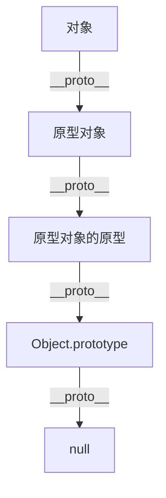

# JavaScript 继承方式

## 介绍

继承是面向对象编程的核心概念之一，它允许我们基于已有的类（在JavaScript中是构造函数或类）创建新类，新类可以重用、扩展或修改原有类的行为。在JavaScript中，继承的实现方式与传统的面向对象语言（如Java或C++）有所不同，这是因为JavaScript使用基于原型的继承模型，而不是基于类的继承模型。

本文将详细探讨JavaScript中的各种继承实现方式，从最基本的原型继承到ES6引入的`class`语法，帮助你理解JavaScript中继承的工作原理以及如何在实际开发中应用这些知识。

## JavaScript 中的继承基础

在深入各种继承方式之前，我们需要理解JavaScript中继承的基础 —— 原型链（prototype chain）。



在JavaScript中，每个对象都有一个内部链接指向另一个对象，称为它的原型。当试图访问一个对象的属性时，如果该对象本身没有这个属性，JavaScript会尝试在其原型对象上查找，如果原型对象也没有，则会继续查找原型的原型，以此类推，形成一个"原型链"，直到找到该属性或达到链的末端（通常是`Object.prototype`）。

## 1. 原型链继承

原型链继承是JavaScript中最基本的继承方式，直接将一个构造函数的原型设置为另一个构造函数的实例。

```javascript
// 父构造函数
function Animal(name) {
  this.name = name;
  this.colors = ["black", "white"];
}

// 为父构造函数添加方法
Animal.prototype.getName = function() {
  return this.name;
};

// 子构造函数
function Dog(name, breed) {
  this.breed = breed;
}

// 设置原型链，实现继承
Dog.prototype = new Animal();

// 添加子构造函数特有的方法
Dog.prototype.getBreed = function() {
  return this.breed;
};

// 创建实例并测试
const dog1 = new Dog("旺财", "拉布拉多");
console.log(dog1.getName()); // 输出: 旺财
console.log(dog1.getBreed()); // 输出: 拉布拉多
```

**优点：**
- 实现简单直接
- 子类可以继承父类的属性和方法

**缺点：**
- 引用类型的属性会被所有实例共享，一个实例修改会影响其他实例
- 创建子类实例时，无法向父类构造函数传参

让我们看看引用类型共享的问题：

```javascript
const dog1 = new Dog("旺财", "拉布拉多");
const dog2 = new Dog("小黑", "哈士奇");

dog1.colors.push("brown");
console.log(dog1.colors); // 输出: ["black", "white", "brown"]
console.log(dog2.colors); // 输出: ["black", "white", "brown"] (也被修改了)
```

## 2. 构造函数继承

为了解决原型链继承中引用类型共享的问题，我们可以使用构造函数继承。这种方式使用`call`或`apply`方法在子构造函数内部调用父构造函数。

```javascript
function Animal(name) {
  this.name = name;
  this.colors = ["black", "white"];
  
  // 直接在构造函数中定义方法（不推荐）
  this.getName = function() {
    return this.name;
  };
}

function Dog(name, breed) {
  // 调用父构造函数并绑定this
  Animal.call(this, name);
  this.breed = breed;
}

// 测试
const dog1 = new Dog("旺财", "拉布拉多");
const dog2 = new Dog("小黑", "哈士奇");

dog1.colors.push("brown");
console.log(dog1.colors); // 输出: ["black", "white", "brown"]
console.log(dog2.colors); // 输出: ["black", "white"] (未被修改)
```

**优点：**
- 解决了引用类型共享的问题
- 可以向父构造函数传参

**缺点：**
- 方法都在构造函数中定义，每次创建实例都会创建一遍方法
- 子类不能继承父类原型上的方法

## 3. 组合继承

组合继承结合了原型链继承和构造函数继承的优点，是JavaScript中最常用的继承模式之一。

```javascript
function Animal(name) {
  this.name = name;
  this.colors = ["black", "white"];
}

Animal.prototype.getName = function() {
  return this.name;
};

function Dog(name, breed) {
  // 第一次调用父构造函数
  Animal.call(this, name);
  this.breed = breed;
}

// 设置原型链
Dog.prototype = new Animal(); // 第二次调用父构造函数
// 修复constructor指向
Dog.prototype.constructor = Dog;

Dog.prototype.getBreed = function() {
  return this.breed;
};

// 测试
const dog1 = new Dog("旺财", "拉布拉多");
const dog2 = new Dog("小黑", "哈士奇");

dog1.colors.push("brown");
console.log(dog1.colors); // 输出: ["black", "white", "brown"]
console.log(dog2.colors); // 输出: ["black", "white"]
console.log(dog1.getName()); // 输出: 旺财
console.log(dog1 instanceof Animal); // 输出: true
console.log(dog1 instanceof Dog); // 输出: true
```

**优点：**
- 解决了引用类型共享问题
- 可以向父构造函数传参
- 复用了父类原型上的方法

**缺点：**
- 父构造函数被调用两次，浪费内存

## 4. 原型式继承

原型式继承的思想来自于Douglas Crockford，后来被标准化为`Object.create()`方法。这种方法适用于不需要创建构造函数但仍需要继承的情况。

```javascript
// 原型式继承函数
function createObject(proto) {
  function F() {}
  F.prototype = proto;
  return new F();
}

// ES5标准方法
// const createObject = Object.create;

const animal = {
  name: "动物",
  colors: ["black", "white"],
  getName: function() {
    return this.name;
  }
};

const dog = createObject(animal);
dog.name = "旺财";
dog.breed = "拉布拉多";

console.log(dog.getName()); // 输出: 旺财
console.log(dog.colors); // 输出: ["black", "white"]

// 引用类型属性仍然会共享
dog.colors.push("brown");
console.log(animal.colors); // 输出: ["black", "white", "brown"]
```

**优点：**
- 不需要构造函数即可实现继承
- 代码简洁

**缺点：**
- 引用类型属性会被所有实例共享

## 5. 寄生式继承

寄生式继承是原型式继承的增强版，创建一个仅用于封装继承过程的函数。

```javascript
function createAnother(original) {
  // 通过原型式继承创建新对象
  const clone = Object.create(original);
  
  // 增强这个对象
  clone.sayHi = function() {
    console.log("Hi!");
  };
  
  return clone;
}

const animal = {
  name: "动物",
  colors: ["black", "white"],
  getName: function() {
    return this.name;
  }
};

const dog = createAnother(animal);
dog.name = "旺财";
dog.sayHi(); // 输出: Hi!
console.log(dog.getName()); // 输出: 旺财
```

**优点：**
- 基于原型式继承，可以在不创建构造函数的情况下扩展对象功能

**缺点：**
- 方法无法复用，每次创建对象都会创建一遍方法
- 引用类型属性仍然会被共享

## 6. 寄生组合式继承

寄生组合式继承解决了组合继承调用两次父构造函数的问题，被认为是引入ES6之前最理想的继承范式。

```javascript
function inheritPrototype(subType, superType) {
  // 创建对象（浅复制父类原型）
  const prototype = Object.create(superType.prototype);
  // 增强对象（修复constructor指向）
  prototype.constructor = subType;
  // 指定对象（子类原型指向这个新对象）
  subType.prototype = prototype;
}

function Animal(name) {
  this.name = name;
  this.colors = ["black", "white"];
}

Animal.prototype.getName = function() {
  return this.name;
};

function Dog(name, breed) {
  Animal.call(this, name);
  this.breed = breed;
}

// 使用寄生组合式继承
inheritPrototype(Dog, Animal);

Dog.prototype.getBreed = function() {
  return this.breed;
};

// 测试
const dog1 = new Dog("旺财", "拉布拉多");
console.log(dog1.getName()); // 输出: 旺财
console.log(dog1.getBreed()); // 输出: 拉布拉多
console.log(dog1 instanceof Animal); // 输出: true
console.log(dog1 instanceof Dog); // 输出: true
```

**优点：**
- 只调用一次父构造函数
- 保留了原型链
- 能够向父构造函数传参
- 引用类型属性不会共享

**缺点：**
- 相对复杂，不如ES6的class语法直观

## 7. ES6 Class继承

ES6引入了`class`语法，使得JavaScript的继承更加清晰和易于理解。虽然底层仍然是基于原型的继承，但语法上更接近传统的面向对象编程。

```javascript
class Animal {
  constructor(name) {
    this.name = name;
    this.colors = ["black", "white"];
  }
  
  getName() {
    return this.name;
  }
}

class Dog extends Animal {
  constructor(name, breed) {
    // 调用父类构造函数
    super(name);
    this.breed = breed;
  }
  
  getBreed() {
    return this.breed;
  }
  
  // 重写父类方法
  getName() {
    return `Dog name: ${super.getName()}`;
  }
}

// 测试
const dog = new Dog("旺财", "拉布拉多");
console.log(dog.getName()); // 输出: Dog name: 旺财
console.log(dog.getBreed()); // 输出: 拉布拉多
```

:::note
`super` 关键字既可以当作函数使用，也可以当作对象使用：
- 作为函数调用时，代表父类的构造函数
- 作为对象时，在普通方法中指向父类的原型对象，在静态方法中指向父类
:::

**优点：**
- 语法简洁清晰，更接近传统面向对象
- 继承机制完善，底层实现类似寄生组合继承
- 有明确的构造函数、静态方法和实例方法

## 实际应用案例

### 游戏角色继承系统

以下是一个简单的游戏角色继承系统的例子，展示如何使用ES6类继承实现游戏中的不同角色：

```javascript
// 基础角色类
class Character {
  constructor(name, health, power) {
    this.name = name;
    this.health = health;
    this.power = power;
    this.alive = true;
  }
  
  attack(target) {
    if (!this.alive) return;
    console.log(`${this.name} 攻击 ${target.name}，造成 ${this.power} 点伤害`);
    target.takeDamage(this.power);
  }
  
  takeDamage(amount) {
    this.health -= amount;
    console.log(`${this.name} 受到 ${amount} 点伤害，剩余生命值: ${this.health}`);
    
    if (this.health <= 0) {
      this.die();
    }
  }
  
  die() {
    this.alive = false;
    console.log(`${this.name} 已阵亡`);
  }
}

// 战士类
class Warrior extends Character {
  constructor(name) {
    super(name, 200, 50);
    this.shield = 20;
  }
  
  takeDamage(amount) {
    const actualDamage = Math.max(amount - this.shield, 0);
    console.log(`${this.name} 的盾牌抵挡了 ${amount - actualDamage} 点伤害`);
    super.takeDamage(actualDamage);
  }
}

// 法师类
class Mage extends Character {
  constructor(name) {
    super(name, 100, 80);
    this.mana = 100;
  }
  
  castSpell(target) {
    if (this.mana >= 20) {
      this.mana -= 20;
      console.log(`${this.name} 对 ${target.name} 施放法术，造成 ${this.power * 1.5} 点伤害`);
      target.takeDamage(this.power * 1.5);
      console.log(`${this.name} 剩余魔法值: ${this.mana}`);
    } else {
      console.log(`${this.name} 魔法值不足，无法施法`);
    }
  }
}

// 实际使用
const warrior = new Warrior("亚瑟");
const mage = new Mage("安琪拉");

warrior.attack(mage);
mage.castSpell(warrior);
warrior.attack(mage);
mage.castSpell(warrior);
```

输出类似：
```
亚瑟 攻击 安琪拉，造成 50 点伤害
安琪拉 受到 50 点伤害，剩余生命值: 50
安琪拉 对 亚瑟 施放法术，造成 120 点伤害
亚瑟 的盾牌抵挡了 20 点伤害
亚瑟 受到 100 点伤害，剩余生命值: 100
安琪拉 剩余魔法值: 80
亚瑟 攻击 安琪拉，造成 50 点伤害
安琪拉 受到 50 点伤害，剩余生命值: 0
安琪拉 已阵亡
```

这个例子展示了如何使用继承实现游戏中不同角色的特性，每个子类都继承了基类的基本功能，同时添加或重写了特定于自己的方法和属性。

## 总结

JavaScript提供了多种实现继承的方式，每种方式都有其优缺点：

1. **原型链继承** - 简单但有引用类型共享问题
2. **构造函数继承** - 解决共享问题但方法不能复用
3. **组合继承** - 结合前两种方式但调用父构造函数两次
4. **原型式继承** - 适用于不需要构造函数的情况
5. **寄生式继承** - 原型式继承的增强版
6. **寄生组合继承** - 最理想的传统继承方式
7. **ES6 Class继承** - 现代JavaScript推荐的继承方式

在实际开发中：
- 对于简单场景或需要轻量级继承，可以考虑使用原型式继承或Object.create()
- 对于复杂应用，推荐使用ES6的class语法
- 理解原型链对于理解JavaScript的继承机制至关重要

### 练习题

1. 创建一个`Vehicle`基类，包含`brand`和`speed`属性，以及`accelerate`方法。然后创建`Car`和`Bicycle`子类，各自实现不同的加速逻辑。

2. 实现一个简单的"形状"继承层次结构，包括`Shape`基类，以及`Circle`、`Rectangle`、`Triangle`子类，每个类都应该能够计算自己的面积和周长。

3. 分别使用原型链继承、组合继承和ES6 class语法实现同一个继承关系，比较它们的异同。

### 扩展资源

- [MDN Web Docs: Inheritance and the prototype chain](https://developer.mozilla.org/en-US/docs/Web/JavaScript/Inheritance_and_the_prototype_chain)
- [MDN Web Docs: Classes](https://developer.mozilla.org/en-US/docs/Web/JavaScript/Reference/Classes)
- 《JavaScript高级程序设计》第6章：面向对象的程序设计

通过掌握这些继承方式，你将能够更好地组织代码结构，提高代码复用性，同时深入理解JavaScript面向对象编程的核心概念。