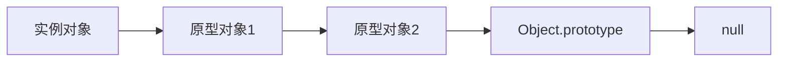

# JavaScript 原型继承

## 什么是原型继承？

在JavaScript中，原型继承是实现对象之间代码共享和属性继承的核心机制。与传统的基于类的继承不同，JavaScript使用原型链来实现继承功能。这种基于原型的继承模式也是JavaScript面向对象编程的基础。

:::note
JavaScript在ES6之前没有类的概念，尽管ES6引入了`class`关键字，但这只是语法糖，背后仍然使用原型继承机制。
:::

## 原型链的基本概念

JavaScript中的每个对象都有一个内部链接指向另一个对象，称为它的原型（prototype）。这个原型对象也有自己的原型，以此类推，形成了所谓的"原型链"。



当你尝试访问一个对象的属性时，如果该对象本身没有这个属性，JavaScript会沿着原型链向上查找，直到找到该属性或到达原型链的末端（`null`）。

## 理解`__proto__`和`prototype`

在JavaScript中，理解以下两个关键概念至关重要：

1. `prototype`属性: 函数对象特有的属性，指向一个对象，这个对象将作为使用该函数作为构造函数创建的所有实例的原型。

2. `__proto__`属性: 每个JavaScript对象都有这个内部属性（在现代浏览器中可以访问，但不是标准属性），指向该对象的原型。

让我们通过代码来理解这两个概念：

```javascript
// 定义一个构造函数
function Animal(name) {
  this.name = name;
}

// 在原型上添加方法
Animal.prototype.sayHello = function() {
  console.log(`Hello, I'm ${this.name}`);
};

// 创建一个实例
const cat = new Animal('Whiskers');

// 调用原型上的方法
cat.sayHello(); // 输出: Hello, I'm Whiskers

// 验证原型关系
console.log(cat.__proto__ === Animal.prototype); // 输出: true
console.log(Animal.prototype.__proto__ === Object.prototype); // 输出: true
console.log(Object.prototype.__proto__ === null); // 输出: true
```

## 实现继承的方法

### 1. 原型链继承

最基本的继承方法是通过将一个构造函数的`prototype`属性设置为另一个构造函数的实例：

```javascript
function Animal(name) {
  this.name = name;
}

Animal.prototype.eat = function() {
  console.log(`${this.name} is eating.`);
};

function Dog(name, breed) {
  Animal.call(this, name); // 继承属性
  this.breed = breed;
}

// 实现原型继承
Dog.prototype = new Animal(); // Dog.prototype现在是Animal的实例
Dog.prototype.constructor = Dog; // 修复constructor属性

Dog.prototype.bark = function() {
  console.log('Woof! Woof!');
};

const myDog = new Dog('Rex', 'German Shepherd');
myDog.eat(); // 输出: Rex is eating.
myDog.bark(); // 输出: Woof! Woof!
```

:::caution
这种方法的问题是：创建`Dog.prototype`时会调用`Animal`构造函数，可能导致不必要的副作用。
:::

### 2. Object.create()方法

ES5引入的`Object.create()`方法提供了一种更清晰的方式来实现原型继承：

```javascript
function Animal(name) {
  this.name = name;
}

Animal.prototype.eat = function() {
  console.log(`${this.name} is eating.`);
};

function Dog(name, breed) {
  Animal.call(this, name); // 继承属性
  this.breed = breed;
}

// 使用Object.create()实现继承
Dog.prototype = Object.create(Animal.prototype);
Dog.prototype.constructor = Dog;

Dog.prototype.bark = function() {
  console.log('Woof! Woof!');
};

const myDog = new Dog('Rex', 'German Shepherd');
myDog.eat(); // 输出: Rex is eating.
myDog.bark(); // 输出: Woof! Woof!
```

### 3. ES6类语法

ES6引入了`class`关键字，使继承看起来更像传统的基于类的继承，但底层仍然是原型继承：

```javascript
class Animal {
  constructor(name) {
    this.name = name;
  }
  
  eat() {
    console.log(`${this.name} is eating.`);
  }
}

class Dog extends Animal {
  constructor(name, breed) {
    super(name); // 调用父类构造函数
    this.breed = breed;
  }
  
  bark() {
    console.log('Woof! Woof!');
  }
}

const myDog = new Dog('Rex', 'German Shepherd');
myDog.eat(); // 输出: Rex is eating.
myDog.bark(); // 输出: Woof! Woof!
```

## 原型继承的特点

1. **动态性**: 原型对象的修改会反映到所有基于该原型的对象上。
   
   ```javascript
   function Person() {}
   Person.prototype.species = 'Human';
   
   const person1 = new Person();
   const person2 = new Person();
   
   console.log(person1.species); // 输出: Human
   
   // 修改原型
   Person.prototype.species = 'Homo Sapiens';
   
   console.log(person1.species); // 输出: Homo Sapiens
   console.log(person2.species); // 输出: Homo Sapiens
   ```

2. **属性查找机制**: 实例属性优先于原型属性。
   
   ```javascript
   function Person() {}
   Person.prototype.name = 'Default';
   
   const person = new Person();
   console.log(person.name); // 输出: Default
   
   person.name = 'John';
   console.log(person.name); // 输出: John（实例属性覆盖了原型属性）
   ```

3. **原型链是单向的**: 对象可以继承原型的属性，但对象的修改不会影响原型。

## 实际应用案例：创建自定义数组类型

让我们创建一个扩展JavaScript原生Array功能的MyArray类：

```javascript
function MyArray() {
  // 借用Array构造函数初始化
  Array.apply(this, arguments);
}

// 设置原型链
MyArray.prototype = Object.create(Array.prototype);
MyArray.prototype.constructor = MyArray;

// 添加新方法
MyArray.prototype.sum = function() {
  return this.reduce((total, current) => total + current, 0);
};

MyArray.prototype.average = function() {
  return this.sum() / this.length;
};

// 使用我们的自定义数组
const numbers = new MyArray(1, 2, 3, 4, 5);
console.log(numbers.sum()); // 输出: 15
console.log(numbers.average()); // 输出: 3
```

:::warning
这个例子在某些JavaScript环境中可能不完全按预期工作，因为Array有特殊的内部实现。但它很好地说明了原型继承的概念。
:::

## 常见的问题和最佳实践

### 问题：原型污染

如果我们修改内置对象的原型（如`Object.prototype`），会影响所有JavaScript对象，这称为"原型污染"。

```javascript
// 不推荐这样做！
Object.prototype.customMethod = function() {
  console.log('This affects all objects!');
};

const obj = {};
obj.customMethod(); // 所有对象现在都有这个方法
```

### 最佳实践

1. **避免修改内置对象的原型**：这可能导致名称冲突和意外行为。

2. **使用Object.create(null)创建无原型对象**：当你需要纯粹的数据存储对象时。
   
   ```javascript
   const dict = Object.create(null);
   // dict没有继承任何属性，甚至没有toString和valueOf
   ```

3. **使用类语法**：ES6类语法使代码更易读、更易维护。

4. **使用组合而非继承**：在许多情况下，组合比继承更灵活。
   
   ```javascript
   // 组合示例
   function createPerson(name) {
     return {
       name,
       greet() {
         console.log(`Hello, I'm ${this.name}`);
       }
     };
   }
   
   function createEmployee(name, role) {
     const person = createPerson(name);
     return {
       ...person,
       role,
       work() {
         console.log(`${this.name} is working as a ${this.role}`);
       }
     };
   }
   
   const employee = createEmployee('John', 'Developer');
   employee.greet(); // 输出: Hello, I'm John
   employee.work(); // 输出: John is working as a Developer
   ```

## 总结

JavaScript的原型继承是其面向对象编程的基础，尽管与传统的基于类的继承有所不同，但它提供了强大而灵活的方法来共享代码和实现对象之间的继承关系。

通过理解原型链、`prototype`和`__proto__`属性，以及如何正确设置原型继承，你可以有效地利用JavaScript的这一核心特性来构建复杂的对象系统。

随着ES6类语法的引入，继承在JavaScript中变得更加直观，但了解底层的原型继承机制仍然至关重要，这有助于你更深入地理解JavaScript的工作方式并编写更优化的代码。

## 练习

1. 创建一个`Shape`基类和继承它的`Circle`和`Rectangle`类。每个类应该有适当的属性和计算面积的方法。

2. 实现一个简单的对象继承系统，不使用ES6类语法，确保正确设置原型链。

3. 修改内置`String`原型，添加一个`reverse`方法，然后思考这种做法的利弊。

## 进一步学习资源

- MDN Web文档: [继承与原型链](https://developer.mozilla.org/zh-CN/docs/Web/JavaScript/Inheritance_and_the_prototype_chain)
- 《JavaScript高级程序设计》中关于原型和继承的章节
- [JavaScript.info](https://javascript.info/)网站上的原型教程

通过这些资源和实践，你将能够掌握JavaScript原型继承的精髓，并在实际项目中有效地应用它。