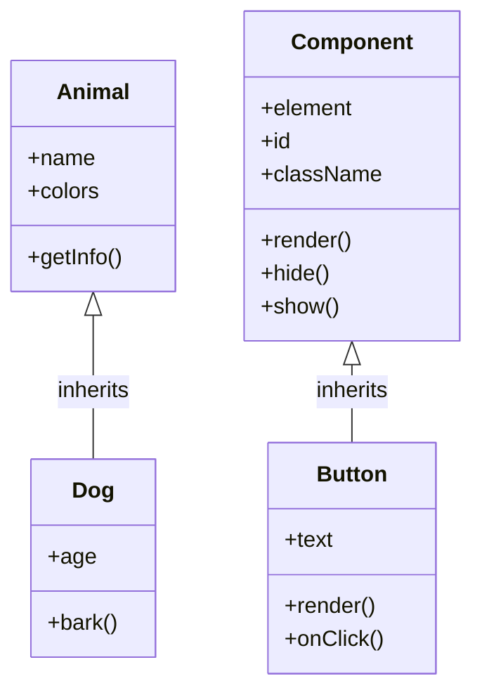

# JavaScript 构造函数继承

在JavaScript面向对象编程中，继承是一个核心概念，它允许我们创建基于已有类的新类，从而实现代码复用和层次化设计。尽管ES6引入了`class`和`extends`关键字使继承变得更加直观，但理解构造函数继承的传统方式对于全面掌握JavaScript至关重要。

## 什么是构造函数继承？

构造函数继承是在JavaScript中实现类继承的经典方式。通过这种方式，我们可以让一个构造函数"继承"另一个构造函数的属性和方法，从而创建类似于类继承的效果。

在深入细节之前，让我们先回顾一下构造函数的基本概念：

```javascript
function Person(name, age) {
  this.name = name;
  this.age = age;
  this.sayHello = function() {
    console.log(`Hello, my name is ${this.name}`);
  };
}

const person1 = new Person('Alice', 25);
person1.sayHello(); // 输出: Hello, my name is Alice
```

现在，我们将探讨如何让一个构造函数继承另一个构造函数的特性。

## JavaScript 中的继承方式

在JavaScript中实现构造函数继承的方法有多种，下面我们将逐一介绍并分析它们的优缺点。

### 1. 原型链继承

原型链继承是最基本的继承方式，通过将父构造函数的实例赋值给子构造函数的原型来实现。

```javascript
// 父构造函数
function Animal(name) {
  this.name = name;
  this.colors = ['black', 'white'];
}

Animal.prototype.getInfo = function() {
  return `This is ${this.name}`;
};

// 子构造函数
function Dog(age) {
  this.age = age;
}

// 设置继承关系
Dog.prototype = new Animal('Dog');
Dog.prototype.constructor = Dog;  // 修正constructor指向

// 创建实例并测试
const dog1 = new Dog(3);
console.log(dog1.name);       // 输出: Dog
console.log(dog1.getInfo());  // 输出: This is Dog
console.log(dog1.colors);     // 输出: ['black', 'white']

// 修改继承的引用类型属性
dog1.colors.push('brown');

// 创建另一个实例
const dog2 = new Dog(5);
console.log(dog2.colors);     // 输出: ['black', 'white', 'brown'] (共享引用!)
```

**优点**：
- 实现简单
- 子类可以访问父类原型上的方法

**缺点**：
- 所有实例共享引用类型的属性，一个实例修改会影响所有实例
- 无法向父构造函数传递参数

### 2. 借用构造函数继承

这种方式通过在子构造函数内部调用父构造函数（使用call或apply）来实现属性继承。

```javascript
function Animal(name) {
  this.name = name;
  this.colors = ['black', 'white'];
}

Animal.prototype.getInfo = function() {
  return `This is ${this.name}`;
};

function Dog(name, age) {
  // 调用父构造函数
  Animal.call(this, name);
  this.age = age;
}

const dog1 = new Dog('Buddy', 3);
console.log(dog1.name);    // 输出: Buddy
console.log(dog1.colors);  // 输出: ['black', 'white']

// 修改colors数组
dog1.colors.push('brown');

// 创建另一个实例
const dog2 = new Dog('Max', 5);
console.log(dog2.colors);  // 输出: ['black', 'white'] (不受dog1的影响)

// 但是无法访问父构造函数原型上的方法
console.log(dog1.getInfo); // 输出: undefined
```

**优点**：
- 可以向父构造函数传参
- 避免了引用类型属性被所有实例共享的问题

**缺点**：
- 无法继承父类原型上的方法和属性
- 方法在每个实例上都会重新创建，无法复用

### 3. 组合继承

组合继承结合了原型链继承和借用构造函数继承的优点，是JavaScript中最常用的继承模式之一。

```javascript
function Animal(name) {
  this.name = name;
  this.colors = ['black', 'white'];
}

Animal.prototype.getInfo = function() {
  return `This is ${this.name}`;
};

function Dog(name, age) {
  // 借用构造函数继承属性
  Animal.call(this, name);
  this.age = age;
}

// 原型链继承方法
Dog.prototype = new Animal();
Dog.prototype.constructor = Dog;

// 在子类原型上添加方法
Dog.prototype.bark = function() {
  return 'Woof!';
};

const dog1 = new Dog('Buddy', 3);
console.log(dog1.name);         // 输出: Buddy
console.log(dog1.getInfo());    // 输出: This is Buddy
console.log(dog1.bark());       // 输出: Woof!

dog1.colors.push('brown');
const dog2 = new Dog('Max', 5);
console.log(dog2.colors);       // 输出: ['black', 'white'] (不受dog1的影响)
```

**优点**：
- 继承了父类的属性和方法
- 允许每个实例拥有自己的属性
- 可以向父构造函数传参

**缺点**：
- 调用了两次父构造函数：一次在创建子类原型时，一次在子类构造函数内部

### 4. 寄生组合继承

寄生组合继承是对组合继承的优化，通过创建父类原型的副本并将其赋给子类原型，避免了调用父类构造函数两次的问题。

```javascript
function Animal(name) {
  this.name = name;
  this.colors = ['black', 'white'];
}

Animal.prototype.getInfo = function() {
  return `This is ${this.name}`;
};

function Dog(name, age) {
  Animal.call(this, name);
  this.age = age;
}

// 创建一个继承函数
function inheritPrototype(child, parent) {
  // 创建父类原型的副本
  const prototype = Object.create(parent.prototype);
  // 重置constructor属性
  prototype.constructor = child;
  // 将新创建的对象赋值给子类的原型
  child.prototype = prototype;
}

// 实现继承
inheritPrototype(Dog, Animal);

// 添加子类特有方法
Dog.prototype.bark = function() {
  return 'Woof!';
};

const dog = new Dog('Rex', 4);
console.log(dog.name);       // 输出: Rex
console.log(dog.getInfo());  // 输出: This is Rex
console.log(dog.bark());     // 输出: Woof!
```

**优点**：
- 只调用一次父构造函数
- 避免了在子类原型上创建不必要的属性
- 保持了原型链
- 效率最高的继承方式

:::tip
寄生组合继承被认为是引入ES6类语法前，实现JavaScript继承的最佳模式。
:::

## 实际应用案例：创建UI组件库

让我们来看一个实际应用案例，创建一个简单的UI组件库，展示构造函数继承的实用性。

```javascript
// 基础组件构造函数
function Component(id, className) {
  this.element = null;
  this.id = id;
  this.className = className;
}

// 基础组件方法
Component.prototype.render = function() {
  this.element = document.createElement('div');
  this.element.id = this.id;
  this.element.className = this.className;
  document.body.appendChild(this.element);
  return this.element;
};

Component.prototype.hide = function() {
  if (this.element) {
    this.element.style.display = 'none';
  }
};

Component.prototype.show = function() {
  if (this.element) {
    this.element.style.display = 'block';
  }
};

// 按钮组件
function Button(id, className, text) {
  // 继承Component属性
  Component.call(this, id, className);
  this.text = text;
}

// 继承Component方法
inheritPrototype(Button, Component);

// 重写render方法
Button.prototype.render = function() {
  this.element = document.createElement('button');
  this.element.id = this.id;
  this.element.className = this.className;
  this.element.textContent = this.text;
  
  // 添加默认点击事件
  this.element.addEventListener('click', this.onClick.bind(this));
  
  document.body.appendChild(this.element);
  return this.element;
};

// 添加Button特有方法
Button.prototype.onClick = function() {
  console.log('Button clicked!');
};

// 使用示例
const mainButton = new Button('main-btn', 'btn primary', 'Click Me');
mainButton.render();
```

在这个例子中：

1. 我们创建了一个基础的`Component`构造函数，定义了所有UI组件共有的属性和方法
2. 然后创建一个特定的`Button`组件，通过寄生组合继承方式继承`Component`
3. `Button`组件重写了`render`方法以提供按钮特定的实现，并添加了自己特有的方法
4. 最后通过实例化创建了一个实际的按钮元素

这种设计允许我们轻松扩展组件库，添加更多组件类型如`Input`、`Modal`等，它们都可以从基础`Component`继承通用功能。

## 继承结构的可视化

以下是JavaScript构造函数继承关系的简化表示：



## ES6 类继承与构造函数继承的比较

ES6引入了`class`语法，使JavaScript的继承更加直观，下面是使用ES6类实现的相同继承结构：

```javascript
// 使用ES6类语法
class Animal {
  constructor(name) {
    this.name = name;
    this.colors = ['black', 'white'];
  }
  
  getInfo() {
    return `This is ${this.name}`;
  }
}

class Dog extends Animal {
  constructor(name, age) {
    super(name);  // 调用父类构造函数
    this.age = age;
  }
  
  bark() {
    return 'Woof!';
  }
}

const dog = new Dog('Rex', 4);
console.log(dog.getInfo());  // 输出: This is Rex
```

尽管ES6类语法更简洁直观，但实际上它只是构造函数继承的语法糖。理解传统的构造函数继承有助于我们更深入地理解JavaScript的原型继承机制。

:::caution
ES6类语法不是完全新的继承模型，而是基于原型的继承模式的语法糖。在底层，JavaScript仍然使用原型链来实现继承。
:::

## 总结

JavaScript构造函数继承是面向对象编程中的重要概念。在本文中，我们学习了：

1. **原型链继承**：简单但有共享引用类型属性的问题
2. **借用构造函数继承**：解决了属性共享问题，但无法继承原型方法
3. **组合继承**：结合了前两种方法的优点，但调用了两次父构造函数
4. **寄生组合继承**：最优化的继承方式，避免了重复调用父构造函数

虽然现代JavaScript开发中我们更倾向于使用ES6的类继承语法，但理解这些传统的继承模式对于深入理解JavaScript的工作原理以及处理遗留代码仍然非常重要。

## 练习

为了巩固所学知识，尝试完成以下练习：

1. 创建一个`Vehicle`构造函数，包含`brand`和`speed`属性，以及`accelerate`方法。
2. 使用寄生组合继承创建`Car`构造函数，继承`Vehicle`，并添加`wheels`属性和`honk`方法。
3. 使用ES6类语法重写上述继承结构。
4. 扩展UI组件库示例，添加一个`Input`组件，继承自`Component`。

## 附加资源

- MDN Web文档: [继承与原型链](https://developer.mozilla.org/zh-CN/docs/Web/JavaScript/Inheritance_and_the_prototype_chain)
- JavaScript高级程序设计（第4版）：深入讲解了JavaScript的继承模式
- You Don't Know JS系列：提供了JavaScript原型和继承的深入解析

通过掌握JavaScript构造函数继承，你将能够更好地理解JavaScript的面向对象特性，为学习现代前端框架和库打下坚实基础。