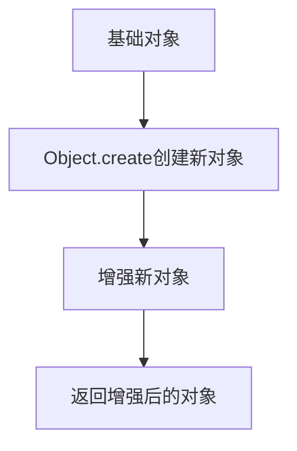

# JavaScript 寄生继承

## 什么是寄生继承

寄生继承是JavaScript中一种创造性的继承模式，它结合了原型式继承和工厂模式的优点。这种模式主要通过在一个函数内部"寄生"于另一个对象之上，创建一个新对象并对其进行增强，然后返回这个增强后的对象。

寄生继承的核心思想是：**利用一个对象作为新对象的基础，然后增强这个新对象，添加新的方法和属性**。

:::note
寄生继承在Douglas Crockford的文章中首次提出，是JavaScript继承模式中一种重要的设计模式。
:::

## 寄生继承的基本实现

寄生继承的基本实现步骤如下：

1. 创建一个用于封装继承过程的函数
2. 在函数内部创建一个新对象（通常基于现有对象）
3. 为新对象添加属性和方法，增强其功能
4. 返回这个新对象

下面是一个简单的寄生继承示例：

```javascript
// 原型对象
const person = {
    name: "Anonymous",
    sayHello: function() {
        console.log(`Hello, my name is ${this.name}`);
    }
};

// 寄生继承函数
function createStudent(name, subject) {
    // 基于person对象创建一个新对象
    const student = Object.create(person);
    
    // 增强这个对象
    student.name = name;
    student.subject = subject;
    student.study = function() {
        console.log(`${this.name} is studying ${this.subject}`);
    };
    
    return student;
}

// 使用寄生继承创建对象
const student1 = createStudent("Alice", "Computer Science");
student1.sayHello(); // 输出: Hello, my name is Alice
student1.study(); // 输出: Alice is studying Computer Science
```

在这个例子中：
- 我们有一个基础对象 `person`
- 通过 `createStudent` 函数实现寄生继承
- 新创建的 `student` 对象不仅继承了 `person` 的属性和方法，还拥有自己的属性和方法

## 寄生继承的实现原理

让我们深入理解寄生继承的工作原理：



寄生继承通常与原型式继承搭配使用，因为原型式继承提供了一个简单的方法来创建一个新对象，该对象以另一个对象为原型。在JavaScript中，`Object.create()` 方法是实现这一点的常用方式。

## 寄生继承的应用场景

寄生继承在以下场景特别有用：

1. **需要在不使用构造函数的情况下实现继承**
2. **需要在继承的同时增强对象**
3. **需要基于已有对象创建特定类型的对象**

### 实际应用案例

#### 创建特定类型的UI组件

```javascript
// 基础UI组件
const UIComponent = {
    render: function() {
        console.log("Rendering component...");
        this.onRender();
    },
    onRender: function() {
        console.log("Component rendered");
    }
};

// 使用寄生继承创建Button组件
function createButton(text, onClick) {
    const button = Object.create(UIComponent);
    
    button.text = text;
    button.onClick = onClick;
    button.onRender = function() {
        console.log(`Button with text "${this.text}" rendered`);
    };
    button.click = function() {
        console.log(`Button "${this.text}" clicked`);
        this.onClick && this.onClick();
    };
    
    return button;
}

const submitButton = createButton("Submit", function() {
    console.log("Form submitted!");
});

submitButton.render();
// 输出:
// Rendering component...
// Button with text "Submit" rendered

submitButton.click();
// 输出:
// Button "Submit" clicked
// Form submitted!
```

#### 创建具有特定功能的数据处理对象

```javascript
// 基础数据处理器
const DataProcessor = {
    process: function(data) {
        const result = this.preProcess(data);
        console.log("Processing data...");
        return this.postProcess(result);
    },
    preProcess: function(data) {
        return data;
    },
    postProcess: function(data) {
        return data;
    }
};

// 使用寄生继承创建JSON数据处理器
function createJSONProcessor() {
    const processor = Object.create(DataProcessor);
    
    processor.preProcess = function(data) {
        console.log("Parsing JSON...");
        return typeof data === 'string' ? JSON.parse(data) : data;
    };
    
    processor.postProcess = function(data) {
        console.log("Converting back to JSON...");
        return JSON.stringify(data);
    };
    
    return processor;
}

const jsonProcessor = createJSONProcessor();
const result = jsonProcessor.process('{"name":"John","age":30}');
console.log(result); // 输出: {"name":"John","age":30}
```

## 寄生继承的优缺点

### 优点

1. **灵活性高** - 可以根据需要自由添加功能和属性
2. **无需构造函数** - 不依赖于构造函数和 `new` 关键字
3. **可以基于任何对象继承** - 不限于构造函数的原型
4. **封装性好** - 继承和增强的过程被封装在工厂函数内部

### 缺点

1. **方法重用性差** - 每个对象的方法都会被重新创建，无法复用
2. **内存占用高** - 由于方法无法复用，可能导致更高的内存占用
3. **无法通过 `instanceof` 确定对象类型** - 因为没有使用构造函数
4. **难以进行进一步扩展** - 无法方便地建立多层次的继承关系

:::warning
寄生继承创建的对象方法无法复用，每次创建对象时都会创建新的方法副本，这在创建大量对象时可能导致性能问题。
:::

## 寄生组合继承

为了解决寄生继承的一些缺点，开发者常常使用寄生组合继承模式，这是一种更高效的JavaScript继承模式。

寄生组合继承结合了寄生继承和组合继承的优点：

```javascript
function inheritPrototype(subType, superType) {
    const prototype = Object.create(superType.prototype); // 创建对象
    prototype.constructor = subType; // 增强对象
    subType.prototype = prototype; // 指定对象
}

function Parent(name) {
    this.name = name;
    this.colors = ["red", "blue", "green"];
}

Parent.prototype.sayName = function() {
    console.log(this.name);
};

function Child(name, age) {
    Parent.call(this, name); // 借用构造函数实现属性继承
    this.age = age;
}

// 使用寄生式继承实现原型继承
inheritPrototype(Child, Parent);

// 添加子类自己的方法
Child.prototype.sayAge = function() {
    console.log(this.age);
};

const child1 = new Child("Nicholas", 29);
child1.sayName(); // 输出: Nicholas
child1.sayAge(); // 输出: 29
```

## 总结

寄生继承是JavaScript中一种灵活的继承模式，特别适用于需要在继承的同时增强对象功能的场景。它结合了原型式继承和工厂模式，通过在一个函数内部创建并增强对象来实现继承。

寄生继承的主要优点是其灵活性和封装性，但也存在方法无法复用和内存占用高的缺点。在实际开发中，可以根据具体需求选择使用寄生继承，或者考虑使用寄生组合继承等更高效的模式。

## 练习与思考

1. 尝试使用寄生继承创建一个具有特定功能的日志记录器对象
2. 比较寄生继承和原型链继承的区别
3. 思考在什么场景下寄生继承比类继承更适合
4. 尝试实现一个结合寄生继承和工厂模式的设计模式

## 延伸阅读

- JavaScript高级程序设计（第4版）中关于寄生继承的章节
- Douglas Crockford关于JavaScript继承模式的文章
- ES6中的类继承与传统继承模式的比较