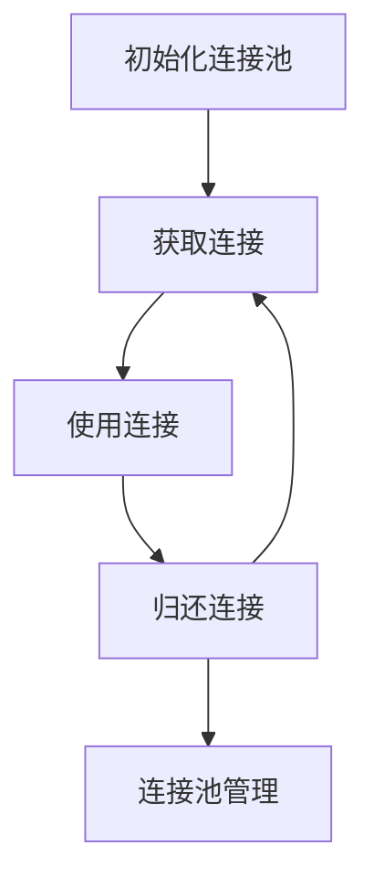

# PHP 连接池

在PHP开发中，数据库连接是应用程序与数据库交互的核心部分。然而，频繁地创建和销毁数据库连接会导致性能问题，尤其是在高并发场景下。为了解决这个问题，**连接池**应运而生。本文将详细介绍PHP连接池的概念、工作原理以及如何在实际项目中使用它。

## 什么是连接池？

连接池（Connection Pool）是一种用于管理数据库连接的技术。它通过预先创建一定数量的数据库连接，并将这些连接保存在一个“池”中，供应用程序重复使用。当应用程序需要与数据库交互时，可以从连接池中获取一个连接，使用完毕后将其归还到池中，而不是直接关闭连接。

连接池的主要优点包括：
- **减少连接创建和销毁的开销**：频繁创建和销毁连接会消耗大量资源，连接池可以避免这种开销。
- **提高性能**：通过复用连接，减少了数据库连接建立的时间，从而提高了应用程序的响应速度。
- **控制并发连接数**：连接池可以限制同时打开的连接数，避免数据库因连接过多而崩溃。

## PHP 连接池的工作原理

连接池的核心思想是**复用连接**。以下是连接池的基本工作流程：

1. **初始化连接池**：在应用程序启动时，创建一定数量的数据库连接，并将它们放入连接池中。
2. **获取连接**：当应用程序需要与数据库交互时，从连接池中获取一个可用的连接。
3. **使用连接**：应用程序使用该连接执行数据库操作。
4. **归还连接**：操作完成后，将连接归还到连接池中，而不是关闭它。
5. **连接池管理**：连接池会定期检查连接的状态，确保连接的有效性，并在必要时创建新的连接或关闭闲置的连接。



## PHP 连接池的实现

在PHP中，连接池的实现通常依赖于第三方库，例如 `Swoole` 或 `ReactPHP`。以下是一个使用 `Swoole` 实现连接池的简单示例：

```php
<?php
use Swoole\ConnectionPool;
use Swoole\Database\PDOConfig;
use Swoole\Database\PDOPool;

// 初始化连接池
$pool = new PDOPool(
    (new PDOConfig())
        ->withHost('127.0.0.1')
        ->withPort(3306)
        ->withDbName('test')
        ->withCharset('utf8mb4')
        ->withUsername('root')
        ->withPassword('password'),
    10 // 连接池大小
);

// 从连接池中获取连接
$pdo = $pool->get();

// 使用连接执行查询
$statement = $pdo->query('SELECT * FROM users');
$users = $statement->fetchAll(PDO::FETCH_ASSOC);

// 归还连接
$pool->put($pdo);

// 输出查询结果
print_r($users);
?>
```

### 代码解释：
1. **初始化连接池**：我们使用 `PDOPool` 类创建了一个包含10个连接的连接池。
2. **获取连接**：通过 `$pool->get()` 方法从连接池中获取一个可用的 `PDO` 连接。
3. **使用连接**：使用获取到的连接执行SQL查询。
4. **归还连接**：操作完成后，通过 `$pool->put($pdo)` 将连接归还到连接池中。

:::tip
在实际项目中，建议将连接池的初始化和管理封装到一个独立的类中，以便于维护和扩展。
:::

## 实际应用场景

连接池在高并发场景中尤为重要，例如：
- **Web应用**：当大量用户同时访问网站时，连接池可以显著减少数据库连接的开销。
- **API服务**：API服务通常需要频繁地与数据库交互，连接池可以提高服务的响应速度。
- **后台任务处理**：在处理大量后台任务时，连接池可以有效地管理数据库连接，避免资源浪费。

## 总结

连接池是一种优化数据库连接管理的技术，通过复用连接减少资源开销，提高应用程序的性能。在PHP中，可以使用 `Swoole` 等第三方库来实现连接池。对于高并发的应用场景，连接池是一个不可或缺的工具。

## 附加资源与练习

- **进一步学习**：可以阅读 `Swoole` 的官方文档，了解更多关于连接池的高级用法。
- **练习**：尝试在自己的项目中实现一个简单的连接池，并测试其在高并发场景下的性能表现。

:::caution
在使用连接池时，务必确保连接的归还操作，否则可能导致连接池耗尽，进而影响应用程序的正常运行。
:::