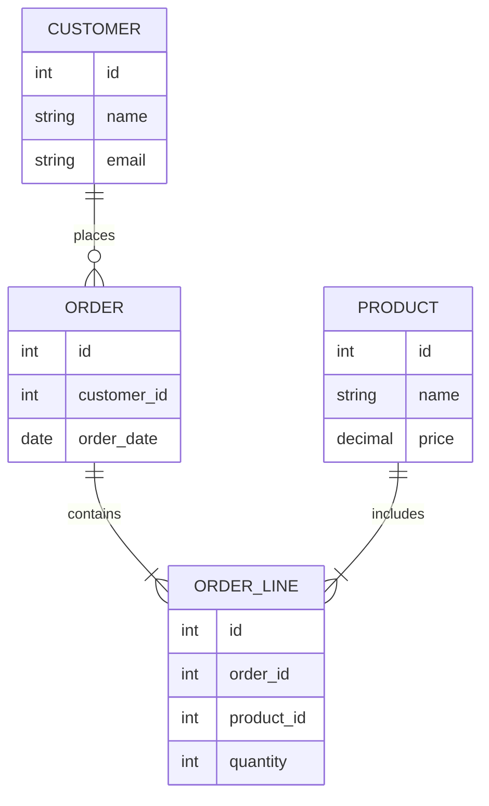

# PHP 数据库模式

在PHP开发中，数据库模式（Database Schema）是数据库结构的蓝图，它定义了数据库中的表、字段、关系以及约束条件。理解数据库模式对于设计高效、可维护的数据库至关重要。本文将逐步介绍PHP中的数据库模式，并通过实际案例帮助你掌握这一概念。

## 什么是数据库模式？

数据库模式是数据库的逻辑结构，它描述了数据库中数据的组织方式。模式通常包括以下内容：

- **表（Tables）**：存储数据的容器。
- **字段（Fields）**：表中的列，定义了数据的类型和约束。
- **关系（Relationships）**：表与表之间的关联，如一对一、一对多、多对多等。
- **约束（Constraints）**：如主键、外键、唯一性约束等，用于确保数据的完整性和一致性。

## 数据库模式的设计

设计数据库模式时，通常需要遵循以下步骤：

1. **需求分析**：明确应用程序需要存储哪些数据。
2. **概念设计**：绘制实体-关系图（ER图），确定实体及其关系。
3. **逻辑设计**：将概念设计转化为具体的表结构。
4. **物理设计**：优化表结构，考虑性能、存储等因素。

### 实体-关系图（ER图）

实体-关系图是数据库设计的可视化工具，用于表示实体及其关系。以下是一个简单的ER图示例：



在这个ER图中，`CUSTOMER`、`ORDER`、`ORDER_LINE`和`PRODUCT`是实体，它们之间的关系通过连线表示。

## 实际案例：在线商店的数据库模式

假设我们要为一个在线商店设计数据库模式，以下是可能的表结构：

```sql
CREATE TABLE customers (
    id INT AUTO_INCREMENT PRIMARY KEY,
    name VARCHAR(100) NOT NULL,
    email VARCHAR(100) UNIQUE NOT NULL
);

CREATE TABLE orders (
    id INT AUTO_INCREMENT PRIMARY KEY,
    customer_id INT,
    order_date DATE NOT NULL,
    FOREIGN KEY (customer_id) REFERENCES customers(id)
);

CREATE TABLE products (
    id INT AUTO_INCREMENT PRIMARY KEY,
    name VARCHAR(100) NOT NULL,
    price DECIMAL(10, 2) NOT NULL
);

CREATE TABLE order_lines (
    id INT AUTO_INCREMENT PRIMARY KEY,
    order_id INT,
    product_id INT,
    quantity INT NOT NULL,
    FOREIGN KEY (order_id) REFERENCES orders(id),
    FOREIGN KEY (product_id) REFERENCES products(id)
);
```

在这个案例中，我们定义了四个表：`customers`、`orders`、`products`和`order_lines`。每个表都有其主键和外键，以确保数据的完整性和一致性。

## 在PHP中操作数据库模式

在PHP中，我们可以使用PDO或MySQLi扩展来操作数据库模式。以下是一个使用PDO创建表的示例：

```php
<?php
$host = 'localhost';
$dbname = 'online_store';
$username = 'root';
$password = '';

try {
    $conn = new PDO("mysql:host=$host;dbname=$dbname", $username, $password);
    $conn->setAttribute(PDO::ATTR_ERRMODE, PDO::ERRMODE_EXCEPTION);

    // 创建customers表
    $sql = "CREATE TABLE customers (
                id INT AUTO_INCREMENT PRIMARY KEY,
                name VARCHAR(100) NOT NULL,
                email VARCHAR(100) UNIQUE NOT NULL
            )";
    $conn->exec($sql);
    echo "Table customers created successfully";
} catch(PDOException $e) {
    echo "Error creating table: " . $e->getMessage();
}

$conn = null;
?>
```

在这个示例中，我们使用PDO连接到数据库，并执行SQL语句来创建`customers`表。

## 总结

数据库模式是数据库设计的核心，它定义了数据的组织方式和关系。通过合理设计数据库模式，可以确保数据的一致性、完整性和高效性。在实际开发中，理解并应用数据库模式是每个PHP开发者必备的技能。

## 附加资源与练习

- **练习**：尝试为一个博客系统设计数据库模式，包括用户、文章、评论等表。
- **资源**：
  - [MySQL官方文档](https://dev.mysql.com/doc/)
  - [PHP PDO文档](https://www.php.net/manual/en/book.pdo.php)
  - [数据库设计教程](https://www.tutorialspoint.com/dbms/dbms_overview.htm)

通过不断练习和学习，你将能够设计出高效、可维护的数据库模式，为你的PHP应用程序打下坚实的基础。