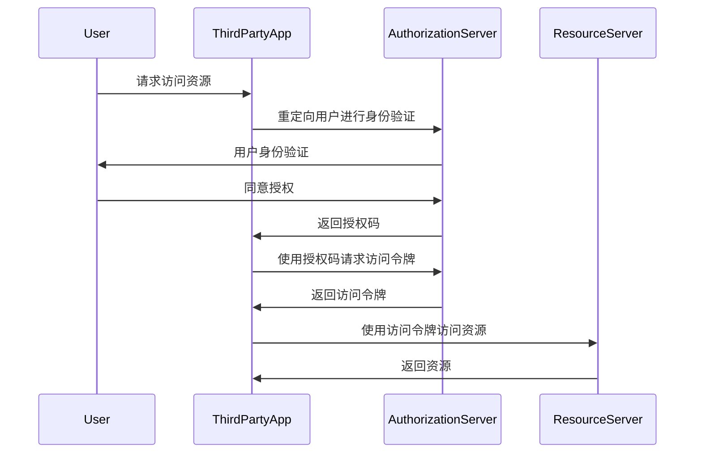

# PHP OAuth认证

OAuth（开放授权）是一种开放标准，允许用户在不共享密码的情况下，授权第三方应用访问其存储在另一服务提供者上的资源。OAuth广泛应用于社交媒体、云存储和其他需要用户授权的场景。本文将带你了解如何在PHP中实现OAuth认证。

## 什么是OAuth？

OAuth是一种授权框架，它允许用户授权第三方应用访问其资源，而无需共享其用户名和密码。OAuth的核心思想是通过令牌（Token）来授权，而不是直接使用用户的凭据。

### OAuth的工作原理

OAuth的工作流程通常涉及以下几个步骤：

1. **用户请求授权**：用户通过第三方应用请求访问资源。
2. **授权服务器验证用户身份**：用户被重定向到授权服务器进行身份验证。
3. **用户授权**：用户同意授权第三方应用访问其资源。
4. **获取访问令牌**：第三方应用从授权服务器获取访问令牌。
5. **访问资源**：第三方应用使用访问令牌访问用户的资源。



## 在PHP中实现OAuth认证

在PHP中，我们可以使用`league/oauth2-client`库来实现OAuth认证。首先，你需要通过Composer安装这个库：

```bash
composer require league/oauth2-client
```

### 示例：使用Google OAuth2进行认证

以下是一个使用Google OAuth2进行认证的示例：

```php
require 'vendor/autoload.php';

use League\OAuth2\Client\Provider\Google;

$provider = new Google([
    'clientId'     => 'YOUR_GOOGLE_CLIENT_ID',
    'clientSecret' => 'YOUR_GOOGLE_CLIENT_SECRET',
    'redirectUri'  => 'https://your-redirect-uri.com/callback',
]);

if (!isset($_GET['code'])) {
    // 如果没有授权码，重定向到Google进行授权
    $authUrl = $provider->getAuthorizationUrl();
    $_SESSION['oauth2state'] = $provider->getState();
    header('Location: ' . $authUrl);
    exit;

} elseif (empty($_GET['state']) || ($_GET['state'] !== $_SESSION['oauth2state'])) {
    // 检查state参数以防止CSRF攻击
    unset($_SESSION['oauth2state']);
    exit('Invalid state');

} else {
    // 获取访问令牌
    $token = $provider->getAccessToken('authorization_code', [
        'code' => $_GET['code']
    ]);

    // 使用访问令牌获取用户信息
    $user = $provider->getResourceOwner($token);

    // 输出用户信息
    echo 'Hello ' . $user->getName();
}
```

### 代码解释

1. **创建Provider对象**：我们使用`Google`类创建一个OAuth2 Provider对象，传入Google的客户端ID、客户端密钥和重定向URI。
2. **获取授权码**：如果请求中没有授权码，我们将用户重定向到Google的授权页面。
3. **验证state参数**：为了防止CSRF攻击，我们验证`state`参数是否与之前保存的值一致。
4. **获取访问令牌**：使用授权码从Google获取访问令牌。
5. **获取用户信息**：使用访问令牌获取用户的基本信息。

## 实际应用场景

OAuth广泛应用于以下场景：

- **社交媒体登录**：允许用户使用Google、Facebook等社交媒体账号登录第三方应用。
- **API访问**：允许第三方应用访问用户的云存储、邮件等服务。
- **单点登录（SSO）**：在企业内部系统中，OAuth可以用于实现单点登录。

## 总结

OAuth是一种强大的授权机制，允许用户在不共享密码的情况下授权第三方应用访问其资源。通过本文，你已经了解了OAuth的基本工作原理，并学会了如何在PHP中使用`league/oauth2-client`库实现OAuth认证。

## 附加资源与练习

- **官方文档**：阅读[OAuth 2.0官方文档](https://oauth.net/2/)以深入了解OAuth的工作原理。
- **练习**：尝试使用其他OAuth提供商（如Facebook、GitHub）实现OAuth认证。
- **扩展阅读**：了解OAuth 2.0的不同授权类型，如授权码模式、隐式模式、密码模式和客户端凭证模式。

:::tip
在实际开发中，务必保护好你的客户端ID和客户端密钥，避免泄露。
:::