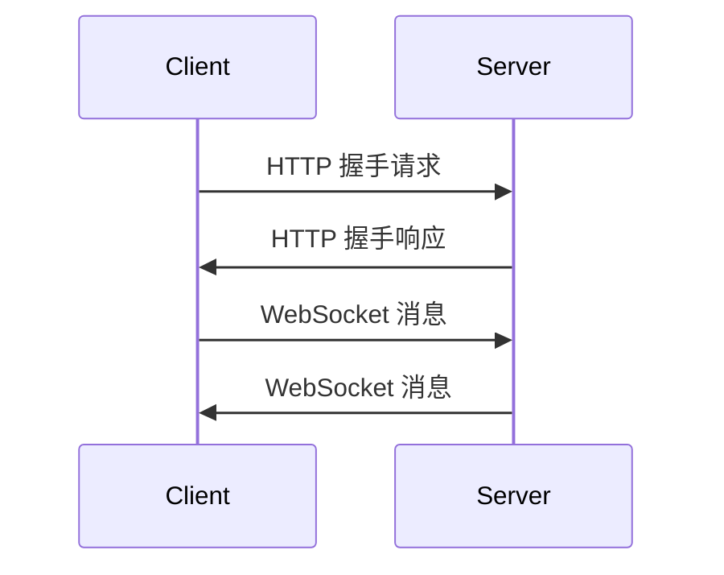

# PHP WebSocket

## 介绍

WebSocket 是一种在单个 TCP 连接上进行全双工通信的协议。与传统的 HTTP 请求-响应模式不同，WebSocket 允许服务器和客户端之间进行实时、双向的通信。这使得 WebSocket 非常适合需要实时更新的应用场景，如聊天应用、在线游戏、实时数据推送等。

在 PHP 中，虽然原生不支持 WebSocket，但我们可以通过一些库和扩展来实现 WebSocket 功能。本文将介绍如何使用 PHP 实现 WebSocket，并通过实际案例展示其应用。

## WebSocket 的工作原理

WebSocket 协议通过 HTTP 协议进行初始握手，之后升级为 WebSocket 协议。握手完成后，客户端和服务器之间可以自由地发送消息，而不需要像 HTTP 那样每次请求都需要建立新的连接。



## 使用 PHP 实现 WebSocket

### 1. 安装依赖

首先，我们需要安装一个 PHP WebSocket 库。推荐使用 `Ratchet`，它是一个流行的 PHP WebSocket 库。

```bash
composer require cboden/ratchet
```

### 2. 创建 WebSocket 服务器

接下来，我们创建一个简单的 WebSocket 服务器。以下是一个基本的示例：

```php
<?php
use Ratchet\MessageComponentInterface;
use Ratchet\ConnectionInterface;
use Ratchet\Server\IoServer;
use Ratchet\Http\HttpServer;
use Ratchet\WebSocket\WsServer;

require 'vendor/autoload.php';

class MyWebSocket implements MessageComponentInterface {
    protected $clients;

    public function __construct() {
        $this->clients = new \SplObjectStorage;
    }

    public function onOpen(ConnectionInterface $conn) {
        $this->clients->attach($conn);
        echo "New connection! ({$conn->resourceId})\n";
    }

    public function onMessage(ConnectionInterface $from, $msg) {
        foreach ($this->clients as $client) {
            if ($client !== $from) {
                $client->send($msg);
            }
        }
    }

    public function onClose(ConnectionInterface $conn) {
        $this->clients->detach($conn);
        echo "Connection {$conn->resourceId} has disconnected\n";
    }

    public function onError(ConnectionInterface $conn, \Exception $e) {
        echo "An error has occurred: {$e->getMessage()}\n";
        $conn->close();
    }
}

$server = IoServer::factory(
    new HttpServer(
        new WsServer(
            new MyWebSocket()
        )
    ),
    8080
);

$server->run();
```

### 3. 运行 WebSocket 服务器

保存上述代码为 `server.php`，然后在终端中运行：

```bash
php server.php
```

现在，WebSocket 服务器已经在 `8080` 端口上运行。

### 4. 创建 WebSocket 客户端

我们可以使用 JavaScript 创建一个简单的 WebSocket 客户端来测试服务器。

```html
<!DOCTYPE html>
<html>
<head>
    <title>WebSocket Client</title>
</head>
<body>
    <script>
        const ws = new WebSocket('ws://localhost:8080');

        ws.onopen = () => {
            console.log('Connected to WebSocket server');
            ws.send('Hello, Server!');
        };

        ws.onmessage = (event) => {
            console.log('Message from server:', event.data);
        };

        ws.onclose = () => {
            console.log('Disconnected from WebSocket server');
        };
    </script>
</body>
</html>
```

打开浏览器并访问此 HTML 文件，您将看到客户端与服务器之间的通信。

## 实际应用场景

### 实时聊天应用

WebSocket 最常见的应用之一是实时聊天应用。通过 WebSocket，服务器可以实时将消息推送给所有连接的客户端，而不需要客户端不断地轮询服务器。

### 在线游戏

在线游戏通常需要实时更新游戏状态。WebSocket 可以确保玩家之间的动作和状态变化能够即时同步。

### 实时数据推送

在金融、体育等领域，实时数据推送非常重要。WebSocket 可以确保数据在发生变化时立即推送给客户端。

## 总结

WebSocket 是一种强大的协议，适用于需要实时通信的应用场景。通过 PHP 和 `Ratchet` 库，我们可以轻松地实现 WebSocket 服务器，并与客户端进行实时通信。

## 附加资源

- [Ratchet 官方文档](https://github.com/ratchetphp/Ratchet)
- [WebSocket 协议规范](https://tools.ietf.org/html/rfc6455)
- [PHP 官方文档](https://www.php.net/manual/en/)

## 练习

1. 修改上述 WebSocket 服务器，使其能够处理不同类型的消息（如文本、JSON 等）。
2. 创建一个简单的聊天应用，允许多个用户通过 WebSocket 进行实时聊天。
3. 尝试将 WebSocket 服务器部署到云服务器上，并通过公网访问。

:::tip
在开发 WebSocket 应用时，务必注意安全性，特别是在处理用户输入和传输敏感数据时。
:::