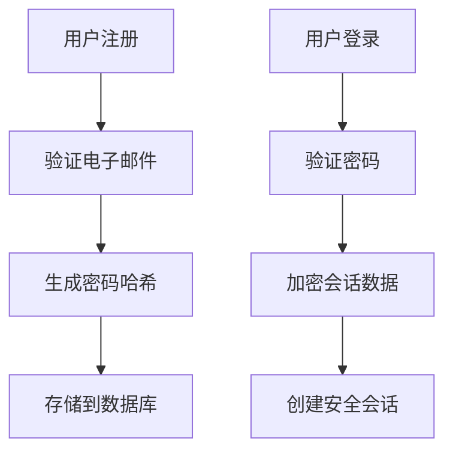

## 介绍

PHP安全扩展是PHP语言中用于增强应用程序安全性的一组工具和库。它们提供了额外的功能，帮助开发者防范常见的安全漏洞，如SQL注入、跨站脚本攻击（XSS）、跨站请求伪造（CSRF）等。通过使用这些扩展，开发者可以更轻松地构建安全的PHP应用程序。

在本文中，我们将探讨几种常见的PHP安全扩展，并展示如何在代码中使用它们来提升安全性。

## 常见的PHP安全扩展

### 1. **PHP Data Filtering (Filter)**

PHP的Filter扩展提供了一组函数，用于验证和过滤用户输入。这是防止SQL注入和XSS攻击的关键步骤。

#### 示例：过滤用户输入

```php
<?php
// 假设用户提交了一个表单
$email = $_POST['email'];

// 使用filter_var函数验证电子邮件地址
if (filter_var($email, FILTER_VALIDATE_EMAIL)) {
    echo "有效的电子邮件地址: $email";
} else {
    echo "无效的电子邮件地址";
}
?>
```

**输入：**
```
email = "user@example.com"
```

**输出：**
```
有效的电子邮件地址: user@example.com
```

**输入：**
```
email = "user@example"
```

**输出：**
```
无效的电子邮件地址
```

:::tip
使用`filter_var`函数时，可以结合多种过滤器来验证不同类型的数据，如URL、IP地址等。
:::

### 2. **PHP Password Hashing (Password)**

PHP的Password扩展提供了一组函数，用于安全地处理用户密码。它支持使用现代哈希算法（如bcrypt）来存储密码，从而防止密码泄露。

#### 示例：密码哈希

```php
<?php
// 用户注册时设置的密码
$password = "mySecurePassword123";

// 使用password_hash函数生成密码哈希
$hashedPassword = password_hash($password, PASSWORD_DEFAULT);

echo "哈希后的密码: $hashedPassword";
?>
```

**输出：**
```
哈希后的密码: $2y$10$92IXUNpkjO0rOQ5byMi.Ye4oKoEa3Ro9llC/.og/at2.uheWG/igi
```

#### 示例：验证密码

```php
<?php
// 用户登录时输入的密码
$userInputPassword = "mySecurePassword123";

// 从数据库中获取的哈希密码
$storedHashedPassword = "$2y$10$92IXUNpkjO0rOQ5byMi.Ye4oKoEa3Ro9llC/.og/at2.uheWG/igi";

// 使用password_verify函数验证密码
if (password_verify($userInputPassword, $storedHashedPassword)) {
    echo "密码正确";
} else {
    echo "密码错误";
}
?>
```

**输出：**
```
密码正确
```

:::caution
永远不要使用`md5`或`sha1`等过时的哈希算法来存储密码，因为它们容易被破解。
:::

### 3. **PHP OpenSSL (OpenSSL)**

PHP的OpenSSL扩展提供了加密和解密数据的功能，适用于需要保护敏感信息的场景。

#### 示例：加密和解密数据

```php
<?php
// 加密密钥
$key = "mySecretKey123";

// 要加密的数据
$data = "Sensitive Information";

// 使用openssl_encrypt函数加密数据
$encryptedData = openssl_encrypt($data, "AES-128-ECB", $key);

echo "加密后的数据: $encryptedData";

// 使用openssl_decrypt函数解密数据
$decryptedData = openssl_decrypt($encryptedData, "AES-128-ECB", $key);

echo "解密后的数据: $decryptedData";
?>
```

**输出：**
```
加密后的数据: U2FsdGVkX1+3q2Zq1ZQ2Zg==
解密后的数据: Sensitive Information
```

:::warning
确保加密密钥的安全性，避免密钥泄露导致数据被解密。
:::

## 实际应用场景

### 案例：用户注册与登录系统

在一个用户注册与登录系统中，使用PHP安全扩展可以显著提升安全性。以下是一个简化的流程：

1. **用户注册：**
   - 使用`filter_var`验证用户输入的电子邮件地址。
   - 使用`password_hash`生成密码哈希并存储到数据库中。

2. **用户登录：**
   - 使用`password_verify`验证用户输入的密码是否与数据库中的哈希匹配。
   - 使用`openssl_encrypt`加密用户的会话数据，防止会话劫持。



## 总结

PHP安全扩展为开发者提供了强大的工具，帮助他们构建更加安全的应用程序。通过使用Filter、Password和OpenSSL等扩展，开发者可以有效防范常见的安全威胁，如SQL注入、XSS攻击和数据泄露。

在实际开发中，建议始终使用这些扩展来处理用户输入、存储密码和加密敏感数据。此外，定期更新PHP版本和安全扩展，以确保应用程序始终处于最佳的安全状态。

## 附加资源与练习

- **练习：** 尝试在一个简单的PHP项目中实现用户注册与登录功能，并使用本文介绍的PHP安全扩展来增强安全性。
- **资源：**
  - [PHP官方文档 - Filter](https://www.php.net/manual/en/book.filter.php)
  - [PHP官方文档 - Password](https://www.php.net/manual/en/book.password.php)
  - [PHP官方文档 - OpenSSL](https://www.php.net/manual/en/book.openssl.php)
