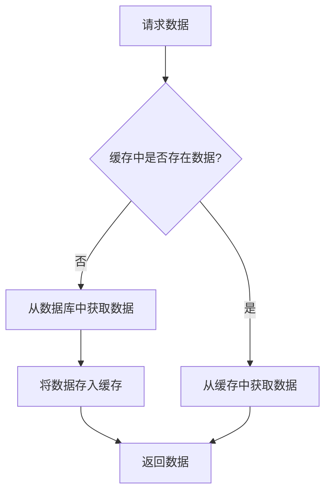

# PHP Redis缓存

在现代Web开发中，性能优化是一个至关重要的主题。随着应用程序的复杂性增加，数据库查询和数据处理可能会成为性能瓶颈。为了解决这个问题，缓存技术应运而生。Redis是一个开源的内存数据结构存储系统，常用于缓存、消息队列和实时分析等场景。本文将介绍如何在PHP中使用Redis缓存来优化应用程序性能。

## 什么是Redis缓存？

Redis（Remote Dictionary Server）是一个高性能的键值存储系统，支持多种数据结构，如字符串、哈希、列表、集合等。它通常被用作缓存层，存储频繁访问的数据，从而减少对数据库的直接查询，提高应用程序的响应速度。

### 为什么使用Redis缓存？

- **高性能**：Redis将数据存储在内存中，读写速度极快。
- **减少数据库负载**：通过缓存频繁访问的数据，减少对数据库的直接查询。
- **支持多种数据结构**：Redis不仅支持简单的键值对，还支持复杂的数据结构，如列表、集合和哈希。
- **持久化**：Redis支持数据持久化，即使服务器重启，数据也不会丢失。

## 在PHP中使用Redis

要在PHP中使用Redis，首先需要安装Redis扩展。可以通过以下命令安装：

```bash
pecl install redis
```

安装完成后，在`php.ini`文件中启用扩展：

```ini
extension=redis.so
```

### 连接到Redis服务器

在PHP中，可以使用`Redis`类来连接到Redis服务器并进行操作。以下是一个简单的连接示例：

```php
$redis = new Redis();
$redis->connect('127.0.0.1', 6379);

if ($redis->ping()) {
    echo "Connected to Redis server successfully!";
}
```

### 缓存数据

假设我们有一个从数据库中获取用户信息的函数，我们可以使用Redis缓存这些数据，以减少数据库查询次数。

```php
function getUserInfo($userId) {
    global $redis;

    $cacheKey = "user:$userId";

    // 检查缓存中是否有数据
    if ($redis->exists($cacheKey)) {
        return json_decode($redis->get($cacheKey), true);
    }

    // 从数据库中获取数据
    $userInfo = fetchUserInfoFromDatabase($userId);

    // 将数据存入缓存，设置过期时间为1小时
    $redis->set($cacheKey, json_encode($userInfo));
    $redis->expire($cacheKey, 3600);

    return $userInfo;
}
```

### 缓存命中与未命中

当请求数据时，Redis会首先检查缓存中是否存在所需数据。如果存在，则直接从缓存中返回数据，这称为**缓存命中**。如果缓存中不存在所需数据，则需要从数据库中获取数据并存入缓存，这称为**缓存未命中**。



## 实际应用场景

### 1. 缓存热门文章

在一个博客系统中，热门文章的访问频率非常高。我们可以将这些文章的内容缓存到Redis中，以减少数据库查询次数。

```php
function getPopularArticles() {
    global $redis;

    $cacheKey = "popular_articles";

    if ($redis->exists($cacheKey)) {
        return json_decode($redis->get($cacheKey), true);
    }

    $articles = fetchPopularArticlesFromDatabase();

    $redis->set($cacheKey, json_encode($articles));
    $redis->expire($cacheKey, 3600);

    return $articles;
}
```

### 2. 缓存API响应

在开发API时，某些响应数据可能不会频繁变化。我们可以将这些响应数据缓存到Redis中，以减少服务器负载并提高响应速度。

```php
function getApiResponse($endpoint) {
    global $redis;

    $cacheKey = "api_response:$endpoint";

    if ($redis->exists($cacheKey)) {
        return $redis->get($cacheKey);
    }

    $response = fetchApiResponseFromServer($endpoint);

    $redis->set($cacheKey, $response);
    $redis->expire($cacheKey, 600); // 缓存10分钟

    return $response;
}
```

## 总结

Redis缓存是优化PHP应用程序性能的强大工具。通过将频繁访问的数据存储在内存中，可以显著减少数据库负载并提高响应速度。本文介绍了如何在PHP中使用Redis缓存，并提供了实际应用场景的示例。

:::tip
在使用Redis缓存时，务必注意缓存的有效期。过长的缓存时间可能导致数据不一致，而过短的缓存时间则可能无法充分发挥缓存的优势。
:::

## 附加资源与练习

- **官方文档**：[Redis官方文档](https://redis.io/documentation)
- **PHP Redis扩展文档**：[PHP Redis扩展](https://github.com/phpredis/phpredis)
- **练习**：尝试在你的PHP项目中集成Redis缓存，并观察性能提升。

通过本文的学习，你应该已经掌握了如何在PHP中使用Redis缓存来优化应用程序性能。继续探索和实践，你将能够更好地利用Redis来提升你的应用程序性能。