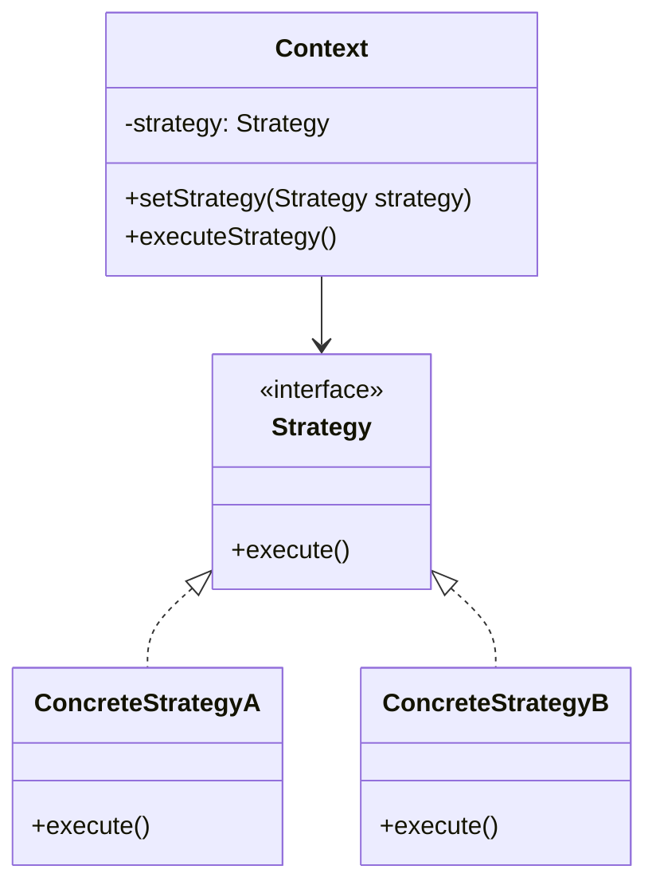

# PHP 策略模式

策略模式（Strategy Pattern）是一种行为设计模式，它允许你在运行时选择算法或行为。通过将算法封装在独立的类中，策略模式使得算法可以独立于使用它的客户端而变化。这种模式非常适合处理需要在不同情况下使用不同算法的场景。

## 什么是策略模式？

策略模式的核心思想是将算法或行为封装在独立的类中，使得它们可以相互替换。这样，客户端代码可以在运行时选择使用哪种算法，而不需要修改客户端代码本身。

策略模式通常由以下几个部分组成：

1. **策略接口（Strategy Interface）**：定义了所有具体策略类必须实现的方法。
2. **具体策略类（Concrete Strategies）**：实现了策略接口的具体算法或行为。
3. **上下文类（Context）**：持有一个策略对象的引用，并在需要时调用策略对象的方法。

## 策略模式的结构



在上面的类图中，`Context` 类持有一个 `Strategy` 接口的引用，并在需要时调用 `execute()` 方法。`ConcreteStrategyA` 和 `ConcreteStrategyB` 是具体的策略类，它们实现了 `Strategy` 接口。

## 代码示例

让我们通过一个简单的例子来理解策略模式。假设我们有一个应用程序，需要根据不同的排序策略对数组进行排序。

### 1. 定义策略接口

首先，我们定义一个策略接口 `SortStrategy`，它包含一个 `sort()` 方法。

```php
interface SortStrategy {
    public function sort(array $data): array;
}
```

### 2. 实现具体策略类

接下来，我们实现两个具体的排序策略类：`QuickSortStrategy` 和 `BubbleSortStrategy`。

```php
class QuickSortStrategy implements SortStrategy {
    public function sort(array $data): array {
        // 实现快速排序算法
        sort($data);
        return $data;
    }
}

class BubbleSortStrategy implements SortStrategy {
    public function sort(array $data): array {
        // 实现冒泡排序算法
        $n = count($data);
        for ($i = 0; $i < $n - 1; $i++) {
            for ($j = 0; $j < $n - $i - 1; $j++) {
                if ($data[$j] > $data[$j + 1]) {
                    $temp = $data[$j];
                    $data[$j] = $data[$j + 1];
                    $data[$j + 1] = $temp;
                }
            }
        }
        return $data;
    }
}
```

### 3. 创建上下文类

然后，我们创建一个上下文类 `Sorter`，它持有一个 `SortStrategy` 的引用，并在需要时调用 `sort()` 方法。

```php
class Sorter {
    private $strategy;

    public function __construct(SortStrategy $strategy) {
        $this->strategy = $strategy;
    }

    public function setStrategy(SortStrategy $strategy) {
        $this->strategy = $strategy;
    }

    public function sort(array $data): array {
        return $this->strategy->sort($data);
    }
}
```

### 4. 使用策略模式

最后，我们可以在客户端代码中使用策略模式来动态选择排序算法。

```php
$data = [3, 1, 4, 1, 5, 9, 2, 6, 5, 3, 5];

$sorter = new Sorter(new QuickSortStrategy());
echo "Quick Sort: " . implode(", ", $sorter->sort($data)) . "\n";

$sorter->setStrategy(new BubbleSortStrategy());
echo "Bubble Sort: " . implode(", ", $sorter->sort($data)) . "\n";
```

### 输出结果

```
Quick Sort: 1, 1, 2, 3, 3, 4, 5, 5, 5, 6, 9
Bubble Sort: 1, 1, 2, 3, 3, 4, 5, 5, 5, 6, 9
```

在这个例子中，我们可以在运行时动态地切换排序策略，而不需要修改 `Sorter` 类的代码。

## 实际应用场景

策略模式在实际开发中有很多应用场景，例如：

- **支付方式选择**：在电商网站中，用户可以选择不同的支付方式（如信用卡、支付宝、微信支付等）。每种支付方式可以作为一个策略类，支付系统可以根据用户的选择动态切换支付策略。
- **数据压缩**：在文件压缩工具中，用户可以选择不同的压缩算法（如ZIP、RAR、7z等）。每种压缩算法可以作为一个策略类，压缩工具可以根据用户的选择动态切换压缩策略。
- **日志记录**：在日志系统中，用户可以选择不同的日志记录方式（如文件日志、数据库日志、远程日志等）。每种日志记录方式可以作为一个策略类，日志系统可以根据用户的选择动态切换日志记录策略。

## 总结

策略模式是一种非常有用的设计模式，它允许你在运行时动态地选择算法或行为。通过将算法封装在独立的类中，策略模式使得代码更加灵活和可维护。在实际开发中，策略模式可以应用于多种场景，如支付方式选择、数据压缩、日志记录等。

## 附加资源与练习

- **练习**：尝试实现一个简单的计算器应用程序，支持加、减、乘、除四种运算。使用策略模式来实现不同的运算策略。
- **进一步阅读**：阅读《设计模式：可复用面向对象软件的基础》一书，了解更多关于策略模式和其他设计模式的内容。

:::tip
策略模式非常适合处理需要在不同情况下使用不同算法的场景。通过将算法封装在独立的类中，策略模式使得代码更加灵活和可维护。
:::