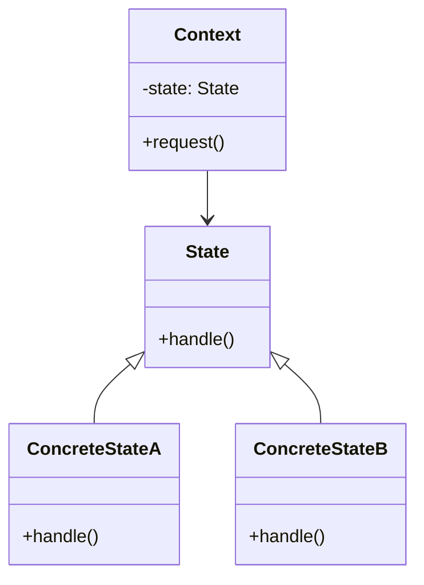

# PHP 状态模式

状态模式（State Pattern）是一种行为设计模式，它允许对象在其内部状态改变时改变其行为。这种模式将状态相关的逻辑封装在独立的类中，使得对象的行为可以根据其状态动态变化，而不需要在代码中使用大量的条件语句。

## 什么是状态模式？

状态模式的核心思想是将对象的状态抽象为一个独立的类，并将与状态相关的行为委托给这些类。这样，当对象的状态发生变化时，它的行为也会随之改变，而不需要修改对象本身的代码。

状态模式通常用于以下场景：
- 当一个对象的行为取决于它的状态，并且它需要在运行时根据状态改变行为时。
- 当代码中包含大量与对象状态相关的条件语句时，状态模式可以帮助简化代码。

## 状态模式的结构

状态模式通常包含以下几个角色：
1. **Context（上下文）**：定义客户端感兴趣的接口，并维护一个具体状态对象的实例。
2. **State（状态）**：定义一个接口，用于封装与Context的特定状态相关的行为。
3. **ConcreteState（具体状态）**：实现State接口，定义与Context的某个状态相关的行为。



## 代码示例

让我们通过一个简单的例子来理解状态模式。假设我们有一个订单系统，订单的状态可以是“新建”、“已支付”和“已发货”。我们将使用状态模式来管理订单的状态变化。

### 1. 定义状态接口

首先，我们定义一个状态接口 `OrderState`，它包含一个处理订单的方法 `handle`。

```php
interface OrderState {
    public function handle(OrderContext $context);
}
```

### 2. 实现具体状态类

接下来，我们实现三个具体状态类：`NewOrderState`、`PaidOrderState` 和 `ShippedOrderState`。

```php
class NewOrderState implements OrderState {
    public function handle(OrderContext $context) {
        echo "订单已创建，等待支付。<br />";
        $context->setState(new PaidOrderState());
    }
}

class PaidOrderState implements OrderState {
    public function handle(OrderContext $context) {
        echo "订单已支付，等待发货。<br />";
        $context->setState(new ShippedOrderState());
    }
}

class ShippedOrderState implements OrderState {
    public function handle(OrderContext $context) {
        echo "订单已发货，交易完成。<br />";
    }
}
```

### 3. 定义上下文类

然后，我们定义上下文类 `OrderContext`，它维护一个当前状态对象，并将请求委托给当前状态对象处理。

```php
class OrderContext {
    private $state;

    public function __construct() {
        $this->state = new NewOrderState();
    }

    public function setState(OrderState $state) {
        $this->state = $state;
    }

    public function request() {
        $this->state->handle($this);
    }
}
```

### 4. 使用状态模式

最后，我们可以在客户端代码中使用状态模式来管理订单的状态变化。

```php
$order = new OrderContext();
$order->request(); // 输出: 订单已创建，等待支付。
$order->request(); // 输出: 订单已支付，等待发货。
$order->request(); // 输出: 订单已发货，交易完成。
```

## 实际应用场景

状态模式在实际开发中有广泛的应用，例如：
- **订单系统**：如上面的例子所示，订单的状态变化可以通过状态模式来管理。
- **游戏开发**：游戏中的角色或对象可能有多种状态（如“站立”、“行走”、“攻击”等），状态模式可以帮助管理这些状态及其行为。
- **工作流系统**：工作流中的任务状态（如“待处理”、“处理中”、“已完成”）可以通过状态模式来管理。

## 总结

状态模式是一种强大的设计模式，它通过将状态相关的逻辑封装在独立的类中，使得对象的行为可以根据其状态动态变化。这种模式不仅简化了代码，还提高了代码的可维护性和可扩展性。

:::tip
**提示**：状态模式特别适用于那些状态变化频繁且复杂的场景。如果你发现代码中有大量的条件语句来管理对象的状态，那么状态模式可能是一个很好的解决方案。
:::

## 附加资源与练习

1. **练习**：尝试在订单系统中添加一个新的状态，例如“已取消”，并实现相应的状态类。
2. **深入学习**：阅读更多关于状态模式的设计模式书籍或在线教程，了解其在不同编程语言中的实现方式。

通过掌握状态模式，你将能够更好地管理复杂的状态变化，并编写出更加清晰和可维护的代码。