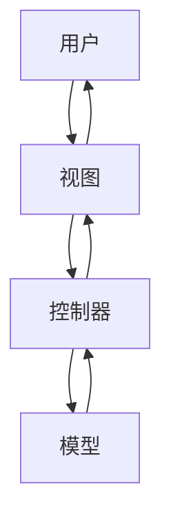

# PHP MVC 模式

MVC（Model-View-Controller）是一种广泛使用的软件设计模式，用于将应用程序的逻辑、数据和用户界面分离。通过这种分离，开发者可以更容易地管理复杂的应用程序，并提高代码的可维护性和可扩展性。本文将详细介绍 PHP 中的 MVC 模式，并通过实际案例帮助你理解其工作原理。

## 什么是 MVC 模式？

MVC 模式将应用程序分为三个主要部分：

1. **Model（模型）**：负责处理应用程序的数据逻辑。它与数据库交互，执行数据的增删改查操作。
2. **View（视图）**：负责展示数据给用户。它是用户界面的部分，通常是 HTML 模板。
3. **Controller（控制器）**：负责处理用户输入并更新模型和视图。它是模型和视图之间的桥梁。

通过这种分离，MVC 模式使得开发者可以独立地修改应用程序的各个部分，而不会影响到其他部分。

## MVC 模式的工作原理

以下是一个简单的 MVC 模式工作流程：

1. 用户通过视图（View）与应用程序交互，例如点击按钮或提交表单。
2. 控制器（Controller）接收用户的输入，并根据输入调用相应的模型（Model）方法。
3. 模型（Model）处理数据逻辑，例如从数据库中获取数据或更新数据。
4. 控制器（Controller）将处理后的数据传递给视图（View）。
5. 视图（View）将数据展示给用户。



## PHP 中的 MVC 实现

让我们通过一个简单的 PHP 示例来理解 MVC 模式的实际应用。假设我们正在构建一个博客系统，用户可以查看博客文章。

### 1. 创建模型（Model）

模型负责与数据库交互，获取博客文章数据。

```php
class PostModel {
    private $db;

    public function __construct($db) {
        $this->db = $db;
    }

    public function getPost($id) {
        $query = "SELECT * FROM posts WHERE id = :id";
        $stmt = $this->db->prepare($query);
        $stmt->execute(['id' => $id]);
        return $stmt->fetch();
    }
}
```

### 2. 创建视图（View）

视图负责展示博客文章的内容。

```php
class PostView {
    public function render($post) {
        echo "<h1>{$post['title']}</h1>";
        echo "<p>{$post['content']}</p>";
    }
}
```

### 3. 创建控制器（Controller）

控制器负责处理用户请求，并调用模型和视图。

```php
class PostController {
    private $model;
    private $view;

    public function __construct($model, $view) {
        $this->model = $model;
        $this->view = $view;
    }

    public function showPost($id) {
        $post = $this->model->getPost($id);
        $this->view->render($post);
    }
}
```

### 4. 整合 MVC

最后，我们将模型、视图和控制器整合在一起，形成一个完整的 MVC 应用程序。

```php
$db = new PDO('mysql:host=localhost;dbname=blog', 'username', 'password');
$model = new PostModel($db);
$view = new PostView();
$controller = new PostController($model, $view);

$controller->showPost(1); // 假设用户请求查看 ID 为 1 的博客文章
```

## 实际应用场景

MVC 模式在 Web 开发中非常常见，特别是在构建大型应用程序时。以下是一些实际应用场景：

- **博客系统**：如上面的示例所示，MVC 模式非常适合用于博客系统，其中模型负责管理文章数据，视图负责展示文章，控制器负责处理用户请求。
- **电子商务网站**：在电子商务网站中，模型可以管理产品数据，视图可以展示产品列表和详情页，控制器可以处理用户的购物车操作。
- **内容管理系统（CMS）**：CMS 通常需要管理大量的内容和用户数据，MVC 模式可以帮助开发者更好地组织代码。

## 总结

MVC 模式通过将应用程序分为模型、视图和控制器三个部分，使得代码更加模块化和易于维护。通过本文的介绍和示例，你应该对 PHP 中的 MVC 模式有了基本的了解。接下来，你可以尝试在自己的项目中应用 MVC 模式，或者通过以下资源进一步学习：

- [PHP MVC 教程](https://www.example.com/php-mvc-tutorial)
- [设计模式：可复用面向对象软件的基础](https://www.example.com/design-patterns-book)

:::tip 练习
1. 尝试扩展上面的博客系统，添加创建、编辑和删除博客文章的功能。
2. 研究其他设计模式，如单例模式、工厂模式等，并思考它们如何与 MVC 模式结合使用。
:::