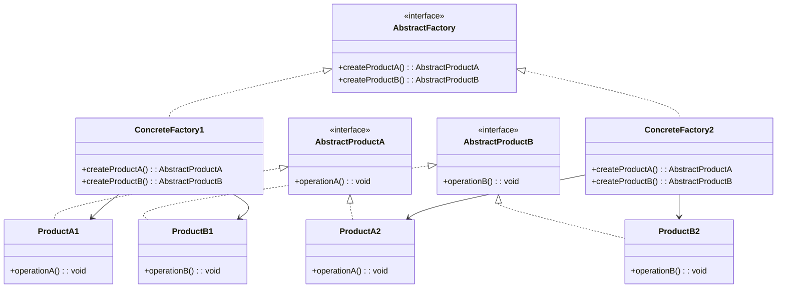

# PHP 抽象工厂

抽象工厂（Abstract Factory）是一种创建型设计模式，它允许你创建一组相关或依赖对象的家族，而无需指定它们的具体类。抽象工厂模式特别适用于需要确保一组对象之间相互兼容的场景。

## 什么是抽象工厂？

抽象工厂模式提供了一个接口，用于创建一系列相关或依赖对象的家族，而无需指定它们的具体类。它通过将对象的创建过程封装在一个工厂类中，使得客户端代码与具体类的实现解耦。

### 主要优点
- **解耦**：客户端代码与具体类的实现解耦。
- **一致性**：确保创建的对象家族之间的一致性。
- **可扩展性**：易于扩展新的产品家族。

### 主要缺点
- **复杂性**：增加了代码的复杂性，尤其是在产品家族较多时。
- **难以扩展**：如果需要添加新的产品类型，可能需要修改抽象工厂接口及其所有子类。

## 抽象工厂的结构

抽象工厂模式通常包含以下几个角色：

1. **抽象工厂（AbstractFactory）**：声明创建一系列产品对象的接口。
2. **具体工厂（ConcreteFactory）**：实现抽象工厂接口，创建具体的产品对象。
3. **抽象产品（AbstractProduct）**：声明产品对象的接口。
4. **具体产品（ConcreteProduct）**：实现抽象产品接口，定义具体产品的行为。



## 代码示例

假设我们有一个家具工厂，可以生产不同类型的椅子和桌子。我们可以使用抽象工厂模式来创建这些家具。

### 抽象产品接口

```php
interface Chair {
    public function sitOn(): string;
}

interface Table {
    public function putOn(): string;
}
```

### 具体产品实现

```php
class ModernChair implements Chair {
    public function sitOn(): string {
        return "Sitting on a modern chair.";
    }
}

class ModernTable implements Table {
    public function putOn(): string {
        return "Putting something on a modern table.";
    }
}

class VictorianChair implements Chair {
    public function sitOn(): string {
        return "Sitting on a victorian chair.";
    }
}

class VictorianTable implements Table {
    public function putOn(): string {
        return "Putting something on a victorian table.";
    }
}
```

### 抽象工厂接口

```php
interface FurnitureFactory {
    public function createChair(): Chair;
    public function createTable(): Table;
}
```

### 具体工厂实现

```php
class ModernFurnitureFactory implements FurnitureFactory {
    public function createChair(): Chair {
        return new ModernChair();
    }

    public function createTable(): Table {
        return new ModernTable();
    }
}

class VictorianFurnitureFactory implements FurnitureFactory {
    public function createChair(): Chair {
        return new VictorianChair();
    }

    public function createTable(): Table {
        return new VictorianTable();
    }
}
```

### 客户端代码

```php
function createFurniture(FurnitureFactory $factory) {
    $chair = $factory->createChair();
    $table = $factory->createTable();

    echo $chair->sitOn() . "\n";
    echo $table->putOn() . "\n";
}

// 使用现代家具工厂
createFurniture(new ModernFurnitureFactory());

// 使用维多利亚家具工厂
createFurniture(new VictorianFurnitureFactory());
```

### 输出

```
Sitting on a modern chair.
Putting something on a modern table.
Sitting on a victorian chair.
Putting something on a victorian table.
```

## 实际应用场景

抽象工厂模式在以下场景中非常有用：

- **跨平台UI库**：例如，一个UI库需要支持多种操作系统（如Windows、MacOS、Linux），每个操作系统都有不同的按钮、窗口等组件。抽象工厂可以确保创建的UI组件与当前操作系统兼容。
- **数据库访问**：不同的数据库（如MySQL、PostgreSQL）可能需要不同的连接、查询等对象。抽象工厂可以确保创建的数据库对象与当前数据库兼容。

## 总结

抽象工厂模式是一种强大的设计模式，它允许你创建一组相关对象的家族，而无需指定它们的具体类。通过使用抽象工厂，你可以确保创建的对象之间的一致性，并且使客户端代码与具体类的实现解耦。

## 附加资源与练习

- **练习**：尝试扩展上述家具工厂示例，添加新的家具类型（如沙发）和新的风格（如工业风格）。
- **资源**：阅读更多关于设计模式的书籍，如《设计模式：可复用面向对象软件的基础》。

:::tip
抽象工厂模式非常适合在需要确保一组对象之间相互兼容的场景中使用。如果你发现自己在创建多个相关对象时，代码变得复杂且难以维护，那么抽象工厂模式可能是一个很好的解决方案。
:::