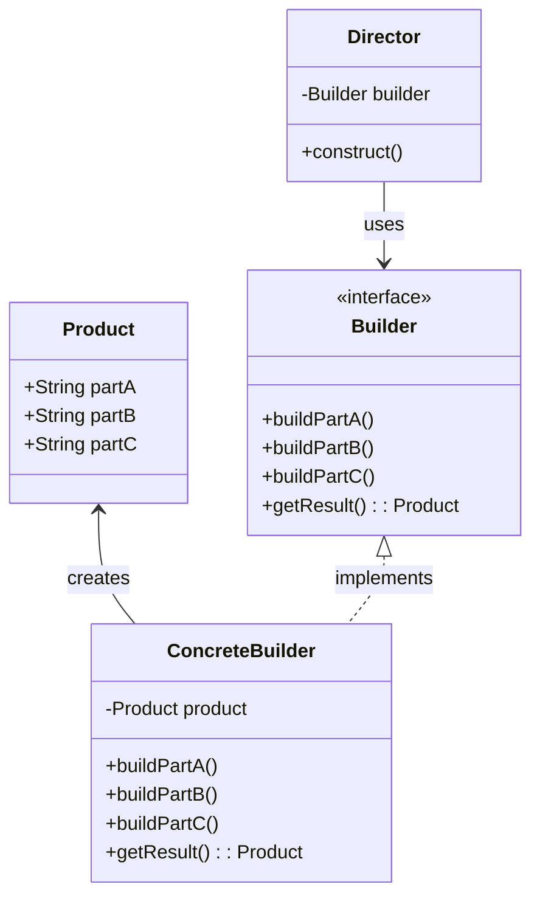

## 介绍

建造者模式（Builder Pattern）是一种创建型设计模式，旨在将复杂对象的构建过程与其表示分离。通过这种方式，相同的构建过程可以创建不同的表示。建造者模式特别适用于需要分步构建复杂对象的场景。

建造者模式的核心思想是将对象的构建过程分解为多个步骤，每个步骤由一个“建造者”负责。最终，通过一个“导演”类来协调这些步骤，从而生成最终的对象。

## 建造者模式的结构

建造者模式通常包含以下几个角色：

1. **产品（Product）**：最终要构建的复杂对象。
2. **建造者（Builder）**：定义构建产品的各个步骤的接口。
3. **具体建造者（Concrete Builder）**：实现建造者接口，具体实现每个步骤。
4. **导演（Director）**：负责调用建造者的步骤，控制构建过程。



## 代码示例

以下是一个简单的PHP代码示例，展示了如何使用建造者模式来构建一个复杂对象。

```php
<?php

// 产品类
class Product {
    public $partA;
    public $partB;
    public $partC;

    public function show() {
        echo "Part A: " . $this->partA . "\n";
        echo "Part B: " . $this->partB . "\n";
        echo "Part C: " . $this->partC . "\n";
    }
}

// 建造者接口
interface Builder {
    public function buildPartA();
    public function buildPartB();
    public function buildPartC();
    public function getResult(): Product;
}

// 具体建造者
class ConcreteBuilder implements Builder {
    private $product;

    public function __construct() {
        $this->product = new Product();
    }

    public function buildPartA() {
        $this->product->partA = "Part A";
    }

    public function buildPartB() {
        $this->product->partB = "Part B";
    }

    public function buildPartC() {
        $this->product->partC = "Part C";
    }

    public function getResult(): Product {
        return $this->product;
    }
}

// 导演类
class Director {
    private $builder;

    public function __construct(Builder $builder) {
        $this->builder = $builder;
    }

    public function construct() {
        $this->builder->buildPartA();
        $this->builder->buildPartB();
        $this->builder->buildPartC();
    }
}

// 客户端代码
$builder = new ConcreteBuilder();
$director = new Director($builder);
$director->construct();
$product = $builder->getResult();
$product->show();
?>
```

### 输出

```
Part A: Part A
Part B: Part B
Part C: Part C
```

## 实际应用场景

建造者模式在以下场景中非常有用：

1. **构建复杂对象**：当需要构建的对象非常复杂，且构建过程需要分步进行时，建造者模式可以帮助将构建过程分解为多个步骤。
2. **构建过程需要灵活控制**：建造者模式允许通过不同的具体建造者来创建不同的产品表示，从而提供更大的灵活性。
3. **避免构造函数参数过多**：当对象的构造函数需要大量参数时，使用建造者模式可以避免构造函数过于复杂。

:::tip
建造者模式特别适用于需要构建的对象具有多个组成部分，并且这些组成部分的构建顺序和方式可能有所不同的情况。
:::

## 总结

建造者模式是一种强大的设计模式，特别适用于需要分步构建复杂对象的场景。通过将对象的构建过程与其表示分离，建造者模式提供了更大的灵活性和可维护性。

在实际开发中，建造者模式可以帮助我们更好地管理复杂对象的构建过程，避免构造函数参数过多，并且允许我们通过不同的具体建造者来创建不同的产品表示。

## 附加资源与练习

1. **练习**：尝试扩展上述代码示例，添加更多的部件（如 `partD`、`partE`），并修改建造者和导演类以支持这些新部件。
2. **进一步阅读**：了解其他创建型设计模式，如工厂模式、单例模式等，并比较它们与建造者模式的异同。

:::caution
在使用建造者模式时，务必确保每个具体建造者都正确地实现了所有构建步骤，以避免最终产品的不完整或错误。
:::