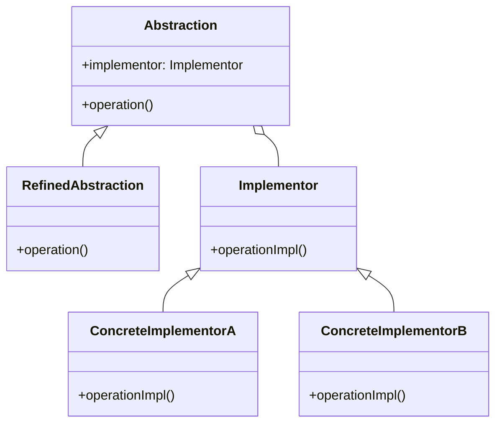

# PHP 桥接模式

## 介绍

桥接模式（Bridge Pattern）是一种结构型设计模式，旨在将抽象部分与其实现部分分离，使它们可以独立变化。这种模式通过将抽象和实现解耦，使得两者可以独立扩展，而不会相互影响。

桥接模式的核心思想是**组合优于继承**。通过组合的方式，我们可以将抽象类和实现类分开，从而避免继承带来的类爆炸问题。

## 桥接模式的结构

桥接模式通常包含以下几个角色：

1. **抽象类（Abstraction）**：定义抽象接口，并持有一个对实现类的引用。
2. **扩展抽象类（Refined Abstraction）**：对抽象类的扩展，通常是对抽象类的具体实现。
3. **实现类接口（Implementor）**：定义实现类的接口，通常是一个抽象类或接口。
4. **具体实现类（Concrete Implementor）**：实现类接口的具体实现。

我们可以通过以下Mermaid图来理解桥接模式的结构：



## 代码示例

让我们通过一个简单的例子来理解桥接模式。假设我们有一个图形绘制系统，支持多种图形（如圆形、矩形）和多种颜色（如红色、蓝色）。我们可以使用桥接模式来将图形和颜色分离。

### 实现类接口

首先，我们定义一个颜色接口 `Color`，它表示颜色的实现：

```php
interface Color {
    public function fill(): string;
}
```

### 具体实现类

接下来，我们实现两种具体的颜色类：

```php
class Red implements Color {
    public function fill(): string {
        return "Red";
    }
}

class Blue implements Color {
    public function fill(): string {
        return "Blue";
    }
}
```

### 抽象类

然后，我们定义一个抽象类 `Shape`，它持有一个对 `Color` 的引用：

```php
abstract class Shape {
    protected $color;

    public function __construct(Color $color) {
        $this->color = $color;
    }

    abstract public function draw(): string;
}
```

### 扩展抽象类

接下来，我们实现两种具体的图形类：

```php
class Circle extends Shape {
    public function draw(): string {
        return "Drawing a Circle with color " . $this->color->fill();
    }
}

class Rectangle extends Shape {
    public function draw(): string {
        return "Drawing a Rectangle with color " . $this->color->fill();
    }
}
```

### 使用桥接模式

现在，我们可以使用桥接模式来组合图形和颜色：

```php
$red = new Red();
$blue = new Blue();

$redCircle = new Circle($red);
$blueRectangle = new Rectangle($blue);

echo $redCircle->draw(); // 输出: Drawing a Circle with color Red
echo $blueRectangle->draw(); // 输出: Drawing a Rectangle with color Blue
```

## 实际应用场景

桥接模式在实际开发中有广泛的应用，特别是在以下场景中：

1. **图形绘制系统**：如上面的例子所示，桥接模式可以用于将图形和颜色分离，使得它们可以独立扩展。
2. **设备驱动程序**：桥接模式可以用于将操作系统与设备驱动程序分离，使得不同的操作系统可以支持相同的设备。
3. **跨平台UI框架**：桥接模式可以用于将UI组件与平台相关的实现分离，使得UI组件可以在不同的平台上运行。

## 总结

桥接模式通过将抽象部分与实现部分分离，使得两者可以独立变化。这种模式避免了继承带来的类爆炸问题，并且提高了代码的可扩展性和可维护性。

在实际开发中，桥接模式特别适用于需要将抽象与实现解耦的场景。通过组合的方式，我们可以轻松地扩展系统的功能，而不会影响现有的代码。

## 附加资源与练习

- **练习**：尝试在现有的代码中添加一个新的图形（如三角形）和新的颜色（如绿色），并验证桥接模式的灵活性。
- **进一步学习**：阅读更多关于设计模式的书籍或文章，了解其他结构型设计模式（如适配器模式、装饰器模式等）的应用场景和实现方式。

:::tip
桥接模式的核心思想是**组合优于继承**。通过组合的方式，我们可以将抽象和实现解耦，从而避免继承带来的类爆炸问题。
:::