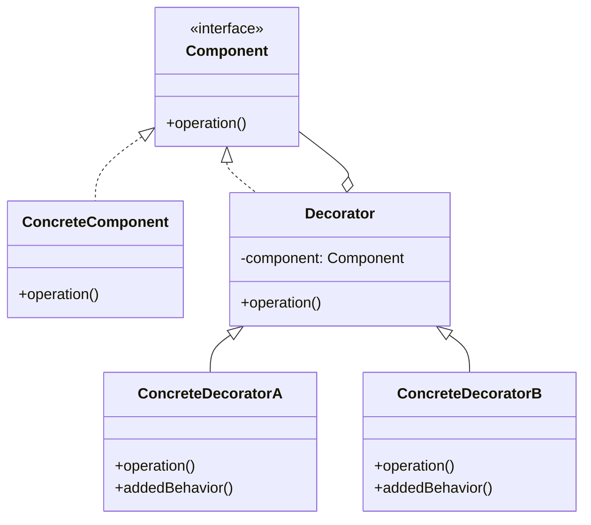

## 介绍

装饰器模式（Decorator Pattern）是一种结构型设计模式，它允许你通过将对象放入包含行为的特殊封装对象中来为原对象增加新的行为。装饰器模式的核心思想是**动态地扩展对象的功能**，而无需修改其原始类。

与继承不同，装饰器模式通过组合而非继承来实现功能的扩展。这使得代码更加灵活，避免了类爆炸问题（即过多的子类）。

## 装饰器模式的结构

装饰器模式通常包含以下几个角色：

1. **组件接口（Component）**：定义了被装饰对象和装饰器的共同接口。
2. **具体组件（Concrete Component）**：实现了组件接口，是被装饰的原始对象。
3. **装饰器（Decorator）**：实现了组件接口，并持有一个组件对象的引用。
4. **具体装饰器（Concrete Decorator）**：扩展了装饰器，添加了新的行为。

以下是一个简单的类图，展示了装饰器模式的结构：



## 代码示例

让我们通过一个简单的例子来理解装饰器模式。假设我们有一个 `Coffee` 接口和一个 `SimpleCoffee` 类，表示一杯简单的咖啡。我们可以通过装饰器模式为咖啡添加额外的功能，例如加牛奶或加糖。

### 1. 定义组件接口

```php
interface Coffee {
    public function getCost(): float;
    public function getDescription(): string;
}
```

### 2. 实现具体组件

```php
class SimpleCoffee implements Coffee {
    public function getCost(): float {
        return 5.0;
    }

    public function getDescription(): string {
        return "Simple Coffee";
    }
}
```

### 3. 实现装饰器基类

```php
class CoffeeDecorator implements Coffee {
    protected $coffee;

    public function __construct(Coffee $coffee) {
        $this->coffee = $coffee;
    }

    public function getCost(): float {
        return $this->coffee->getCost();
    }

    public function getDescription(): string {
        return $this->coffee->getDescription();
    }
}
```

### 4. 实现具体装饰器

```php
class MilkDecorator extends CoffeeDecorator {
    public function getCost(): float {
        return parent::getCost() + 2.0;
    }

    public function getDescription(): string {
        return parent::getDescription() . ", Milk";
    }
}

class SugarDecorator extends CoffeeDecorator {
    public function getCost(): float {
        return parent::getCost() + 1.0;
    }

    public function getDescription(): string {
        return parent::getDescription() . ", Sugar";
    }
}
```

### 5. 使用装饰器

```php
$coffee = new SimpleCoffee();
echo $coffee->getDescription(); // 输出: Simple Coffee
echo $coffee->getCost(); // 输出: 5.0

$coffee = new MilkDecorator($coffee);
echo $coffee->getDescription(); // 输出: Simple Coffee, Milk
echo $coffee->getCost(); // 输出: 7.0

$coffee = new SugarDecorator($coffee);
echo $coffee->getDescription(); // 输出: Simple Coffee, Milk, Sugar
echo $coffee->getCost(); // 输出: 8.0
```

:::tip
通过装饰器模式，我们可以动态地为 `SimpleCoffee` 添加新的功能，而无需修改其原始类。这使得代码更加灵活和可扩展。
:::

## 实际应用场景

装饰器模式在实际开发中有广泛的应用，以下是一些常见的场景：

1. **日志记录**：在不修改原始类的情况下，为类添加日志记录功能。
2. **缓存**：为某些方法添加缓存功能，以提高性能。
3. **权限控制**：为某些操作添加权限检查功能。
4. **数据格式化**：为数据添加格式化功能，例如将数据转换为JSON或XML格式。

## 总结

装饰器模式是一种强大的设计模式，它允许我们动态地扩展对象的功能，而无需修改其原始类。通过组合而非继承，装饰器模式使得代码更加灵活和可维护。

在实际开发中，装饰器模式可以用于日志记录、缓存、权限控制等场景。掌握装饰器模式的核心思想，将有助于你编写更加灵活和可扩展的代码。

## 附加资源与练习

- **练习**：尝试实现一个 `TextFormatter` 类，并使用装饰器模式为其添加加粗、斜体、下划线等功能。
- **资源**：
  - [PHP设计模式](https://refactoring.guru/design-patterns/php)
  - [装饰器模式详解](https://en.wikipedia.org/wiki/Decorator_pattern)

:::caution
在使用装饰器模式时，需要注意避免过度使用装饰器，否则可能会导致代码难以理解和维护。
:::