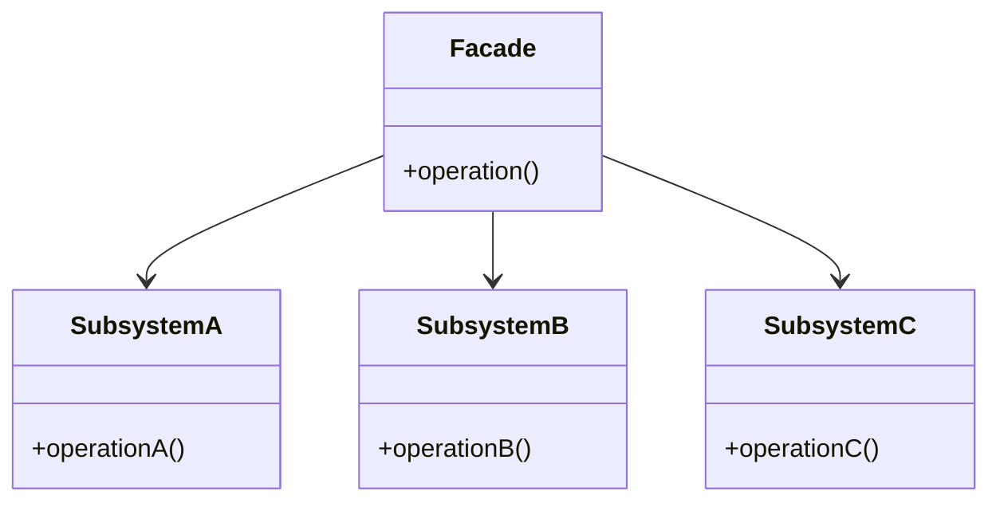

# PHP 外观模式

外观模式（Facade Pattern）是一种结构型设计模式，它为复杂的子系统提供一个简化的接口。通过外观模式，客户端可以更容易地与子系统交互，而无需了解其内部复杂性。这种模式非常适合用于简化代码结构，提高代码的可维护性和可读性。

## 什么是外观模式？

外观模式的核心思想是**隐藏复杂性**。它通过创建一个外观类（Facade Class），将多个子系统的接口整合到一个统一的接口中。客户端只需要与外观类交互，而不需要直接与子系统中的多个类打交道。

:::tip
外观模式并不是为了替代子系统，而是为了提供一个更简单的接口来使用子系统。
:::

## 外观模式的结构

外观模式通常由以下几个部分组成：

1. **外观类（Facade）**：提供一个简化的接口，封装了子系统的复杂性。
2. **子系统类（Subsystem Classes）**：实现子系统的功能，外观类会调用这些类来完成具体的工作。



## 代码示例

让我们通过一个简单的例子来理解外观模式。假设我们有一个电子商务系统，其中包含多个子系统：库存管理、支付处理和物流管理。我们可以使用外观模式来简化这些子系统的调用。

### 子系统类

```php
class Inventory {
    public function checkStock($productId) {
        // 检查库存
        return "Product $productId is in stock.";
    }
}

class Payment {
    public function processPayment($amount) {
        // 处理支付
        return "Payment of $amount processed.";
    }
}

class Shipping {
    public function shipProduct($productId) {
        // 发货
        return "Product $productId has been shipped.";
    }
}
```

### 外观类

```php
class ECommerceFacade {
    private $inventory;
    private $payment;
    private $shipping;

    public function __construct() {
        $this->inventory = new Inventory();
        $this->payment = new Payment();
        $this->shipping = new Shipping();
    }

    public function placeOrder($productId, $amount) {
        $stockCheck = $this->inventory->checkStock($productId);
        $paymentProcess = $this->payment->processPayment($amount);
        $shippingProcess = $this->shipping->shipProduct($productId);

        return "$stockCheck\n$paymentProcess\n$shippingProcess";
    }
}
```

### 客户端代码

```php
$ecommerce = new ECommerceFacade();
echo $ecommerce->placeOrder(123, 100.00);
```

### 输出

```
Product 123 is in stock.
Payment of 100 processed.
Product 123 has been shipped.
```

## 实际应用场景

外观模式在现实世界中有很多应用场景。例如：

1. **API网关**：在微服务架构中，API网关通常作为外观模式的一个实现，它封装了多个微服务的调用，为客户端提供一个统一的接口。
2. **框架封装**：许多PHP框架（如Laravel）使用外观模式来简化复杂的操作，例如数据库查询、缓存管理等。
3. **第三方库集成**：当你需要集成多个第三方库时，外观模式可以帮助你简化调用过程。

## 总结

外观模式是一种非常实用的设计模式，它通过提供一个简化的接口来隐藏系统的复杂性。这种模式不仅提高了代码的可维护性，还使得客户端代码更加简洁和易于理解。

:::note
外观模式并不是万能的，它适用于需要简化复杂子系统调用的场景。如果你发现外观类变得过于复杂，可能需要重新考虑系统的设计。
:::

## 附加资源与练习

1. **练习**：尝试为一个包含用户认证、文件上传和邮件发送的Web应用创建一个外观类。
2. **深入学习**：阅读更多关于其他设计模式的内容，例如单例模式、工厂模式等，了解它们与外观模式的区别和联系。

通过学习和实践，你将能够更好地掌握外观模式，并在实际项目中灵活运用它。