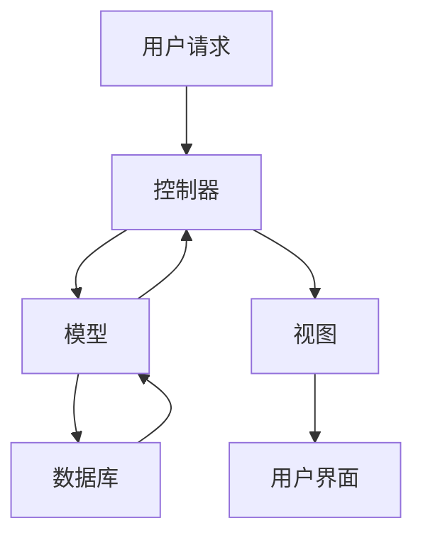

# PHP 框架基础

## 什么是PHP框架？

PHP框架是为开发PHP应用程序提供基础结构和工具的软件库。它们通过提供预定义的代码库、设计模式和工具，帮助开发者更高效地构建Web应用程序。框架通常遵循**MVC（Model-View-Controller）**架构模式，将应用程序的逻辑、数据和用户界面分离，从而提高代码的可维护性和可扩展性。

:::note
**MVC模式**：  
- **Model**：负责处理数据和业务逻辑。  
- **View**：负责显示数据（用户界面）。  
- **Controller**：处理用户输入并更新模型和视图。
:::

## 为什么使用PHP框架？

1. **提高开发效率**：框架提供了许多内置功能（如数据库操作、表单验证等），减少了重复代码的编写。  
2. **代码结构清晰**：MVC模式使代码更易于维护和扩展。  
3. **安全性**：框架通常内置了安全机制，如防止SQL注入和跨站脚本攻击（XSS）。  
4. **社区支持**：流行的框架有庞大的社区，提供了丰富的文档和插件。

## 常见的PHP框架

以下是一些流行的PHP框架：  
- **Laravel**：功能强大，适合构建现代Web应用程序。  
- **Symfony**：模块化设计，适合大型项目。  
- **CodeIgniter**：轻量级，适合小型项目。  
- **Yii**：高性能，适合需要快速开发的项目。

## MVC模式示例

以下是一个简单的MVC模式示例，展示如何将用户请求分解为模型、视图和控制器。

### 1. 模型（Model）
模型负责处理数据逻辑。例如，从数据库中获取用户信息。

```php
class UserModel {
    public function getUser($id) {
        // 模拟从数据库获取用户数据
        return ['id' => $id, 'name' => 'John Doe'];
    }
}
```

### 2. 视图（View）
视图负责显示数据。例如，将用户信息渲染为HTML。

```php
class UserView {
    public function render($user) {
        echo "<h1>User Profile</h1>";
        echo "<p>ID: {$user['id']}</p>";
        echo "<p>Name: {$user['name']}</p>";
    }
}
```

### 3. 控制器（Controller）
控制器负责处理用户请求并协调模型和视图。

```php
class UserController {
    public function showProfile($id) {
        $model = new UserModel();
        $user = $model->getUser($id);

        $view = new UserView();
        $view->render($user);
    }
}
```

### 运行示例

```php
$controller = new UserController();
$controller->showProfile(1);
```

**输出**：  
```html
<h1>User Profile</h1>
<p>ID: 1</p>
<p>Name: John Doe</p>
```

## 实际应用场景

假设你正在开发一个博客系统，使用PHP框架可以极大地简化开发过程。以下是一个简单的博客系统示例：

1. **模型**：处理博客文章的数据库操作。  
2. **视图**：显示博客文章列表和单篇文章。  
3. **控制器**：处理用户请求，如查看文章或发布新文章。



## 总结

PHP框架是开发高效、可维护Web应用程序的强大工具。通过使用MVC模式，开发者可以将应用程序的逻辑、数据和用户界面分离，从而提高代码的可读性和可扩展性。对于初学者来说，选择一个适合的框架（如Laravel或CodeIgniter）并掌握其基础知识是迈向高级开发的重要一步。

## 附加资源

- [Laravel官方文档](https://laravel.com/docs)  
- [Symfony官方文档](https://symfony.com/doc)  
- [CodeIgniter官方文档](https://codeigniter.com/user_guide)  

## 练习

1. 使用Laravel或CodeIgniter创建一个简单的博客系统。  
2. 尝试将MVC模式应用到你的项目中，分离模型、视图和控制器。  
3. 探索框架的内置功能，如路由、表单验证和数据库迁移。