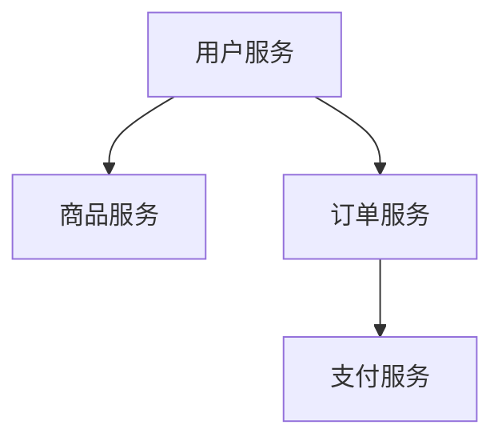

# PHP 微服务

## 什么是微服务？

微服务是一种软件架构风格，它将应用程序拆分为一组小型、独立的服务。每个服务都运行在自己的进程中，并通过轻量级的通信机制（通常是 HTTP/API）与其他服务交互。与传统的单体应用相比，微服务具有更高的灵活性、可扩展性和可维护性。

在 PHP 中，微服务通常通过 RESTful API 或消息队列来实现。每个微服务负责处理特定的业务功能，例如用户管理、订单处理或支付服务。

## 为什么选择微服务？

微服务架构的主要优势包括：

1. **模块化**：每个服务可以独立开发、部署和扩展。
2. **技术多样性**：不同的服务可以使用不同的技术栈。
3. **容错性**：一个服务的故障不会影响整个系统。
4. **可扩展性**：可以根据需求单独扩展某个服务。

## 如何用 PHP 构建微服务？

### 1. 创建独立的 PHP 服务

每个微服务都是一个独立的 PHP 应用程序。以下是一个简单的 PHP 微服务示例，它提供了一个用户信息查询的 API。

```php
<?php
// user_service.php

header("Content-Type: application/json");

$users = [
    '1' => ['id' => 1, 'name' => 'Alice', 'email' => 'alice@example.com'],
    '2' => ['id' => 2, 'name' => 'Bob', 'email' => 'bob@example.com'],
];

$userId = $_GET['id'] ?? null;

if ($userId && isset($users[$userId])) {
    echo json_encode($users[$userId]);
} else {
    http_response_code(404);
    echo json_encode(['error' => 'User not found']);
}
?>
```

**输入**：访问 `http://localhost/user_service.php?id=1`  
**输出**：
```json
{
    "id": 1,
    "name": "Alice",
    "email": "alice@example.com"
}
```

### 2. 使用 RESTful API 进行通信

微服务之间通常通过 RESTful API 进行通信。以下是一个调用上述用户服务的客户端示例：

```php
<?php
// client.php

$userId = 1;
$url = "http://localhost/user_service.php?id=$userId";

$response = file_get_contents($url);
$user = json_decode($response, true);

if (isset($user['error'])) {
    echo "Error: " . $user['error'];
} else {
    echo "User Name: " . $user['name'];
}
?>
```

**输出**：
```
User Name: Alice
```

### 3. 使用消息队列解耦服务

在高并发场景中，可以使用消息队列（如 RabbitMQ 或 Kafka）来解耦服务。以下是一个简单的 RabbitMQ 示例：

```php
<?php
// producer.php

require_once __DIR__ . '/vendor/autoload.php';

use PhpAmqpLib\Connection\AMQPStreamConnection;
use PhpAmqpLib\Message\AMQPMessage;

$connection = new AMQPStreamConnection('localhost', 5672, 'guest', 'guest');
$channel = $connection->channel();

$channel->queue_declare('user_queue', false, false, false, false);

$msg = new AMQPMessage('User ID: 1');
$channel->basic_publish($msg, '', 'user_queue');

echo " [x] Sent 'User ID: 1'\n";

$channel->close();
$connection->close();
?>
```

```php
<?php
// consumer.php

require_once __DIR__ . '/vendor/autoload.php';

use PhpAmqpLib\Connection\AMQPStreamConnection;

$connection = new AMQPStreamConnection('localhost', 5672, 'guest', 'guest');
$channel = $connection->channel();

$channel->queue_declare('user_queue', false, false, false, false);

echo " [*] Waiting for messages. To exit press CTRL+C\n";

$callback = function ($msg) {
    echo " [x] Received ", $msg->body, "\n";
};

$channel->basic_consume('user_queue', '', false, true, false, false, $callback);

while ($channel->is_consuming()) {
    $channel->wait();
}

$channel->close();
$connection->close();
?>
```

**输出**：
```
[x] Sent 'User ID: 1'
[*] Waiting for messages. To exit press CTRL+C
[x] Received User ID: 1
```

## 实际应用场景

### 电商平台

在一个电商平台中，可以将系统拆分为以下微服务：

1. **用户服务**：管理用户注册、登录和个人信息。
2. **商品服务**：管理商品信息和库存。
3. **订单服务**：处理订单创建和支付。
4. **支付服务**：处理支付请求。

每个服务都可以独立开发和部署，从而提高开发效率和系统稳定性。



## 总结

微服务架构通过将应用程序拆分为多个独立的服务，提供了更高的灵活性和可扩展性。在 PHP 中，可以通过 RESTful API 或消息队列来实现微服务。虽然微服务带来了许多优势，但也增加了系统的复杂性，因此在设计时需要权衡利弊。

## 附加资源与练习

- **资源**：
  - [PHP 官方文档](https://www.php.net/manual/en/)
  - [RabbitMQ 官方文档](https://www.rabbitmq.com/documentation.html)
  - [微服务架构设计模式](https://microservices.io/)

- **练习**：
  1. 创建一个商品服务，提供商品信息的查询功能。
  2. 使用 RabbitMQ 实现订单服务与支付服务之间的异步通信。
  3. 尝试将多个微服务部署到 Docker 容器中，并测试它们的交互。

:::tip
在开发微服务时，建议使用 Docker 来管理各个服务的依赖和环境，以确保开发和生产环境的一致性。
:::