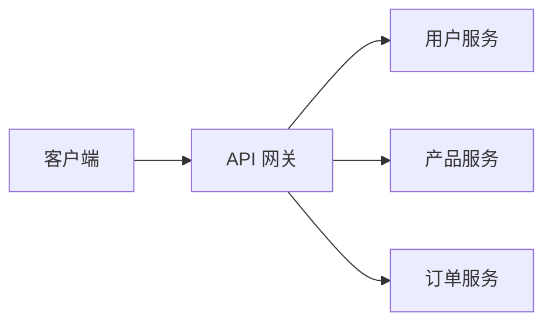
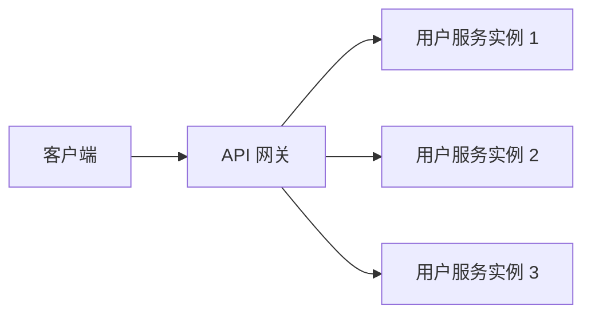

# PHP API 网关

在现代 Web 开发中，API（应用程序编程接口）是不同系统之间通信的关键。随着微服务架构的流行，API 网关（API Gateway）成为了管理和优化 API 请求的重要工具。本文将介绍 PHP API 网关的概念、工作原理以及如何在实际项目中使用它。

## 什么是 API 网关？

API 网关是一个服务器，充当客户端和后端服务之间的中间层。它的主要职责包括：

- **路由请求**：将客户端请求转发到适当的后端服务。
- **负载均衡**：将请求分发到多个后端实例，以提高系统的可用性和性能。
- **身份验证和授权**：确保只有经过身份验证和授权的请求才能访问后端服务。
- **缓存**：缓存常用请求的响应，以减少后端服务的负载。
- **日志记录和监控**：记录请求和响应，以便进行监控和分析。

## 为什么需要 API 网关？

在微服务架构中，一个应用程序通常由多个独立的服务组成。每个服务都有自己的 API，客户端可能需要与多个服务进行交互。API 网关通过提供一个统一的入口点，简化了客户端的请求处理，并提供了额外的功能，如安全性、负载均衡和缓存。

## PHP API 网关的实现

在 PHP 中，我们可以使用现有的库或框架来实现 API 网关。以下是一个简单的 PHP API 网关示例，使用 `Guzzle` HTTP 客户端库来转发请求。

### 安装 Guzzle

首先，使用 Composer 安装 Guzzle：

```bash
composer require guzzlehttp/guzzle
```

### 创建 API 网关

以下是一个简单的 PHP API 网关实现：

```php
<?php

require 'vendor/autoload.php';

use GuzzleHttp\Client;
use GuzzleHttp\Exception\RequestException;

$client = new Client();

$requestUri = $_SERVER['REQUEST_URI'];
$requestMethod = $_SERVER['REQUEST_METHOD'];
$requestBody = file_get_contents('php://input');

try {
    $response = $client->request($requestMethod, "http://backend-service" . $requestUri, [
        'body' => $requestBody,
        'headers' => [
            'Content-Type' => 'application/json',
            'Authorization' => $_SERVER['HTTP_AUTHORIZATION'] ?? '',
        ],
    ]);

    header('Content-Type: application/json');
    echo $response->getBody();
} catch (RequestException $e) {
    http_response_code($e->getResponse()->getStatusCode());
    echo $e->getResponse()->getBody();
}
```

### 代码解释

1. **Guzzle 客户端**：我们使用 Guzzle 客户端来发送 HTTP 请求。
2. **请求转发**：我们将客户端的请求方法、URI 和请求体转发到后端服务。
3. **响应处理**：我们将后端服务的响应返回给客户端，并处理可能的异常。

### 输入和输出示例

假设客户端发送以下请求：

```bash
GET /api/users HTTP/1.1
Host: api-gateway.example.com
Authorization: Bearer token
```

API 网关将请求转发到后端服务，并返回响应：

```json
[
    {"id": 1, "name": "John Doe"},
    {"id": 2, "name": "Jane Doe"}
]
```

## 实际应用场景

### 微服务架构中的 API 网关

在微服务架构中，API 网关通常用于管理多个服务的请求。例如，一个电子商务网站可能有以下服务：

- 用户服务
- 产品服务
- 订单服务

API 网关可以将请求路由到适当的服务，并提供统一的身份验证和授权机制。



### 负载均衡

API 网关可以将请求分发到多个后端实例，以提高系统的可用性和性能。例如，如果有多个用户服务实例，API 网关可以使用轮询算法将请求分发到这些实例。



## 总结

API 网关是现代 Web 开发中的重要工具，特别是在微服务架构中。它简化了客户端的请求处理，并提供了额外的功能，如安全性、负载均衡和缓存。通过本文的介绍和示例，你应该对 PHP API 网关有了基本的了解，并能够在实际项目中应用它。

## 附加资源

- [Guzzle 官方文档](https://docs.guzzlephp.org/en/stable/)
- [微服务架构中的 API 网关](https://microservices.io/patterns/apigateway.html)
- [PHP 微服务开发指南](https://www.php.net/manual/en/book.microservices.php)

## 练习

1. 尝试扩展上面的 PHP API 网关示例，添加缓存功能。
2. 实现一个简单的负载均衡算法，将请求分发到多个后端实例。
3. 研究如何在 API 网关中实现身份验证和授权。
