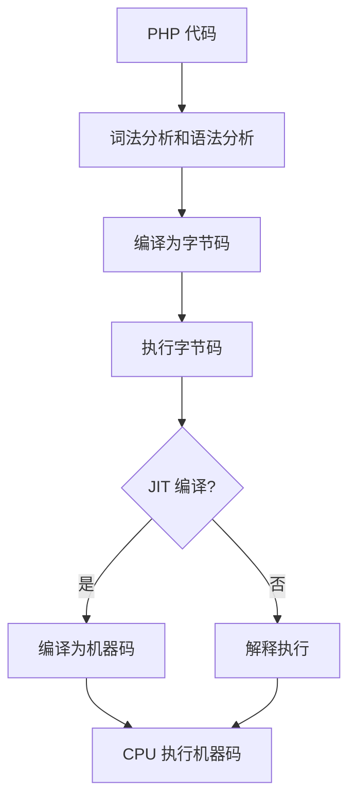

# PHP JIT 编译

PHP 是一种广泛使用的服务器端脚本语言，以其易用性和灵活性而闻名。然而，随着现代 Web 应用对性能要求的提高，PHP 也在不断进化。PHP 8.0 引入了一个重要的新特性：**JIT 编译**（Just-In-Time Compilation）。本文将详细介绍 JIT 编译的概念、工作原理及其在 PHP 中的应用。

## 什么是 JIT 编译？

JIT 编译是一种在程序运行时将代码动态编译为机器码的技术。与传统的解释执行方式不同，JIT 编译可以在运行时优化代码，从而提高执行效率。PHP 的 JIT 编译器通过将 PHP 字节码转换为机器码，显著提升了某些计算密集型任务的性能。

:::note
JIT 编译并不是 PHP 独有的技术。许多现代编程语言（如 Java、C# 和 JavaScript）都采用了 JIT 编译来提升性能。
:::

## PHP JIT 的工作原理

PHP 的执行过程通常分为以下几个步骤：

1. **词法分析和语法分析**：将 PHP 代码解析为抽象语法树（AST）。
2. **编译为字节码**：将 AST 转换为 PHP 字节码（Opcode）。
3. **执行字节码**：PHP 虚拟机（Zend VM）解释执行字节码。

在引入 JIT 编译后，PHP 的执行过程增加了一个新的步骤：

4. **JIT 编译**：将频繁执行的字节码编译为机器码，直接由 CPU 执行。



## 如何启用 PHP JIT

在 PHP 8.0 及以上版本中，JIT 编译默认是关闭的。要启用 JIT，需要在 `php.ini` 文件中进行配置：

```ini
opcache.enable=1
opcache.jit_buffer_size=100M
opcache.jit=tracing
```

- `opcache.enable=1`：启用 OPcache，这是 JIT 编译的前提。
- `opcache.jit_buffer_size=100M`：为 JIT 编译分配 100MB 的内存。
- `opcache.jit=tracing`：设置 JIT 编译模式为 "tracing"，这是推荐的模式。

:::tip
你可以通过 `phpinfo()` 函数查看 JIT 是否已成功启用。
:::

## JIT 编译的实际效果

JIT 编译对计算密集型任务（如数学运算、图像处理等）的性能提升尤为显著。以下是一个简单的示例，展示 JIT 编译对性能的影响。

```php
<?php
$start = microtime(true);

for ($i = 0; $i < 10000000; $i++) {
    $result = $i * $i;
}

$end = microtime(true);
echo "Execution time: " . ($end - $start) . " seconds\n";
```

**启用 JIT 前：**
```
Execution time: 0.45 seconds
```

**启用 JIT 后：**
```
Execution time: 0.12 seconds
```

可以看到，启用 JIT 后，代码的执行时间显著减少。

## JIT 编译的实际应用场景

JIT 编译在以下场景中特别有用：

1. **数学计算**：如科学计算、数据分析等。
2. **图像处理**：如图像滤镜、压缩等。
3. **游戏开发**：如物理引擎、AI 计算等。
4. **机器学习**：如矩阵运算、模型训练等。

:::caution
JIT 编译对 I/O 密集型任务（如数据库查询、文件读写）的性能提升有限，因为这些任务的主要瓶颈在于 I/O 操作，而非 CPU 计算。
:::

## 总结

PHP JIT 编译是 PHP 8.0 引入的一项重要特性，它通过将频繁执行的字节码编译为机器码，显著提升了计算密集型任务的性能。虽然 JIT 编译对 I/O 密集型任务的提升有限，但在数学计算、图像处理等场景中，它的优势非常明显。

## 附加资源与练习

- **官方文档**：阅读 [PHP 官方文档](https://www.php.net/manual/en/opcache.configuration.php#ini.opcache.jit) 了解更多关于 JIT 编译的配置选项。
- **练习**：尝试在自己的 PHP 项目中启用 JIT 编译，并测试其对性能的影响。

:::warning
在启用 JIT 编译时，请确保服务器有足够的内存资源，以避免因内存不足导致的性能问题。
:::