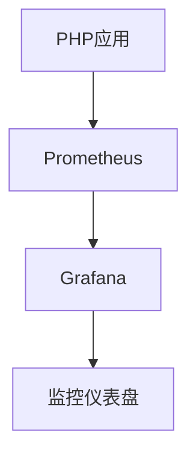

## 介绍

PHP是一种广泛使用的服务器端脚本语言，常用于Web开发。随着PHP应用的复杂性增加，运维工作变得至关重要。PHP运维不仅涉及应用的部署，还包括性能优化、安全性、监控和自动化部署等方面。本文将介绍PHP运维的最佳实践，帮助初学者掌握如何高效地管理和维护PHP应用。

## 性能优化

### 1. 使用OPcache

OPcache是PHP的一个内置缓存系统，可以显著提高PHP应用的性能。它通过缓存编译后的脚本字节码，减少每次请求时的编译时间。

```php
// 启用OPcache
opcache.enable=1
opcache.enable_cli=1
```

### 2. 优化数据库查询

数据库查询是PHP应用性能的瓶颈之一。通过优化查询语句、使用索引和缓存查询结果，可以显著提高数据库性能。

```php
// 使用索引优化查询
$query = "SELECT * FROM users WHERE email = :email";
$stmt = $pdo->prepare($query);
$stmt->execute(['email' => $email]);
```

### 3. 使用CDN加速静态资源

将静态资源（如图片、CSS和JavaScript文件）托管在CDN上，可以减少服务器负载并加快页面加载速度。

```html
<link rel="stylesheet" href="https://cdn.example.com/styles.css" />
```

## 安全性

### 1. 防止SQL注入

SQL注入是常见的Web应用安全漏洞。使用预处理语句和参数化查询可以有效防止SQL注入。

```php
// 使用预处理语句防止SQL注入
$query = "SELECT * FROM users WHERE email = :email";
$stmt = $pdo->prepare($query);
$stmt->execute(['email' => $email]);
```

### 2. 防止跨站脚本攻击（XSS）

XSS攻击通过在网页中注入恶意脚本来窃取用户数据。使用`htmlspecialchars`函数可以防止XSS攻击。

```php
// 防止XSS攻击
echo htmlspecialchars($user_input, ENT_QUOTES, 'UTF-8');
```

### 3. 使用HTTPS

HTTPS通过加密数据传输，防止数据被窃取或篡改。确保所有敏感数据传输都使用HTTPS。

```nginx
# 配置Nginx使用HTTPS
server {
    listen 443 ssl;
    server_name example.com;
    ssl_certificate /path/to/certificate.crt;
    ssl_certificate_key /path/to/private.key;
}
```

## 监控与日志

### 1. 使用监控工具

监控工具可以帮助你实时了解应用的运行状态，及时发现和解决问题。常用的监控工具有Prometheus、Grafana等。



### 2. 记录日志

日志是排查问题的重要工具。确保记录所有重要的操作和错误信息，并定期分析日志。

```php
// 记录错误日志
error_log("Error: Unable to connect to database", 3, "/var/log/php_errors.log");
```

## 自动化部署

### 1. 使用CI/CD工具

持续集成和持续部署（CI/CD）工具可以自动化构建、测试和部署过程，减少人为错误。常用的CI/CD工具有Jenkins、GitLab CI等。

```yaml
# GitLab CI配置示例
stages:
  - build
  - test
  - deploy

build_job:
  stage: build
  script:
    - echo "Building the application..."

test_job:
  stage: test
  script:
    - echo "Running tests..."

deploy_job:
  stage: deploy
  script:
    - echo "Deploying the application..."
```

### 2. 使用Docker容器化

Docker可以将应用及其依赖打包到一个容器中，确保在不同环境中的一致性。

```dockerfile
# Dockerfile示例
FROM php:7.4-cli
COPY . /app
WORKDIR /app
RUN composer install
CMD ["php", "index.php"]
```

## 实际案例

### 案例：电商网站的性能优化

一个电商网站在高峰期遇到了性能瓶颈。通过以下步骤进行优化：

1. 启用OPcache，减少PHP脚本的编译时间。
2. 优化数据库查询，使用索引和缓存查询结果。
3. 将静态资源托管在CDN上，减少服务器负载。

优化后，网站的响应时间从5秒降低到1秒，用户体验显著提升。

## 总结

PHP运维是确保应用稳定、高效运行的关键。通过性能优化、安全性、监控和自动化部署等最佳实践，可以有效提升PHP应用的运维水平。希望本文的内容能帮助初学者掌握PHP运维的基本技巧。

## 附加资源

- [PHP官方文档](https://www.php.net/docs.php)
- [OPcache配置指南](https://www.php.net/manual/en/book.opcache.php)
- [Prometheus监控指南](https://prometheus.io/docs/introduction/overview/)
- [Docker官方文档](https://docs.docker.com/)

## 练习

1. 在你的PHP应用中启用OPcache，并测试性能提升。
2. 使用预处理语句优化一个数据库查询，防止SQL注入。
3. 配置Nginx使用HTTPS，确保数据传输安全。
4. 使用GitLab CI配置一个简单的CI/CD流水线，自动化部署你的PHP应用。